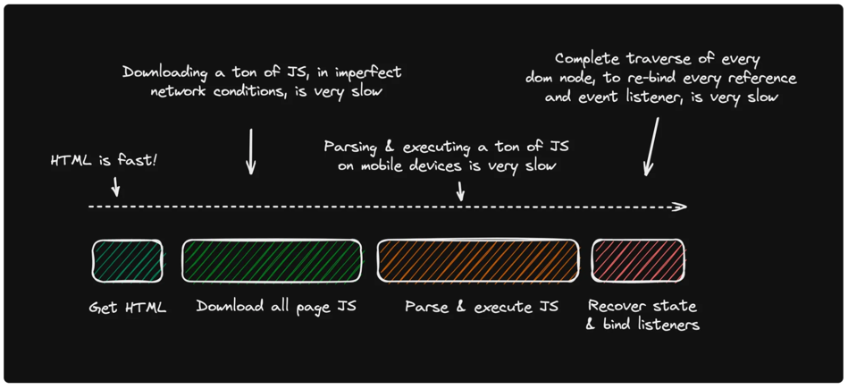
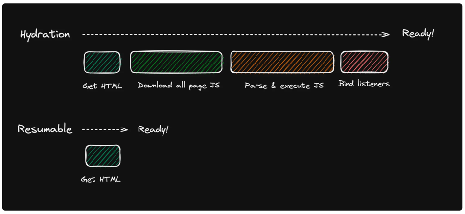
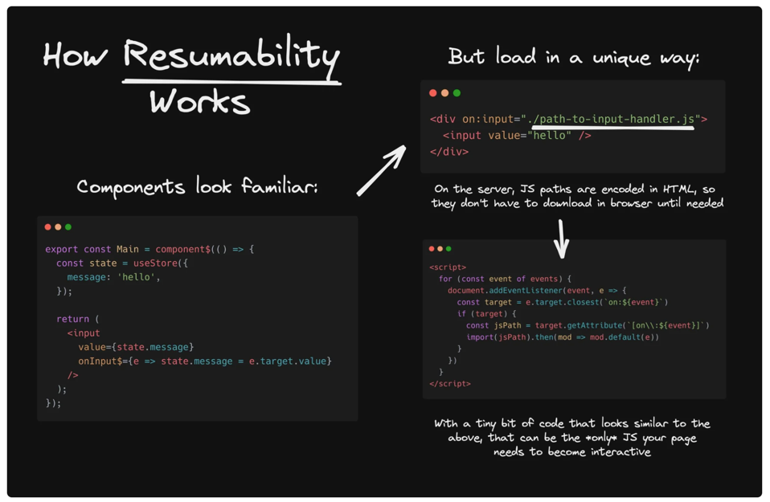

# hydration 纯粹是开销

> 原文：https://www.builder.io/blog/hydration-is-pure-overhead

hydration是对服务端渲染的HTML添加交互性的方案。
下面是维基百科的定义：

```javascript
在web开发中，hydration或者rehydration是一种用js转换静态HTML为动态页面的客户端技术，
通过将事件处理器添加到元素上的方法。
```
上述定义是从事件处理器角度来谈hydration的。但实际上给DOM添加事件处理器不是hydration
最有挑战和最费性能的部分，所以这个定义遗漏了一部分内容，而正是遗漏的那部分内容是为什么大家
说hydration是开销的原因。我们这篇文章"overhead"的含义是：如果完全可以省去一个东西或技术的工作，
还可以导致相同的结果，那这个东西就是overhead了。hydration就是这样。

## 深究一下hydration
hydration的一个重要工作是：要去了解我们有什么事件处理器，和 应该把他们附加在哪个DOM上。

事件处理器通常包含APP_STATE和FRAMEWORK_STATE:
* APP_STATE: 应用的状态。就是大多数人认为的那个状态。没有他们，你的应用就是死的，没有任何动态内容。
* FRAMEWORK_STATE: 框架内部状态。没有他们，框架不知道该更新哪些DOM节点，以及何时更新他们。

所以怎么恢复事件处理器呢？那就要要下载和执行这个HTML里面的组件。
这里的下载和执行是很费性能的。

换句话说，hydration是一种恢复APP_STATE和FRAMEWORK_STATE的技术，它的方法是
尽快的在浏览器里执行应用的代码，具体工作包括：
1. 下载组件代码
2. 执行组件代码
3. 发现都有哪些事件处理器，发现都有哪些dom上需要事件处理器
4. 给dom添加事件处理



我们可以把前三步叫做应用恢复阶段（RECOVERY phase）。恢复指框架重新构建应用。
重新构建是昂贵的，因为需要下载和执行应用代码。

RECOVERY昂贵度是跟要hydration的页面的复杂度成正比的，而且在移动设备上
很容易就花费10秒。因为RECOVERY很昂贵，所以很多应用只能一个次优的启动性能，尤其是移动设备上。

RECOVERY也是overhead的。
overhead指那些不能直接提供价值却又要做的工作。
RECOVERY之所以是overhead的是因为它重新构建了信息，而这些信息在服务端进行SSR的时候已经收集过了。
如果不把这些信息发送给客户端，则它们实际上等于被丢弃掉了。
因此，客户端必须执行昂贵的RECOVERY步骤来重建服务器已经做过的工作。
如果服务器已经序列化好这些信息并且随着HTML将他们发送给客户端，RECOVERY这一步本可以避免。
这些序列化好的信息可以使客户端不用那么急切地去下载和执行HTML里的所有组件代码。


服务端SSR已经执行过的代码在客户端需要再执行一遍，就是hydration的问题：
也就是说客户端做了一部分服务端已经做过的重复工作。
如果框架可以将信息从服务端发送给客户端，而不是将信息直接丢掉，本避免这一点。

总结一下，hydration是通过下载和"重"执行SSR渲染出来的HTML里的所有组件来恢复事件处理器的过程。
站点被发送到客户端两次，一次是作为HTML，一次是JavaScript。
另外，框架必须急切地执行JavaScript以恢复事件处理器、应用状态、框架状态。
所有这些工作其实是在 重取和重做 服务端已经做过但丢弃的。

我们通过一个例子来展示为什么hydration是在客户端进行的重复工作。

我们将使用能被多数开发者理解的流行语法，但是请记住这是一个通用问题，不针对具体某个框架。

```javascript
export const Main = () => <>
   <Greeter />
   <Counter value={10}/>
</>

export const Greeter = () => {
  return (
    <button onClick={() => alert('Hello World!'))}>
      Greet
    </button>
  )
}

export const Counter = (props: { value: number }) => {
  const store = useStore({ count: props.number || 0 });
  return (
    <button onClick={() => store.count++)}>
      {count}
    </button>
  )
}


```

上面的代码在执行SSR/SSG之后，会有下面的结果：

```javascript
<button>Greet</button>
<button>10</button>

```

可以看到，HTML不会携带事件处理器在哪里和组件边界信息。
不包含APP_STATE, FRAMEWORK_STATE状态信息。
但是其实这些信息在服务端生成HTML的时候，是存在的，但是服务端没有序列化这些信息。

客户端为了使应用激活/可交互，唯一能做的事就是去下载和执行应用代码，
然后使事件处理器挂载在对于的DOM上，使应用状态、框架状态恢复。

这里的重点是：必须下载和执行代码，而在这之前，没有任何事件可以被处理。
代码会实例化组件，然后重新创建各种状态。

一旦hydration完成，应用就可以运行了。
单击按钮会如期更新UI。

## 可恢复性：hydration的替代方案

所以怎么设计一个不需要hydration的系统呢？

为了清除overhead，框架必须避免RECOVERY阶段，和上述的第四步。
第四步是将事件处理器添加到对于的DOM上，这也是一个可以避免的成本。

为了避免这些成本，我们需要下面三件事：
1. 序列化所有需要的信息作为HTML的一部分。序列化的信息包括：事件处理器、事件绑定在哪里、应用状态、框架状态等
2. 全局事件处理器。依赖事件冒泡机制，可以收到所有子DOM上的事件。它需要是全局的，这样我们就不用急切地逐一在不同DOM上注册所有事件。
3. 一个工厂函数。可以惰性恢复事件处理器。



工厂函数很重要！Hydration急切地创建事件处理器因为它需要将其绑定到具体的DOM。
而我们避免这种不必要的工作。我们的方式是惰性创建事件处理器。

上面的解决方案是可恢复性的，因为它可以在服务器完成工作后在客户端恢复执行，不需要重做任何服务器已做的工作。
更重要的是，上述方案是轻量的（因为所有工作都是必要的，非必要的工作一点没做，且没有工作是重做的）。

一个好理解上述两种方案的区别的方法是跟push和pull系统类比一下。

* Push (hydration)：为了应用交互性，急切地下载和执行代码来给DOM添加事件处理器。
* Pull (resumability)：什么都不做，等着用户触发事件，然后惰性创建事件处理器来处理这个事件。

hydration时，事件还没发生，事件处理器就要创建好，因此被称为"急切地"。
Hydration同时也要求所有事件处理器都创建和注册好，来应对有可能的用户触发（很有可能用户不会触发），因此事件处理的创建是基于推测的。
它是可能最终也并不需要的额外工作。
（同时事件处理器的创建工作也是重复工作，因为这是服务器已经做过的，因此是overhead的）

而在resumable系统，事件处理器是惰性的，因此只有当真的有事件触发时，事件处理器才会创建，因此它是严格按需的（而非基于推测的）。
框架通过反序列化来创建事件处理器，因此客户端没有重做任何服务端已做的工作。

事件处理器的惰性创建就是qwik的工作原理，这让qwik应用的启动时间非常快。

Resumability需要序列化APP_STATE、FRAMEWORK_STATE还有事件处理器。
一个可恢复系统可以生成下面的HTML，HTML能存储APP_STATE、FRAMEWORK_STATE还有事件处理器。
完整的细节是不重要的，
The exact details are not important, only that all of the information is present.

```javascript
<div q:host>
  <div q:host>
    <button on:click="./chunk-a.js#greet">Greet</button>
  </div>
  <div q:host>
    <button q:obj="1" on:click="./chunk-b.js#count[0]">10</button>
  </div>
</div>
<script>/* code that sets up global listeners */</script>
<script type="text/qwik">/* JSON representing APP_STATE, FRAMEWORK_STATE */</script>

```
当上述HTML在浏览器加载后，会立即执行脚本来安装全局监听器。
应用准备接收事件，但浏览器还没有执行任何应用代码。这非常接近0 JS。

HTML包含了在元素的属性上加了事件处理器的位置信息。
当用户触发事件，框架可以使用DOM中的信息来惰性创建事件处理器。
创建过程中还包含反序列化APP_STATE and FRAMEWORK_STATE。
等框架创建了事件处理器，就可以处理事件了。
再次提醒，客户端没有重做任何服务端已经做过的工作。



## 内存使用上的注意事项
dom元素在元素生命周期中都维持着事件处理器，hydration很早就创建了所有listeners，所以它需要在应用启动时就分配内存。

而可恢复的框架在真正的事件触发以前都不创建事件处理器，因此，可恢复的框架比hydration需要更少内存。
甚至，都可以在事件执行完以后不再保存该事件，释放内存。

而释放内存是不适合hydration的。

## 结论

resumability是hydration的替代方法。
Resumability重点在于把服务器所有信息传送到客户端。
信息包含事件处理器、APP_STATE and FRAMEWORK_STATE等。
正是这些信息让应用可恢复。
只有有交互发生时，才会去下载代码处理指定交互。
客户端没有重做任何服务器已做的工作，因此是不overhead的。

为了将上述理论付诸实践，我们构建了qwik。
一个围绕着resumabilty和极致的应用启动性能而设计的框架。
我们期待听到你的反馈。