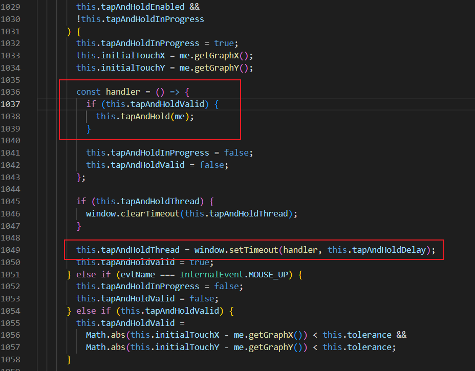

# 事件

## EventObject和 **Event对象

快速看一下两者的属性：

简单而言，`EventObject`是对事件的封装，包含更多maxGraph自定义的信息。

`EventMixin`赋予了Graph更多的事件类型，它拿到的是底层的事件，向外传递的却是`EventObject`对象。例如：

注意这里的`this`通通指向的是`graph`（类的继承关系：`EventSouce->Graph`）。

`fireEvent`即触发事件，会执行`graph`上的所有事件监听。

那么问题就来到了`this.eventListeners`这边，`Graph`暴露了哪个方法让我们管理这个事件回调数组呢？

添加事件监听的能力在`EventSouce`类中就已经有了（毕竟是事件源对象，理所应当）：

这就意味着，所有以这种方式注册的事件回调，传入的参数都是sender和eventObject。

那么这个时候，我们大概可以理解为什么需要有`EventObject`对象了。它是`maxGraph`为丰富多样的事件提供的一个统一的事件封装，例如事件类型、触发事件的源对象等。它提供了一组公共方法和属性，用于访问和操作事件信息。

而对于`MouseEvent`，就没有这种待遇了，传入的是`Event`对象（`InternalMouseEvent`）。为什么鼠标事件不需要封装呢，因为我们已经明确知道它是鼠标事件了，不需要通过额外的方式获取信息，例如`tapAndHold`这种经过封装的事件。

## 如何实现`tapAndHold`事件

核心是定时器，因为按压并不会持续触发`mouseDown`或者其他类似的事件，只会触发一次。

因此需要使用定时器判断。

经过`delay`延时后触发hander。

如果提前松开了，也会将valid置为false。

当再次触发`mouseDown`事件时，需要进行判断：

- 如果没有有效的定时器，则创建一个。
- 如果存在，则判断鼠标点击位置的偏移。

## 如何新增自定义事件

可以看到，`graph.addListener`其实没有对事件名称做限制。但`fireEvent`事件触发时，会遍历所有的回调函数，判断事件名称与回调函数绑定的事件名称是否一致。

因此我们只需要先`addListener`，再在合适的时候`fireEvent`就行了。

一般来说是在基础事件的回调中进行`fire`。
