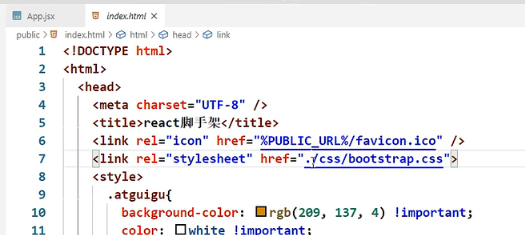
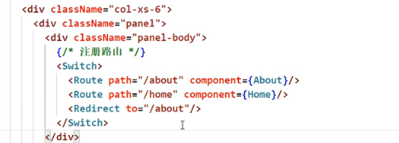
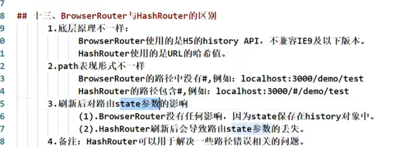

# react-router-dom

```javascript
ReactDOM.createRoot(document.getElementById('root') as HTMLElement).render(
  <BrowserRouter>
    <App></App>
  </BrowserRouter>
)
```

`App`组件就是一个显示路由组件的容器

在`Vue`中，就是

```javascript
<router-view v-slot="{ Component }">
      <keep-alive>
        <component :is="Component" />
      </keep-alive>
</router-view>
```

## 5.x


### Switch


`/home`路径，Home和Test组件都会展示——匹配到一个路径后，还会继续匹配。


匹配到一个后不会往下匹配。

### 样式丢失

问题出现原因：路由路径与真实路径不一致

```
<Link to="0.0.0.0:3000/wejdemo/home"
```



请求demo.css资源路路径

0.0.0.0:3000/wejdemo/demo.css

**路径层级错误**，引入时使用`.`，当前路径。

刷新后才会出现。

解决办法：1.使用`/`，2.使用`%PUCLIC_URL%`, 3.使用HashRouter

### 模糊匹配和精准匹配

```
<Route path="/pages/rtc/index.tsx" element={<RTCIndex></RTCIndex>}></Route>
```

路径`/pages/rtc/index.tsx/a/b/c`可以匹配到该路由。

```
<Route exact={true} path="/pages/rtc/index.tsx" element={<RTCIndex></RTCIndex>}></Route>
```

不能匹配

exact可能导致无法进行二级路由匹配

在6.x版本中，需要手动添加通配符。

```
<Route path="/embedroute/*" element={<Top></Top>}></Route>

```


### Redirect

所有路由都匹配失败



写在路由注册最下方

### 嵌套路由

一级路由注册


二级路由注册

```javascript
import { Link, Route, Routes } from "react-router-dom";
import {Second} from './Second'

export function Top(){
    return <div>
        <h3>一级路由界面</h3>
        <Link to="/embedroute/second">显示二级路由</Link>
        <Routes>
            <Route path="/second" element={<Second></Second>}></Route>
        </Routes>
    </div>
}
```

路由注册有先后，匹配时也有先后顺序，与最开始注册的路由进行匹配。

因此`/embedroute/second`会与之前注册的

```
<Route path="/embedroute" element={<Top></Top>}></Route>\
```

进行匹配。

因此`Top`组件不会丢失。

进入`Top`后继续进行路由注册和匹配。

如果开启`exact`，则无法匹配到`Top`组件。

在5.x版本中，我们需要加上上级路由，在6.x中，只需要写子路由路径。


### 普通组件使用路由信息

使用withRouter包装一般组件, 让一般组件具有路由组件的api。

```
import {withRouter} from ''
```

### 注意

BrowseRouter使用H5的history API，IE9及以下不支持。



## 6.x

- 路由定义有区别，需要加Routes
- 路由组件指定有区别
- 嵌套路由有区别

### hooks

#### useParams

params

#### useSearchParams

search

#### useLocation

state

#### useMatch


## NavLink

点击后加属性

```javascript
// 5.x
<NavLink activaClassName="active" to="" component={}>
```

