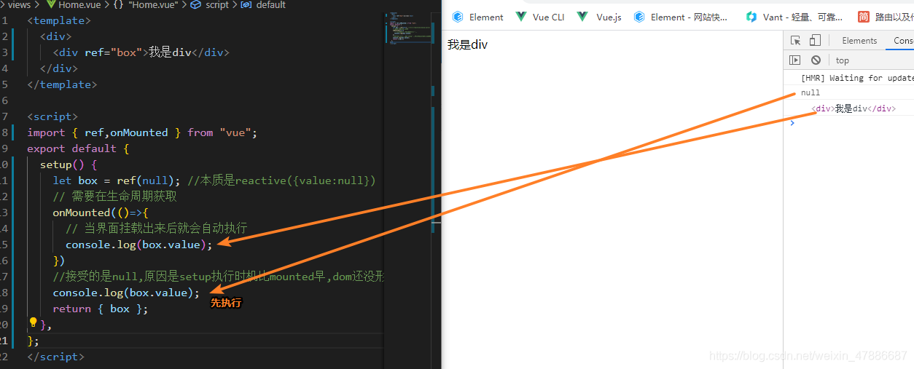

[(71条消息) vue3中ref的理解_山竹回家了的博客-CSDN博客_vue3ref](https://blog.csdn.net/weixin_47886687/article/details/112919563)

## 1.什么是ref?

- ref和reactive一样,也是用来实现响应式数据的方法
- 由于reactive必须传递一个对象,所以在实际开发中如果只是想让某个变量实现响应式的时候回非常麻烦
- 所以Vue3提供了ref方法实现简单值得监听

## 2.ref本质

- ref底层其实还是reactive,所以当运行时系统会自动根据传入的ref转换成reactive.

## 3.ref注意点

- 在vue中使用ref的值不用通过value获取
- 在js中使用ref的值必须通过value获取


## 4.ref获取元素

> 在vue2中我们可以通过给元素添加ref=‘xxx’,然后在代码中通过refs.xxx的方式来获取元素,在vue3中也可以通过ref来获取元素.
> 但不是像以下这种熟悉的方式,因为在vue3中没有$和refs这些东西.


**正确写法**

```html
<template>
  <div>
    <div ref="box">我是div</div>
  </div>
</template>

<script>
import { ref,onMounted } from "vue";
export default {
  setup() {
    let box = ref(null); //本质是reactive({value:null})
    // 需要在生命周期获取
    onMounted(()=>{
      // 当界面挂载出来后就会自动执行
      console.log(box.value);
    })
    //接受的是null,原因是setup执行时机比mounted早,dom还没形成
    console.log(box.value);
    return { box };
  },
};
</script>

```

