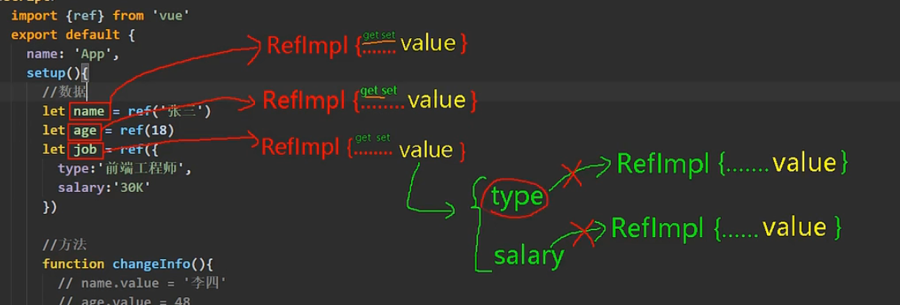

# 传值

[Props | Vue.js (vuejs.org)](https://cn.vuejs.org/guide/components/props.html#one-way-data-flow)

**选项式**：

```
// 使用 <script setup>
defineProps({
  title: String,
  likes: Number
})
```

**组合式：**

```
// 非 <script setup>
export default {
  props: {
    title: String,
    likes: Number
  }
}
```

校验选项中的 `type` 可以是下列这些原生构造函数：

- `String`
- `Number`
- `Boolean`
- `Array`
- `Object`
- `Date`
- `Function`
- `Symbol`


## 值的修改-单向数据流

所有的 props 都遵循着**单向绑定**原则，props 因父组件的更新而变化，自然地将新的状态**向下流往子组件**，而不会逆向传递。**这避免了子组件意外修改父组件的状态的情况**，不然应用的数据流将很容易变得混乱而难以理解。

另外，每次父组件更新后，所有的子组件中的 props 都会被更新到最新值，这意味着你**不应该**在子组件中去更改一个 prop。若你这么做了，Vue 会在控制台上向你抛出警告：

```
const props = defineProps(['foo'])

// ❌ 警告！prop 是只读的！
props.foo = 'bar'
```

导致你想要更改一个 prop 的需求通常来源于以下两种场景：

1. **prop 被用于传入初始值；而子组件想在之后将其作为一个局部数据属性**。在这种情况下，最好是新定义一个局部数据属性，从 props 上获取初始值即可：

```
const props = defineProps(['initialCounter'])

// 计数器只是将 props.initialCounter 作为初始值
// 像下面这样做就使 prop 和后续更新无关了
const counter = ref(props.initialCounter)
```

2. **需要对传入的 prop 值做进一步的转换**。在这种情况中，最好是基于该 prop 值定义一个计算属性：

```
const props = defineProps(['size'])

// 该 prop 变更时计算属性也会自动更新
const normalizedSize = computed(() => props.size.trim().toLowerCase())
```


# 响应式

## ref函数

基于Object.defineProperty();



基本数据类型 -> RefImpl **(ref，defineProperty)**

**对象类型 -> Proxy (reacive，Proxy)**


## reactive函数
