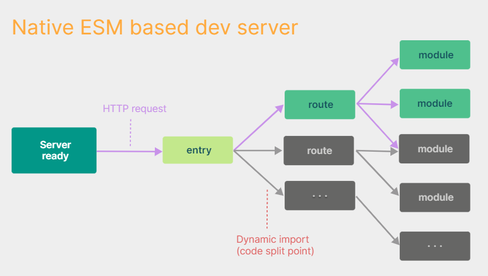

# 编码对比

## main.js


app相比vm更轻；

## 模板 template

不需要有根标签。

## script块的 setup函数

setup函数的返回值：

- 对象，对象中的属性方法在该组件中能访问（重点）
- 渲染函数，自定义渲染内容（了解）

```javascript
export default {
	setup(){
		var name = '123';
		function test() {
			console.log('test');
		}
		return {
			name,
			test
		}
		
		// 渲染函数
		// 模板中的内容将失效
		// import {h} from 'vue';
		// return () => return h('h1', 'test')
	}
}
```

## script setup块

相当于setup函数中的内容。


# 源码升级


# 新的特性


# TypeScript

**等待填坑**


# vite VS webpack

|  |  |
| ------------------------------------------------------------ | ------------------------------------------------------------ |


# 响应式原理对比

## vue2

**数据劫持**

将原始数据转换成代理形式，捕获对数据的修改和访问，之后再对数据进行修改。

通过`$set`, `$delete`追究和删除响应式数据。

**存在问题**

- 新增属性、删除属性，界面不会更新；

`defineProperty`无法只能捕获修改和查询。

- 直接通过下标修改数组，界面不会更新。

## vue3

基于**ES6**

实现原理:

- 通过Proxy（代理）: 拦截对象中任意属性的变化, 包括：属性值的读写、属性的添加、属性的删除等。
- 通过Reflect（反射）: 对源对象的属性进行操作。

- MDN文档中描述的Proxy与Reflect：

  - Proxy：https://developer.mozilla.org/zh-CN/docs/Web/JavaScript/Reference/Global_Objects/Proxy

  - Reflect：https://developer.mozilla.org/zh-CN/docs/Web/JavaScript/Reference/Global_Objects/Reflect

    ```javascript
    new Proxy(data, {
        // 拦截读取属性值
        get (target, prop) {
        	// return target[prop]
            return Reflect.get(target, prop)
        },
        // 拦截设置属性值或添加新属性
        set (target, prop, value) {
        // target[prop] = value
            return Reflect.set(target, prop, value)
        },
        // 拦截删除属性
        deleteProperty (target, prop) {
        // delete target[prop]
            return Reflect.deleteProperty(target, prop)
        }
    })
    
    proxy.name = 'tom'   
    ```

Reflect相比Object简化了错误处理代码。
