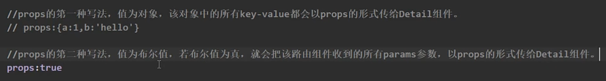
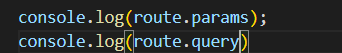
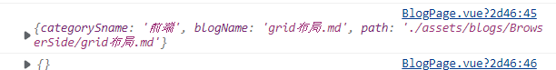

# 嵌套路由

```javascript
const routes = [
  {
    path: '/',
    component: HomePage,
    children: [{
      path: '',
      component: HomeBlog,
    }, {
      path: 'demo',
      component: DemoContent
    }, {
      path: 'blog',
      component: HomeBlog
    }]
  }, {
    path: '/blog/:categorySname/:blogName/:path',
    name: 'blog', component: BlogPage, props: true
  }
]
```

# 路由的Hash模式和HTML5模式

[路由的Hash模式和HTML5模式](./解决使用vue路由hash模式下无法使用锚点定位的问题.md)

# 路由传参

## 接收声明

- 使用布尔类型probs

```
{
    path: '/blog/:categorySname/:blogName/:path',
    name: 'blog', component: BlogPage, props: true
  }
```

```
//1 
const params = route.params;
//2
const probs = defineProps(['categorySname', 'blogName', 'path']);
```

- 使用字典probs，不会出现在路径中

```
{
    path: '/blog/:categorySname/:blogName/:path',
    name: 'blog', component: BlogPage, props: {a: '123', b: '456'}
  }
```

route.params只能得到probs字典内的参数。



- 函数

```
const routes = [
  {
    path: '/search',
    component: SearchUser,
    props: route => ({ query: route.query.q })
  }
]
```

## 跳转

```javascript
// 字符串路径
router.push('/users/eduardo')

// 带有路径的对象
router.push({ path: '/users/eduardo' })

// 命名的路由，并加上参数，让路由建立 url
router.push({ name: 'user', params: { username: 'eduardo' } })

// 带查询参数，结果是 /register?plan=private
router.push({ path: '/register', query: { plan: 'private' } })

// 带 hash，结果是 /about#team
router.push({ path: '/about', hash: '#team' })
```

**注意**：如果提供了 `path`，`params` 会被忽略，上述例子中的 `query` 并不属于这种情况。取而代之的是下面例子的做法，你需要提供路由的 `name` 或手写完整的带有参数的 `path` ：

```
const username = 'eduardo'
// 我们可以手动建立 url，但我们必须自己处理编码
router.push(`/user/${username}`) // -> /user/eduardo
// 同样
router.push({ path: `/user/${username}` }) // -> /user/eduardo
// 如果可能的话，使用 `name` 和 `params` 从自动 URL 编码中获益
router.push({ name: 'user', params: { username } }) // -> /user/eduardo
// `params` 不能与 `path` 一起使用
router.push({ path: '/user', params: { username } }) // -> /user
```

当指定 `params` 时，可提供 `string` 或 `number` 参数（或者对于[可重复的参数](https://router.vuejs.org/zh/guide/essentials/route-matching-syntax.html#repeatable-params)可提供一个数组）。**任何其他类型（如 `undefined`、`false` 等）都将被自动字符串化**。对于[可选参数](https://router.vuejs.org/zh/guide/essentials/route-matching-syntax.html#repeatable-params)，你可以提供一个空字符串（`""`）来跳过它。

**总结**

两种带参数跳转方法：

```
// 命名的路由，并加上参数，让路由建立 url
router.push({ name: 'user', params: { username: 'eduardo' } })
```

url由路由实现（不需要自己写路径）

和

```
// 带查询参数，结果是 /register?plan=private
router.push({ path: '/register', query: { plan: 'private' } })
```

需要自己写路径。



```javascript
function viewBlog(file) {
  router.push({
    name: "blog",
    params: {
      path: file.relapath,
      categorySname: probs.categoryInfo.sname,
      blogName: file.name,
    },
  });
}
```



**要用对应的方法获取参数。**


# keep-alive用到的声明周期钩子

- **onActivated**,
- **onDeactivated**


# 路由守卫

保卫路由的安全（权限控制）

满足某种条件才能触发路由。

## 全局前置守卫

```
const router = createRouter({ ... })

router.beforeEach((to, from) => {
  // ...
  // 返回 false 以取消导航
  return false
})
```

当一个导航触发时，全局前置守卫按照创建顺序调用。守卫是异步解析执行，此时导航在**所有守卫** resolve 完之前一直处于**等待中**。

## 控制是否进行守卫

```
// 在meta中添加自定义数据
meta: { requiresAuth: true }
```
