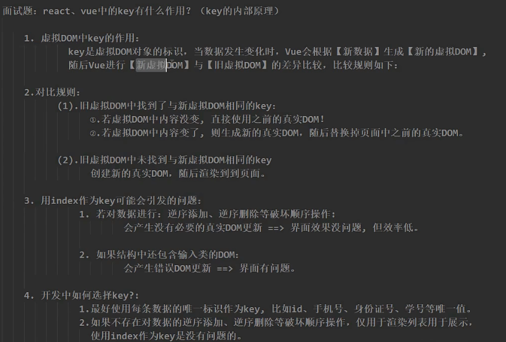

# 虚拟DOM的key

## 目的

复用节点

# 生命周期

[Vue生命周期详解 📌 - 掘金 (juejin.cn)](https://juejin.cn/post/6874855535234170887)

四个阶段：创建，挂载，更新，卸载；每个阶段应前后两个生命周期钩子。

# 为什么Vue需要Diff算法

[面试必备的13道可以举一反三的Vue面试题 - 掘金 (juejin.cn)](https://juejin.cn/post/6844903903968903175)

前端框架的两种侦测变化方式：pull，push。

组件内部有多个DOM元素，以及子组件。Vue创建的Watcher是组件级的，为了减少不必要的更新，只需要替换状态发生变化的DOM元素。

# Vue为什么没有shouldComponentUpdate函数

vue一开始就知道哪些组件需要发生变化。