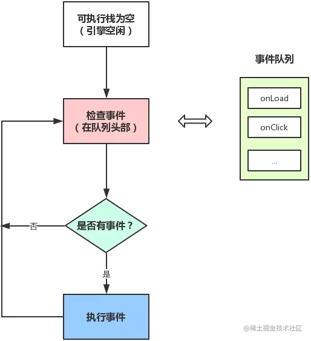
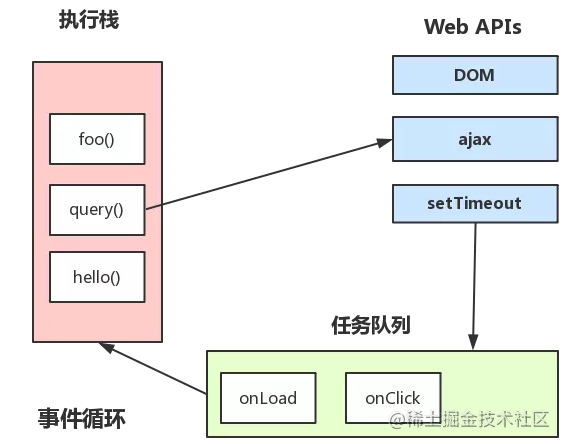

[你真的理解$nextTick么 - 掘金 (juejin.cn)](https://juejin.cn/post/6844903843197616136)

[(112条消息) 什么是宏任务、微任务？宏任务、微任务有哪些？又是怎么执行的？_F N Janine的博客-CSDN博客_宏任务微任务](https://blog.csdn.net/NancyFyn/article/details/118407548)

> ES6 规范中，microtask 称为 jobs，macrotask 称为 task
宏任务是由宿主发起的，而微任务由JavaScript自身发起。

[(112条消息) 每日一题2：说一下宏任务和微任务_蒋宗正啊的博客-CSDN博客](https://blog.csdn.net/weixin_42898315/article/details/114964454?spm=1001.2101.3001.6661.1&depth_1-utm_relevant_index=1)

> 宏任务主要包括 script(整体代码)、事件回调、请求回调、setTimeout、setInterval
> 微任务主要就是 Promises.then和MutationObserver
>
> Mutation Observer（变动观察器）是监视DOM变动的接口。当DOM对象树发生任何变动时，Mutation Observer会得到通知。
> 要概念上，它很接近事件。可以理解为，当DOM发生变动会触发Mutation Observer事件。但是，它与事件有一个本质不同：事件是同步触发，也就是说DOM发生变动立刻会触发相应的事件；Mutation Observer则是异步触发，DOM发生变动以后，并不会马上触发，而是要等到当前所有DOM操作都结束后才触发。

# 事件循环

## 浏览器事件

浏览器（多进程）包含了**Browser进程**（浏览器的主进程）、**第三方插件进程**和**GPU进程**（浏览器渲染进程），其中**GPU进程**（多线程）和Web前端密切相关，包含以下线程：

- **GUI渲染线程**
- **JS引擎线程**
- **事件触发线程**（和EventLoop密切相关）
- **定时触发器线程**
- **异步HTTP请求线程**

> **GUI渲染线程**和**JS引擎线程**是互斥的，为了防止DOM渲染的不一致性，其中一个线程执行时另一个线程会被挂起。

这些线程中，和Vue的`nextTick`息息相关的是**JS引擎线程**和**事件触发线程**。

### JS引擎线程和事件触发线程

浏览器页面初次渲染完毕后，**JS引擎线程**结合**事件触发线程**的工作流程如下：

（1）同步任务在**JS引擎线程**（主线程）上执行，形成**执行栈**（Execution Context Stack）。

（2）主线程之外，**事件触发线程**管理着一个**任务队列**（Task Queue）。只要异步任务有了运行结果，就在**任务队列**之中放置一个事件。

（3）**执行栈**中的同步任务执行完毕，系统就会读取**任务队列**，如果有异步任务需要执行，将其加到主线程的**执行栈**并执行相应的异步任务。

主线程的执行流程如下图所示：





> 这里可能是不够严谨的，在本文中**事件队列**和**任务队列**指向同一个概念。

## 事件循环机制（Event Loop）

**事件触发线程**管理的**任务队列**是如何产生的呢？事实上这些任务就是从**JS引擎线程**本身产生的，主线程在运行时会产生**执行栈**，栈中的代码调用某些异步API时会在**任务队列**中添加事件，栈中的代码执行完毕后，就会读取**任务队列**中的事件，去执行事件对应的回调函数，如此循环往复，形成事件循环机制，如下图所示：

执行栈可以理解为主线程中的一个个同步函数。





#### 任务类型

JS中有两种任务类型：**微任务**（microtask）和**宏任务**（macrotask），在ES6中，microtask称为 jobs，macrotask称为 task。

**宏任务**： script （主代码块）、`setTimeout` 、`setInterval` 、`setImmediate` 、I/O 、UI rendering

**微任务**：`process.nextTick`（Nodejs） 、`promise` 、`Object.observe` 、`MutationObserver`

> 这里要重点说明一下，**宏任务**并非全是异步任务，主代码块就是属于**宏任务**的一种（**Promises/A+规范**）。

它们之间区别如下：

- **宏任务**是每次**执行栈**执行的代码（包括每次从事件队列中获取一个事件回调并放到执行栈中执行）
- 浏览器为了能够使得**JS引擎线程**与**GUI渲染线程**有序切换，会在当前**宏任务**结束之后，下一个**宏任务**执行开始之前，对页面进行重新渲染（**宏任务** > 渲染  > **宏任务** > ...）
- **微任务**是在当前**宏任务**执行结束之后立即执行的任务（在当前 **宏任务**执行之后，UI渲染之前执行的任务）。**微任务**的响应速度相比`setTimeout`（下一个**宏任务**）会更快，因为无需等待UI渲染。
- 当前**宏任务**执行后，会将在它执行期间产生的所有**微任务**都执行一遍。

自我灌输一下自己的理解：

- **宏任务**中的事件是由**事件触发线程**来维护的
- **微任务**中的所有任务是由**JS引擎线程**维护的（这只是自我猜测，因为**宏任务**执行完毕后会立即执行**微任务**，为了提升性能，这种无缝连接的操作放在**事件触发线程**来维护明显是不合理的）。

根据事件循环机制，重新梳理一下流程：

- 执行一个**宏任务**（首次执行的主代码块或者**任务队列**中的回调函数）
- 执行过程中如果遇到**微任务**，就将它添加到**微任务**的任务队列中
- **宏任务**执行完毕后，立即执行当前**微任务**队列中的所有任务（依次执行）
- **JS引擎线程**挂起，**GUI线程**执行渲染
- **GUI线程**渲染完毕后挂起，**JS引擎线程**执行**任务队列**中的下一个**宏任务**

举个栗子，以下示例无法直观的表述**UI渲染线程**的接管过程，只是表述了**JS引擎线程**的执行流程：

```html
<!DOCTYPE html>
<html lang="en">
<head>
  <meta charset="UTF-8">
  <meta name="viewport" content="width=device-width, initial-scale=1.0">
  <meta http-equiv="X-UA-Compatible" content="ie=edge">
  <title>Document</title>

  <style>
    .outer {
      height: 200px;
      background-color: red;
      padding: 10px;
    }

    .inner {
      height: 100px;
      background-color: blue;
      margin-top: 50px;
    }
  </style>
</head>
<body>
  <div class="outer">
    <div class="inner"></div>
  </div>
</body>

<script>
let inner = document.querySelector('.inner')
let outer = document.querySelector('.outer')

// 监听outer元素的attribute变化
new MutationObserver(function() {
  console.log('mutate')
}).observe(outer, {
  attributes: true
})

// click监听事件
function onClick() {
  console.log('click')

  setTimeout(function() {
    console.log('timeout')
  }, 0)

  Promise.resolve().then(function() {
    console.log('promise')
  })

  outer.setAttribute('data-random', Math.random())
}

inner.addEventListener('click', onClick)

</script>
</html>
```

点击`inner`元素打印的顺序是：click -> promise -> mutate -> timeout

`click`事件的处理程序会加入**宏任务**队列，`MutationObserver`和`Promise`的回调会加入**微任务**队列，`setTimeout`加入到**宏任务**队列，对应的任务用对象直观的表述一下（自我认知的一种表述，只有参考价值）：

## Vue nextTick

[全局 API：常规 | Vue.js (vuejs.org)](https://cn.vuejs.org/api/general.html#nexttick)

> [神奇的nextTick一定能获取到最新的dom么？ - 掘金 (juejin.cn)](https://juejin.cn/post/7166517557124415518)
>
> `vue`的`dom`更新操作时异步的，为了获取更新后的`dom`官方提供了相应的api`nextTick`,文档中对该api的描述为：`将回调延迟到下次 DOM 更新循环之后执行` , 所谓的下一次，到底是哪一次呢？`dom`更新是异步任务，`nextTick`的回调也是异步任务，`nextTick`的回调中一定就能获取到最新的dom么?

> 当你在 Vue 中更改响应式状态时，最终的 DOM 更新并不是同步生效的，而是由 Vue 将它们缓存在一个队列中，直到下一个“tick”才一起执行。**这样是为了确保每个组件无论发生多少状态改变，都仅执行一次更新**。

状态更新是一个微任务；

nextTick也是微任务；

先写状态更新，再写nextTick回调；

状态更新会先创建一个微任务，并且代码块中的所有状态变化会集中到这个微任务进行，状态改变触发了DOM更新，创建了一个宏任务。

界面更新宏任务结束后，立即调用nextTick微任务。

## 类型

```ts
function nextTick(callback?: () => void): Promise<void>
```

## 在线演示

https://codesandbox.io/s/nexttickanalysis-vsfqh3?file=/src/App.vue

## 实例

由于返回的是Promise，因此可以在使用`await`等待DOM更新完成(vue3)。

```js
<script>
import { nextTick } from 'vue'

export default {
  data() {
    return {
      count: 0
    }
  },
  methods: {
    async increment() {
      this.count++

      // DOM 还未更新
      console.log(document.getElementById('counter').textContent) // 0

      await nextTick()
      // DOM 此时已经更新
      console.log(document.getElementById('counter').textContent) // 1
    }
  }
}
</script>

<template>
  <button id="counter" @click="increment">{{ count }}</button>
</template>
```

