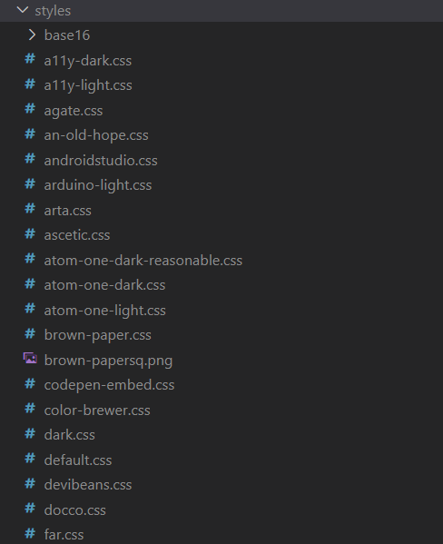

# 代码高亮

[`highlight.js`]()库可以根据所提供的语言类型，自动解析代码块：

```js
highlight: function (str, lang) {
    lang = lang || 'shell';  //lang是语言类型
    if (lang && hljs.getLanguage(lang)) {
        try {
            return (
                '<pre class="hljs" style="color: #000;"><code>' +
                hljs.highlight(lang, str, true).value +
                '</code></pre>'
            )
        } catch (__) { }
    }

    return (
        '<pre class="hljs" style="color: #000;"><code>' + md.utils.escapeHtml(str) + '</code></pre>'
    )
}
```

它提供了大量的代码样式：



我们可以选择一个样式导入到组件中。

