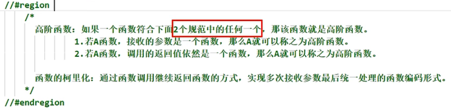

# 代码

```javascript
import React from "react";

export class EventDemo extends React.Component {
    constructor(props){
        super(props)
        this.state = {username: undefined, password: undefined}
    }

    saveUserName = (e) => {
        console.log(e.target.value)
        this.setState({'username': e.target.value})
    }
    savePassword = (e) =>{
        console.log(e.target.value)
        this.setState({'password': e.target.value})
    }

    render(){
        return (
            <div>
                <input onBlur={this.doOnBlur} placeholder='失去焦点提示数据'></input>
                <button onClick={this.showMsg}></button>
                <br></br>
                <form onSubmit={this.handleSubmit}>
                    用户名: <input type='text' ref={c=>this.usernameinput=c} name='username' placeholder='用户名'></input>
                    密码: <input onChange={this.savePassword} name='password'></input>
                    <button >提交</button>
                </form>
            </div>
        )
    }
}
```

# 优化

```javascript
saveFormData = (e, key) => {
	this.setState({[key]: e.target.value})
}
// 回调
<input onChange={(e)=>this.saveFormData(e, 'password')} name='password'></input>
// 会在最开始调用，而且只在最开始调用
// 将this.savePassword(e, 'password')的返回值作为onChange的回调
<input onChange={this.saveFormData(e, 'password')} name='password'></input>
```

方式2

```
// 高阶函数
// 柯里化（返回函数）
saveFormData = (key)=>{
	return (e) =>{
		this.setState({[key]: e.target.value})
  }
}
<input onChange={this.saveFormData('password')} name='password'></input>
```

必须把函数作为事件回调



常用高阶函数：Promise, setTimeout, setInterval, arr.map...；

**注意**

```
// 使用方括号读变量的值
// key = 'password'
saveFormData = (e, key) => {
	this.setState({[key]: e.target.value})
}
```


