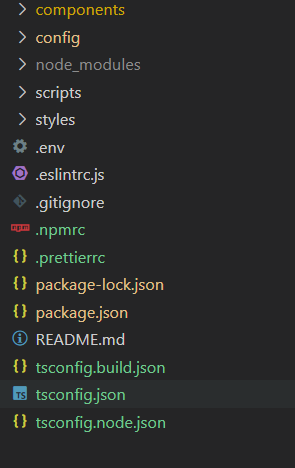
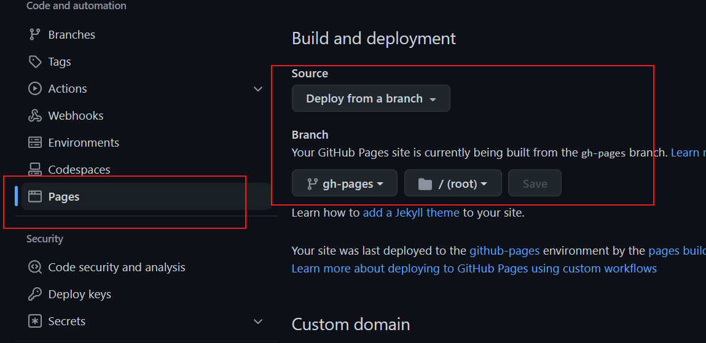

# 1.创建项目

可以选用不同的脚手架创建项目，但是创建的项目一般是面向前端应用的，我们需要重新组织目录，这也意味着我们要修改脚手架的配置文件。

（也许存在为组件库开发的项目创建命令，待发现...）

## 1.1初始化项目


## 1.2


## 1.4 添加ts、eslint配置

`ts`和`eslint`的配置参考：

https://github.com/ant-design/ant-design

我们将项目结构修改为：



## 1.5 配置路径映射

配置路径映射需要注意两个方面，一个是开发过程，一个是打包过程。

对开发过程有效的是`tsconfig.json`，对打包过程有效的是`webpack.config.js`；

在配置`tsconfig.json`时，需要注意不能配置`include`属性：[(127条消息) TS(tsconfig) 中路径映射的坑_NeverSettle101的博客-CSDN博客_tsconfig 路径映射](https://blog.csdn.net/qq_21265915/article/details/105499184?spm=1001.2101.3001.4242.2&utm_relevant_index=4)。

## 1.6 编译打包

此时不用指定是生产环境还是开发环境，这应该由组件使用者决定。

# 2. 单元测试

## 2.1 安装依赖

```shell
npm i jest ts-jest @testing-library/react @testing-library/jest-dom identity-obj-proxy @types/jest @types/testing-library__react --dev
```

- [jest](https://jestjs.io/): JavaScript 测试框架，专注于简洁明快；
- [ts-jest](https://github.com/kulshekhar/ts-jest)：为`TypeScript`编写`jest`测试用例提供支持；
- [@testing-library/react](https://testing-library.com/docs/react-testing-library/intro)：简单而完整的`React DOM`测试工具，鼓励良好的测试实践；
- [@testing-library/jest-dom](https://testing-library.com/docs/ecosystem-jest-dom)：自定义的`jest`匹配器(`matchers`)，用于测试`DOM`的状态（即为`jest`的`except`方法返回值增加更多专注于`DOM`的`matchers`）；
- [identity-obj-proxy](https://www.npmjs.com/package/identity-obj-proxy)：一个工具库，此处用来`mock`样式文件。

jest配置：https://jestjs.io/docs/configuration

# 3. 标准发布流程

标准流程包括：

1. 版本更新
2. 生成 CHANGELOG
3. 推送至 git 仓库
4. 组件库打包
5. 发布至 npm
6. 打 tag 并推送至 git

**package.json**

```
"scripts": {
+ "release": "ts-node ./scripts/release.ts"
},
```

```
/* eslint-disable  import/no-extraneous-dependencies,@typescript-eslint/camelcase, no-console */
import inquirer from 'inquirer';
import fs from 'fs';
import path from 'path';
import child_process from 'child_process';
import util from 'util';
import chalk from 'chalk';
import semverInc from 'semver/functions/inc';
import { ReleaseType } from 'semver';

import pkg from '../package.json';

const exec = util.promisify(child_process.exec);

const run = async (command: string) => {
  console.log(chalk.green(command));
  await exec(command);
};

const currentVersion = pkg.version;

const getNextVersions = (): { [key in ReleaseType]: string | null } => ({
  major: semverInc(currentVersion, 'major'),
  minor: semverInc(currentVersion, 'minor'),
  patch: semverInc(currentVersion, 'patch'),
  premajor: semverInc(currentVersion, 'premajor'),
  preminor: semverInc(currentVersion, 'preminor'),
  prepatch: semverInc(currentVersion, 'prepatch'),
  prerelease: semverInc(currentVersion, 'prerelease'),
});

const timeLog = (logInfo: string, type: 'start' | 'end') => {
  let info = '';
  if (type === 'start') {
    info = `=> 开始任务：${logInfo}`;
  } else {
    info = `✨ 结束任务：${logInfo}`;
  }
  const nowDate = new Date();
  console.log(
    `[${nowDate.toLocaleString()}.${nowDate.getMilliseconds().toString().padStart(3, '0')}] ${info}
    `,
  );
};

/**
 * 询问获取下一次版本号
 */
async function prompt(): Promise<string> {
  const nextVersions = getNextVersions();
  const { nextVersion } = await inquirer.prompt([
    {
      type: 'list',
      name: 'nextVersion',
      message: `请选择将要发布的版本 (当前版本 ${currentVersion})`,
      choices: (Object.keys(nextVersions) as Array<ReleaseType>).map((level) => ({
        name: `${level} => ${nextVersions[level]}`,
        value: nextVersions[level],
      })),
    },
  ]);
  return nextVersion;
}

/**
 * 更新版本号
 * @param nextVersion 新版本号
 */
async function updateVersion(nextVersion: string) {
  pkg.version = nextVersion;
  timeLog('修改package.json版本号', 'start');
  await fs.writeFileSync(path.resolve(__dirname, './../package.json'), JSON.stringify(pkg));
  await run('npx prettier package.json --write');
  timeLog('修改package.json版本号', 'end');
}

/**
 * 生成CHANGELOG
 */
async function generateChangelog() {
  timeLog('生成CHANGELOG.md', 'start');
  await run(' npx conventional-changelog -p angular -i CHANGELOG.md -s -r 0');
  timeLog('生成CHANGELOG.md', 'end');
}

/**
 * 将代码提交至git
 */
async function push(nextVersion: string) {
  timeLog('推送代码至git仓库', 'start');
  await run('git add package.json CHANGELOG.md');
  await run(`git commit -m "v${nextVersion}" -n`);
  await run('git push');
  timeLog('推送代码至git仓库', 'end');
}

/**
 * 组件库打包
 */
async function build() {
  timeLog('组件库打包', 'start');
  await run('npm run build');
  timeLog('组件库打包', 'end');
}

/**
 * 发布至npm
 */
async function publish() {
  timeLog('发布组件库', 'start');
  await run('npm publish');
  timeLog('发布组件库', 'end');
}

/**
 * 打tag提交至git
 */
async function tag(nextVersion: string) {
  timeLog('打tag并推送至git', 'start');
  await run(`git tag v${nextVersion}`);
  await run(`git push origin tag v${nextVersion}`);
  timeLog('打tag并推送至git', 'end');
}

async function main() {
  try {
    const nextVersion = await prompt();
    const startTime = Date.now();
    // =================== 更新版本号 ===================
    await updateVersion(nextVersion);
    // =================== 更新changelog ===================
    await generateChangelog();
    // =================== 代码推送git仓库 ===================
    await push(nextVersion);
    // =================== 组件库打包 ===================
    await build();
    // =================== 发布至npm ===================
    await publish();
    // =================== 打tag并推送至git ===================
    await tag(nextVersion);
    console.log(`✨ 发布流程结束 共耗时${((Date.now() - startTime) / 1000).toFixed(3)}s`);
  } catch (error) {
    console.log('💣 发布失败，失败原因：', error);
  }
}

main();
```

## 其他

每次初始化一个组件就要新建许多文件（夹），复制粘贴也可，不过还可以使用更高级一点的偷懒方式。

思路如下：

1. 创建组件模板，预留动态信息插槽（组件名称，组件描述等等）；
2. 基于`inquirer.js`询问动态信息；
3. 将信息插入模板，渲染至`components`文件夹下；
4. 向 components/index.ts 插入导出语句。

我们只需要配置好模板以及问题，至于询问以及渲染就交给[plop.js](https://plopjs.com/)吧。

```
yarn add plop --dev
```

新增脚本命令。

**package.json**

```
"scripts": {
+ "new": "plop --plopfile ./scripts/plopfile.ts",
},
```

新增配置文件以及组件模板，详情可见：

- 配置文件：[scripts/plopfile.ts](https://github.com/worldzhao/react-ui-library-tutorial/blob/master/scripts/plopfile.ts)
- 模板文件：[templates/component](https://github.com/worldzhao/react-ui-library-tutorial/tree/master/templates/component)

# 4. 配置Github pages

## 4.1 build

添加Action:

```
name: github pages

on:
  push:
    branches:
      - master # default branch

jobs:
  deploy:
    runs-on: ubuntu-18.04
    steps:
      - uses: actions/checkout@v2
      - run: npm install
      - run: npm run build:site
      - name: Deploy
        uses: peaceiris/actions-gh-pages@v3
        with:
          github_token: ${{ secrets.GITHUB_TOKEN }}
          publish_dir: ./doc-site

```

关键的命令：

`peaceiris/actions-gh-pages@v3`: [GitHub Pages action · Actions · GitHub Marketplace](https://github.com/marketplace/actions/github-pages-action)

这个命令将会把输出的目录发布到指定的分支：`gh-pages`

## 4.2 部署



# 参考资料

[如何快速构建React组件库 - 知乎 (zhihu.com)](https://zhuanlan.zhihu.com/p/196758730)

# 构建工具对比

[webpack、rollup、gulp对比 - 简书 (jianshu.com)](https://www.jianshu.com/p/cea946fa3c58)