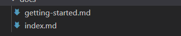

# 1.创建项目

可以选用不同的脚手架创建项目，但是创建的项目一般是面向前端应用的，我们需要重新组织目录，这也意味着我们要修改脚手架的配置文件。

（也许存在为组件库开发的项目创建命令，待发现...）

目标：初始化项目结构，配置代码规范（eslint，prettier，stylelint），添加typescript支持

## 1.1 初始化项目结构

```
mkdir fanasy-ui-react
cd fantasy-ui-react
npm init --y 
mkdir src && cd src && touch index.ts
```

## 1.2 代码规范

### 1.2.1 前置准备

```
npm i @umijs/fabric --dev
npm i prettier --dev # 因为@umijs/fabric没有将prettier作为依赖 所以我们需要手动安装

npm i lint-staged -D   # 本地暂存代码检查工具
npm i husky  # 操作 git 钩子的工具
```

**lint 工具简史**

> 在计算机科学中，lint是一种工具的名称，它用来标记代码中，某些可疑的、不具结构性（可能造成bug）的语句。它是一种静态程序分析工具，最早适用于C语言，在UNIX平台上开发出来。后来它成为通用术语，可用于描述在任何一种编程语言中，用来标记代码中有疑义语句的工具。    -- by wikipedia


### 1.2.2  代码检查

**.eslintrc.js**

```
module.exports = {
  extends: [require.resolve('@umijs/fabric/dist/eslint')],
};
```

### 1.2.3 代码风格

**.prettierrc.js**

```
const fabric = require('@umijs/fabric');

module.exports = {
  ...fabric.prettier,
};
```

### 1.2.4 css代码规范

**.stylelintrc.js**

```
module.exports = {
  extends: [require.resolve('@umijs/fabric/dist/stylelint')],
};
```

### 1.2.5 提交检查

**package.json**配置：文件控制检查和操作方式（取代`.lintstagedrc.json`）：

`lint-staged`: 代码暂存检查；

```
"lint-staged": {
  "src/**/*.ts?(x)": [
    "prettier --write",
    "eslint --fix",
    "git add"  # 不需要添加这条了，https://github.com/okonet/lint-staged/issues/775
  ],
  "src/**/*.less": [
    "stylelint --syntax less --fix",
    "git add"
  ]
},
"styles": {
  "hooks": {
    "pre-commit": "lint-staged"
  }
}
```

使用`lint-staged`进行暂存区代码检查：

`package.json`

```
"scripts": {
	// others
	"pre-commit": "lint-staged",
	// others
}
```

```shell
git add src/*
npm run pre-commit
```

**Commit message 检测**

**安装辅助提交依赖**

```
npm i @commitlint/cli @commitlint/config-conventional commitizen cz-conventional-changelog --dev
```

新增`.commitlintrc.js`，写入：

```
module.exports = { extends: ['@commitlint/config-conventional'] };
```

**安装指令和命令行的展示信息**

```
npm set-script commit "git-cz" # package.json 中添加 commit 指令, 执行 `git-cz` 指令
```

`pacakage.json`：

```
"scripts": {
	// others
	"commit": "git-cz",
	// others
}
```

## 1.3 TypeScript

```
npm i  typescript --save-dev
```

新建`tsconfig.json`并写入以下内容

```
{
    "compilerOptions": {
        "baseUrl": "./",
        "paths": {
            "@fantasyui/*": [
                "src/*"
            ],
            "@fantasy955/fantasy-ui-react": [
                "src/index.ts"
            ]
        },
        "resolveJsonModule": true,
        "strictNullChecks": true,
        "eclarationDir": "lib",
        "module": "commonjs",
        "target": "es6",
        "moduleResolution": "node",
        "esModuleInterop": true,
        "experimentalDecorators": true,
        "jsx": "react",
        "jsxFactory": "React.createElement",
        "jsxFragmentFactory": "React.Fragment",
        "noUnusedParameters": true,
        "noUnusedLocals": true,
        "noImplicitAny": true,
        "lib": [
            "dom",
            "es2017"
        ],
        "skipLibCheck": true,
        "stripInternal": true,
        "outDir": "dist", // 生成目录
        "declaration": true
    },
    "exclude": [
        "node_modules",
        "lib",
        "es"
    ]
}
```

`paths`属性配置别名，我们编程中可以使用别名导入项目中的模块。

## 1.4 总结

完成上述操作后，我们生成了一个标准的react ui组件库开发项目，能够进行代码检查，风格检查，git提交检查，规范生成commit message，**我们可以开始编码工作，但不能进行构建**。

## 1.5 参考资料

- [深入理解 ESlint - 掘金 (juejin.cn)](https://juejin.cn/post/6844903901292920846)

- [Eslint + Prettier + Husky + Commitlint+ Lint-staged 规范前端工程代码规范 - 掘金 (juejin.cn)](https://juejin.cn/post/7038143752036155428)

  包含如何自定义commit message

- [Home | Stylelint 中文文档 (bootcss.com)](https://stylelint.bootcss.com/)

- [什么是npx？ - 掘金 (juejin.cn)](https://juejin.cn/post/7142666525365764104)

- [TypeScript Compiler Configuration - tsconfig.json (howtodoinjava.com)](https://howtodoinjava.com/typescript/tsconfig-json/)

- [Linting Your React+Typescript Project with ESLint and Prettier!](https://medium.com/@dors718/linting-your-react-typescript-project-with-eslint-and-prettier-2423170c3d42)

- [使用 ESLint+Prettier 规范 React+Typescript 项目](https://zhuanlan.zhihu.com/p/62401626)

# 2. 编写一个示例组件

在目录`compoents`下创建各种组件，每个组件单独创建一个目录：


## 2.1 创建alert组件

### 2.1.1 组件定义

创建`alert`目录，并创建`index.tsx`文件进行组件定义：

```tsx
import React from 'react';
import t from 'prop-types';
// https://react.docschina.org/docs/typechecking-with-proptypes.html

export type AlertProps = {
    kind?: 'info' | 'positive' | 'negative' | 'warning';
} & React.HTMLAttributes<any>

export type KindMap = Record<Required<AlertProps>['kind'], string>;

const prefixCls = 'fantasy-alert';

const kinds: KindMap = {
    info: '#5352ED',
    positive: '#2ED573',
    negative: '#FF4757',
    warning: '#FFA502',
};

const Alert: React.FC<AlertProps> = ({ children, kind = 'info', ...rest }) => (
    <div
        className={prefixCls}
        style={{
            background: kinds[kind],
        }}
        {...rest}
    >
        {children}
    </div>
);

// props类型检查
Alert.propTypes = {
    kind: t.oneOf(['info', 'positive', 'negative', 'warning']),
};

export default Alert;
```

### 2.1.1 组件样式

创建`src/alert/style/index.less`文件：

```
@popupPrefix: fantasy-alert;

.@{popupPrefix} {
  padding: 20px;
  background: white;
  border-radius: 3px;
  color: white;
}
```

以及`src/alert/style/index.ts`文件：

```
import './index.less';
```

> 样式文件里为什么存在一个index.ts - 按需加载样式 管理样式依赖 后面章节会提到

## 2.2 组件导出

在`src/index.ts`文件内进行所有组件的导出：

```
export { default as Alert } from './alert';
```

## 2.3 提交

```
git add .
npm run commit // 执行 git-cz
git push
```

## 2.4 组件测试

### 2.4.1 安装依赖

```shell
npm i jest ts-jest @testing-library/react @testing-library/jest-dom identity-obj-proxy @types/jest @types/testing-library__react --dev
```

- [jest](https://jestjs.io/): JavaScript 测试框架，专注于简洁明快；
- [ts-jest](https://github.com/kulshekhar/ts-jest)：为`TypeScript`编写`jest`测试用例提供支持；
- [@testing-library/react](https://testing-library.com/docs/react-testing-library/intro)：简单而完整的`React DOM`测试工具，鼓励良好的测试实践；
- [@testing-library/jest-dom](https://testing-library.com/docs/ecosystem-jest-dom)：自定义的`jest`匹配器(`matchers`)，用于测试`DOM`的状态（即为`jest`的`except`方法返回值增加更多专注于`DOM`的`matchers`）；
- [identity-obj-proxy](https://www.npmjs.com/package/identity-obj-proxy)：一个工具库，此处用来`mock`样式文件。

jest配置：https://jestjs.io/docs/configuration

# 3. 站点开发

选择 [dumi](https://d.umijs.org/zh-CN) 作为文档站点工具，并**兼具开发调试**功能（可以展示所创建的组件）。

## 3.1 安装依赖

```
np i dumi serve --dev
```

## 3.2 创建dumi脚本

```json
"scripts": {
  "dev": "dumi dev", // 启动开发环境 在文档站点中调试组件
  "build:site": "rimraf doc-site && dumi build", // 构建文档站点 后续会部署到 github pages
  "preview:site": "npm run build:site && serve doc-site" // 本地预览构建后的文档站点
},
```

## 3.3 配置dumi

创建`.umirc.ts`文件：

```ts
import { defineConfig } from 'dumi';

export default defineConfig({
  title: 'Happy UI', // 站点名称
  mode: 'site',
  outputPath: 'doc-site', // 输出文件夹
  exportStatic: {}, // 后续会部署到 github pages 直接全部生成静态页面 不走前端路由
  dynamicImport: {}, // 拆包 站点过大时可以优化首屏加载速度
});
```

指定dumi的打包目录为`doc-site`，项目目录使用默认值`docs`；

在`docs`目录下创建以下文件：



具体内容见仓库：https://github.com/fantasy995/fantasy-ui-react/blob/master/docs/index.md

> 一个问题
>
> 编写dumi文档时，最开始使用components做完项目源文件的目录，但在`alert/demo/basic.tsx`中，想要以npm库的方式导入本地组件（[在DEMO中引入组件](https://d.umijs.org/guide/write-demo#%E5%9C%A8-demo-%E4%B8%AD%E5%BC%95%E5%85%A5%E7%BB%84%E4%BB%B6)），但是webpack的构建过程报错，提升`can't resolve`对应引入。
>
> 将components更名为src后正常。

## 3.4 遇到的问题

- dumi构建过程报错
  见3.3中提到的。

- 无法引入`less`样式

  无法通过`index.ts`引入`index.less`，只能直接`import "index.less"`。

  在`index.ts`中添加打印操作，证实没有执行`index.ts`中的代码。

  **fix**：
  
  是由`sideEffects`配置项导致的（`package.json`）：
  
  ```
    "//sideEffects": [
      "dist/*",
      "esm/styles/*",
      "lib/styles/*",
      "*.less"
    ],
  ```

[Tree Shaking | webpack 中文文档 (docschina.org)](https://webpack.docschina.org/guides/tree-shaking/#:~:text=通过 package.json 的 "sideEffects" 属性，来实现这种方式。 { "name"%3A "your-project"%2C,false } 如果所有代码都不包含副作用，我们就可以简单地将该属性标记为 false ，来告知 webpack 它可以安全地删除未用到的 export。)

> **Tip**
>
>  "side effect(副作用)" 的定义是，在导入时会执行特殊行为的代码，而不是仅仅暴露一个 export 或多个 export。举例说明，例如 polyfill，它影响全局作用域，并且通常不提供 export。

## 3.5 部署到Github Pages

### 3.5.1 配置public path和Github路由

托管在 `Github Pages`，所以应用是挂在 `${username}.github.io/${repo}` 下面，我们站点应用的静态资源路径`publicPath`以及路由`basename`都需要进行适配。

编辑`.umirc.ts` ，在构建过程中，更改所需资源的路径：

```
if (process.env.SITE_BUILD_ENV === 'PREVIEW') {
  base = undefined;
  publicPath = undefined;
}
```

本地环境打包，`public path`仍然是`./`，增加本地打包命令，需要指定环境变量，因此需要`cross-env`包：

`package.json`，本地打包脚本：

```
"scripts": {
  "preview:site": "cross-env SITE_BUILD_ENV=PREVIEW npm run build:site && serve doc-site",
},
```

### 3.5.2 Github Actions

工作流，`.github/workflows/gh-pages.yml`：

```
name: github pages

on:
  push:
    branches:
      - master # default branch

jobs:
  deploy:
    runs-on: ubuntu-18.04
    steps:
      - uses: actions/checkout@v2
      - run: npm run
      - run: npm run build:site
      - name: Deploy
        uses: peaceiris/actions-gh-pages@v3
        with:
          github_token: ${{ secrets.GITHUB_TOKEN }}
          publish_dir: ./doc-site
```

这里使用了`peaceiris/actions-gh-pages@v3`: [GitHub Pages action · Actions · GitHub Marketplace](https://github.com/marketplace/actions/github-pages-action)

这个命令将会把输出的目录发布到指定的分支：`gh-pages`。

### 3.5.3设定 deploy branch


## 3.6 参考资料

- dumi编写方， [dumi 文档 - 写组件 demo](https://d.umijs.org/zh-CN/guide/basic#写组件-demo)。
- dumi 提供了一种偷懒的方式：[组件 API 自动生成](https://d.umijs.org/zh-CN/guide/advanced#组件-api-自动生成)。
  该能力基于 [react-docgen-typescript](https://github.com/styleguidist/react-docgen-typescript)

# 4. 组件库打包

我们的目标是：

1. 导出**类型声明文件**；
2. 导出 `UMD`/`Commonjs module`/`ES module` 等 **3 种形式产物**供使用者引入；
3. 支持样式文件 `css` 引入，而非只有`less`，减少业务方接入成本；
4. 支持按需加载。

## 4.1 导出类型声明文件

在`package.json`中添加以下属性：

```json
{
  "typings": "lib/index.d.ts", // 定义类型入口文件
  "scripts": {
    "build:types": "tsc -p tsconfig.build.json && cpr lib esm" // 执行tsc命令生成类型声明文件
  }
}
```

`tsconfig.build.json`文件：

```
{
  "extends": "./tsconfig.json",
  "compilerOptions": { "emitDeclarationOnly": true }, // 只生成声明文件
  "exclude": ["**/__tests__/**", "**/demo/**", "node_modules", "lib", "esm"] // 排除示例、测试以及打包好的文件夹
}
```

`typings`指定了类型的入口文件（`package.json`是组件库使用中可以得到的，这个属性告诉`ts`到哪里去找类型定义）。

> 值得注意的是：此处使用`cpr`(需要手动安装)将`lib`的声明文件拷贝了一份，并将文件夹重命名为`esm`，用于后面存放 ES module 形式的组件。这样做的原因是保证用户手动按需引入组件时依旧可以获取自动提示。

> 最开始的方式是将声明文件单独存放在`types`文件夹，但这样只有通过'@fantasy955/fantasy-ui-react'引入才可以获取提示，而'@fantasy955/fantasy-ui-react/esm/xxx'和'@fantasy955/fantasy-ui-react/lib/xxx'就无法获取提示。

执行`npm run build:types`，可以发现根目录下已经生成了`lib`文件夹（`tsconfig.json`中定义的`declarationDir`字段）以及`esm`文件夹（拷贝而来），目录结构与`src`文件夹保持一致，如下：

**lib**

```
├── alert
│   ├── index.d.ts
│   └── style
│       └── index.d.ts
└── index.d.ts
```

这样使用者引入`npm` 包时，便能得到自动提示，也能够复用相关组件的类型定义。

接下来将`ts(x)`等文件处理成`js`文件。

> 需要注意的是，我们需要输出`Commonjs module`以及`ES module`两种模块类型的文件（暂不考虑`UMD`），以下使用`cjs`指代`Commonjs module`，`esm`指代`ES module`。对此有疑问的同学推荐阅读：[import、require、export、module.exports 混合详解](https://github.com/ShowJoy-com/showjoy-blog/issues/39)

## 4.2导出 Commonjs 模块

4.1节讲述生成了类型声明文件，并生成了所有目录结构。

接下来使用`gulp`对代码进行编译（其实完全可以使用`babel`或`tsc`命令行工具进行代码编译处理（实际上很多工具库就是这样做的），此处借助 `gulp` 来串起这个流程。）。

> 为什么是 `gulp` 而不是 `webpack` 或 `rollup` ？因为我们要做的是代码编译而非代码打包，同时需要考虑到**样式处理及其按需加载**。

### babel 配置

首先安装`babel`及其相关依赖

```
npm run add @babel/core @babel/preset-env @babel/preset-react @babel/preset-typescript @babel/plugin-proposal-class-properties  @babel/plugin-transform-runtime --dev
npm run add @babel/runtime-corejs3
```

新建`.babelrc.js`文件，写入以下内容：

**.babelrc.js**

```js
module.exports = {
  presets: ['@babel/env', '@babel/typescript', '@babel/react'],
  plugins: [
    '@babel/proposal-class-properties',
    [
      '@babel/plugin-transform-runtime',
      {
        corejs: 3,
        helpers: true,
      },
    ],
  ],
};
```

关于`@babel/plugin-transform-runtime`与`@babel/runtime-corejs3`：

- 若`helpers`选项设置为`true`，可抽离代码编译过程重复生成的 `helper` 函数（`classCallCheck`,`extends`等），减小生成的代码体积；
- 若`corejs`设置为`3`，可引入不污染全局的按需`polyfill`，常用于类库编写（我更推荐：不引入`polyfill`，转而告知使用者需要引入何种`polyfill`，避免重复引入或产生冲突，后面会详细提到）。

更多参见[官方文档-@babel/plugin-transform-runtime](https://babeljs.io/docs/en/next/babel-plugin-transform-runtime)

**配置目标环境**

为了避免转译浏览器原生支持的语法，新建`.browserslistrc`文件，根据适配需求，写入支持浏览器范围，作用于`@babel/preset-env`。

**.browserslistrc**

```
>0.2%
not dead
not op_mini all
```

很遗憾的是，`@babel/runtime-corejs3`无法在按需引入的基础上根据目标浏览器支持程度再次减少`polyfill`的引入，参见[@babel/runtime for target environment ](https://github.com/zloirock/core-js/blob/master/docs/2019-03-19-core-js-3-babel-and-a-look-into-the-future.md#babelruntime-for-target-environment)。

这意味着`@babel/runtime-corejs3` 甚至会在针对现代引擎的情况下注入所有可能的 `polyfill`：不必要地增加了最终捆绑包的大小。

对于组件库（代码量可能很大），个人建议将`polyfill`的选择权交还给使用者，在宿主环境进行`polyfill`。若使用者具有兼容性要求，自然会使用`@babel/preset-env + core-js + .browserslistrc`进行全局`polyfill`，这套组合拳引入了最低目标浏览器不支持`API`的全部 `polyfill`。

> 顺带一提，业务开发中，若将`@babel/preset-env`的`useBuiltIns`选项值设置为 `usage`，同时把`node_modules`从`babel-loader`中`exclude`，会导致`babel` 无法检测到`nodes_modules`中所需要的`polyfill`。["useBuiltIns: usage" for node_modules without transpiling #9419](https://github.com/babel/babel/issues/9419)，在未支持该`issue`提到的内容之前，请将`useBuiltIns`设置为`entry`，或者不要把`node_modules`从`babel-loader`中`exclude`。

所以组件库不用画蛇添足，引入多余的`polyfill`，写好文档说明，比什么都重要（就像[zent](https://github.com/youzan/zent#required-polyfills)和[antd](https://ant.design/docs/react/getting-started-cn#兼容性)这样）。

现在`@babel/runtime-corejs3`更换为`@babel/runtime`，只进行`helper`函数抽离。

```
npm run remove @babel/runtime-corejs3

npm run add @babel/runtime
```

**.babelrc.js**

```
module.exports = {
  presets: ['@babel/env', '@babel/typescript', '@babel/react'],
  plugins: ['@babel/plugin-transform-runtime', '@babel/proposal-class-properties'],
};
```

> `@babel/transform-runtime`的`helper`选项默认为`true`。

### gulp 配置

再来安装`gulp`相关依赖

```
npm run add gulp gulp-babel --dev
```

新建`gulpfile.js`，写入以下内容：

**gulpfile.js**

```js
const gulp = require('gulp');
const babel = require('gulp-babel');

const paths = {
  dest: {
    lib: 'lib', // commonjs 文件存放的目录名 - 本块关注
    esm: 'esm', // ES module 文件存放的目录名 - 暂时不关心
    dist: 'dist', // umd文件存放的目录名 - 暂时不关心
  },
  styles: 'src/**/*.less', // 样式文件路径 - 暂时不关心
  scripts: ['src/**/*.{ts,tsx}', '!src/**/demo/*.{ts,tsx}'], // 脚本文件路径
};

function compileCJS() {
  const { dest, scripts } = paths;
  return gulp
    .src(scripts)
    .pipe(babel()) // 使用gulp-babel处理
    .pipe(gulp.dest(dest.lib));
}

// 并行任务 后续加入样式处理 可以并行处理
const build = gulp.parallel(compileCJS);

exports.build = build;

exports.default = build;
```

目前将js代码编译并输出到`lib`文件夹（CJS模块），不包括样式文件。

修改`package.json`

**package.json**

```
{
- "main": "index.js",
+ "main": "lib/index.js",
  "scripts": {
    ...
+   "clean": "rimraf lib esm dist",
+   "build": "npm run clean && npm run build:types && gulp",
    ...
  },
}
```

执行`npm run build`，得到如下内容：

**lib**

```
├── alert
│   ├── index.js
│   └── style
│       └── index.js
└── index.js
```

观察编译后的源码，可以发现：诸多`helper`方法已被抽离至`@babel/runtime`中，模块导入导出形式也是`commonjs`规范。

## 4.4 导出ES模块

生成`ES module`可以更好地进行[tree shaking](https://webpack.docschina.org/guides/tree-shaking/)，基于上一步的`babel`配置，更新以下内容：

1. 配置`@babel/preset-env`的`modules`选项为`false`，关闭模块转换；
2. 配置`@babel/plugin-transform-runtime`的`useESModules`选项为`true`，使用`ES module`形式引入`helper`函数。

**.babelrc.js**

```js
module.exports = {
  presets: [
    [
      '@babel/env',
      {
        modules: false, // 关闭模块转换
      },
    ],
    '@babel/typescript',
    '@babel/react',
  ],
  plugins: [
    '@babel/proposal-class-properties',
    [
      '@babel/plugin-transform-runtime',
      {
        useESModules: true, // 使用esm形式的helper
      },
    ],
  ],
};
```

目标达成，我们再使用环境变量区分`esm`和`cjs`（关闭了模块转换，执行任务时设置对应的环境变量即可，即在gulp文件中进行设置），最终`babel`配置如下：

```js
module.exports = {
  presets: ['@babel/env', '@babel/typescript', '@babel/react'],
  plugins: ['@babel/plugin-transform-runtime', '@babel/proposal-class-properties'],
  env: {
    esm: {
      presets: [
        [
          '@babel/env',
          {
            modules: false,
          },
        ],
      ],
      plugins: [
        [
          '@babel/plugin-transform-runtime',
          {
            useESModules: true,
          },
        ],
      ],
    },
  },
};
```

接下来修改`gulp`相关配置，抽离`compileScripts`任务，增加`compileESM`任务。

**gulpfile.js**

```js
// ...

/**
 * 编译脚本文件
 * @param {string} babelEnv babel环境变量
 * @param {string} destDir 目标目录
 */
function compileScripts(babelEnv, destDir) {
  const { scripts } = paths;
  // 设置环境变量
  process.env.BABEL_ENV = babelEnv;
  return gulp
    .src(scripts)
    .pipe(babel()) // 使用gulp-babel处理
    .pipe(gulp.dest(destDir));
}

/**
 * 编译cjs
 */
function compileCJS() {
  const { dest } = paths;
  return compileScripts('cjs', dest.lib);
}

/**
 * 编译esm
 */
function compileESM() {
  const { dest } = paths;
  return compileScripts('esm', dest.esm);
}

// 串行执行编译脚本任务（cjs,esm） 避免环境变量影响
const buildScripts = gulp.series(compileCJS, compileESM);

// 整体并行执行任务
const build = gulp.parallel(buildScripts);

// ...
```

在上述代码中，我们指定了不同编译目标时的`babel_env`，以及输出目录。

执行`npm run build`，可以发现生成了`lib`/`esm`两个文件夹，观察`esm`目录，结构同`lib`一致，js 文件都是以`ES module`模块形式导入导出。

别忘了给`package.json`增加相关入口。

**package.json**

```json
{
+ "module": "esm/index.js"
}
```

`commonjs`使用的是`main: lib/index.js`。

## 4.5 处理样式文件

### 拷贝 less 文件

我们会将`less`文件包含在`npm`包中，用户可以通过`@fantasy955/fantasy-ui-react/lib/alert/style/index.js`的形式按需引入`less`文件，此处可以直接将 less 文件拷贝至目标文件夹。

在`gulpfile.js`中新建`copyLess`任务。

**gulpfile.js**

```
// ...

/**
 * 拷贝less文件
 */
function copyLess() {
  return gulp.src(paths.styles).pipe(gulp.dest(paths.dest.lib)).pipe(gulp.dest(paths.dest.esm));
}

const build = gulp.parallel(buildScripts, copyLess);

// ...
```

观察`lib`目录，可以发现 `less` 文件已被拷贝至`alert/style`目录下。

**lib**

```
├── alert
│   ├── alert.js
│   ├── index.js
│   ├── interface.js
│   └── style
│       ├── index.js
│       └── index.less # less文件
└── index.js
```

可能有些同学已经发现问题：若使用者没有使用`less`预处理器，使用的是`sass`方案甚至原生`css`方案，那现有方案就搞不定了。经分析，有以下 4 种预选方案：

1. 告知业务方增加`less-loader`。会导致业务方使用成本增加；
2. 打包出一份完整的 `css` 文件，进行**全量**引入。无法进行按需引入；
3. `css in js`方案；
4. 提供一份`style/css.js`文件，引入组件 `css`样式依赖，而非 `less` 依赖，组件库底层抹平差异。

重点看一看方案 3 以及方案 4。

`css in js`除了赋予样式编写更多的可能性之外，在编写第三方组件库时更是利器。

如果我们写一个`react-use`这种`hooks`工具库，不涉及到样式，只需要在`package.json`中设置`sideEffects`为`false`，业务方使用 webpack 进行打包时，只会打包被使用到的 hooks（优先使用 ES module）。

入口文件`index.js`中导出的但未被使用的其他 hooks 会被`tree shaking`，第一次使用这个库的时候我很好奇，为什么没有按需引入的使用方式，后来进行打包分析，发现人家天生支持按需引入。

回到正题。如果将样式使用`javascript`来编写，在某种维度上讲，组件库和工具库一致了，配好`sideEffects`，自动按需引入。

而且每个组件都与自己的样式绑定，不需要业务方或组件开发者去**维护样式依赖**，什么是样式依赖，后面会讲到。

缺点：

1. 样式无法单独缓存；
2. styled-components 自身体积较大；
3. 复写组件样式需要使用属性选择器或者使用`styled-components`自带方法。

需要看取舍了，偷偷说一句`styled-components`做主题定制也极其方便。

方案 4 是`antd`使用的这种方案。

在搭建组件库的过程中，有一个问题困扰了我很久：为什么需要`alert/style/index.js`引入`less`文件或`alert/style/css.js`引入`css`文件？

答案是**管理样式依赖**。

因为我们的组件是没有引入样式文件的，需要使用者去手动引入。

假设存在以下场景：使用者引入`<Button />`，`<Button />`依赖了`<Icon />`，则需要手动去引入调用组件的样式（`<Button />`）及其依赖的组件样式（`<Icon />`），遇到复杂组件极其麻烦，所以组件库开发者可以提供一份这样的`js`文件，使用者手动引入这个`js`文件，就能引入对应组件及其依赖组件的样式。

那么问题又来了，为什么组件不能自己去`import './index.less'`呢？

当然可以，但业务方需要配置`less-loader`。

业务方不想配置 `less-loader`？那我们`import './index.css'`开发体验岂不是直线下降？

所以需要一个两全其美的方案：

1. 保障组件库开发者的开发体验 DX；
2. 减轻业务方的使用成本。

答案就是~~css in js~~单独提供一份`style/css.js`文件，引入的是组件 `css`样式文件依赖，而非 `less` 依赖，组件库底层抹平差异。

之前了解到 [father](https://github.com/umijs/father) 可以在打包的时候将`index.less`转成`index.css`，这倒是个好法子，但是一些重复引入的样式模块（比如动画样式），会被重复打包，不知道有没有好的解决方案。

### 生成 css 文件

安装相关依赖。

```
yarn add gulp-less gulp-autoprefixer gulp-cssnano --dev
```

将`less`文件生成对应的`css`文件，在`gulpfile.js`中增加`less2css`任务。

```
// ...

/**
 * 生成css文件
 */
function less2css() {
  return gulp
    .src(paths.styles)
    .pipe(less()) // 处理less文件
    .pipe(autoprefixer()) // 根据browserslistrc增加前缀
    .pipe(cssnano({ zindex: false, reduceIdents: false })) // 压缩
    .pipe(gulp.dest(paths.dest.lib))
    .pipe(gulp.dest(paths.dest.esm));
}

const build = gulp.parallel(buildScripts, copyLess, less2css);

// ...
```

执行`yarn build`，组件`style`目录下已经存在`css`文件了。

接下来我们需要一个`alert/style/css.js`来帮用户引入`css`文件。

### 生成 css.js

此处参考[antd-tools](https://github.com/ant-design/antd-tools/blob/master/lib/gulpfile.js#L248)的实现方式：在处理`scripts`任务中，截住`style/index.js`，生成`style/css.js`，并通过正则将引入的`less`文件后缀改成`css`。

安装相关依赖。

```
yarn add through2 --dev
```

**gulpfile.js**

```
// ...

/**
 * 编译脚本文件
 * @param {*} babelEnv babel环境变量
 * @param {*} destDir 目标目录
 */
function compileScripts(babelEnv, destDir) {
  const { scripts } = paths;
  process.env.BABEL_ENV = babelEnv;
  return gulp
    .src(scripts)
    .pipe(babel()) // 使用gulp-babel处理
    .pipe(
      through2.obj(function z(file, encoding, next) {
        this.push(file.clone());
        // 找到目标
        if (file.path.match(/(\/|\\)style(\/|\\)index\.js/)) {
          const content = file.contents.toString(encoding);
          file.contents = Buffer.from(cssInjection(content)); // 文件内容处理
          file.path = file.path.replace(/index\.js/, 'css.js'); // 文件重命名
          this.push(file); // 新增该文件
          next();
        } else {
          next();
        }
      }),
    )
    .pipe(gulp.dest(destDir));
}

// ...
```

`cssInjection`的实现：

**gulpfile.js**

```
/**
 * 当前组件样式 import './index.less' => import './index.css'
 * 依赖的其他组件样式 import '../test-comp/style' => import '../test-comp/style/css.js'
 * 依赖的其他组件样式 import '../test-comp/style/index.js' => import '../test-comp/style/css.js'
 * @param {string} content
 */
function cssInjection(content) {
  return content
    .replace(/\/style\/?'/g, "/style/css'")
    .replace(/\/style\/?"/g, '/style/css"')
    .replace(/\.less/g, '.css');
}
```

再进行打包，可以看见组件`style`目录下生成了`css.js`文件，引入的也是上一步`less`转换而来的`css`文件。

**lib/alert**

```
├── alert.js
├── index.js
├── interface.js
└── style
    ├── css.js # 引入index.css
    ├── index.css
    ├── index.js
    └── index.less
```

## 4.6 按需加载

在 package.json 中增加`sideEffects`属性，配合`ES module`达到`tree shaking`效果（将样式依赖文件标注为`side effects`，避免被误删除）。

```
// ...
"sideEffects": [
  "dist/*",
  "esm/**/style/*",
  "lib/**/style/*",
  "*.less"
],
// ...
```

> 配置了sideEffects会导致dumi无法自动导入样式（导入/style/index.ts无效，这段代码似乎会在构建过程被删除）

使用以下方式引入，可以做到`js`部分的按需加载，但需要手动引入样式：

```
import { Alert } from '@fantasy955/fantasy-ui-react';
import '@fantasy955/fantasy-ui-react/esm/alert/style';
```

也可以使用以下方式引入：

```
import Alert from '@fantasy955/fantasy-ui-react/esm/alert'; // or import Alert from '@fantasy955/fantasy-ui-react/lib/alert';
import '@fantasy955/fantasy-ui-react/esm/alert/style'; // or import Alert from '@fantasy955/fantasy-ui-react/lib/alert';
```

以上引入样式文件的方式不太优雅，直接入口处引入**全量**样式文件又和按需加载的本意相去甚远。

使用者可以借助 [babel-plugin-import](https://www.npmjs.com/package/babel-plugin-import) 来进行辅助，减少代码编写量（还是增加了使用成本）。

```
import { Alert } from '@fantasy955/fantasy-ui-react';
```

⬇️

```
import Alert from '@fantasy955/fantasy-ui-react/lib/alert';
import '@fantasy955/fantasy-ui-react/lib/alert/style';
```

最重要的构建流程到此结束，可以发现 sideEffects 字段对于非 `CSS in JS` 组件库用处并不大，还是依赖 babel 插件达到完整的按需引入效果。

## 4.7 参考资料

- [发布声明文件](https://www.tslang.cn/docs/handbook/declaration-files/publishing.html)

# 5. 标准发布流程

标准流程包括：

1. 版本更新
2. 生成 CHANGELOG
3. 推送至 git 仓库
4. 组件库打包
5. 发布至 npm
6. 打 tag 并推送至 git

**package.json**

```
"scripts": {
+ "release": "ts-node ./scripts/release.ts"
},
```

```
/* eslint-disable  import/no-extraneous-dependencies,@typescript-eslint/camelcase, no-console */
import inquirer from 'inquirer';
import fs from 'fs';
import path from 'path';
import child_process from 'child_process';
import util from 'util';
import chalk from 'chalk';
import semverInc from 'semver/functions/inc';
import { ReleaseType } from 'semver';

import pkg from '../package.json';

const exec = util.promisify(child_process.exec);

const run = async (command: string) => {
  console.log(chalk.green(command));
  await exec(command);
};

const currentVersion = pkg.version;

const getNextVersions = (): { [key in ReleaseType]: string | null } => ({
  major: semverInc(currentVersion, 'major'),
  minor: semverInc(currentVersion, 'minor'),
  patch: semverInc(currentVersion, 'patch'),
  premajor: semverInc(currentVersion, 'premajor'),
  preminor: semverInc(currentVersion, 'preminor'),
  prepatch: semverInc(currentVersion, 'prepatch'),
  prerelease: semverInc(currentVersion, 'prerelease'),
});

const timeLog = (logInfo: string, type: 'start' | 'end') => {
  let info = '';
  if (type === 'start') {
    info = `=> 开始任务：${logInfo}`;
  } else {
    info = `✨ 结束任务：${logInfo}`;
  }
  const nowDate = new Date();
  console.log(
    `[${nowDate.toLocaleString()}.${nowDate.getMilliseconds().toString().padStart(3, '0')}] ${info}
    `,
  );
};

/**
 * 询问获取下一次版本号
 */
async function prompt(): Promise<string> {
  const nextVersions = getNextVersions();
  const { nextVersion } = await inquirer.prompt([
    {
      type: 'list',
      name: 'nextVersion',
      message: `请选择将要发布的版本 (当前版本 ${currentVersion})`,
      choices: (Object.keys(nextVersions) as Array<ReleaseType>).map((level) => ({
        name: `${level} => ${nextVersions[level]}`,
        value: nextVersions[level],
      })),
    },
  ]);
  return nextVersion;
}

/**
 * 更新版本号
 * @param nextVersion 新版本号
 */
async function updateVersion(nextVersion: string) {
  pkg.version = nextVersion;
  timeLog('修改package.json版本号', 'start');
  await fs.writeFileSync(path.resolve(__dirname, './../package.json'), JSON.stringify(pkg));
  await run('npx prettier package.json --write');
  timeLog('修改package.json版本号', 'end');
}

/**
 * 生成CHANGELOG
 */
async function generateChangelog() {
  timeLog('生成CHANGELOG.md', 'start');
  await run(' npx conventional-changelog -p angular -i CHANGELOG.md -s -r 0');
  timeLog('生成CHANGELOG.md', 'end');
}

/**
 * 将代码提交至git
 */
async function push(nextVersion: string) {
  timeLog('推送代码至git仓库', 'start');
  await run('git add package.json CHANGELOG.md');
  await run(`git commit -m "v${nextVersion}" -n`);
  await run('git push');
  timeLog('推送代码至git仓库', 'end');
}

/**
 * 组件库打包
 */
async function build() {
  timeLog('组件库打包', 'start');
  await run('npm run build');
  timeLog('组件库打包', 'end');
}

/**
 * 发布至npm
 */
async function publish() {
  timeLog('发布组件库', 'start');
  await run('npm publish');
  timeLog('发布组件库', 'end');
}

/**
 * 打tag提交至git
 */
async function tag(nextVersion: string) {
  timeLog('打tag并推送至git', 'start');
  await run(`git tag v${nextVersion}`);
  await run(`git push origin tag v${nextVersion}`);
  timeLog('打tag并推送至git', 'end');
}

async function main() {
  try {
    const nextVersion = await prompt();
    const startTime = Date.now();
    // =================== 更新版本号 ===================
    await updateVersion(nextVersion);
    // =================== 更新changelog ===================
    await generateChangelog();
    // =================== 代码推送git仓库 ===================
    await push(nextVersion);
    // =================== 组件库打包 ===================
    await build();
    // =================== 发布至npm ===================
    await publish();
    // =================== 打tag并推送至git ===================
    await tag(nextVersion);
    console.log(`✨ 发布流程结束 共耗时${((Date.now() - startTime) / 1000).toFixed(3)}s`);
  } catch (error) {
    console.log('💣 发布失败，失败原因：', error);
  }
}

main();
```

## 4.1 流水线创建新组件模板

每次初始化一个组件就要新建许多文件（夹），复制粘贴也可，不过还可以使用更高级一点的偷懒方式。

思路如下：

1. 创建组件模板，预留动态信息插槽（组件名称，组件描述等等）；
2. 基于`inquirer.js`询问动态信息；
3. 将信息插入模板，渲染至`src`文件夹下；
4. 向 src/index.ts 插入导出语句。

我们只需要配置好模板以及问题，至于询问以及渲染就交给[plop.js](https://plopjs.com/)吧。

```
npm run add plop --dev
```

新增脚本命令。

**package.json**

```
"scripts": {
+ "new": "plop --plopfile ./scripts/plopfile.ts",
},
```

新增配置文件以及组件模板，详情可见：

- 配置文件：[scripts/plopfile.ts](https://github.com/fantasy995/fantasy-ui-react/blob/master/scripts/plopfile.ts)
- 模板文件：[templates/component](https://github.com/fantasy995/fantasy-ui-react/blob/master/scripts/release.ts)

------


# 参考资料

- [如何快速构建React组件库 - 知乎 (zhihu.com)](https://zhuanlan.zhihu.com/p/196758730)

# 构建工具对比

- [webpack、rollup、gulp对比 - 简书 (jianshu.com)](https://www.jianshu.com/p/cea946fa3c58)

# 致谢

> 本文大量参考https://github.com/worldzhao/blog的博客