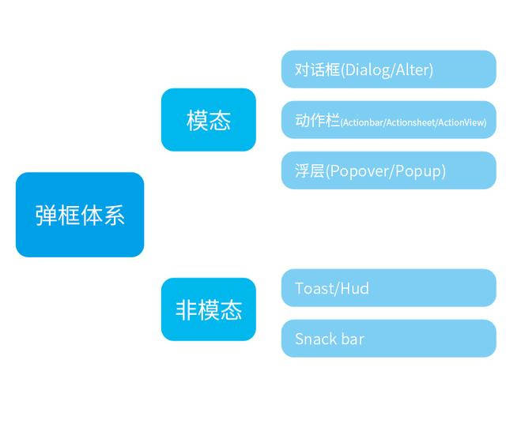
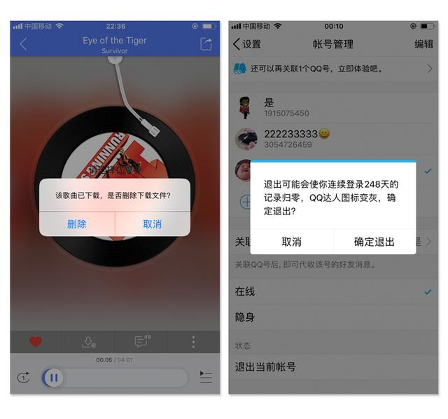
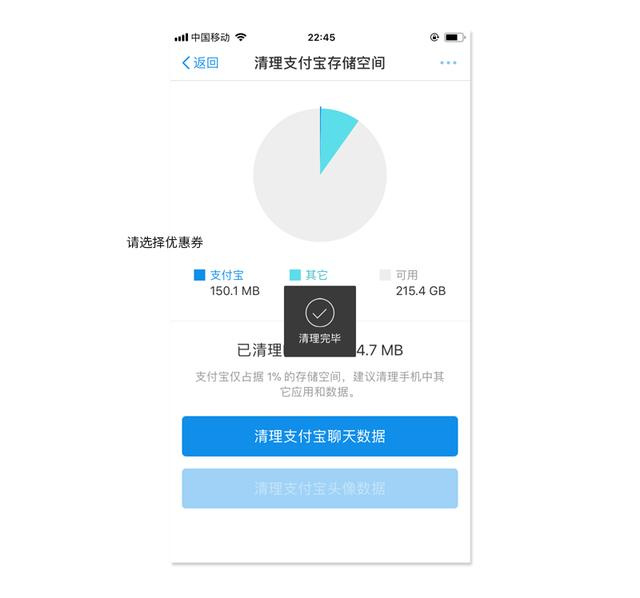
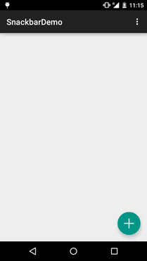
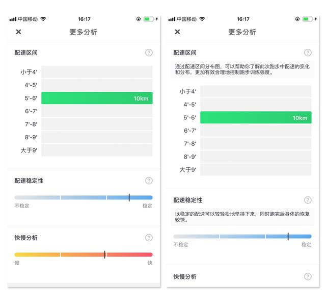

我们日常所说的弹框是一个很笼统的概念。所有的对话框，浮层，提示条我们都习惯性的称之为弹框，其实弹框我们可以分为两种：模态弹框和非模态弹框。

# 模态弹框

模态弹框和非模态弹框最大的区别就是是否强制用户交互。模态弹框会打断用户的当前操作流程，用户不在弹框上操作的话，其余功能都使用不了。从这方面，我们可以看出来模态弹框的优缺点都十分的明显：优点是可以很好的获取的用户的视觉焦点，缺点是打断了用户的当前操作流程。模态弹框属于一种重量性反馈，一般用于用户进行重要的操作。常见的模态弹框种类有对话框(Dialog/Alter)，动作栏(Actionbar/Actionsheet/ActionView)和浮层(Popover/Popup)。因为现在iOS和Android很多组件都是通用的，所以在接下来的文章里过于相似的组件我只介绍一种。

## 对话框

对话框一般用于用户进行一项很重要或者有风险的操作，这时会弹出一个对话框来给用户提示信息，用户根据提示来进行判断。一般会出现在屏幕的中间位置，会对界面的主要内容造成遮挡。

目前来说对话框的设计样式繁多，用户可以进行信息录入，也可以用于营销宣传。

## 动作栏

动作栏在我看来可以看成是对话框的一个加强版，因为无论是alert还是dialog一般都只有两个按钮。而动作栏可以提供多个功能按钮，而且展示的样式比较多变。

但是也有例外，有的动作栏只有两个选项。以网易云音乐为例，你要删除歌曲时，“确认删除”提示就是通过动作栏来完成的(如左图)。其实这里使用对话框也是完全可以的(如右图)，网易云音乐的设计师在这里使用的动作栏的理由我不得而知。但是我的个人猜测是，动作栏位于屏幕下方，相对来说对界面内容的遮盖会小一点。

## 浮层

浮层是用户点击控件或者界面某一区域浮出的半透明的临时视图。浮层的样式跟动作栏很相似，都可以向用户展示多个功能选项。但是浮层可以出现屏幕中的任何位置，能够给用户更具有指向型的提示。

接下来我们可以做一个小结：在不考虑信息录入情况下，**对话框适用于用户进行判断操作**，而**动作栏和浮层**适用于用户进行**选择操作**，而浮层相对于动作栏更具有**指向性**。

# 非模态弹框

与模态弹框相比，非模态弹框最大的区别是不强制用户交互，也不会弹出半透明背景层，非模态弹框停留一段时间后会自己消失。所以相对于模态弹框来说，非模态弹框属于轻量型反馈，不会对用户造成太大的干扰。常见的非模态弹框有toast(hud)和snackbar。

## Toast

Toast主要用于用户完成操作以后，告诉用户操作结果或者状态的变更。Toast其实是属于Android的组件，iOS里有一个相类似的是hud，最常见的就是音量调节提示。但是现在iOS和Android的界限不断被打破，toast现在也被广泛应用于iOS界面设计中。如果我们去看Android给的设计规范，会发现toast有以下几个特点：

只出现在屏幕底部

只能放文字

非模态弹框

但是我们会发现现在的一些toast是可以出现在屏幕中任何位置的，而且也可以加icon，所以说教条主义害死人啊。我想起前端跟我说的一句话，“只要你们能设计出来，理论上我们都可以做出来，但是我们可能会砍人。”

其实真实的toast是可以出现在屏幕的任何位置的，而且可以加icon，甚至连背景层颜色都能变。所以说我觉得设计师不仅要去看那些设计规范，还要花点时间跟开发沟通一下。

Toast的优点是不会打断用户当前的操作流程，属于轻量型的反馈方式。缺点是容易被用户忽视，而且不适合展示过多的信息，可能在用户读完之前就消失了。为了提升信息的可读性和增加样式美感，现在toast都会采用文字加icon的组合样式。

## Snackbar

Snackbar一般是由文字和功能按钮组成的，用户可以点击按钮交互，即使用户不点击snackbar也会自动消失，一般位于屏幕下方。通俗意义上，我们可以把snackbar看成是带有icon的toast。

Snackbar我放在最后说，因为它非常特殊。虽然snackbar属于非模态弹框，但是它也有模态弹框的一些特点。例如snackbar也有按钮来供用户交互；此外snackbar一般会出现在界面下方，这点又和动作栏中的Action sheet很像。

如果上面写的你看不懂，没关系。我来给你做一个小结：非模态弹框偏重信息提示，模态弹框既可以信息提示也可以供用户交互；toast是轻量型的弹框类型，snackbar集众家之所长，当然你说它四不像我也没意见。

弹框体系的建立优化

以上我们了解了几种主要的弹框样式和用法，接下来我们来考虑的是如何建立一款产品的弹框体系或者如何对现有产品的弹框体系进行优化。其实弹框体系的建立和优化的原则可以用一句话概括：能在界面中展示就不用弹框，能用非模态弹框的就不要用模态弹框。

因为任何弹框都会对用户造成干扰，即使是最轻量型的toast。从用户体验的角度来说，进行一个操作流程所受到的干扰肯定是越少越好。以下图为例，用户可能会对“配速区间”和“配速稳定性”这些专业术语不太了解，所以他们会点击“问号”图标。

这时候我们有3种的解决方案：

通过一个新的界面展示。但是我们可以可以看出，解释信息并不多，不需要通过一个新的页面来展示。

使用对话框或者浮层，在这里我们不能使用toast，因为toast时间太短，用户根本读不完。

在当前界面展示。

其实方案2和3这在我看来是不错的解决方案。但是考虑到减少对用户的干扰和操作步骤，这里我觉得方案3更佳。

多态按钮

此外多态按钮的使用也可以帮助我们解放弹框的压力。例如，支付宝的支付界面，立即支付按钮可以跳转到付款成功的状态，这时候就没有必要再用弹框给用户提示了。

建立优先级

优先级不同的信息应该获得不同的视觉权重，那么视觉权重最大的模态弹框应该展示重要的内容。所以我们要对需要展示的信息做一个优先级的排布，要让真正重要的信息才可以使用模态弹框。只有低频而又合理的使用，用户才会当回事。过度使用会给用户产生”狼来了”心理。