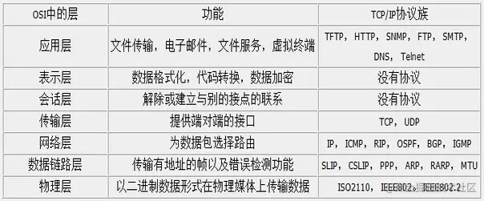
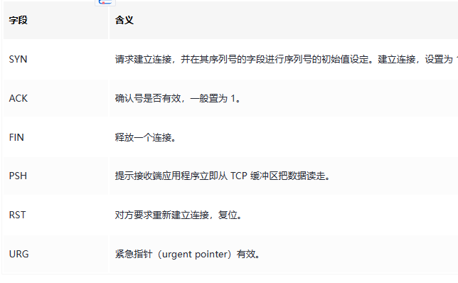
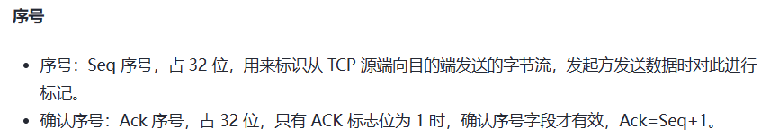
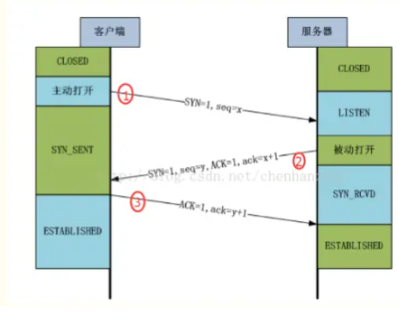
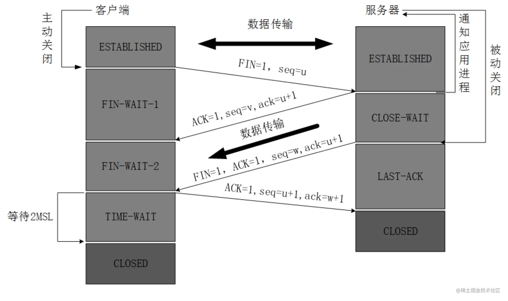

- [HTTP协议](./HTTP协议.md)
- [浏览器网络面试题：跨域、Axios、HTTP协议](./浏览器网络面试题.md)

# OSI七层模型和TCP/IP四层模型

[(140条消息) OSI七层模型、TCP/IP四层模型（超详细！！！！！）_加油，你可以的！的博客-CSDN博客_iso七层模型和四层模型](https://blog.csdn.net/wwy0324/article/details/109310658)

分层
- 应用层

  > 网络服务与最终用户的一个接口
  > 各种应用程序协议
  > 协议有： (超文本传输协议) FTP（文本传输协议） TFTP（简单文件传输协议） SMTP（简单邮件传输协议） SNMP（简单网络管理协议） DNS（域名系统） TELNET（远程终端协议） HTTPS（超文本传输安全协议） POP3（邮局协议版本3 ） DHCP（动态主机配置协议）

- 表示层

  > 数据的表示、安全、压缩。（在五层模型里面已经合并到了应用层）
  > 信息的语法语义以及他们的关联，如加密解密、转换翻译、压缩解压
  > 格式有，JPEG、ASCll、EBCDIC、加密格式等 [2]
  > 如LPP（轻量级表示协议）

- 会话层

  > 建立、管理、终止会话。（在五层模型里面已经合并到了应用层）
  > 不同机器上的用户之间建立及管理会话
  > 对应主机进程，指本地主机与远程主机正在进行的会话
  > 安全协议：SSL（安全套接字层协议）、TLS（安全传输层协议）

- 传输层

  > 定义传输数据的协议端口号，以及流控和差错校验。
  > 接受上一层数据，在必要的时候把数据进行切割，并将这些数据交给网络层，并保证这些数据段有效到达对端
  > 协议有：TCP UDP，数据包一旦离开网卡即进入网络传输层

- 网络层

  > 进行逻辑地址寻址，实现不同网络之间的路径选择。
  > 控制子网的运行，如逻辑编址、分组传输、路由选择
  > 协议有：ICMP（互联网控制信息协议） IGMP（组管理协议） IP（IPV4 IPV6）（互联网协议）
  > 安全协议、路由协议（vrrp虚拟路由冗余）

- 数据链路层

  > 建立逻辑连接、进行硬件地址寻址、差错校验 [3] 等功能。（由底层网络定义协议）
  > 将比特组合成字节进而组合成帧，用MAC地址访问介质，错误发现但不能纠正。
  > 物理寻址、同时将原始比特流转变为逻辑传输线路
  > 地址解析协议：ARP、PARP（反向地址转换协议）

- 物理层

  > 建立、维护、断开物理连接。（由底层网络定义协议）
  > 机械、电子、定时接口通信信道上的原始比特流传输
  > TCP/IP 层级模型结构，应用层之间的协议通过逐级调用传输层（Transport layer）、网络层（Network Layer）和物理数据链路层（Physical Data Link）而可以实现应用层的应用程序通信互联。

# TCP三次握手和四次挥手

## 标志位和序号

标注位中有ACK，序号中有Ack。

## 三次握手

**为什么要第三次握手？**

> 已失效的连接请求报文段”的产生在这样一种情况下：client 发出的第一个连接请求报文段并没有丢失，而是在某个网络结点长时间的滞留了，以致延误到连接释放以后的某个时间才到达 server。本来这是一个早已失效的报文段。但 server 收到此失效的连接请求报文段后，就误认为是 client 再次发出的一个新的连接请求。于是就向 client 发出确认报文段，同意建立连接。假设不采用“三次握手”，那么只要 server 发出确认，新的连接就建立了。由于现在 client 并没有发出建立连接的请求，因此不会理睬 server 的确认，也不会向 server 发送数据。但 server 却以为新的运输连接已经建立，并一直等待 client 发来数据。这样，server 的很多资源就白白浪费掉了。采用“三次握手”的办法可以防止上述现象发生。例如刚才那种情况，client 不会向 server 的确认发出确认。server 由于收不到确认，就知道 client 并没有要求建立连接。”

总结一下就是为了**防止服务端的等待浪费资源**。

**回答：**client 发送了第一个连接的请求报文，但是由于网络不好，这个请求没有立即到达服务端，而是在某个网络节点中滞留了，直到某个时间才到达 server，本来这已经是一个失效的报文，但是 server 端接收到这个请求报文后，还是会向 client 发出确认的报文，表示同意连接。**假如不采用三次握手，那么只要 server 发出确认，新的建立就连接了，但其实这个请求是失效的请求，client 是不会理睬 server 的确认信息，**也不会向服务端发送确认的请求，但是 server 认为新的连接已经建立起来了，并一直等待 client 发来数据，这样，server 的很多资源就没白白浪费掉了，采用三次握手就是为了防止这种情况的发生，server 会因为收不到确认的报文，就知道 client 并没有建立连接。这就是三次握手的作用。

## 四次挥手

确定双方都受到的断开指令。

1、2次，客户端知道服务端受到了断开指令，可以不再发送数据。

3、4次，服务端知道客户端确实断开了，不再发送数据。

1. 第一次分手：主机1（可以使客户端，也可以是服务器端），设置Sequence Number和Acknowledgment Number，向主机2发送一个FIN报文段；此时，主机1进入FINWAIT1状态；**这表示主机1没有数据要发送给主机2了**；
2. 第二次分手：主机2收到了主机1发送的FIN报文段，向主机1回一个ACK报文段，Acknowledgment Number为Sequence Number加1；主机1进入FINWAIT2状态；**主机2告诉主机1，我“同意”你的关闭请求**；
3. 第三次分手：**主机2向主机1发送FIN报文段，请求关闭连接**，同时主机2进入LAST_ACK状态；
4. 第四次分手：主机1收到主机2发送的FIN报文段，向主机2发送ACK报文段，然后主机1进入TIME_WAIT状态；主机2收到主机1的ACK报文段以后，就关闭连接；此时，主机1等待2MSL后依然没有收到回复，则证明Server端已正常关闭，那好，主机1也可以关闭连接了。

**为什么是四次挥手？**

**回答：** TCP协议是一种面向连接的、可靠的、基于字节流的运输层通信协议。**TCP是全双工模式**，这就意味着，当主机1发出FIN报文段时，**只是表示主机1已经没有数据要发送了**，主机1告诉主机2，它的数据已经全部发送完毕了；但是，这个时候主机1还是可以接受来自主机2的数据；当主机2返回ACK报文段时，表示它已经知道主机1没有数据发送了，但是主机2还是可以发送数据到主机1的；当主机2也发送了FIN报文段时，**这个时候就表示主机2也没有数据要发送了，就会告诉主机1，我也没有数据要发送了，之后彼此就会愉快的中断这次TCP连接**。如果要正确的理解四次分手的原理，就需要了解四次分手过程中的状态变化。

**为了确保数据能够完成传输。**

# 参考资料

- [Http系列(三) Http/Tcp三次握手和四次挥手 - 掘金 (juejin.cn)](https://juejin.cn/post/6844903935669436424)
- [(140条消息) OSI七层模型、TCP/IP四层模型（超详细！！！！！）_加油，你可以的！的博客-CSDN博客_iso七层模型和四层模型](https://blog.csdn.net/wwy0324/article/details/109310658)
- [通俗大白话来理解 TCP 协议的三次握手和四次分手 (qq.com)](https://mp.weixin.qq.com/s/efON3efZoDmHJg1os_3nqA)

