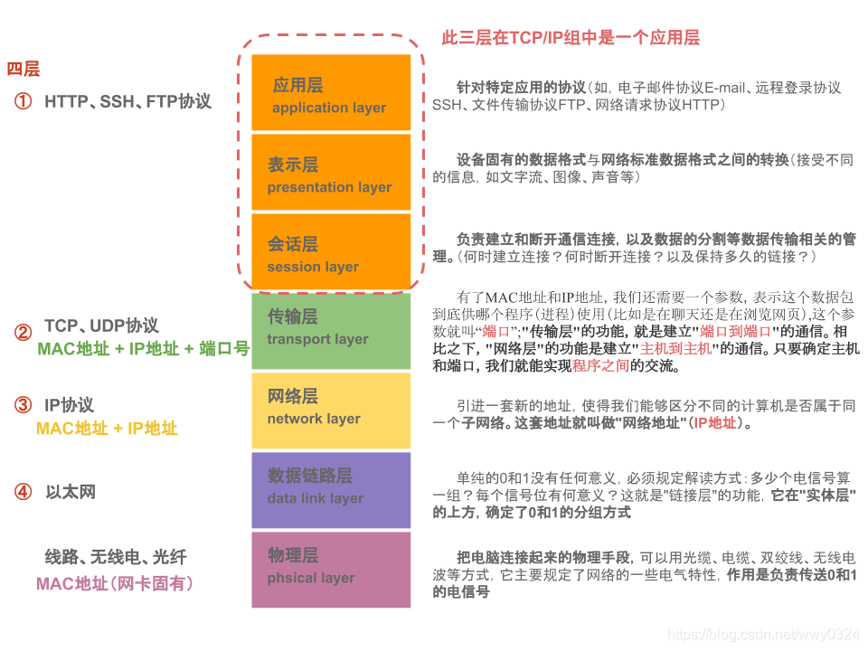

- [HTML知识点](./HTML知识点.md)

- [HTTP协议](./HTTP协议.md)
- [浏览器网络面试题：跨域、Axios、HTTP协议](./浏览器网络面试题.md)

# OSI七层模型和TCP/IP四层模型

[(140条消息) OSI七层模型、TCP/IP四层模型（超详细！！！！！）_加油，你可以的！的博客-CSDN博客_iso七层模型和四层模型](https://blog.csdn.net/wwy0324/article/details/109310658)

分层
- 应用层

  > 网络服务与最终用户的一个接口
  > 各种应用程序协议
  > 协议有： (超文本传输协议) FTP（文本传输协议） TFTP（简单文件传输协议） SMTP（简单邮件传输协议） SNMP（简单网络管理协议） DNS（域名系统） TELNET（远程终端协议） HTTPS（超文本传输安全协议） POP3（邮局协议版本3 ） DHCP（动态主机配置协议）

- 表示层

  > 数据的表示、安全、压缩。（在五层模型里面已经合并到了应用层）
  > 信息的语法语义以及他们的关联，如加密解密、转换翻译、压缩解压
  > 格式有，JPEG、ASCll、EBCDIC、加密格式等 [2]
  > 如LPP（轻量级表示协议）

- 会话层

  > 建立、管理、终止会话。（在五层模型里面已经合并到了应用层）
  > 不同机器上的用户之间建立及管理会话
  > 对应主机进程，指本地主机与远程主机正在进行的会话
  > 安全协议：SSL（安全套接字层协议）、TLS（安全传输层协议）

- 传输层

  > 定义传输数据的协议端口号，以及流控和差错校验。
  > 接受上一层数据，在必要的时候把数据进行切割，并将这些数据交给网络层，并保证这些数据段有效到达对端
  > 协议有：TCP UDP，数据包一旦离开网卡即进入网络传输层

- 网络层

  > 进行逻辑地址寻址，实现不同网络之间的路径选择。
  > 控制子网的运行，如逻辑编址、分组传输、路由选择
  > 协议有：ICMP（互联网控制信息协议） IGMP（组管理协议） IP（IPV4 IPV6）（互联网协议）
  > 安全协议、路由协议（vrrp虚拟路由冗余）

- 数据链路层

  > 建立逻辑连接、进行硬件地址寻址、差错校验 [3] 等功能。（由底层网络定义协议）
  > 将比特组合成字节进而组合成帧，用MAC地址访问介质，错误发现但不能纠正。
  > 物理寻址、同时将原始比特流转变为逻辑传输线路
  > 地址解析协议：ARP、PARP（反向地址转换协议）

- 物理层

  > 建立、维护、断开物理连接。（由底层网络定义协议）
  > 机械、电子、定时接口通信信道上的原始比特流传输
  > TCP/IP 层级模型结构，应用层之间的协议通过逐级调用传输层（Transport layer）、网络层（Network Layer）和物理数据链路层（Physical Data Link）而可以实现应用层的应用程序通信互联。

