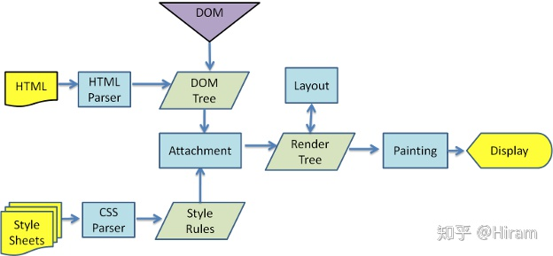

[[前端面试题总结\] ⭐️ 从莉莉丝到滴滴--我的成长之路 - 掘金 (juejin.cn)](https://juejin.cn/post/7146151385707315213)

回流：元素大小改变导致布局改变；

重绘：元素外观发生改变，但没有改变布局。

减少重绘和回流。

# 浏览器的渲染过程



从上面这个图上，我们可以看到，浏览器渲染过程如下：

1. 解析HTML，生成DOM树，解析CSS，生成CSSOM树
2. 将DOM树和CSSOM树结合，生成渲染树(Render Tree)
3. **Layout**(layout):根据生成的渲染树，进行回流(Layout)，得到节点的几何信息（位置，大小）
4. **Painting**(painting):根据渲染树以及回流得到的几何信息，得到节点的绝对像素
5. Display:将像素发送给GPU，展示在页面上。（这一步其实还有很多内容，比如会在GPU将多个合成层合并为同一个层，并展示在页面中。而css3硬件加速的原理则是新建合成层，这里我们不展开，之后有机会会写一篇博客）

## 回流

回流又称重排，当**浏览器发现布局（layout）发生了变化**，这个**时候就需要倒回去重新渲染，这个过程叫 回流（reflow）**。回流几乎是无法避免的，因为只要用户进行了交互操作，就会发生页面的一部分重新渲染。

### 重绘

重绘（repaint）则是当我们改变某个元素的背景色，文字颜色，边框颜色等不影响它周围或内部布局的属性是，屏幕的一部分要重画，但是元素的几何尺寸和位置没有发生改变。

## 何时发生回流重绘

我们前面知道了，回流这一阶段主要是计算节点的位置和几何信息，那么当页面布局和几何信息发生变化的时候，就需要回流。比如以下情况：

- 添加或删除可见的DOM元素
- 元素的位置发生变化
- 元素的尺寸发生变化（包括外边距、内边框、边框大小、高度和宽度等）
- 内容发生变化，比如文本变化或图片被另一个不同尺寸的图片所替代。
- 页面一开始渲染的时候（这肯定避免不了）
- 浏览器的窗口尺寸变化（因为回流是根据视口的大小来计算元素的位置和大小的）

**注意：回流一定会触发重绘，而重绘不一定会回流（回流和重绘是渲染中的两个过程）**

根据改变的范围和程度，渲染树中或大或小的部分需要重新计算，有些改变会触发整个页面的重排，比如，滚动条出现的时候或者修改了根节点。

**需要注意的是** 

　　`display：none` 会触发回流（reflow），而

　　`visibility：hidden` 属性表示隐藏元素，元素任然占据着布局空间，并没有改变布局和几何尺寸，所以只会触发 重绘（repaint）

## 浏览器的优化机制

现代的浏览器都是很聪明的，由于每次**重排**都会造成额外的计算消耗，因此大多数浏览器都会通过队列化**修改并批量执行来优化重排过程**。浏览器会将修改操作放入到队列里，直到过了一段时间或者操作达到了一个阈值，才清空队列。但是！**当你获取布局信息的操作的时候，会强制队列刷新**，比如当你访问以下属性或者使用以下方法：

- offsetTop、offsetLeft、offsetWidth、offsetHeight
- scrollTop、scrollLeft、scrollWidth、scrollHeight
- clientTop、clientLeft、clientWidth、clientHeight
- getComputedStyle()
- getBoundingClientRect
- 具体可以访问这个网站：[https://gist.github.com/paulirish/5d52fb081b3570c81e3a](https://link.zhihu.com/?target=https%3A//gist.github.com/paulirish/5d52fb081b3570c81e3a)

以上属性和方法都需要返回最新的布局信息，因此浏览器不得不清空队列，触发回流重绘来返回正确的值。因此，我们在修改样式的时候，**最好避免使用上面列出的属性，他们都会刷新渲染队列。**如果要使用它们，最好将值缓存起来。

## 减小重绘和重排的方法

- 使用`cssText`属性进行修改；

- 使元素脱离文档流；

- 使元素不可见；

  ```js
  ul.style.display = 'none';
  ```

  - 构建一个不在DOM中的子树，属性修改完成后再添加；

  ```
  const ul = document.getElementById('list');
  const fragment = document.createDocumentFragment();
  appendDataToElement(fragment, data);
  ul.appendChild(fragment);
  ```

  

# 参考资料

- [讲清楚重排或回流、重绘 - 知乎 (zhihu.com)](https://zhuanlan.zhihu.com/p/342371522)
- [浏览器的重绘和回流（Repaint & Reflow） - 知乎 (zhihu.com)](https://zhuanlan.zhihu.com/p/77520334#:~:text= 重绘：由于节点的几何属性发生改变或者由于样式发生改变而不会影响布局的，称为重绘，例如 outline%2C visibility%2C color,、 background-color 等。 回流：是布局或者几何属性需要改变就称为回流。 回流是影响浏览器性能的关键因素，因为其变化涉及到部分页面（或是整个页面）的布局更新。)
- [回流（reflow）与重绘（repaint） - 默然晴天 - 博客园 (cnblogs.com)](https://www.cnblogs.com/bryanfu/p/15059250.html#:~:text=回流又称重排，当浏览器发现布局（layout）发生了变化，这个时候就需要倒回去重新渲染，这个过程叫 回流（reflow）。,回流几乎是无法避免的，因为只要用户进行了交互操作，就会发生页面的一部分重新渲染。 重绘（repaint）则是当我们改变某个元素的背景色，文字颜色，边框颜色等不影响它周围或内部布局的属性是，屏幕的一部分要重画，但是元素的几何尺寸和位置没有发生改变。)
