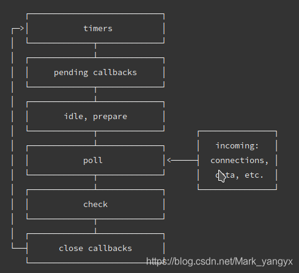
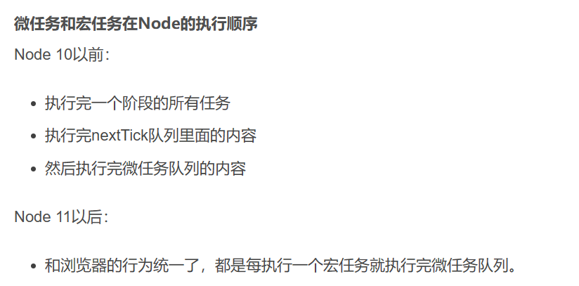

## NodeJS事件循环

- 事件循环是一个单独的线程；
- 事件循环并不是Node.js的唯一线程，它还有一个Worker Pool，它是一个线程池，用于处理一些耗时的操作，比如文件I/O。事件循环和Worker Pool之间通过消息队列进行通信。所以，Node.js并不是完全单线程的，它只是在JavaScript层面使用了单线程的事件循环模型。

### 什么是事件nodejs的事件循环

主代码执行、nextTick和事件循环的区别如下：[1](https://juejin.cn/post/7030833263618818084)[2](https://juejin.cn/post/6993315229845159943)[3](https://www.jianshu.com/p/deb8bc589377)

- 主代码执行是指nodejs启动后，首先执行的输入脚本或模块。主代码执行是一个宏任务，它会在事件循环之前完成。[1](https://juejin.cn/post/7030833263618818084)[2](https://juejin.cn/post/6993315229845159943)
- nextTick是指nodejs提供的一个函数，它可以将一个回调函数放入一个微任务队列中，在当前阶段的所有操作完成后立即执行。nextTick优先于其他微任务和宏任务执行。[2](https://juejin.cn/post/6993315229845159943)[3](https://www.jianshu.com/p/deb8bc589377)
- 事件循环是指nodejs的核心特性，它可以让nodejs在单线程上执行异步操作。事件循环有六个阶段，每个阶段都有一个或多个回调函数队列。事件循环会按照一定的顺序依次进入每个阶段，并执行该阶段的所有回调函数。[1](https://juejin.cn/post/7030833263618818084)[2](https://juejin.cn/post/6993315229845159943)

> [nodejs中的事件循环是指nodejs如何处理异步任务的机制](https://www.cnblogs.com/EaVango/p/14722428.html)[1](https://www.cnblogs.com/EaVango/p/14722428.html)[2](https://www.cnblogs.com/goloving/p/16523648.html)[。宏任务和微任务是两种不同类型的异步任务，它们在事件循环中有不同的执行顺序](https://www.cnblogs.com/EaVango/p/14722428.html)[1](https://www.cnblogs.com/EaVango/p/14722428.html)[3](https://segmentfault.com/a/1190000040014996)。
>
> [简单来说，宏任务是指那些需要放到事件队列中等待执行的异步任务，比如setTimeout、setInterval、setImmediate等](https://www.cnblogs.com/EaVango/p/14722428.html)[1](https://www.cnblogs.com/EaVango/p/14722428.html)[2](https://www.cnblogs.com/goloving/p/16523648.html)[。微任务是指那些不需要进入事件队列，而是在当前宏任务执行完毕后立即执行的异步任务，比如Promise.then、process.nextTick等](https://www.cnblogs.com/EaVango/p/14722428.html)[1](https://www.cnblogs.com/EaVango/p/14722428.html)[2](https://www.cnblogs.com/goloving/p/16523648.html)。

当 Node.js 启动后，它会：**1）初始化事件循环**，2）**处理已提供的输入脚本**（或丢入 [REPL](https://nodejs.org/api/repl.html#repl_repl)，本文不涉及到），它可能会调用一些异步的 API、调度定时器，或者调用 `process.nextTick()`，然后3**开始处理事件循环**。

事件循环是 Node.js 处理**非阻塞 I/O 操作**的机制——尽管 JavaScript 是单线程处理的——当有可能的时候，它们会把操作转移到系统内核中去。

因为目前大多数内核都是多线程的，所以它们可以在后台处理多种操作。当其中的一个操作完成的时候，内核通知 Node.js 将适合的**回调函数添**加到 ***轮询* 队列**中等待时机执行。

以下是事件循环操作顺序的简化概览：

```bash
   ┌───────────────────────┐
┌─>│        timers         │<————— 执行 setTimeout()、setInterval() 的回调
│  └──────────┬────────────┘
|             |<-- 执行所有 Next Tick Queue 以及 MicroTask Queue 的回调
│  ┌──────────┴────────────┐
│  │     pending callbacks │<————— 执行由上一个 Tick 延迟下来的 I/O 回调（待完善，可忽略）
│  └──────────┬────────────┘
|             |<-- 执行所有 Next Tick Queue 以及 MicroTask Queue 的回调
│  ┌──────────┴────────────┐
│  │     idle, prepare     │<————— 内部调用（可忽略）
│  └──────────┬────────────┘     
|             |<-- 执行所有 Next Tick Queue 以及 MicroTask Queue 的回调
|             |                   ┌───────────────┐
│  ┌──────────┴────────────┐      │   incoming:   │ - (执行几乎所有的回调，除了 close callbacks 以及 timers 调度的回调和 setImmediate() 调度的回调，在恰当的时机将会阻塞在此阶段)
│  │         poll          │<─────┤  connections, │ 
│  └──────────┬────────────┘      │   data, etc.  │ 
│             |                   |               | 
|             |                   └───────────────┘
|             |<-- 执行所有 Next Tick Queue 以及 MicroTask Queue 的回调
|  ┌──────────┴────────────┐      
│  │        check          │<————— setImmediate() 的回调将会在这个阶段执行
│  └──────────┬────────────┘
|             |<-- 执行所有 Next Tick Queue 以及 MicroTask Queue 的回调
│  ┌──────────┴────────────┐
└──┤    close callbacks    │<————— socket.on('close', ...)
   └───────────────────────┘
```

事件循环的6个阶段是在Node.js启动时初始化的，然后按照一定的顺序循环执行。**每次循环执行的过程叫做一个tick**。所以，事件循环是会不断地重复1-6这样的顺序，直到没有更多的异步任务或者定时器。

### 阶段概述

事件循环是Node.js实现非阻塞I/O操作的机制，**它可以将操作分发给系统内核**，然后继续执行其他任务。事件循环有六个阶段，分别是timers，pending callbacks，idle, prepare，poll，check和close callbacks1。**每个阶段都有一个或多个宏任务队列**，事件循环会按照顺序依次处理每个队列中的任务1。在**每个阶段之间，事件循环还会执行微任务队列中的任务**。微任务是一些需要尽快执行的任务，比如process.nextTick和Promise.then。

- **定时器**：本阶段执行**已经被** `setTimeout()` 和 `setInterval()` 的调度回调函数。
- 待定回调（I/O callbacks阶段）：执行延迟到下一个循环迭代的 I/O 回调。
- idle, prepare：仅系统内部使用。
- **轮询**：检索新的 I/O 事件; 大部分情况**执行与 I/O 相关的回调**（几乎所有情况下，**除了**关闭的回调函数，那些由计时器和 `setImmediate()` 调度的之外，关闭和检测在下面两个阶段），**其余情况 node 将在适当的时候在此阻塞**。
- **检测**：`setImmediate()` 回调函数在这里执行。
- **关闭的回调函数**：一些关闭的回调函数，如：`socket.on('close', ...)`。

在每次运行的事件循环**之间**，Node.js 检查**前一个阶段**是否在等待任何异步 I/O 或计时器，如果没有的话，则完全关闭。

**每个框被称为事件循环机制的一个阶段**；`timers`是；**每个阶段**都有一个 FIFO 队列来执行回调。当事件循环进入给定的阶段时，它将执行特定于该阶段的任何操作，然后执行该阶段队列中的回调，直到队列用尽或已经执行到最大的回调数。**当该队列已用尽**或**达到回调限制**，事件循环将移动到下一阶段，以此类推。

### 轮询阶段

轮询阶段有两个重要功能：1）计算应该阻塞和轮询I/O的时间；2）处理轮询队列里的事件。

当事件循环进入 **轮询** 阶段且 *没有被调度的计时器时* ，将发生以下两种情况之一：

- *如果 **轮询** 队列 **不是空的*** ，事件循环将循环访问回调队列并同步执行它们，直到队列已用尽，或者达到了与系统相关的硬性限制。
- *如果 **轮询** 队列 **是空的*** ，还有两件事发生：
  - 如果脚本被 `setImmediate()` 调度，则事件循环将结束 **轮询** 阶段，并进入 **检测** 阶段以执行那些被调度的脚本。
  - 如果脚本 **未被** `setImmediate()`调度，则事件循环将等待回调被添加到队列中，然后立即执行。

[poll阶段是事件循环中检索新的I/O事件的阶段，执行与I/O相关的回调函数。](https://blog.csdn.net/cainiaofu/article/details/108339295)[1](https://blog.csdn.net/cainiaofu/article/details/108339295)[2](https://blog.csdn.net/agony_isolate/article/details/105077249)

[要往poll阶段添加任务，可以使用nodejs的底层库libuv提供的接口，如epoll或poll。](https://www.zhihu.com/question/330124623)[3](https://www.zhihu.com/question/330124623)[1](https://blog.csdn.net/cainiaofu/article/details/108339295)[ 这些接口可以让nodejs监听文件描述符（fd）上的事件，并在事件发生时执行相应的回调函数。](https://blog.csdn.net/cainiaofu/article/details/108339295)[1](https://blog.csdn.net/cainiaofu/article/details/108339295)[2](https://blog.csdn.net/agony_isolate/article/details/105077249)

- [如果poll阶段没有任何I/O事件或定时器到期，且没有setImmediate()函数被调用，那么nodejs会一直等待新的I/O事件到来。](https://www.zhihu.com/question/330124623)[1](https://www.zhihu.com/question/330124623)[2](https://juejin.cn/post/7080070564282368007)
- [如果poll阶段有I/O事件或定时器到期，但是没有回调函数可以执行（轮询队列为空），那么nodejs会跳过poll阶段并检查是否有setImmediate()函数被调用。](https://www.zhihu.com/question/330124623)[1](https://www.zhihu.com/question/330124623)[2](https://juejin.cn/post/7080070564282368007)否则绕回定时器阶段执行定时器的回调。
- [如果poll阶段有I/O事件或定时器到期，并且有回调函数可以执行，那么nodejs会执行回调函数，并在每次执行后检查是否有setImmediate()函数被调用。](https://www.zhihu.com/question/330124623)[1](https://www.zhihu.com/question/330124623)[2](https://juejin.cn/post/7080070564282368007)

一旦 **轮询** 队列为空，事件循环将检查 **\_已达到时间阈值的计时器\_**。如果一个或多个计时器已准备就绪，则事件循环将**绕回计时器阶段**以执行这些计时器的回调。


**虽然轮询阶段需要等待新事件的到来**，**但是事件循环并不会一直停留在轮询阶段等待事件的发生**。当轮询阶段中的所有任务都被处理完毕之后，事件循环会根据当前状态决定是否进入下一个阶段。

具体来说，事件循环中有多个阶段，每个阶段都有自己的任务队列。当一个阶段中的任务都被处理完毕之后，事件循环会查看下一个阶段的任务队列是否为空。如果下一个阶段的任务队列不为空，则事件循环会进入下一个阶段继续执行任务。如果下一个阶段的任务队列为空，则事件循环会等待新事件的到来，直到有新事件触发并被添加到轮询阶段的任务队列中。

需要注意的是，事件循环中的每个阶段都有自己的任务队列，这些任务队列是互相独立的。如果在某个阶段的任务队列中添加了新的任务，**这些任务将会在下一个Tick（事件循环的一个轮回）中被执行**。因此，**即使事件循环在等待新事件的到来时**（轮询阶段），也可能会在下一个Tick中继续执行任务，**而不是一直停留在轮询阶段等待事件的发生**。

### 检查阶段

此阶段允许人员在 **轮询** 阶段完成后立即执行回调。如果轮询阶段变为空闲状态，并且脚本使用 `setImmediate()` 后被排列在队列中，则事件循环可能进入到 **检查** 阶段而不是等待。

`setImmediate()` 实际上是一个在**事件循环的单独阶段运行的特殊计时器**。它使用一个 libuv API 来安排回调在 **轮询** 阶段完成后执行。

通常，在执行代码时，事件循环最终会进入轮询阶段，在该阶段它将等待传入连接、请求等。但是，如果回调已使用 `setImmediate()`调度过，并且轮询阶段变为空闲状态，则它将结束此阶段，并继续到检查阶段而不是继续等待轮询事件。

### `setImmediate()` 对比 `setTimeout()`

`setImmediate`没有一个等待时间阈值的参数，一旦结束轮询阶段，则它的回调函数会立刻执行。

`setTimeout`则是在经过指定时间后，将任务添加到**定时器阶段**的任务队列中。参考**轮询阶段**描述的：

> 一旦 **轮询** 队列为空，事件循环将检查 **\_已达到时间阈值的计时器\_**。如果一个或多个计时器已准备就绪，则事件循环将**绕回计时器阶段**以执行这些计时器的回调。

如果在一个I/O循环中使用`setTimeout`和`setImmediate`，`setImmediate `总是被优先调用：

```js
// timeout_vs_immediate.js
const fs = require('fs');

fs.readFile(__filename, () => {
  setTimeout(() => {
    console.log('timeout');
  }, 0);
  setImmediate(() => {
    console.log('immediate');
  });
});
```

而主模块内的执行调用顺序是不确定的。

### process.nextTick

 `process.nextTick()` 从技术上讲不是事件循环的一部分。

相反，它都将在当前操作完成后处理 `nextTickQueue`， 而不管事件循环的当前阶段如何。

这里所谓的 **操作** 被定义为来自底层 C/C++ 处理器的转换，和需要处理的 JavaScript 代码的执行。

回顾我们的图示，**任何时候在给定的阶段中调用** `process.nextTick()`，所有传递到 `process.nextTick()` 的回调将在事件**循环继续之前**解析。这可能会造成一些糟糕的情况，因为**它允许您通过递归 `process.nextTick()`调用来“饿死”您的 I/O**，阻止事件循环到达 **轮询** 阶段。

### 每个阶段的执行时机上限

一些阶段，比如 timers 阶段，有一个系统相关的硬限制，如果达到系统依赖最大限制数量，即使有未执行的计时器，它也会移到下一阶段。

一些阶段，比如 I/O callbacks 阶段，有一个内部的软限制，如果执行时间超过了 10 毫秒，它也会移到下一阶段。

一些阶段，比如 poll 阶段，没有固定的时间上限，它会等待 I/O 事件或者其他事件触发才会离开

### 参考资料

- [使用 Node.js 多线程进行并行处理 - 掘金 (juejin.cn)](https://juejin.cn/post/7075256441019465742)
- [nodejs如何解决高并发？ - 浅笑· - 博客园 (cnblogs.com)](https://www.cnblogs.com/qianxiaox/p/13847495.html#:~:text=Node可以在不新增额外线程的情况下，依然可以对任务进行并发处理 —— Node.js是单线程的。,它通过事件循环（event loop）来实现并发操作，对此，我们应该要充分利用这一点 —— 尽可能的避免阻塞操作，取而代之，多使用非阻塞操作。)
- [Node.js 事件循环，定时器和 process.nextTick() | Node.js (nodejs.org)](https://nodejs.org/zh-cn/docs/guides/event-loop-timers-and-nexttick/#:~:text=事件循环是 Node.js 处理非阻塞 I%2FO 操作的机制——尽管 JavaScript,是单线程处理的——当有可能的时候，它们会把操作转移到系统内核中去。 既然目前大多数内核都是多线程的，它们可在后台处理多种操作。 当其中的一个操作完成的时候，内核通知 Node.js 将适合的回调函数添加到 轮询 队列中等待时机执行。)
- [nodejs源码解析之事件循环 - 知乎 (zhihu.com)](https://zhuanlan.zhihu.com/p/101009546)
- [理解libuv的基本原理 - 知乎 (zhihu.com)](https://zhuanlan.zhihu.com/p/139127919)
- [the Node.js Event Loop, Timers, and `process.nextTick()`](https://nodejs.org/en/docs/guides/event-loop-timers-and-nexttick/)
- [nodejs中的event loop - 简书 (jianshu.com)](https://www.jianshu.com/p/deedcbf68880)

## API

### setTimeout和setImmediate

setImmediate和setTimeout的区别在于**它们执行的时机不同**。setImmediate是在poll阶段结束后，在check阶段执行的，而setTimeout是在timers阶段执行的。

如果`setTimeout`的延迟时间是0，那么它会在下一个**tick**的**timers**阶段执行。如果`setTimeout`的延迟时间是大于0的，那么它会在指定的时间后的**timers**阶段执行。而`setImmediate`是在当前**tick**的**check**阶段执行的。

如果两者都在一个I/O回调中调用，那么`setTimeout`可能会比`setImmediate`先执行，因为I/O回调是在**poll**阶段执行的，而此时**timers**阶段可能已经到达了。但是，如果两者都在主模块中调用，那么`setImmediate`通常会比`setTimeout`先执行，因为主模块是在第一个**tick**的**timers**阶段之前执行的，而此时**check**阶段会先于**timers**阶段。

**timers阶段是第一个阶段，但是它并不是在每个tick的开始就执行的**。它只有在到达了预设的延迟时间或者超时时间才会执行。所以，如果在第一个**tick**的开始没有任何定时器到期，那么timers阶段就会被跳过，直接进入下一个阶段。而主模块是在第一个**tick**的开始就执行的，所以它会先于timers阶段。

---

在Node.js中，事件循环是由几个不同的阶段组成的，每个阶段都有自己的任务队列，用来存放待执行的回调函数。

当事件循环进入某个阶段时，它会检查该阶段的任务队列是否有需要执行的任务，如果有，就依次执行它们，直到队列为空或者达到最大执行限制。

在同一个队列中，意思是在同一个阶段的任务队列中。

例如，在poll阶段中，如果调用了setTimeout和setImmediate，那么它们就会被放入poll阶段的任务队列中。

这样，当事件循环处理完当前的I/O回调后，就会执行poll阶段的任务队列中的任务。

这时，setImmediate会被优先处理，因为它是在poll阶段被调用的。

而setTimeout则要等到timers阶段才能被执行，因为它是在timers阶段被检查的。

所以，在这种情况下，setImmediate会比setTimeout先执行。

---

一般来说，如果它们都在同一个异步流程中被调用，那么setImmediate会比setTimeout先执行。

但是，如果它们都在同步代码中被调用，那么它们的执行顺序就会受到事件循环的影响。

具体来说，如果在poll阶段中调用它们，那么它们就会被放入poll阶段的任务队列中，等待下一次事件循环。

这时，如果poll阶段的执行时间超过了setTimeout的延迟时间（即使是0毫秒），那么setTimeout就会在下一次事件循环中被检查并执行，而setImmediate则要等到check阶段才能执行。

反之，如果poll阶段的执行时间没有超过setTimeout的延迟时间，那么setImmediate就会在下一次事件循环中被优先执行，而setTimeout则要等到timers阶段才能执行。

### 轮询（poll）阶段和定时器

poll阶段是事件循环中的一个阶段，它主要负责处理异步的I/O事件，比如文件读写，网络请求等。

在poll阶段中，如果有新的I/O事件发生，那么它们的回调函数就会被放入poll阶段的任务队列中，等待执行。

setTimeout的回调函数是由timers阶段来调度的，但是它们并不是在timers阶段被创建的。

**当你调用setTimeout时，它会在内部创建一个定时器对象，并将它插入到一个优先队列中。**

这个优先队列会根据定时器对象的到期时间来排序，最先到期的定时器对象会被放在队列的最前面。

然后，在每次事件循环开始时，timers阶段会检查这个优先队列，看看是否有已经到期的定时器对象。

如果有，那么它们的回调函数就会被取出并执行。

如果没有，那么事件循环就会进入下一个阶段，也就是poll阶段。

在poll阶段中，如果有新的I/O事件发生，并且它们的回调函数被放入了poll阶段的任务队列中，那么这些回调函数就有可能在setTimeout的回调函数之前执行。

这是因为**poll阶段会一直等待新的I/O事件发生**，直到满足以下两个条件之一：

- poll阶段的**任务队列已经被清空**或者**达到了最大执行限制**（自身原因）；
- 有已经到期的定时器对象（定时器原因）；

只有当满足了其中一个条件后，事件循环才会离开poll阶段，并进入check阶段。

在check阶段中，setImmediate的回调函数才会被执行。

所以，在poll阶段中调用setTimeout和setImmediate时，它们的执行顺序取决于poll阶段的执行时间是否超过了setTimeout的延迟时间。

### process.nextTick

process.nextTick() 是 Node.js 中的一个函数，它可以将一个回调函数放入当前事件循环的末尾，让它在下一个事件循环开始前执行。

这样可以保证 API 始终是异步的，即使它不必是。

process.nextTick() 与 setImmediate() 的区别是，setImmediate() 会在事件循环的下一次迭代或 tick 时触发，而 process.nextTick() 会在同一个阶段立即执行。

这意味着 process.nextTick() 比 setImmediate() 触发得更快，但也可能导致其他阶段的延迟。

---

process.nextTick 的回调，会在**同一个阶段立即执行**，而不是等到下一个阶段。

process.nextTick 一般是在 poll 阶段被执行，也有可能在 check 阶段执行（这是用户定义的回调执行的阶段）。

process.nextTick 的回调会在 Promise 的 Microtasks 之前执行，因为它们是通过 V8 的 RunMicrotasks 方法执行的，而 RunMicrotasks 会在 process.nextTick 队列执行，也会在 node::MakeCallback 中执行。

---

**promise.nextTick可以饿死I/O：**

process.nextTick 可以饿死 I/O，是因为它会在事件循环继续之前执行所有传递给它的回调函数。[1](https://juejin.cn/post/7073715866130612231)[2](https://stackoverflow.com/questions/64264617/when-is-process-nexttick-in-the-nodejs-event-loop-called)

这意味着如果你在 process.nextTick 的回调函数中递归地调用 process.nextTick，你就会阻塞事件循环，导致其他的异步任务无法执行，比如 I/O 操作。

### setImmediate的特殊情况

setImmediate 是在 check 阶段执行的。

但是，有一种特殊情况，如果 poll 阶段空闲，并且有被 setImmediate () 设定的回调，那么事件循环直接跳到 check 执行而不是阻塞在 poll 阶段等待回调被加入。

这样，setImmediate 可能会在 poll 阶段执行，而不是 check 阶段。

假设我们有这样一段代码：

```
setTimeout(function timeout () {
  console.log('timeout');
},0);

setImmediate(function immediate () {
  console.log('immediate');
});
```

这段代码的执行结果可能是 timeout 先打印，也可能是 immediate 先打印，取决于 poll 阶段的状态。123

如果 poll 阶段空闲，并且有被 setImmediate() 设定的回调，那么事件循环直接跳到 check 执行而不是阻塞在 poll 阶段等待回调被加入。123

这时，immediate 会先打印，然后再执行 timer 阶段的 timeout。123

如果 poll 阶段不空闲，或者没有被 setImmediate() 设定的回调，那么事件循环会在 poll 阶段等待，直到 timer 阶段的 timeout 到达设定时间。123

这时，timeout 会先打印，然后再执行 check 阶段的 immediate。12

nodejs中也有宏任务与微任务的区别，但是宏任务由多个队列组成

### 宏任务执行顺序



### 微任务执行顺序



[浏览器和Node 事件循环的区别_node事件循环机制与浏览器的区别是什么-CSDN博客](

## 对比浏览器的事件循环

### 定时器差异

**在 Node.js 的一个事件循环中，timers阶段会尽可能地执行所有到期的定时器回调，而不是像在浏览器中，只执行一个**。

这是因为 Node.js 中的定时器函数实现了与网络浏览器提供的定时器 API 类似的 API，但使用的是围绕 Node.js 事件循环 构建的不同的内部实现。

在浏览器中，每次事件循环只会执行一个任务队列中的任务，然后检查是否有微任务（如 Promise）需要执行，然后再执行下一个任务队列中的任务。

所以，在浏览器中，如果有多个定时器到期，它们会被放入同一个任务队列中，但是只有第一个定时器的回调会被执行，然后事件循环会转移到下一个阶段。

---

在 Node.js 中，每次事件循环只有一个阶段会执行任务队列中的任务，就是 timers 阶段。

所以，在 Node.js 中，如果有多个定时器到期，它们会被放入同一个任务队列中，并且 timers 阶段会尝试执行所有的定时器回调，直到任务队列为空或者达到了**最大执行限制**。

然后事件循环会转移到下一个阶段，并且不会检查是否有微任务需要执行。

这就导致了 Node.js 中的定时器回调可能比浏览器中的更及时地执行，但也可能导致其他阶段的延迟。

---

**在timers阶段创建了新的定时器：**

在timers阶段使用`setTimeout(callback, 0)`创建了新的到期的定时器，**那么只要timers阶段在执行完闭后还有时间**，就会执行这个新的到期的定时器回调。
