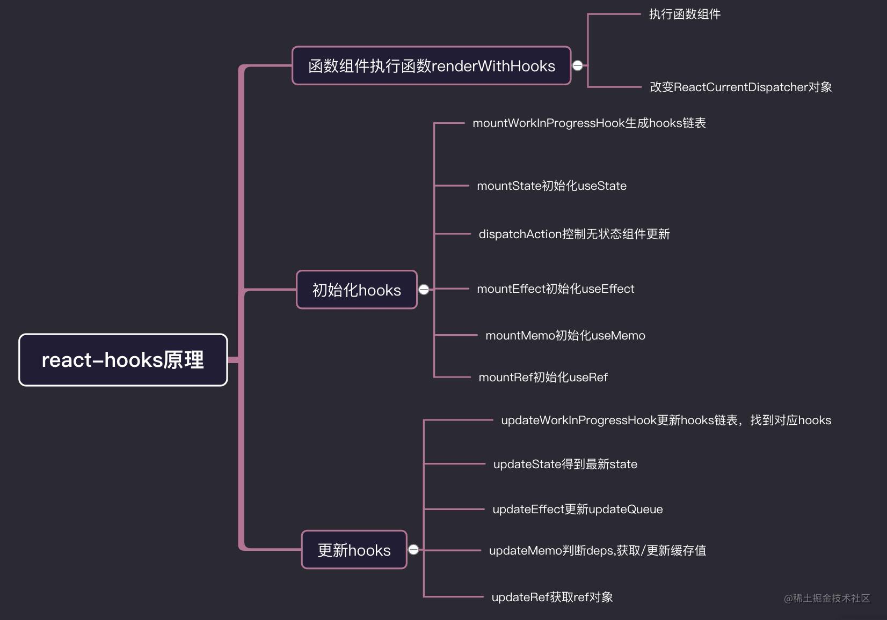
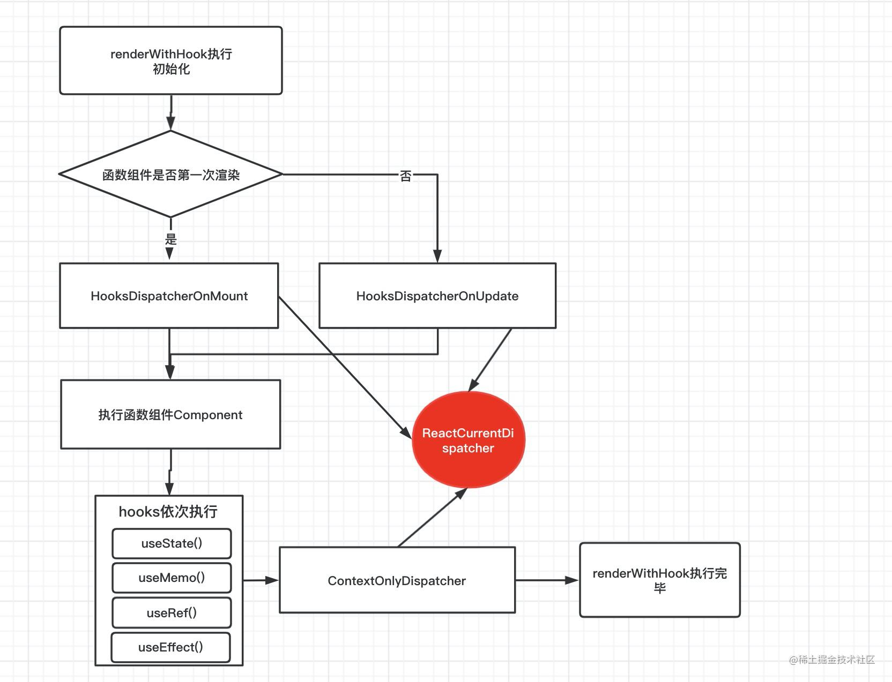

# hooks原理

> *Hook* 是 React 16.8 的新增特性。它可以让你在不编写 class 的情况下使用 state 以及其他的 React 特性。

## Questions

1 在无状态组件每一次函数上下文执行的时候，`react`用什么方式记录了`hooks`的状态？

2 多个`react-hooks`用什么来记录每一个`hooks`的顺序的 ？ 换个问法！为什么不能条件语句中，声明`hooks`? `hooks`声明为什么在组件的最顶部？

3 `function`函数组件中的`useState`，和 `class`类组件 `setState`有什么区别？

4 `react` 是怎么捕获到`hooks`的执行上下文，是在函数组件内部的？

5 `useEffect`,`useMemo` 中，为什么`useRef`不需要依赖注入，就能访问到最新的改变值？

6 `useMemo`是怎么对值做缓存的？如何应用它优化性能？

7 为什么两次传入`useState`的值相同，函数组件不更新?

...

# 使用useMemo和useCallback

`useCallback`和`useMemo`是一样的东西，只是入参有所不同。

`useCallback`缓存的是回调函数，如果依赖项没有更新，就会使用缓存的回调函数；

`useMemo`缓存的是回调函数的`return`，如果依赖项没有更新，就会使用缓存的`return`；

官网有这样一段描述`useCallback(fn, deps)` 相当于 `useMemo(() => fn, deps)`。

# 参考资料

- [「react进阶」一文吃透react-hooks原理 - 掘金 (juejin.cn)](https://juejin.cn/post/6944863057000529933)
- [从React源码角度看useCallback，useMemo，useContext - 掘金 (juejin.cn)](https://juejin.cn/post/7197189371371323450)