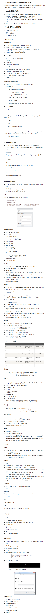

[非关系型数据库（nosql）介绍 (qq.com)](https://view.inews.qq.com/a/20210109A02VE200)

非关系型数据库也叫Nosql数据库，全称是not noly sql。

2009年初，Johan Oskarsson举办了一场关于开源分布式数据库的讨论，Eric Evans在这次讨论中提出了NoSQL一词，用于指代那些非关系型的，分布式的，且一般不保证遵循ACID原则的数据存储系统。Eric Evans使用NoSQL这个词，并不是因为字面上的“没有SQL”的意思，他只是觉得很多经典的关系型数据库名字都叫“**SQL”,所以为了表示跟这些关系型数据库在定位上的截然不同，就是用了“NoSQL“一词。

非关系型数据库提出另一种理念，例如，以键值对存储，且结构不固定，每一个元组可以有不一样的字段，每个元组可以根据需要增加一些自己的键值对，这样就不会局限于固定的结构，可以减少一些时间和空间的开销。使用这种方式，用户可以根据需要去添加自己需要的字段，这样，为了获取用户的不同信息，不需要像关系型数据库中，要对多表进行关联查询。仅需要根据id取出相应的value就可以完成查询。

