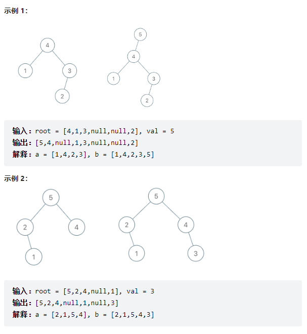
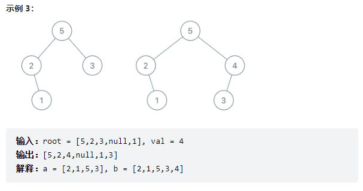

# 题目

[998. 最大二叉树 II - 力扣（LeetCode）](https://leetcode.cn/problems/maximum-binary-tree-ii/)

> 最大树 定义：一棵树，并满足：其中每个节点的值都大于其子树中的任何其他值。
>
> 给你最大树的根节点 root 和一个整数 val 。
>
> 就像 之前的问题 那样，给定的树是利用 Construct(a) 例程从列表 a（root = Construct(a)）递归地构建的：
>
> 如果 a 为空，返回 null 。
> 否则，令 a[i] 作为 a 的最大元素。创建一个值为 a[i] 的根节点 root 。
> root 的左子树将被构建为 Construct([a[0], a[1], ..., a[i - 1]]) 。
> root 的右子树将被构建为 Construct([a[i + 1], a[i + 2], ..., a[a.length - 1]]) 。
> 返回 root 。
> 请注意，题目没有直接给出 a ，只是给出一个根节点 root = Construct(a) 。
>
> 假设 b 是 a 的副本，并在末尾附加值 val。题目数据保证 b 中的值互不相同。
>
> 返回 Construct(b) 。
>
> 来源：力扣（LeetCode）
> 链接：https://leetcode.cn/problems/maximum-binary-tree-ii
> 著作权归领扣网络所有。商业转载请联系官方授权，非商业转载请注明出处。






# 分析

给定的树是从list **a** 构建的

记 $a=[a_{0},a_{1},a_{2},\cdots a_{k}]$;

在**Construct**算法中，根节点是列表中最大元素$x_{i}$，然后将列表以$x_{i}$将列表划分为左右两个子list，递归调用**Construct**构造左子树和右子树。

记$b=[a_{0},a_{1},a_{2},\cdots a_{k}, val]$;

当我们遍历到原始树中某个节点$node$ 时，有以下两种场景：

- $node$ 的值小于val，需要插入新节点$node\_val$；$node$ 对应的$a_{i}$ 在list中一定位于 $val$ 的左边，因此$node\_val\rightarrow left=node$;
- $node$ 的值大于val，只需要遍历右子树寻找插入位置；

# 代码

```c++
/**
 * Definition for a binary tree node.
 * struct TreeNode {
 *     int val;
 *     TreeNode *left;
 *     TreeNode *right;
 *     TreeNode() : val(0), left(nullptr), right(nullptr) {}
 *     TreeNode(int x) : val(x), left(nullptr), right(nullptr) {}
 *     TreeNode(int x, TreeNode *left, TreeNode *right) : val(x), left(left), right(right) {}
 * };
 */
class Solution {
public:
    TreeNode* insertIntoMaxTree(TreeNode* root, int val) {
        if (root == nullptr || root->val < val){
            TreeNode* rootNew = new TreeNode(val);
            rootNew->left = root;
            return rootNew;
        }
        doInsert(root, val, nullptr);
        return root;
    }

    TreeNode* doInsert(TreeNode* root, int val, TreeNode* father){
        if (root == nullptr || root->val < val){
            TreeNode* nodeNew = new TreeNode(val);
            nodeNew->left = root;
            if (father!=nullptr){
                father->right = nodeNew;
            }
            return nodeNew;
        }else{
            return doInsert(root->right, val, root);
        }
    }
};
```

# 结果


