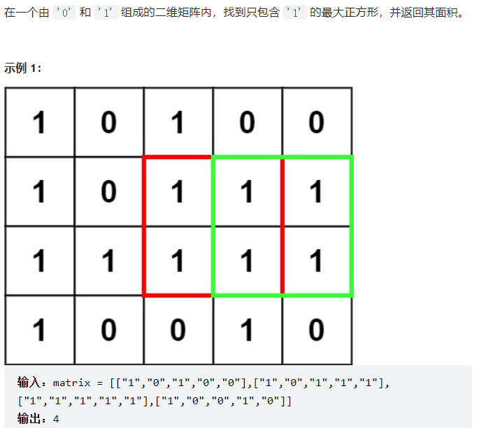
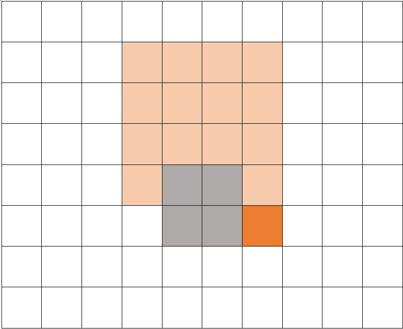

[221. 最大正方形 - 力扣（LeetCode）](https://leetcode.cn/problems/maximal-square/)

在动态规划算法中，后续元素的状态由之前元素的状态决定。

对于正方形，如果一个坐标点的状态由之前的状态决定，那么根据传统的从左至右，从上至下的遍历顺序，这个点就应该位于右下角这个最边缘的位置。

那么可以写出状态转移方程：

$dp(i,j)=min(dp(i−1,j),dp(i−1,j−1),dp(i,j−1))+1$

$dp(i,j)$是在以$(i,j)$坐标为右下角顶点的最大正方形边长。