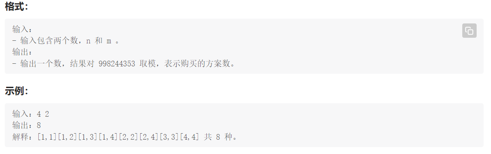

# 题目

[美团 2021 届秋季校园招聘笔试真题 - LeetBook - 力扣（LeetCode）全球极客挚爱的技术成长平台](https://leetcode.cn/leetbook/read/meituan/oxh202/)

> 小团正在装饰自己的书桌，他的书桌上从左到右有 m 个空位需要放上装饰物。商店中每个整数价格的装饰物恰好有一种，且每种装饰物的数量无限多。
> 小团去商店的时候，想到了一个购买方案，他要让右边的装饰物价格是左边的倍数。用数学语言来说，假设小团的 m 个装饰物价格为 a[1], a[2], ..., a[m] ，那么对于任意的 1≤i≤j≤m ，a[j] 是 a[i] 的倍数。
> 小团是一个节约的人，他希望最贵的装饰物不超过 n 元。现在，请你计算小团有多少种购买的方案？
>
> 作者：美团
> 链接：https://leetcode.cn/leetbook/read/meituan/oxh202/
> 来源：力扣（LeetCode）
> 著作权归作者所有。商业转载请联系作者获得授权，非商业转载请注明出处。



# 解题

以4, 2为例:

当挑选第1 个位置的礼物时, 所有价格的礼物(不超过m )都能选择;

当挑选第2 个位置的礼物时, 挑选价格为k 的组合由第一个位置礼物价格为k 的因数的数量决定, 例如k 为4 时, 其因数有1, 2, 4, 因此有3 中组合; k为2 时, 其因数有1, 2, 因此有2 中组合.

以此类推$count[i][k] = count[i-1][j],j\%k==0$;


# 代码

```c++
#include<iostream>
#include<vector>
using namespace std;
const int MOD = 998244353;

int main(){
    int n, m;
    cin>>n>>m;
    int ans = 0;
    vector<vector<int>> count(m+1);
    for(int i=1; i<=m; i++){
        count[i].resize(n+1);
    }
    fill(count[1].begin(), count[1].end(), 1);
    for(int i=2; i<=m; i++){
        for(int j=1; j<=n; j++){
            for(int k=1; k*j<=n; k++){
                count[i][j*k] += count[i-1][j];
                count[i][j*k] %= MOD;
            }
        }
    }
    for(int i=1; i<=n; i++){
        ans += count[m][i];
        ans %= MOD;
    }
    cout<<ans<<endl;
    return 0;
}
```

# 运行时间

