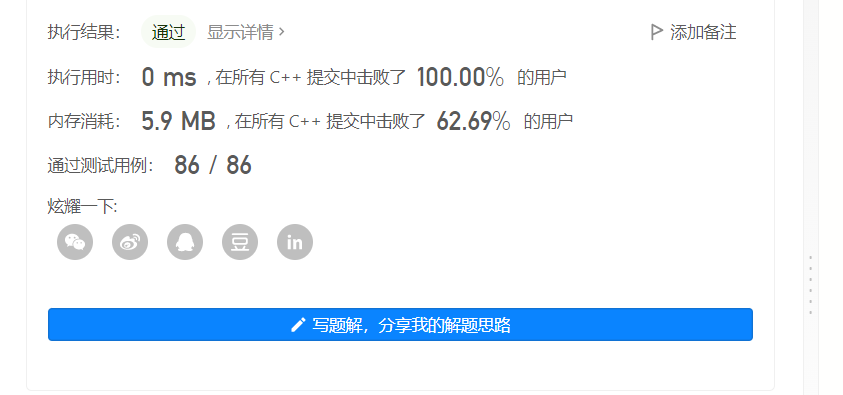

# 题目

[856. 括号的分数 - 力扣（LeetCode）](https://leetcode.cn/problems/score-of-parentheses/)

> 给定一个平衡括号字符串 S，按下述规则计算该字符串的分数：
>
> () 得 1 分。
> AB 得 A + B 分，其中 A 和 B 是平衡括号字符串。
> (A) 得 2 * A 分，其中 A 是平衡括号字符串。
>
> 来源：力扣（LeetCode）
> 链接：https://leetcode.cn/problems/score-of-parentheses
> 著作权归领扣网络所有。商业转载请联系官方授权，非商业转载请注明出处。

# 分析

A, B是抽象的串

`(())`即是`(A)`类型，A是`()`。

对于一个输入串，我们有这样一个递归的思路：

- 如果一个串，其里面是子串，那么我们返回子串两倍的分数；

- 否则串即是`()`，返回1，；

这里有一个条件，这个输入的串必须是闭合的，而且是最小闭合，因为我们需要递归调用其子串。

例如一个串`(())()`，它的最小闭合字串是`(())`；

# 代码

```c++
class Solution {
public:
    int scoreOfParentheses(string s) {
        int n = s.size();
        int left = 0;
        int start = 0;
        int score = 0;
        for(int i=0; i<n && start<n; i++){
            if (s[i] == '('){
                left++;
            }else {
                left--;
                if (left == 0){ 
                  // 找到了最小闭合的字串
                  // 从start 到 i
                    score += fun(s, start, i);
                    start = i+1;
                }
            }
        }
        return score;
    }

    int fun(string& s, int start, int end){
        if (start+1 == end){
            return 1;
        }else{
          // 返回两部字串的分数
            string tmp = s.substr(start+1, end-start+1-2);
            return 2 * scoreOfParentheses(tmp);
        }
    }
};
```

