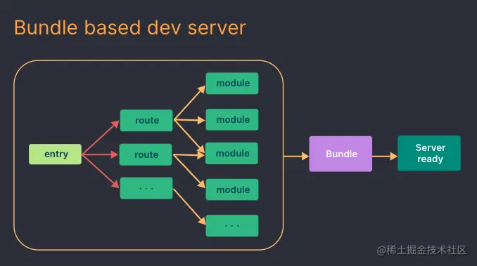
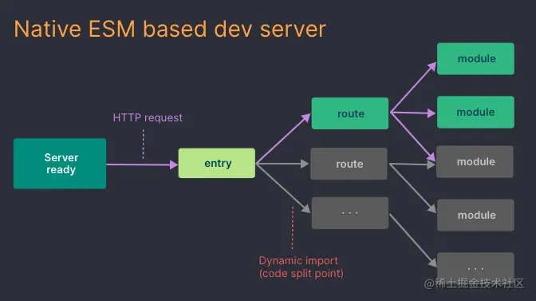

# Vite新在哪里

由于浏览器开始原生支持 ES 模块，`Vite`巧妙的利用生态系统中的新进展解决了 Webpack 构建速度慢，HMR(热更新)迟钝等问题。

使用 `webpack` 时，从 `yarn start` 命令启动，到最后页面展示，需要经历的过程：

1. 以 `entry` 配置项为起点，做一个全量的打包，并生成一个入口文件 `index.html` 文件；
2. 启动一个 `node` 服务；
3. 打开浏览器，去访问入 `index.html`，然后去加载已经打包好的 `js`、`css` 文件；

在整个工作过程中，最重要的就是第一步中的全量打包，中间涉及到构建 `module graph` (涉及到大量度文件操作、文件内容解析、文件内容转换)、`chunk` 构建，这个需要消耗大量的时间。尽管在二次启动、热更新过程中，在构建 `module graph` 中可以充分利用缓存，但随着项目的规模越来越大，整个开发体验也越来越差。

使用 `vite` 时， 从 `vite` 命令启动，到最后的页面展示，需要经历的过程：

1. 使用 [esbuild](https://link.juejin.cn?target=https%3A%2F%2Fesbuild.github.io%2F) [预构建依赖](https://link.juejin.cn?target=https%3A%2F%2Fcn.vitejs.dev%2Fguide%2Fdep-pre-bundling.html)，提前将项目的第三方依赖格式化为 `ESM` 模块；
2. 启动一个 `node` 服务；
3. 打开浏览器，去访问 `index.html`；
4. 基于浏览器已经支持原生的 `ESM` 模块, 逐步去加载入口文件以及入口文件的依赖模块。浏览器发起请求以后，`dev server` 端会通过 `middlewares` 对请求做拦截，然后对源文件做 `resolve`、`load`、`transform`、`parse` 操作，然后再将转换以后的内容发送给浏览器。

在第四步中，`vite` 需要逐步去加载入口文件以及入口文件的依赖模块，但在实际应用中，这个过程中涉及的模块的数量级并不大，需要的时间也较短。而且在分析模块的依赖关系时， `vite` 采用的是 `esbuild`，**`esbuild`** 使用 Go 编写，比以 JavaScript 编写的打包器预构建依赖快 10-100 倍（`webpack` 就是采用 `js` ）

综上，开发模式下 `vite` 比 `webpack` 快的原因：

1. `vite` 不需要做全量的打包，这是比 `webpack` 要快的最主要的原因；
2. `vite` 在解析模块依赖关系时，利用了 `esbuild`，更快（esbuild 使用 Go 编写，并且比以 JavaScript 编写的打包器预构建依赖快 10-100 倍）；
3. `按需加载`；模块之间的依赖关系的解析由浏览器实现。Vite 只需要在浏览器请求源码时进行转换并按需提供源码。根据情景动态导入代码，即只在当前屏幕上实际使用时才会被处理。
4. `充分利用缓存`；Vite 利用 HTTP 头来加速整个页面的重新加载（再次让浏览器为我们做更多事情）：源码模块的请求会根据 `304 Not Modified` 进行协商缓存，而依赖模块请求则会通过 `Cache-Control: max-age=31536000,immutable` 进行强缓存，因此一旦被缓存它们将不需要再次请求。

# vite 对比 webpack ，优缺点在哪

`优点`：

1. **更快的冷启动**：`Vite` 借助了浏览器对 `ESM` 规范的支持，采取了与 `Webpack` 完全不同的 `unbundle` 机制
2. **更快的热更新**：`Vite` 采用 `unbundle` 机制，所以 `dev server` 在监听到文件发生变化以后，只需要通过 `ws` 连接通知浏览器去重新加载变化的文件，剩下的工作就交给浏览器去做了。

`缺点`：

1. **开发环境下首屏加载变慢**：由于 `unbundle` 机制，`Vite` 首屏期间需要额外做其它工作。不过首屏性能差只发生在 `dev server` 启动以后第一次加载页面时发生。之后再 `reload` 页面时，首屏性能会好很多。原因是 `dev server` 会将之前已经完成转换的内容缓存起来
2. **开发环境下懒加载变慢**：跟首屏加载变慢的原因一样。`Vite` 在懒加载方面的性能也比 `Webpack` 差。由于 `unbundle` 机制，动态加载的文件，需要做 `resolve`、`load`、`transform`、`parse` 操作，并且还有大量的 `http` 请求，导致懒加载性能也受到影响。
3. **webpack支持的更广**。由于 `Vite` 基于ES Module，所以代码中不可以使用CommonJs；webpack更多的关注兼容性, 而`Vite` 关注浏览器端的开发体验。`Vite`目前生态还不如 `Webpack`。

> 当需要打包到生产环境时，`Vite`使用传统的`rollup`进行打包，所以，vite的优势是体现在开发阶段，缺点也只是在开发阶段存在。

