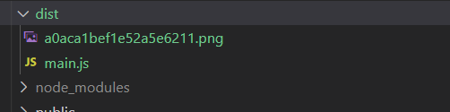
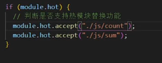
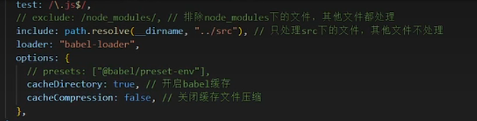
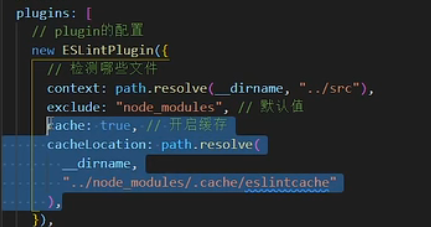
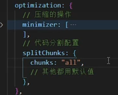
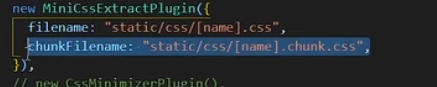
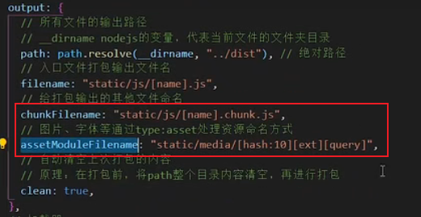

# 概念

- module，chunk，bundle
  module：源码中每个文件；
  chunk：内存中的一个概念，还没有整理输出的集合。一个chunk对应一个bundle。包括**初始化的（例如entry指定的入口文件）**和**非初始化的（例如自己写的代码模块，webpack分割的代码模块，动态导入的模块）**两类
  bundle：最终输出的文件。bundle 是一个或多个 chunk 组成的集合。

- 举个例子：

  ```jsx
  {
    entry: {
      foo: ["webpack/hot/only-dev-server.js","./src/foo.js"],
      bar: ["./src/bar.js"]
    },
    output: {
      path: "./dist",
      filename: "[name].js"
    }
  }
  ```

  - **modules**："webpack/hot/only-dev-server.js", "./src/foo.js" 以及其他依赖于这些文件的其他模块都是 modules。
  - **chunks**：foo, bar
  - **bundles**：foo, bar

-----

# loader

loader是代码层面的处理，这里以`css-loader`和`style-loader`进行分析。

- [Understanding Loaders In Webpack](https://backbencher.dev/webpack-loaders)
- [Webpack style-loader vs css-loader](https://stackoverflow.com/questions/34039826/webpack-style-loader-vs-css-loader)

`css`的样式在运行时通过`js`代码添加到页面中。并没有影响最终产物（直接将css添加到html文件中）。

## css-loader

1. Turn `file.less` into plain CSS with the Less loader
2. Resolve all the `imports` and `url(...)`s in the CSS with the CSS loader
3. Insert those styles into the page with the style loader

## style-loader

takes those styles and creates a `<style>` tag in the page's `<head>` element containing those styles.

## 引入资源

`webpack5`继承了`file-loader`和`url-loader`，只需要将`type`设置为`asset`。

### 图片

```js
{
	test: /\.(png|jpg|jpeg|webp)$/,
	type: "asset",
}
```

文件被打包到输出目录：



### 其他资源

`type: "asset/resource"`

### 配置

`generator`可以配置资源的输出的目录。

```js
{
	test: /\.(png|jpg|jpeg|webp)$/,
	type: "asset",
	generator: {
		filename: "static/[hash][ext]"  // 
	}
}
```

## babel

`webpack`对js的处理有限，**只能编译ES中的模块化语法，类似箭头函数等高级特性不能做兼容性处理**。

## 配置

普通引入`loader`可以直接写字符串。

如果要配置`options`则需要以对象形式引入。

------

# Plugin

## 处理HTML

[HtmlWebpackPlugin ](https://www.webpackjs.com/plugins/html-webpack-plugin/)

通过`template`指定`html`的模板（自己写的html文件，一般是public/index.html或index.html）。

> 如果你有多个 webpack 入口，他们都会在已生成 HTML 文件中的 `<script>` 标签内引入。

> 如果在 webpack 的输出中有任何 CSS 资源（例如，使用 [MiniCssExtractPlugin](https://www.webpackjs.com/plugins/mini-css-extract-plugin/) 提取的 CSS），那么这些资源也会在 HTML 文件 `<head>` 元素中的 `<link>` 标签内引入。

-----

# 生产优化

## 生成单独css文件

`style-loader`将`css`以js的方式添加到页面上，这意味着需要通过解析过程，并且需要引入`script`文件。

如果输出的是css文件，webpack会将其通过`link`标签引入（HtmlWebpackPlugin ），不会出现闪屏现象。

[MiniCssExtractPlugin](https://www.webpackjs.com/plugins/mini-css-extract-plugin#root)

> 本插件会将 CSS 提取到单独的文件中，为每个包含 CSS 的 JS 文件创建一个 CSS 文件，并且支持 CSS 和 SourceMaps 的按需加载。

## 样式兼容性

`post-cssloader`，做到什么程度受`browerlist`配置的影响。

## SourceMap

[弄懂 SourceMap，前端开发提效 100% - 知乎 (zhihu.com)](https://zhuanlan.zhihu.com/p/467566753)

[Devtool | webpack 中文文档 | webpack 中文文档 | webpack 中文网 (webpackjs.com)](https://www.webpackjs.com/configuration/devtool/#root)

生成源代码和构建代码的映射关系，在出错时快速定位出错位置。

生成模型需要关心行和列，因为只会生成一行代码。

## 打包构建速度

### 模块热替换

一般来说`loader`帮助我们指定了哪些模块可以进行模块热替换。



`vue-loader`配置了`vue`文件的热替换。

> HMR 是可选功能，只会影响包含 HMR 代码的模块。举个例子，通过 [`style-loader`](https://github.com/webpack-contrib/style-loader) 为 style 追加补丁。为了运行追加补丁，`style-loader` 实现了 HMR 接口；当它通过 HMR 接收到更新，它会使用新的样式替换旧的样式。

### 文件只被一个loader处理

`oneOf`属性。

[Rule.oneOf](https://www.webpackjs.com/configuration/module#ruleoneof)

### Babel和Eslint缓存

`babel-loader`配置：



`EslintPlugin`配置：



### 多进程

对`babel-loader`，`Eslint`代码压缩，开启多进程（这不是一键开启的）。

## 减小打包体积

- `@babel/plugin-transform-runtime`

- [babel-plugin-transform-runtime · Babel 中文文档 - 印记中文 (docschina.org)](https://babel.docschina.org/docs/en/6.26.3/babel-plugin-transform-runtime/)

  > [babel-runtime使用与性能优化 - 掘金 (juejin.cn)](https://juejin.cn/post/6844903615212027917)
  >
  > [babel-polyfill使用与性能优化](https://link.juejin.cn/?target=https%3A%2F%2Fwww.chyingp.com%2Fposts%2Funderstanding-babel-polyfill%2F)
  >
  > 引入babel-polyfill会有一定副作用，比如：
  >
  > - 引入了新的全局对象：比如Promise、WeakMap等。
  > - 修改现有的全局对象：比如修改了Array、String的原型链等。
  >
  > 在应用开发中，上述行为问题不大，基本可控。但如果在库、工具的开发中引入babel-polyfill，则会带来潜在的问题。
  >
  > 举个例子，我在项目中定义了跟规范不一致的`Array.from()`函数（别管我为什么不一样，就是这么任性），同时引入了一个库（依赖babel-polyfill），此时，这个库可能覆盖了自定义的`Array.from()`函数，导致出错。

  这就是babel-runtime存在的原因。**它将开发者依赖的全局内置对象等，抽取成单独的模块，并通过模块导入的方式引入**，避免了对全局作用域的修改（污染）。

  因此，如果是开发库、工具，可以考虑使用 babel-runtime。

- 图片压缩
  `imagemin`

## Code Split

webpack的`optimazation`下的`splitChunks`属性。

将代码分割成多个chunk（chunk是指源代码中的块，打包出的交bundle），并打包（按需加载，在首页时只加载首页所需要的js文件）。

- 多入口。
- 抽离复用代码，输出成独立模块。
  

### 按需导入任意文件

`plugins: ['import']`

在任意位置使用`import`语句。

### CodeSplit统一命名

- css资源
  
- js，asset资源
  