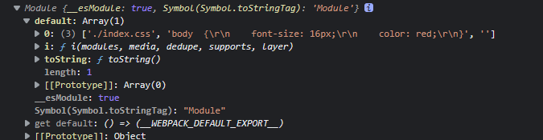
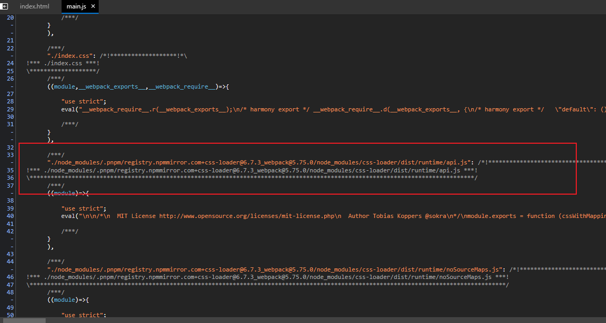

# 介绍

Webpack 支持使用 [loader](https://www.webpackjs.com/concepts/loaders) 对文件进行预处理。你可以构建包括 JavaScript 在内的任何静态资源。并且可以使用 Node.js 轻松编写自己的 loader。

1. 在 `require()` 语句中使用 `loadername!` 作为前缀的方式来使用 loader（使用问号传递参数），内联loader。可以使用`!,-!,!!`三个前缀，配置该文件被不被以及如何被config内配置的loader处理。
2. 或者在 webpack 配置中配置 regex 来自动应用它们 - 请参阅 [配置](https://www.webpackjs.com/concepts/loaders/#configuration) 。

## loader 特性

- loader 支持链式调用。链中的每个 loader 会将转换应用在已处理过的资源上。一组链式的 loader 将按照相反的顺序执行。链中的第一个 loader 将其结果（也就是应用过转换后的资源）传递给下一个 loader，依此类推。最后，链中的最后一个 loader，返回 webpack 所期望的 JavaScript。
- loader 可以是同步的，也可以是异步的。
- loader 运行在 Node.js 中，并且能够执行任何操作。
- loader 可以通过 `options` 对象配置（仍然支持使用 `query` 参数来设置选项，但是这种方式已被废弃）。
- 除了常见的通过 `package.json` 的 `main` 来将一个 npm 模块导出为 loader，还可以在 module.rules 中使用 `loader` 字段直接引用一个模块。
- 插件(plugin)可以为 loader 带来更多特性。
- loader 能够产生额外的任意文件。

## 关键概念

- **request**
  `module request`，[loader-utils](https://github.com/webpack/loader-utils)中使用了这种说明。是指用内联方式处理一个模块的路径，例如：

  ```
  E:\Users\lenovo\fantasy995.github.io\demos\webpack-study\node_modules\css-loader\dist\cjs.js!E:\Users\lenovo\fantasy995.github.io\demos\webpack-study\src\index.css
  ```

-----

# Loader和pitch方法

## loader

loader是一个函数，loader模块要默认导出该函数，同时这个函数上可以有pitch方法，webpack会执行这个pitch方法，pitch方法会影响webpack后续行为。

loader的作用是将源文件转化为可以执行的js模块，**webpack会检查loader返回的这个模块是否是正确的，符合js模块化规范**，如果有错误会终止打包。例如我定义了一个`test.js`模块，其默认导出一个函数：

`test.js`

```js
module.exports = function (a, b) {
    return a+b;
}
```

然后定义一个`test-loader`，让其只会匹配`test.js`：


```js
module.exports = function (content) {
    return `var a = {name: 'wjl'}; module.exports = a;`
}
```

`test-loader`返回了一段新的代码，默认导出一个对象，在`index.js`中我们导入`test.js`模块，尝试输出对象上的`name`属性，然后通过`webpack`打包：

```js
const a = require('./test.js')
console.log(a.name)
```

打包结果为`main.js`，运行`main.js`可以正确得到输出。这说明`webpack`执行了`var a = {name: 'wjl'}; module.exports = a;`，`test.js`模块最终导出的内容为`a`。

当把`test-loader`的导出语句删除，改为以下内容时，能够正确通过`webpack`检查，但是`index.js`中不能访问导出对象了：

`test-loader.js`

```js
module.exports = function (content) {
    // return `var a = {name: 'wjl'}; console.log(123); module.exports = a;`
    return `var a = {name: 'wjl'}; console.log(123);`
}
```

`index.js`

```js
const a = require('./test.js')
console.log(a, a.name)
```

运行导出文件`main.js`得到


这是由于这个模块没有导出内容（对象上没有属性），`test.js`的模块代码会在运行时执行（输出123，cjs的模块需要执行完模块内容才能得到导出对象）。

> （如果`loader`导出的内容中含有`import`或`require`等语句，`webpack`会再次进行相关内容的导入，这方面的知识目前暂时不分析）

**loader总结**：`loader`的作用是将准备导入的**模块里面的内容**转换成可以正常执行的`js`模块代码，转换后的内容会在运行时执行，以得到模块的导出内容或执行其他副作用代码。

## pitch

为什么需要使用pitch？我们以`css-loader`和`style-loader`作为分析。

**在只使用`css-loader`的情况下**，假设我们有两个文件：`index.css`和`index.js`，`index.css`定义了一些样式，`index.js`导入了`index.css`：

`index.css`：

```css
body  {
    font-size: 16px;
    color: red;
}
```

`index.js`：

```js
const style = require('./index.css')
console.log(style);
```

运行结果为：



`css-loader`将目标样式文件转换成一个js对象并导出了该对象，默认属性上有`index.css`文件的信息。

需要注意的是，这个对象是执行完`css-loader`转换的模块内容后得到的！我们先定义一个普通的`my-style-loader`根据调用顺序拿到`css-loader`的返回值: 

`my-style-loader`:

```js
module.exports = function (source) {
  console.log('*******************');
  console.log(source);
  console.log('*******************');
  return source;
}
```

`css-loader`将`index.css`模块转换为以下内容：

```js
// Imports
import ___CSS_LOADER_API_NO_SOURCEMAP_IMPORT___ from "./node_modules/.pnpm/registry.npmmirror.com+css-loader@6.7.3_webpack@5.75.0/node_modules/css-loader/dist/runtime/noSourceMaps.js";
import ___CSS_LOADER_API_IMPORT___ from "./node_modules/.pnpm/registry.npmmirror.com+css-loader@6.7.3_webpack@5.75.0/node_modules/css-loader/dist/runtime/api.js";
var ___CSS_LOADER_EXPORT___ = ___CSS_LOADER_API_IMPORT___(___CSS_LOADER_API_NO_SOURCEMAP_IMPORT___);
// Module
___CSS_LOADER_EXPORT___.push([module.id, "body  {\r\n    font-size: 16px;\r\n    color: red;\r\n}", ""]);
// Exports
export default ___CSS_LOADER_EXPORT___;

```

**也就是说，`index.css`里面的内容，还是要执行完`index.css`模块才能得到**

使用`style-loader`的目的是往`document`中插入`style`标签，如果`style-loader`是一个普通`loader`的话，它需要执行`css-loader`返回的模块才能得到`css`样式，当然可以解析`css-loader`返回的模块内容，然后得到样式，然后返回创建`style`标签的相关语句，但是这样工作量太大了。而返回的模块中有`import`相关的语句时，`webpack`还会加载那些import的内容，但是例如`./node_modules/.pnpm/registry.npmmirror.com+css-loader@6.7.3_webpack@5.75.0/node_modules/css-loader/dist/runtime/api.js`是会被`webpack`最终打包生成的模块，在nodejs环境中是无法得到的。

打包产物：



> 一个模块加载（import '!!xxxx-loader!./index.css'）被`webpack`打包之后会添加到`module map`里面，键就是请求路径。

`style-loader`的思路就是，得到`css-loader`的模块内容，然后再将模块内容插入到`style`标签中，再将`style`标签插入文档中。

为了得到`css-loader`处理后的内容（需要能被执行），`style-loader`构造了一个新的`require`语句，即：

```js
require(`${loaderUtils.stringifyRequest(this, '!!' + remainingRequest)}`)
// !!./node_modules/.pnpm/registry.npmmirror.com+css-loader@6.7.3_webpack@5.75.0/node_modules/css-loader/dist/cjs.js!./index.css
```

`webpack`发现返回的内容中有模块导入，然后使用路径中的`loader`去加载这个模块，并将其保存在内存中（多个文件引用同一个模块，目标模块只会被处理一次）。

## 总结

`loader`和`picher`本质上都是改变目标文件的内容，让它变成符合js语法的代码，如果返回的内容有不存在的导入，则会再次执行导入。

`webpack`每个`loader`处理的结果都会生成单独的模块，但是在`loader`函数中，它无法之前使用了哪些loader，也无法知道已生成模块的名字，因此`style-loader`无法在`loader`函数中导入已经生成的模块。

而`pitch`阶段可以获取到之后的`loader`顺序，实现起来也更加方便。

---

# 自定义Loader

[编写 loader | webpack 中文文档 | webpack 中文文档 | webpack 中文网 (webpackjs.com)](https://www.webpackjs.com/contribute/writing-a-loader/)

> 我们预期 loader 模块导出为一个函数，并且编写为 Node.js 兼容的 JavaScript。通常使用 npm 进行管理 loader，但是也可以将应用程序中的文件作为自定义 loader。按照约定，loader 通常被命名为 `xxx-loader`（例如 `json-loader`）。更多详细信息，请查看 [编写一个 loader](https://www.webpackjs.com/contribute/writing-a-loader/)。

Loader是一个Node.js函数，它接收源代码文件的内容，并将内容处理后返回出去。

## Loader接口

loader 本质上是导出为函数的 JavaScript 模块。[loader runner](https://github.com/webpack/loader-runner) 会调用此函数，然后将上一个 loader 产生的结果或者资源文件传入进去。函数中的 `this` 作为上下文会被 webpack 填充，并且 [loader runner](https://github.com/webpack/loader-runner) 中包含一些实用的方法，比如可以使 loader 调用方式变为异步，或者获取 query 参数。

起始 loader 只有一个入参：资源文件的内容。compiler 预期得到最后一个 loader 产生的处理结果。这个**处理结果**应该为 `String` 或者 `Buffer`（能够被转换为 string）类型，代表了模块的 JavaScript 源码。另外，还可以传递一个可选的 SourceMap 结果（格式为 JSON 对象）。

如果是单个处理结果，可以在 [同步模式](https://www.webpackjs.com/api/loaders/#synchronous-loaders) 中直接返回。**如果有多个处理结果**，则必须调用 `this.callback()`。在 [异步模式](https://www.webpackjs.com/api/loaders/#asynchronous-loaders) 中，必须调用 `this.async()` 来告知 [loader runner](https://github.com/webpack/loader-runner) 等待异步结果，它会返回 `this.callback()` 回调函数。**随后 loader 必须返回 `undefined` 并且调用该回调函数。**

```js
/**
 *
 * @param {string|Buffer} content 源文件的内容
 * @param {object} [map] 可以被 https://github.com/mozilla/source-map 使用的 SourceMap 数据
 * @param {any} [meta] meta 数据，可以是任何内容
 */
function webpackLoader(content, map, meta) {
  // 你的 webpack loader 代码
}
```

不返回`map`会导致无法生成`SourceMap`。

## Raw Loader

默认情况下，资源文件会被转化为 UTF-8 字符串，然后传给 loader。通过设置 `raw` 为 `true`，loader 可以接收原始的 `Buffer`。每一个 loader 都可以用 `String` 或者 `Buffer` 的形式传递它的处理结果。complier 将会把它们在 loader 之间相互转换。

**raw-loader.js**

```javascript
module.exports = function (content) {
  assert(content instanceof Buffer);
  return someSyncOperation(content);
  // 返回值也可以是一个 `Buffer`
  // 即使不是 "raw"，loader 也没问题
};
module.exports.raw = true;  // 声明
```

## Pitching Loader

[Loader Interface | webpack 中文文档 | webpack 中文文档 | webpack 中文网 (webpackjs.com)](https://www.webpackjs.com/api/loaders/#pitching-loader)

### 接口

```js

module.exports.pitch = function (remainingRequest, precedingRequest, data) {
  if (someCondition()) {
    return (
      'module.exports = require(' +
      JSON.stringify('-!' + remainingRequest) +
      ');'
    );
  }
};
```

[这篇文章,揭秘webpack loader - 知乎 (zhihu.com)](https://zhuanlan.zhihu.com/p/104205895#:~:text=`pitch` 是 loader 上的一个方法，它的作用是阻断 loader 链。 %2F%2F loaders%2Fsimple-loader-with-pitch.js,%3D function() { console.log('pitching graph')%3B %2F%2F todo })用`style-loader`和`css-loader`分析了`pitch`的作用。

由于`pitch`是顺序执行的，一旦有返回值就会立即返回，执行之前的`loader`。

`style-loader`与`css-loader`的使用方式（先后顺序）：

```js
module: {
    rules: [
      {
        // 配置处理 css 的 loader
        test: /\.css$/,
        use: ['style-loader', 'css-loader']
      }
    ]
  },
```

`css-loader`可以将`css`代码转换为`js`模块，`js`模块内容**不会交给它**的下一个`loader`: `style-loader`。

> loader拿到的是上一个loader处理后的文件，而不是上一个loader的返回值

我们可以在`style-loader`的`pitch`方法内使用require方式得到`css-loader`解析的内容。然后返回一段`js`语句将创建`style`标签插入到`head`处。

- 为什么不能在loader函数内使用`css-loader`？

  1. 我们无法自己调用`css-loader`得到对应js模块。`loader`是由`loader runner`实例化的，函数中的 `this` 作为上下文会被 webpack 填充，并且 [loader runner](https://github.com/webpack/loader-runner) 中包含一些实用的方法，比如可以使 loader 调用方式变为异步，或者获取 query 参数。
  2. 既然无法自己调用`loader`，那就只能通过链式调用，如前面分析的，链式调用顺序下，我们无法获得`css-loader`的输出。

  因此，在`pitch`函数内（非编译阶段），我们修改源文件内容：

  ```js
  // loaders/simple-style-loader.js
  
  const loaderUtils = require('loader-utils');
  module.exports = function(source) {
      // do nothing
  }
  
  module.exports.pitch = function(remainingRequest) {
    console.log('simple-style-loader is working');
      // 在 pitch 阶段返回脚本
      return (
        `
        // 创建 style 标签
        let style = document.createElement('style');
  
        /**
        * 利用 remainingRequest 参数获取 loader 链的剩余部分
        * 利用 ‘!!’ 前缀跳过其他 loader 
        * 利用 loaderUtils 的 stringifyRequest 方法将模块的绝对路径转为相对路径
        * 将获取 css 的 require 表达式赋给 style 标签
        */
        style.innerHTML = require(${loaderUtils.stringifyRequest(this, '!!' + remainingRequest)});
        
        // 将 style 标签插入 head
        document.head.appendChild(style);
        `
      )
  }
  ```

  ```ts
  export function stringifyRequest(loaderContext: loader.LoaderContext, resource: string): string;
  ```

  因此，`simplestyle-loader`并没有做其他处理，只是利用了`css-loader`。

## loader 工具库(Loader Utilities)

充分利用 [`loader-utils`](https://github.com/webpack/loader-utils) 包。它提供了许多有用的工具，但最常用的一种工具是获取传递给 loader 的选项。[`schema-utils`](https://github.com/webpack-contrib/schema-utils) 包配合 `loader-utils`，用于保证 loader 选项，进行与 JSON Schema 结构一致的校验。

-----

# 参考资料

- [Loaders | webpack 中文文档 | webpack 中文文档 | webpack 中文网 (webpackjs.com)](https://www.webpackjs.com/loaders/)

- [揭秘webpack loader - 知乎 (zhihu.com)](https://zhuanlan.zhihu.com/p/104205895#:~:text=`pitch` 是 loader 上的一个方法，它的作用是阻断 loader 链。 %2F%2F loaders%2Fsimple-loader-with-pitch.js,%3D function() { console.log('pitching graph')%3B %2F%2F todo })

- loader简介：[loader | webpack 中文文档 | webpack 中文文档 | webpack 中文网 (webpackjs.com)](https://www.webpackjs.com/concepts/loaders/#loader-features)

- 编写loader：[编写 loader | webpack 中文文档 | webpack 中文文档 | webpack 中文网 (webpackjs.com)](https://www.webpackjs.com/contribute/writing-a-loader/)

- loader 接口、API：[Loader Interface | webpack 中文文档 | webpack 中文文档 | webpack 中文网 (webpackjs.com)](https://www.webpackjs.com/api/loaders/)

- [Webpack中Loader的pitch方法 - 简书 (jianshu.com)](https://www.jianshu.com/p/9dfb8e18e76d)

  
