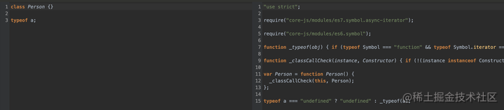
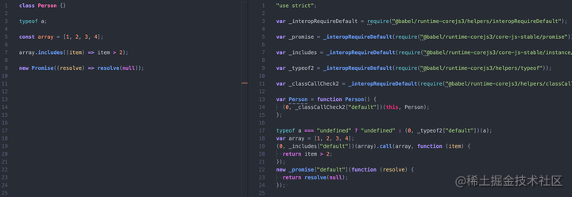

# 问题

babel在编译js代码时，为了处理兼容性问题，需要使用`core.js`进行兜底。

但是这个兜底过程存在两个问题：

1.  babel 的 `polyfill` 机制是，对于例如 `Array.from` 等静态方法，直接在 `global.Array` 上添加；对于例如 `includes` 等实例方法，直接在 `global.Array.prototype` 上添加。这样直接修改了全局变量的原型，有可能会带来意想不到的问题。这个问题在开发第三方库的时候尤其重要，因为我们开发的第三方库修改了全局变量，有可能和另一个也修改了全局变量的第三方库发生冲突，或者和使用我们的第三方库的使用者发生冲突。公认的较好的编程范式中，也不鼓励直接修改全局变量、全局变量原型。

2. babel 转译 syntax 时，有时候会使用一些辅助的函数来帮忙转，比如：
   

   class 语法中，babel 自定义了 `_classCallCheck` 这个函数来辅助；`typeof` 则是直接重写了一遍，自定义了 `_typeof` 这个函数来辅助。这些函数叫做 `helper`。从上图中可以看到，`helper` 直接在转译后的文件里被定义了一遍。如果一个项目中有100个文件，其中每个文件都写了一个 class，那么这个项目最终打包的产物里就会存在100个 `_classCallCheck` 函数，他们的长相和功能一模一样，这显然不合理。

`@babel/plugin-transform-runtime` 这个插件的作用就是解决上面提到的两个问题

先执行下面两条命令安装两个库：

```sql
yarn add @babel/plugin-transform-runtime -D

yarn add @babel/runtime-corejs3
复制代码
```

其中` @babel/plugin-transform-runtime `的作用是转译代码，转译后的代码中可能会引入 `@babel/runtime-corejs3` 里面的模块。所以前者用在编译时，后者用在运行时。类似 `polyfill`，后者需要被打包到最终产物里在浏览器中运行。

# 引入插件后



从上图可以看到，在引入了 `transform-runtime` 这个插件后：

- api 从之前的直接修改原型改为了从一个统一的模块中引入，避免了对全局变量及其原型的污染，解决了第一个问题

- helper 从之前的原地定义改为了从一个统一的模块中引入，使得打包的结果中每个 helper 只会存在一个，解决了第二个问题

  ```js
  (0, _includes["default"])(array).call(array, function(item) {
      return item > 2;
  });
  ```

  为什么需要加一个`0`?

  https://stackoverflow.com/questions/43910333/purpose-of-expression-0-foox-in-javascript

  解释：https://stackoverflow.com/questions/6577812/calling-function-with-window-scope-explanation-0-function

  目的：改变`this`指向，`(0, c.d)`是一个表达式，返回了`c.d`，此时`c`不再是这个函数`(0, c.d)`的`this`对象。

# 总结

babel 在转译的过程中，对 syntax 的处理可能会使用到 helper 函数，对 api 的处理会引入 polyfill。

默认情况下，babel 在每个需要使用 helper 的地方都会定义一个 helper，导致最终的产物里有大量重复的 helper；引入 `polyfill` 时会直接修改全局变量及其原型，造成原型污染。

@babel/plugin-transform-runtime 的作用是将 `helper` 和 `polyfill` 都改为从一个统一的地方引入，并且引入的对象和全局变量是完全隔离的，这样解决了上面的两个问题。

# 参考资料

[@babel/plugin-transform-runtime 到底是什么？ - 掘金 (juejin.cn)](https://juejin.cn/post/7033383643976630302)

[怎么给新手科普Babel：polyfill/preset-env/plugin-transform-runtime - 掘金 (juejin.cn)](https://juejin.cn/post/6844903890404507656)