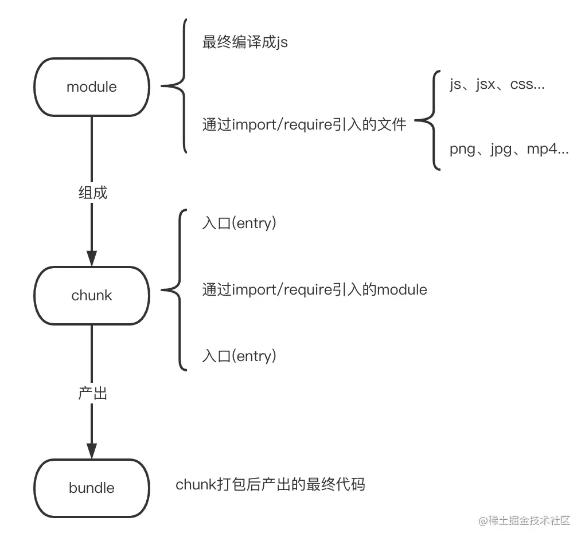

# Webpack

## 常用生命周期钩子

所有钩子：[compiler 钩子 ](https://www.webpackjs.com/api/compiler-hooks/)，[compilation 钩子 ](https://www.webpackjs.com/api/compilation-hooks/)

```js
const { SyncHook, SyncBailHook, AsyncSeriesHook } = require("tapable");
class Compiler {
  constructor() {
    // 1. 定义生命周期钩子
    this.hooks = Object.freeze({
      // ...只列举几个常用的常见钩子，更多hook就不列举了，有兴趣看源码
      done: new AsyncSeriesHook(["stats"]),//一次编译完成后执行，回调参数：stats
      beforeRun: new AsyncSeriesHook(["compiler"]),
      run: new AsyncSeriesHook(["compiler"]),//在编译器开始读取记录前执行
      emit: new AsyncSeriesHook(["compilation"]),//在生成文件到output目录之前执行，回调参数： compilation
      afterEmit: new AsyncSeriesHook(["compilation"]),//在生成文件到output目录之后执行
      compilation: new SyncHook(["compilation", "params"]),//在一次compilation创建后执行插件
      beforeCompile: new AsyncSeriesHook(["params"]),
      compile: new SyncHook(["params"]),//在一个新的compilation创建之前执行
      make:new AsyncParallelHook(["compilation"]),//完成一次编译之前执行
      afterCompile: new AsyncSeriesHook(["compilation"]),
      watchRun: new AsyncSeriesHook(["compiler"]),
      failed: new SyncHook(["error"]),
      watchClose: new SyncHook([]),
      afterPlugins: new SyncHook(["compiler"]),
      entryOption: new SyncBailHook(["context", "entry"])
    });
    // ...省略代码
  }
 
 
      done: 编译完成后
      beforeRun: 在编译器执行前
      run: 在编译器开始读取记录前执行
      emit: 文件提交到dist目录前
      afterEmit: 文件提交到dist目录前
      compilation: 创建compilation后
      beforeCompile: 在编译前
      compile: 创建compilation前
      make:编译完成前
```

## 两个重要对象

在插件开发中最重要的两个资源就是 [`compiler`](https://www.webpackjs.com/api/node/#compiler-instance) 和 [`compilation`](https://www.webpackjs.com/api/compilation-hooks/) 对象。理解它们的角色是扩展 webpack 引擎重要的第一步。

```javascript
class HelloCompilationPlugin {
  apply(compiler) {
    // 指定一个挂载到 compilation 的钩子，回调函数的参数为 compilation 。
    compiler.hooks.compilation.tap('HelloCompilationPlugin', (compilation) => {
      // 现在可以通过 compilation 对象绑定各种钩子
      compilation.hooks.optimize.tap('HelloCompilationPlugin', () => {
        console.log('资源已经优化完毕。');
      });
    });
  }
}

module.exports = HelloCompilationPlugin;
```

`compiler` 和 `compilation` 以及其他重要对象提供的钩子清单，请查看 [plugins API](https://www.webpackjs.com/api/plugins/) 文档。

## 插件

### 生命周期过程

- `compiler.hooks.compilation`
  一次编译，会创建多个`compilation`对象，`compilation` 实例能够访问所有的模块和它们的依赖（大部分是循环依赖）。 它会对应用程序的依赖图中所有模块， 进行字面上的编译(literal compilation)。 在编译阶段，模块会被加载(load)、封存(seal)、优化(optimize)、 分块(chunk)、哈希(hash)和重新创建(restore)。
  一个`compilation`对应一个最终的`bundle`输出。

  `Compilation`类实例，提供了 webpack 大部分生命周期Hook API供自定义处理时做拓展使用。**一个 compilation 对象记录了一次构建到生成资源过程中的信息**，它储存了当前的模块资源、编译生成的资源、变化的文件、以及被跟踪依赖的状态信息。
  

简单来说，`Compilation`的职责就是对所有 require 图(graph)中对象的字面上的编译，编译构建 module 和 chunk，并调用插件构建过程，同时把本次构建编译的内容全存到内存里。compilation 编译可以多次执行，如在watch模式下启动 webpack，每次监测到源文件发生变化，都会重新实例化一个compilation对象，从而生成一组新的编译资源对象。这个对象可以访问所有的模块和它们的依赖。

### 注册生命周期中的同步和异步回调

## Loader

loader 用于对模块的源代码进行转换。loader 可以使你在 `import` 或 "load(加载)" 模块时预处理文件。因此，loader 类似于其他构建工具中“任务(task)”，并提供了处理前端构建步骤的得力方式。loader 可以将文件从不同的语言（如 TypeScript）转换为 JavaScript 或将内联图像转换为 data URL。loader 甚至允许你直接在 JavaScript 模块中 `import` CSS 文件

# Vite


## 代码测试

```js
function myExamplePlugin(): Plugin {
  return {
    name: 'my-example-plugin',
    // 只执行一次
    options(opt) {
      console.log('options', opt)
      return opt
    },
    buildStart() {
      console.log('start')
    },
    // vite特有的钩子
    config(conf) {
      console.log('config', conf)
    },
    configResolved(id) {
      console.log('configResolved', id)
    },
    configureServer(server) {
      console.log('configureServer', 'server拦截，做mock')
    },
    transformIndexHtml(html) {
      console.log('transformIndexHtml')
      return html
    },
    // 每次插件执行后都会去调用的钩子
    resolveId(source) {
      console.log('resolveId')
      return source
    },
    // 加载模块代码
    load(id) {
      console.log('load', id)
      return id
    },
    transform(code, id) {
      console.log('transform')
      return code
    }
  }
}

```

# 参考资料

- [webpack plugin 从入门到入门 之compiler与compilation - 掘金 (juejin.cn)](https://juejin.cn/post/7068930184887402509)