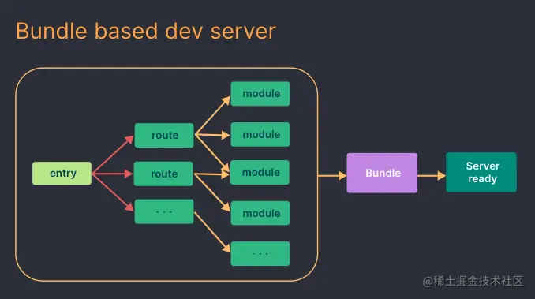
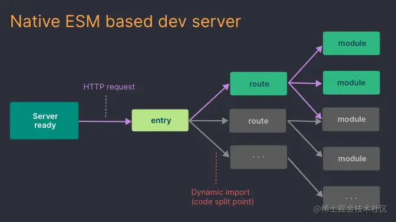

# webpack, rollup,gulp快速对比

| **名称** | **简介**                                                     | 优点 | 优点 | **应用场景** |
| -------- | ------------------------------------------------------------ | ---- | ---- | ------------ |
|          | 一种前端资源模块化管理和打包工具。它可以将许多松散的模块按照依赖和规则打包成符合生产环境部署的前端资源。还可以将按需加载的模块进行代码分割，等到实际需要的时候再异步加载 |      |      |              |
|          | 一个模块打包工具, **可以将我们按照 ESM** (ES2015 Module) 规范编写的源码构建输出如下格式:  iife: 自执行函数, 可通过 `<script>` 标签加载  amd: 通过 `RequireJS` 加载  cjs: Node 默认的模块规范, 可通过 `Webpack` 加载  umd: 兼容 IIFE, AMD, CJS 三种模块规范  esm: ES2015 Module 规范, 可用 `Webpack`, `Rollup` 加载 |      |      |              |
|          | 借鉴了Unix操作系统的管道（pipe）思想，**前一级的输出，直接变成后一级的输入**，使得在操作上非常简单，基于流式操作，通过各种 Transform Stream 来实现文件不断处理输出 |      |      |              |

# Vite新在哪里

由于浏览器开始原生支持 ES 模块，`Vite`巧妙的利用生态系统中的新进展解决了 Webpack 构建速度慢，HMR(热更新)迟钝等问题。

使用 `webpack` 时，从 `yarn start` 命令启动，到最后页面展示，需要经历的过程：

1. 以 `entry` 配置项为起点，做一个全量的打包，并生成一个入口文件 `index.html` 文件；
2. 启动一个 `node` 服务；
3. 打开浏览器，去访问入 `index.html`，然后去加载已经打包好的 `js`、`css` 文件；

在整个工作过程中，最重要的就是第一步中的全量打包，中间涉及到构建 `module graph` (涉及到大量度文件操作、文件内容解析、文件内容转换)、`chunk` 构建，这个需要消耗大量的时间。尽管在二次启动、热更新过程中，在构建 `module graph` 中可以充分利用缓存，但随着项目的规模越来越大，整个开发体验也越来越差。

使用 `vite` 时， 从 `vite` 命令启动，到最后的页面展示，需要经历的过程：

1. 使用 [esbuild](https://link.juejin.cn?target=https%3A%2F%2Fesbuild.github.io%2F) [预构建依赖](https://link.juejin.cn?target=https%3A%2F%2Fcn.vitejs.dev%2Fguide%2Fdep-pre-bundling.html)，提前将项目的第三方依赖格式化为 `ESM` 模块；
2. 启动一个 `node` 服务；
3. 打开浏览器，去访问 `index.html`；
4. 基于浏览器已经支持原生的 `ESM` 模块, 逐步去加载入口文件以及入口文件的依赖模块。浏览器发起请求以后，`dev server` 端会通过 `middlewares` 对请求做拦截，然后对源文件做 `resolve`、`load`、`transform`、`parse` 操作，然后再将转换以后的内容发送给浏览器。

在第四步中，`vite` 需要逐步去加载入口文件以及入口文件的依赖模块，但在实际应用中，这个过程中涉及的模块的数量级并不大，需要的时间也较短。而且在分析模块的依赖关系时， `vite` 采用的是 `esbuild`，**`esbuild`** 使用 Go 编写，比以 JavaScript 编写的打包器预构建依赖快 10-100 倍（`webpack` 就是采用 `js` ）

综上，开发模式下 `vite` 比 `webpack` 快的原因：

1. `vite` 不需要做全量的打包，这是比 `webpack` 要快的最主要的原因；
2. `vite` 在解析模块依赖关系时，利用了 `esbuild`，更快（esbuild 使用 Go 编写，并且比以 JavaScript 编写的打包器预构建依赖快 10-100 倍）；
3. `按需加载`；模块之间的依赖关系的解析由浏览器实现。Vite 只需要在浏览器请求源码时进行转换并按需提供源码。根据情景动态导入代码，即只在当前屏幕上实际使用时才会被处理。
4. `充分利用缓存`；Vite 利用 HTTP 头来加速整个页面的重新加载（再次让浏览器为我们做更多事情）：源码模块的请求会根据 `304 Not Modified` 进行协商缓存，而依赖模块请求则会通过 `Cache-Control: max-age=31536000,immutable` 进行强缓存，因此一旦被缓存它们将不需要再次请求。

# vite 对比 webpack ，优缺点在哪

`优点`：

1. **更快的冷启动**：`Vite` 借助了浏览器对 `ESM` 规范的支持，采取了与 `Webpack` 完全不同的 `unbundle` 机制
2. **更快的热更新**：`Vite` 采用 `unbundle` 机制，所以 `dev server` 在监听到文件发生变化以后，只需要通过 `ws` 连接通知浏览器去重新加载变化的文件，剩下的工作就交给浏览器去做了。

`缺点`：

1. **开发环境下首屏加载变慢**：由于 `unbundle` 机制，`Vite` 首屏期间需要额外做其它工作。不过首屏性能差只发生在 `dev server` 启动以后第一次加载页面时发生。之后再 `reload` 页面时，首屏性能会好很多。原因是 `dev server` 会将之前已经完成转换的内容缓存起来
2. **开发环境下懒加载变慢**：跟首屏加载变慢的原因一样。`Vite` 在懒加载方面的性能也比 `Webpack` 差。由于 `unbundle` 机制，动态加载的文件，需要做 `resolve`、`load`、`transform`、`parse` 操作，并且还有大量的 `http` 请求，导致懒加载性能也受到影响。
3. **webpack支持的更广**。由于 `Vite` 基于ES Module，所以代码中不可以使用CommonJs；webpack更多的关注兼容性, 而`Vite` 关注浏览器端的开发体验。`Vite`目前生态还不如 `Webpack`。

> 当需要打包到生产环境时，`Vite`使用传统的`rollup`进行打包，所以，vite的优势是体现在开发阶段，缺点也只是在开发阶段存在。

