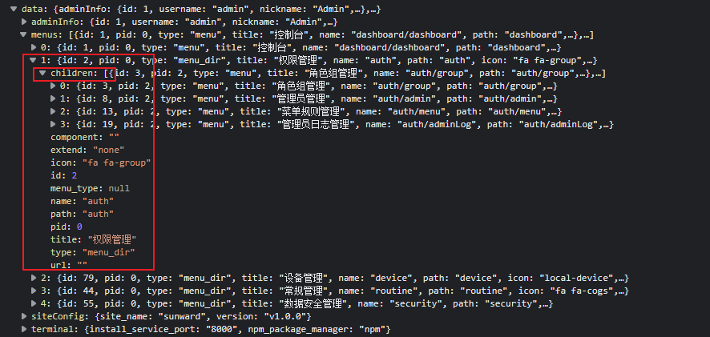
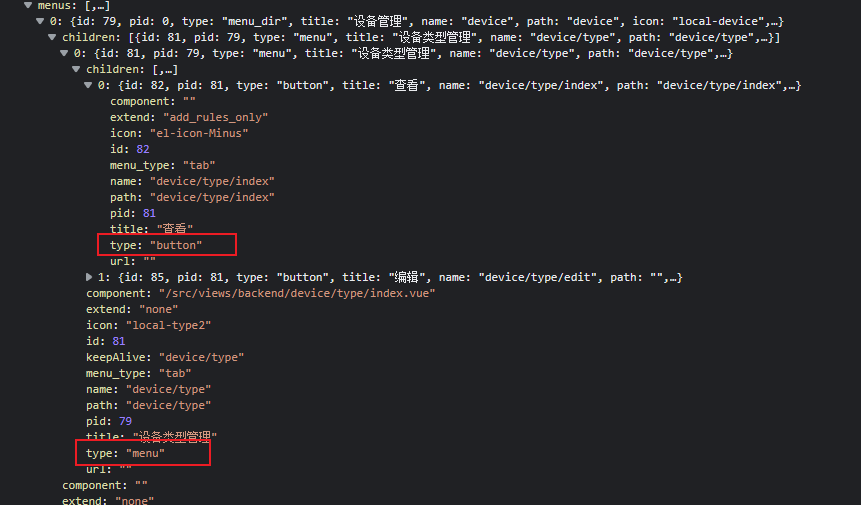
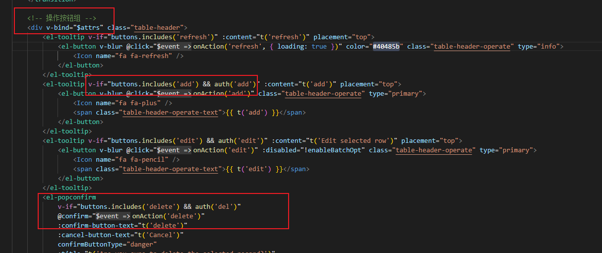
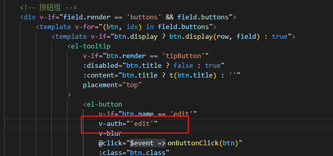

面试时要注意体现区分度，不要主动提原理（面向对象，什么是函数式编程）；

项目亮点：自己主动做的；


## bing的建议

你好，这是必应。我可以帮你找一些关于字节跳动前端开发暑假实习生面试的信息。😊

根据网上的一些面经[1](https://juejin.cn/post/6844904117068890119)[2](https://blog.csdn.net/qq_38349067/article/details/88917623)[3](https://blog.csdn.net/weixin_43311978/article/details/107523627)，字节跳动的前端开发实习生面试主要考察以下几个方面：

- JavaScript基础知识，包括数据类型、原型链、作用域、闭包、异步、事件循环等
- 前端框架，如React、Vue等，以及它们的原理和使用方法
- 前端工程化，如webpack、babel、eslint等，以及它们的配置和优化
- 算法和数据结构，如数组、字符串、链表、树、排序、查找等，需要能够用JavaScript实现
- 计算机网络，如HTTP、TCP/IP、DNS、CDN、缓存、安全等，以及它们的原理和应用
- 设计模式，如单例模式、观察者模式、发布订阅模式等，以及它们的优缺点和使用场景
- 前端性能优化，如页面加载、渲染、重绘、回流、动画、资源管理等，以及它们的优化方法和工具
- 前端安全，如XSS、CSRF、CORS等，以及它们的原理和防范措施
- 前端测试，如单元测试、集成测试、端到端测试等，以及它们的框架和工具
- 前端新技术，如WebAssembly、PWA、Service Worker等，以及它们的特点和应用

一般来说，字节跳动的前端开发实习生面试会有三轮技术面和一轮HR面，每轮面试大约1小时左右，面试官会根据你的简历和项目来提问，也会出一些算法题或者编程题让你在线编码或者画图解释，所以你需要准备好你的简历和项目，以及熟练掌握JavaScript和前端相关的知识和技能，同时也要保持良好的沟通和表达能力，展示你的热情和积极性。

如果你想了解更多关于字节跳动前端开发暑假实习生面试的信息，你可以点击以下链接查看：

- [1](https://juejin.cn/post/6844904117068890119) 字节跳动-Data-前端开发实习生面经 - 掘金
- [2](https://blog.csdn.net/qq_38349067/article/details/88917623) 字节跳动 测试开发实习生 面经_左手机遇 右手挑战的博客-CSDN博客
- [3](https://blog.csdn.net/weixin_43311978/article/details/107523627) 字节跳动前端开发实习生 三轮技术面面经_Captain.Y.的博客-CSDN博客
- [4](https://zhuanlan.zhihu.com/p/162664452) 2020字节跳动暑期实习教研岗-经验分享 - 知乎
- [5](https://blog.csdn.net/qq_40693171/article/details/118545647) 字节跳动实习面经(已拿offer附攻略)_Big sai的博客-CSDN博客_字节跳动实习面试

# BuildAdmin

## 基本接口查询

- 操作成功与失败
  `app\common\controller\Api.php`

## BuildAdmin权限管理控制实现分析

登录界面和进入系统后的界面属于两个路由：

```
{
   // 首页
   path: '/',
   redirect: '/admin'
},
    {
        // 管理员登录页
        path: '/admin/login',
        name: 'adminLogin',
        component: () => import('/@/views/backend/login.vue'),
        meta: {
            title: pageTitle('adminLogin'),
        },
    },
```

管理员界面路由，最外层是Layout：

```js
const adminBaseRoute: RouteRecordRaw = {
    path: '/admin',
    name: 'admin',
    // 在写 redirect 的时候，可以省略 component 配置，因为它从来没有被直接访问过，
    // 所以没有组件要渲染。
    // 唯一的例外是嵌套路由：如果一个路由记录有 children 和 redirect 属性，它也应该有 component 属性。
    component: () => import('/@/layouts/backend/index.vue'),
    redirect: '/admin/loading',
    meta: {
        title: pageTitle('admin'),
    },
    children: [
        {
            path: 'loading',
            name: 'adminMainLoading',
            component: () => import('/@/layouts/common/components/loading.vue'),
            meta: {
                title: pageTitle('Loading'),
            },
        },
        {
            path: 'iframe/:url',
            name: 'layoutIframe',
            component: () => import('/@/layouts/common/router-view/iframe.vue'),
            meta: {
                title: pageTitle('Embedded iframe'),
            },
        },
    ],
}
```

- 需要登录后才能进入组件的最外层：Layout组件`web\src\layouts\backend\index.vue`，它决定使用哪种布局，在该组件中会调用`index.pnp/index/index`接口。

  该组件是静态的，但是会进行token验证，如果没有token会跳转到登录界面。存在token的话会调用上述接口，得到路由菜单。

  由于axios被封装成自动携带token，如果存在本地token的话，会自动携带并在后端进行校验，校验成功后端会返回`menus`字段，用于更新路由（左侧菜单）。

  

- 管理员进行登录操作，如果账号信息正确，会重定向（已经登录）或跳转（第一次登录）到`/admin`，请求路由菜单。
  `web\src\views\backend\login.vue`
  
  后端接口：

  `app\admin\controller\Index.php`
  
  `app\admin\library\Auth.php`具体权限逻辑，包括信息验证，菜单生成
  
  如果已经登录，会重定向到`/admin`：

  ```php
  $this->success(__('You have already logged in. There is no need to log in again~'), [
  	'routePath' => '/admin'
  ], 302);
  ```
  
  ```js
  if (response.data.code == 302) {
                      if (response.data.data.routeName) {
                          router.push({ name: response.data.data.routeName })
                      } else if (response.data.data.routePath) {
                          router.push({ path: response.data.data.routePath })
                      }
                  }
  ```
  
-  路由菜单生成
   `app\admin\controller\auth\Menu.php`
   `extend\ba\Auth.php` 负责权限方面的具体逻辑
   首先获取用户的组id：`gorunp_ids`，组是最顶层的权限分类，包括超级管理员、一级管理员、二级管理员，组内进行规则（`rules`）配置，规则规定该级别的管理员可以访问哪些路由。
   表`menu_rule`中包含了系统中所有路由信息以及操作信息，每条数据都有类型字段，表示该条数据是一个路由还是一个操作，每条信息有一个规则`id`，用于配置用户组的`rules`。

   后端后把信息封装成为树结构返回。

- 菜单项内权限管理（操作权限管理）

  最基本的查看功能用于获取所有信息列表。

  此外，例如编辑、新增、删除都对应一条路由信息
  
  `type`字段决定了这条路由被渲染成菜单还是按钮。

  在添加路由的函数中（``web\src\utils\router.ts），只会处理`type: menu`的数据：
  权限节点（编辑、删除等）被单独保存，菜单路由被返回（在Layout组件中处理）：

  这里路由要添加到两个地方，主要为了解耦，首先肯定要添加到路由上（`addRouteAll`），才能支持页面页面跳转，其中权限节点被过滤，不会被添加到路由；

  此外将路由添加到全局状态`navTabs`上（`handleMenuRule`），这个store会被用于在页面上渲染路由菜单，其中权限节点会被保存在`authNode`中。

  ```ts
  /**
   * 动态添加路由-带子路由
   */
  export const addRouteAll = (viewsComponent: Record<string, { [key: string]: any }>, routes: any, parentName: string) => {
      for (const idx in routes) {
          if (routes[idx].extend == 'add_menu_only') {
              continue
          }
  
          // 添加路由项 只有类型为menu 或tab 才添加
          if (routes[idx].type == 'menu' && routes[idx].menu_type == 'tab' && viewsComponent[routes[idx].component]) {
              addRouteItem(viewsComponent, routes[idx], parentName)
          }
          
          // 添加子路由
          if (routes[idx].children && routes[idx].children.length > 0) {
              addRouteAll(viewsComponent, routes[idx].children, parentName)
          }
      }
  }
  
  /**
   * 动态添加路由
   */
  export const addRouteItem = (viewsComponent: Record<string, { [key: string]: any }>, route: any, parentName: string) => {
      if (parentName) {
          console.log(parentName, ' add route path:', route.path)
          console.log('route name:', route.name,)
          console.log('component', viewsComponent[route.component].default)
          router.addRoute(parentName, {
              path: route.path,
              name: route.name,
              component: viewsComponent[route.component].default,
              meta: {
                  title: route.title,
              },
          })
      } else {
          router.addRoute({
              path: '/' + route.path,
              name: route.name,
              component: viewsComponent[route.component].default,
              meta: {
                  title: route.title,
              },
          })
      }
  }
  ```
  
  处理路由菜单：
  
  ```ts
  let menuRule = handleAdminRoute(res.data.menus)
  // 更新stores中的路由菜单数据
  navTabs.setTabsViewRoutes(menuRule)
  ```
  
  ```ts
  /**
   * 处理后台的路由
   */
  export const handleAdminRoute = (routes: any) => {
      const viewsComponent = import.meta.globEager('/src/views/backend/**/*.vue')
      // adminBaseRoute.name: admin
      // console.log('routes all ', routes)
  
      // 递归添加路由
      addRouteAll(viewsComponent, routes, adminBaseRoute.name as string)
      let menuAdminBaseRoute = '/' + (adminBaseRoute.name as string) + '/'
      return handleMenuRule(_.cloneDeep(routes), menuAdminBaseRoute, menuAdminBaseRoute)
  }
  
  
  /**
   * 后台菜单处理
   */
  const handleMenuRule = (routes: any, pathPrefix = '/', parent = '/', module = 'admin') => {
      let menuRule = []
      let authNode = []
      for (const key in routes) {
          if (routes[key].extend == 'add_rules_only') {
              continue
          }
          if (routes[key].type == 'menu' || routes[key].type == 'menu_dir') {
              if (routes[key].type == 'menu_dir') {
                  // 如果是菜单目录 但没有下级路由 则过滤
                  if (!routes[key].children) {
                      continue
                  }
                  // 否则将其设置为菜单项
                  routes[key].menu_type = 'tab'
              }
  
              routes[key].type = routes[key].menu_type
              if (routes[key].type == 'tab') {
                  routes[key].path = pathPrefix + routes[key].path
              } else {
                  routes[key].path = routes[key].url
              }
              delete routes[key].url
              delete routes[key].menu_type
              if (routes[key].children && routes[key].children.length > 0) {
                  routes[key].children = handleMenuRule(routes[key].children, pathPrefix, routes[key].path)
              }
              menuRule.push(routes[key])
          } else {
              // 权限节点
              authNode.push(pathPrefix + routes[key].name)
          }
      }
      if (authNode.length) {
          if (module == 'admin') {
              const navTabs = useNavTabs()
              navTabs.setAuthNode(parent, authNode)
          } else if (module == 'user') {
              const memberCenter = useMemberCenter()
              memberCenter.setAuthNode(parent, authNode)
          }
      }
      return menuRule
  }
  ```
  
  

## navBar渲染——路由导航菜单

`web\src\layouts\backend\components\menuVertical.vue`：获取navTabs列表

`web\src\layouts\backend\components\menuTree.vue`：接收数据，执行具体渲染工作

## Table渲染——权限节点

以表格header作为分析（表格内部也有操作列），header部分显示了添加、编辑等可以执行的权限操作。

`web\src\components\table\header\index.vue`

权限验证函数`web\src\utils\common.ts  ---> auth`：

```ts
/**
 * 页面按钮鉴权
 * @param name
 */
export const auth = (name: string) => {
    const navTabs = useNavTabs()
    // console.log(navTabs.state.authNode)
    if (navTabs.state.authNode.has(router.currentRoute.value.path)) {
        if (navTabs.state.authNode.get(router.currentRoute.value.path)!.some((v: string) => v == router.currentRoute.value.path + '/' + name)) {
            return true
        }
    }
    return false
}
```

回顾添加auth节点时的操作：

```ts
if (module == 'admin') {
	const navTabs = useNavTabs()
	navTabs.setAuthNode(parent, authNode)
}
```

回顾`authNode`类型以及添加操作：

```ts
authNode: new Map()，

const setAuthNode = (key: string, data: string[]) => {
	state.authNode.set(key, data)
}
```

`authNode`用map保存了路由下所有的权限操作数组；

权限路径是` router.currentRoute.value.path + '/' + name)`；

返回来看`Header`组件的渲染过程：

首先定义默认的权限操作：

```ts
const props = withDefaults(defineProps<Props>(), {
    buttons: () => {
        return ['refresh', 'add', 'edit', 'delete']
    },
    quickSearchPlaceholder: '',
})
```

然后在组件模板中进行权限验证：



## Table内部的权限按钮渲染

相关逻辑在`web\src\components\table\fieldRender\index.vue`中：



这里使用了自定指令`v-auth`：`web\src\utils\directives.ts`

```ts
/**
 * 页面按钮鉴权指令
 * @description v-auth="'name'"，name可以为：index,add,edit,del,...
 */
function authDirective(app: App) {
    app.directive('auth', {
        mounted(el, binding) {
            if (!binding.value) return false
            const navTabs = useNavTabs()
            if (navTabs.state.authNode.has(router.currentRoute.value.path)) {
                if (
                    !navTabs.state.authNode
                        .get(router.currentRoute.value.path)!
                        .some((v: string) => v == router.currentRoute.value.path + '/' + binding.value)
                ) {
                    el.parentNode.removeChild(el)
                }
            }
        },
    })
}
```

## 总结

上述内容主要讲解了后端怎么返回经过权限过滤的路由菜单和权限按钮，以及前端的渲染过程。

前端渲染的核心是`navTabs` `store`对象，路由菜单的渲染和权限节点的渲染都需要使用它。

当然后端接收到请求时也会进行权限验证，这部分上述内容没有涉及。
