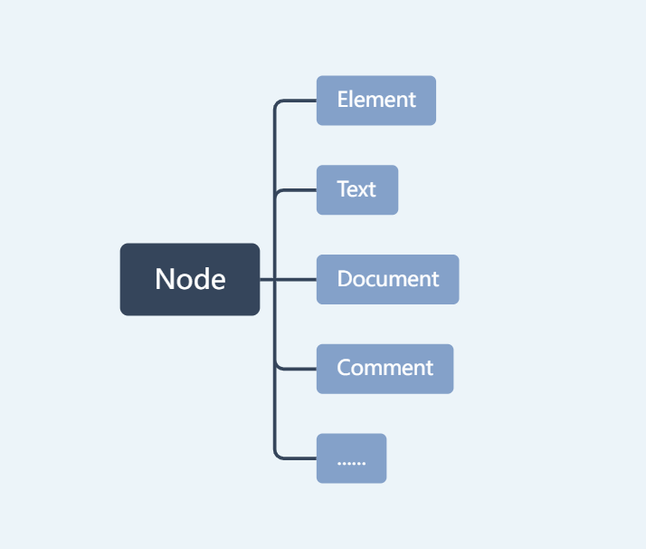

## 算法相关

- promise调度器；
- 可以立即指向的节流函数；

## 计算机组成原理

- 页表大小计算，参数：页表项（几张页）、**逻辑地址结构**为页号（20位）、业内偏移。

- 清理僵尸进程，需要让父进程被kill，僵尸进程是父进程没有处理子进程的退出信息。

  

## 数据结构

- 依次构建二叉排序树，第一个节点是根节点，后面的依次插入；

## JS

- await 后面的promise不resolve，会一致阻塞。
- 精度计算问题；0.2-0.1=0.1的原因是0.2是0.1的2倍，二进制乘2或者除2，左移或又移一位就行，所以0.2-0.1=0.1，但是0.8不是0.6的倍数，所以0.8-0.6！=0.2。

## css

- sass的安装需要Ruby环境的，是在服务端上处理的，而Less是需要引入**less.js**来处理Less代码输出css到浏览器，也可以在开发环节使用Less，然后编译成css文件，直接放到项目中。变量符号Less是@，而Scss是$。但是lees.js是一个很大的文件，一般处理之后再在浏览器使用。less.js文件的引用必须在.less文件的引用之前。
- i是行内元素；
- `background-position `取值是百分比时，所表示的距离为(conwidth-imgwidth)*x%。容器宽度减图片宽度后剩余宽度的百分比。
- text-size:bold不能使字体变粗。 font-weight:bold 这个是可以使字体变粗的样式。
- padding部分是透明的，可以显示背景（content不是透明的）。
- list-style-type，没有list-type；
- 盒模型的属性：margin（外边距）、border（边框）、padding（内边距）、content（内容），visible这种不属于盒模型特有的属性；

## 基础知识

- `typeof null`的结果为`object`，一般用null表示一个未赋值的对象；

- 函数内的`arguments`为实参，对`arguments`直接赋值可以修改形参；

- 不同进制的数组在转换成字符串时（与字符串相加），会转换为10进制；

- linux权限控制，`chmod`用于修改文件的访问权限，`chown`用于更改文件的所有者和组组信息。chmod中u表示文件所有者，g表示与文件所有者同组的用户，o表示其他用户，a表示所有用户，如果不指定用户，则用`chmod abc xxx_file`快速指定三类用户的权限，a b c可选值为1 2 4的组合1表示执行（x)，2表示写入（w），4表示读取（r）。

- 表单的默认编码格式为`application/x-www-form-urlencoded`，在发送前对所有字符进行编码；

- css使用服务端字体，使用`@font-face`；

  

## 操作dom

- 创建：createDocumentFragment()   //创建一个DOM片段
- createElement()  //创建一个具体的元素
- createTextNode()  //创建一个文本节点
- 添加：appendChild()
- 移出：removeChild()
- 替换：replaceChild()
- 插入：insertBefore()
- 复制：cloneNode(true)
- 查找：etElementsByTagName()   //通过标签名称
- getElementsByClassName()   //通过标签名称
- getElementsByName()   //通过元素的Name属性的值
- getElementById()   //通过元素Id，唯一性

- 遍历节点子元素时，注意`children`和`childNodes`的区别，`children`只包含所有`element`类型（HTML元素节点）的子节点，而`childNodes`会包含所有类型的节点（注释、文本等）。[childNodes 和 children 有什么区别？ - 知乎 (zhihu.com)](https://zhuanlan.zhihu.com/p/497721144)
  

