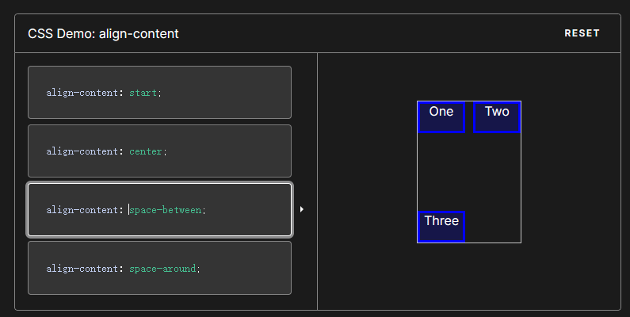

## 对盒子模型的理解

当对文档进行布局时（layout），浏览器的渲染引擎会根据css的基础框盒模型，将所有元素表示为一个个矩形盒子。

---

## 可继承属性

所有元素可继承：visibility和cursor。

内联元素可继承：letter-spacing、word-spacing、white-space、line-height、color、font、font-family、font-size、font-style、font-variant、font-weight、text-decoration、text-transform、direction。 

块状元素可继承：text-indent和text-align。 

列表元素可继承：list-style、list-style-type、list-style-position、list-style-image。

（大部分是跟文字相关的）


## a标签伪类设置

a :link、a:hover、a:visited、a:active中，定义CSS时候的顺序不同，也会直接导致链接显示的效果不同。为了保证每个效果都能正确的触发，定义时的顺序应该为：link、visited、hover、active.

> 对于有冲突的CSS，浏览器是按照：**位置，优先级，顺序 (后>前)** 来处理的
>
> 因此，考虑到`hover鼠标悬停`状态时也会有`link`或`visited`状态，所以`hover`得写在这两个后面，使得在鼠标悬停状态优先选择hover的样式。
>
> 同理，又考虑到`active点下去`时，同时也有`hover`状态，故`active`得写在`hover`后 
>
> 因此就是 **lvha** 或 **vlha** 的顺序

## table属性

### cellpadding和cellspacing


> cellpadding 属性规定**单元边沿**与**其内容之间**的空白。 
> **注释：**请勿将该属性与 [cellspacing   属性](http://www.w3school.com.cn/tags/att_table_cellspacing.asp)相混淆，cellspacing 属性规定的是单元之间的空间。 

>  从实用角度出发，最好不要规定 cellpadding，而是使用 CSS 来添加[内边距](https://hd.nowcoder.com/link.html?target=http://www.w3school.com.cn/css/css_padding.asp)。

> cellpadding--内容和单元格的距离， cellspacing--单元格之间的距离。最好设置为零！

---

## opacity和visibility的区别

`visibility`和`opacity`都是用于控制元素的可见性，但它们有一些重要的区别。

`visibility`属性用于控制元素是否可见，可以设置为`visible`（可见）或`hidden`（隐藏）。如果将元素的`visibility`属性设置为`hidden`，该元素将不可见，但它仍然占用页面布局空间，即它的尺寸和位置不会改变。此外，**被隐藏的元素仍然可以被JavaScript访问和操作**。

示例代码：

```html
<div style="visibility: hidden">我被隐藏了</div>
```

在上面的代码中，将`<div>`元素的`visibility`属性设置为`hidden`，该元素将不可见，但**仍然占用**布局空间。

`opacity`属性用于控制元素的不透明度，可以设置为0到1之间的数值。如果将元素的`opacity`属性设置为0，则该元素将完全透明，即不可见；如果将其设置为1，则该元素将完全不透明，即完全可见。不同于`visibility`属性，如果将元素的`opacity`属性设置为0，该元素将不仅不可见，同时不再占用布局空间，即它的尺寸和位置都将被视为0。

示例代码：

```html
<div style="opacity: 0">我被隐藏了</div>
```

在上面的代码中，将`<div>`元素的`opacity`属性设置为0，该元素将不可见，并且**不再占用**布局空间。

总之，`visibility`和`opacity`都可以控制元素的可见性，但它们的具体效果和行为略有不同，开发者需要根据具体情况选择适当的属性。

---

## flex布局

- align-content属性

  将content视为flex布局中每一行的内容，`justify-content`指导每一行元素在行中沿主轴方向如何排列，items视为行中的每一个元素，`align-items`指导元素在该行如何排列，`align-content`的目标是content，它指导`content`在交叉轴如何排列。

  justify: 对齐

  主轴上的东西叫content。

  

## 水平垂直居中方式

| 方式                             | 条件                                                         |
| -------------------------------- | ------------------------------------------------------------ |
| absolute + 负margin              | 知道父元素宽高                                               |
| absolute + inset 0 + margin auto | **指定**子元素宽高                                           |
| absolute + calc                  | 知道自身宽高                                                 |
| absolute + transform             | 无                                                           |
| lineheight + text-align          | 子元素display  为inline-block<br />父元素高度确定            |
| table                            | 1.子元素display: inline-block<br />2.子元素的父元素类型为`table-cell`或为`td`元素 |
| css-table                        | 同上                                                         |
| flex align-items justify-content | 无                                                           |
| grid align-seft justify-self     | 无                                                           |
| writing-mode                     |                                                              |

---

## PC端暗黑模式

PC端的暗黑模式是指当用户在使用电脑时，**可以通过设置或系统自动识别来改变页面的颜色主题**，使页面背景变为黑色或暗色系，以达到降低光照对用户眼睛的刺激，减少视觉疲劳的目的。

实现PC端暗黑模式的主要技术手段有以下几种：

1. CSS变量：通过使用CSS变量来实现不同的颜色主题，根据用户的选择或系统自动识别来动态地修改CSS变量的值，以改变页面的颜色主题。
2. 媒体查询：通过使用媒体查询来判断当前设备是否支持暗黑模式，并在相应的情况下加载不同的样式表或修改相应的CSS样式，以实现暗黑模式和常规模式的切换。
3. JavaScript：通过使用JavaScript来监听用户的选择或系统的设置，根据相应的状态来修改相应的CSS样式或加载不同的样式表，以实现暗黑模式和常规模式的切换。

需要注意的是，在实现PC端暗黑模式时，应该考虑到不同浏览器和操作系统的支持情况，并进行相应的兼容性处理。此外，为了提供更好的用户体验，应该允许用户自由选择是否使用暗黑模式，并提供相应的设置选项。

**判断设备是否开启了暗黑模式：**

获取设备是否开启了暗黑模式可以通过以下几种方式：

1. CSS媒体查询：可以使用CSS的@media查询来判断是否开启了暗黑模式。在暗黑模式下，浏览器会将`prefers-color-scheme`属性的值设置为`dark`，可以根据该属性的值来设置相应的样式。例如：

```css
@media (prefers-color-scheme: dark) {
  /* 在暗黑模式下应用的样式 */
}
```

1. JavaScript：可以使用JavaScript来检测是否开启了暗黑模式。通过访问`window.matchMedia`方法并传递`'(prefers-color-scheme: dark)'`参数来判断是否开启了暗黑模式。例如：

```js
if (window.matchMedia && window.matchMedia('(prefers-color-scheme: dark)').matches) {
  // 开启了暗黑模式
} else {
  // 未开启暗黑模式
}
```

需要注意的是，以上两种方式并不是所有浏览器和操作系统都支持的，开发者应该进行兼容性处理，以确保在各种设备上都能正常判断是否开启了暗黑模式。

---

## canvas和svg

Canvas和SVG都是用来绘制图形的，但它们之间有一些区别。Canvas是基于像素点绘图，是位图，如果进行放大或缩小会失真；而SVG基于图形，用html标签描绘形状，放大缩小不会失真12。此外，Canvas需要在js中绘制，而SVG在html中绘制。

Canvas和SVG都有各自的优缺点。**Canvas基于像素**，提供2D绘制函数，是一种HTML元素类型，依赖于HTML，**只能通过脚本绘制图案**1，。

而SVG是一种**矢量图形语言**，**基于XML**，这意味着SVG DOM中的每个元素都是可用的。您可以为某个元素附加JavaScript事件处理器2，它适用于**需要绘制二维图像的场景**2。由于SVG能够完美解决不同分辨率和尺寸的屏幕显示问题，因此它在支持各种不同分辨率和尺寸的屏幕显示方面非常成功3。

---

## 优化图片加载、精灵图

**CSS Sprite**：又称为CSS精灵或者雪碧图，是一种网页图片应用处理方式。它允许你将一个页面涉及到的所有零星图片都包含到一张大图中去，当访问该页面时，载入的图片就不会像以前那样一幅一幅地慢慢显示出来了。能很好地减少网页的http请求，从而大大的提高页面的性能。
 **SVG Sprite**：与CSS Sprite类似。另外一种实现思路 `<symbol> `+` <use>`。`<symbol>`用于定义可复用的形状，定义的现状不会展示出来，而是通过use元素引用来显示。
**Icon font**：图标字体，也叫字体图标，就是字体做的图标。能自由变化大小，且不会模糊。比图片小，加载快。可以任意改变颜色。
 **Base64**：可以将一副图片数据编码成一串字符串，使用该字符串代替图像地址。图片的下载始终都要向服务器发出请求，而通过base64编码后可以随着 HTML的下载同时下载到本地，减少 http 请求。

css精灵图 利用CSS的“background-image”，“background-    repeat”，“background-position”的组合进行背景定位， 访问页面时避免图片载入缓慢的现象。 **优点**  ：（1）CSS Sprites能很好地减少网页的http请求，从而大大的提高页面的性能，这是CSS  Sprites最大的优点，也是其被广泛传播和应用的主要原因；  2）**CSS Sprites能减少图片的字节**（曾经比较过多次3张图片合并成1张图片的字节总是小于这3张图片的字节总和）；（3）CSS    Sprites解决了网页设计师在图片命名上的困扰，只需对一张集合的图片命名，不需要对每一个小图片进行命名，从而提高了网页制作效率；（4）CSS Sprites只需要修改一张或少张图片的颜色或样式来改变整个网页的风格。  **缺点**  ：1）图片合并麻烦：图片合并时，需要把多张图片有序的合理的合并成一张图片，并留好足够的空间防止版块出现不必要的背景。2）图片适应性差：在高分辨的屏幕下自适应页面，若图片不够宽会出现背景断裂。 3）图片定位繁琐：开发时需要通过工具测量计算每个背景单元的精确位置。  4）可维护性差：页面背景需要少许改动，可能要修改部分或整张已合并的图片，进而要改动css。在避免改动图片的前提下，又只能（最好）往下追加图片，但这样增加了图片字节。

---

## 字体相关属性

`font-family` 允许您通过给定一个有先后顺序的，由字体名或者字体族名组成的列表来为选定的元素设置字体。

`@font-face` 可以消除对用户电脑字体的依赖。 `@font-face` 不仅可以放在在 CSS 的最顶层，也可以放在 @规则 的 [条件规则组](https://developer.mozilla.org/zh-CN/docs/Web/CSS/At-rule#conditional_group_rules) 中。

---

## @规则

[@规则是一个CSS语句，用来指示CSS如何运行。](https://developer.mozilla.org/zh-CN/docs/Web/CSS/At-rule)

[根据使用方法的不同，@规则又可以分为“常规规则”与“嵌套规则”两种](http://c.biancheng.net/css3/at-rule.html)[2](http://c.biancheng.net/css3/at-rule.html)。

例如，@charset用来设置CSS文件使用的字符编码[3](https://bing.com/search?q=css+%40规则)；@import用来向当前CSS样式文件中导入其他样式文件[3](https://bing.com/search?q=css+%40规则)；@namespace用来定义CSS样式表中XML命名空间的@规则[3](https://bing.com/search?q=css+%40规则)。

所谓“常规规则”指的是语法类似下面的规则：

```css
@[KEYWORD] (RULE);
```

所谓“嵌套规则”指的就是在 @规则后面需要跟随一个花括号`{ }`，其中包含了一些其它的规则声明，类似于下面这样：

```css
@[KEYWORD] {
  /* 嵌套语句 */
}
```

---

## 动画

`linear ` 规定以相同速度开始至结束的过渡效果（等于 cubic-bezier(0,0,1,1)）。`ease`  规定慢速开始，然后变快，然后慢速结束的过渡效果（cubic-bezier(0.25,0.1,0.25,1)）。`ease-in `规定以慢速开始的过渡效果（等于 cubic-bezier(0.42,0,1,1)）。ease-out  规定以慢速结束的过渡效果（等于 cubic-bezier(0,0,0.58,1)）。`ease-in-out` 规定以慢速开始和结束的过渡效果（等于 cubic-bezier(0.42,0,0.58,1)）；

默认是`ease`。

`ease-in-out`动画会慢慢开始，中间加速，然后慢慢结束。而`ease`动画类似于`ease-in-out`，但它**开始时稍微快一些**，**结束时稍微慢一些**。

贝塞尔曲线曲线由四个点 P0，P1，P2 和 P3 定义。P0 和 P3 是曲线的起点和终点。P0是（0,0）并且表示初始时间和初始状态，P3是（1,1）并且表示最终时间和最终状态。
P0：默认值 (0,0) ；P1：动态取值 (x1, y1)； P2：动态取值 (x2, y2)； P3：默认值 (1,1)
**我们需要关注的是 P1 和 P2 两点的取值**，而其中 X 轴的取值范围是 0 到 1，当取值超出范围时 cubic-bezier 将失效；Y 轴的取值没有规定，当然也毋须过大。**贝塞尔曲线的横轴表示动画的进度，纵轴表示动画属性的变化量。**

最直接的理解是，将以一条直线放在范围只有 1 的坐标轴中，并从中间拿出两个点来拉扯（X 轴的取值区间是 [0, 1]，Y 轴任意），最后形成的曲线就是动画的速度曲线。

## top和fixed

当你使用 `position: absolute` 时，元素会相对于它的第一个非静态定位的祖先元素进行定位。如果没有这样的祖先元素，那么它会相对于 `<html>` 元素进行定位。所以，如果你想让一个元素固定在顶部，你可以使用 `position: fixed` 而不是 `position: absolute`。

也就是说`absolute`是相对于元素的绝对定位，而`fixed`是相对于视口的绝对定位。
