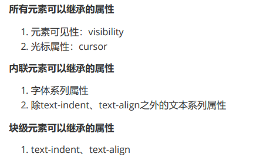
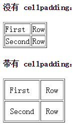
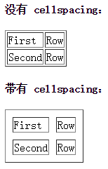

## 对盒子模型的理解

当对文档进行布局时（layout），浏览器的渲染引擎会根据css的基础框盒模型，将所有元素表示为一个个矩形盒子。

---

## 可继承属性

所有元素可继承：visibility和cursor。

内联元素可继承：letter-spacing、word-spacing、white-space、line-height、color、font、font-family、font-size、font-style、font-variant、font-weight、text-decoration、text-transform、direction。 

块状元素可继承：text-indent和text-align。 

列表元素可继承：list-style、list-style-type、list-style-position、list-style-image。

（大部分是跟文字相关的）



## a标签伪类设置

a :link、a:hover、a:visited、a:active中，定义CSS时候的顺序不同，也会直接导致链接显示的效果不同。为了保证每个效果都能正确的触发，定义时的顺序应该为：link、visited、hover、active.

> 对于有冲突的CSS，浏览器是按照：**位置，优先级，顺序 (后>前)** 来处理的
>
> 因此，考虑到`hover鼠标悬停`状态时也会有`link`或`visited`状态，所以`hover`得写在这两个后面，使得在鼠标悬停状态优先选择hover的样式。
>
> 同理，又考虑到`active点下去`时，同时也有`hover`状态，故`active`得写在`hover`后 
>
> 因此就是 **lvha** 或 **vlha** 的顺序

## table属性

### cellpadding和cellspacing



> cellpadding 属性规定**单元边沿**与**其内容之间**的空白。 
> **注释：**请勿将该属性与 [cellspacing   属性](http://www.w3school.com.cn/tags/att_table_cellspacing.asp)相混淆，cellspacing 属性规定的是单元之间的空间。 

>  从实用角度出发，最好不要规定 cellpadding，而是使用 CSS 来添加[内边距](https://hd.nowcoder.com/link.html?target=http://www.w3school.com.cn/css/css_padding.asp)。

> cellpadding--内容和单元格的距离， cellspacing--单元格之间的距离。最好设置为零！

---

## opacity和visibility的区别

`visibility`和`opacity`都是用于控制元素的可见性，但它们有一些重要的区别。

`visibility`属性用于控制元素是否可见，可以设置为`visible`（可见）或`hidden`（隐藏）。如果将元素的`visibility`属性设置为`hidden`，该元素将不可见，但它仍然占用页面布局空间，即它的尺寸和位置不会改变。此外，**被隐藏的元素仍然可以被JavaScript访问和操作**。

示例代码：

```html
<div style="visibility: hidden">我被隐藏了</div>
```

在上面的代码中，将`<div>`元素的`visibility`属性设置为`hidden`，该元素将不可见，但**仍然占用**布局空间。

`opacity`属性用于控制元素的不透明度，可以设置为0到1之间的数值。如果将元素的`opacity`属性设置为0，则该元素将完全透明，即不可见；如果将其设置为1，则该元素将完全不透明，即完全可见。不同于`visibility`属性，如果将元素的`opacity`属性设置为0，该元素将不仅不可见，同时不再占用布局空间，即它的尺寸和位置都将被视为0。

示例代码：

```html
<div style="opacity: 0">我被隐藏了</div>
```

在上面的代码中，将`<div>`元素的`opacity`属性设置为0，该元素将不可见，并且**不再占用**布局空间。

总之，`visibility`和`opacity`都可以控制元素的可见性，但它们的具体效果和行为略有不同，开发者需要根据具体情况选择适当的属性。