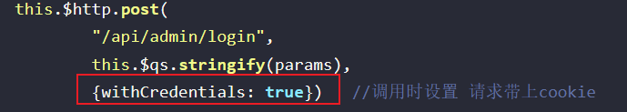

## 0.1+0.2 !== 0.3

关键在于使用二进制表示浮点数。0.1和0.2在二进制中是无限循环的。

[IEEE754是一个浮点数标准，它规定了浮点数的格式和运算方法](https://segmentfault.com/a/1190000024578628)[1](https://segmentfault.com/a/1190000024578628)[2](https://baike.baidu.com/item/IEEE 754/3869922)[3](https://en.wikipedia.org/wiki/IEEE_754)[。浮点数是用来表示实数的一种近似值，它由符号位，阶码和尾数三部分组成](https://segmentfault.com/a/1190000024578628)[1](https://segmentfault.com/a/1190000024578628)[4](https://blog.csdn.net/weixin_47713503/article/details/108699001)。浮点数的误差主要有两个原因：

- [进制问题。由于计算机使用二进制来存储和运算浮点数，而有些十进制的小数在二进制中不能精确表示，比如0.1，0.2等，所以在转换的过程中会产生截断误差](https://blog.csdn.net/cluster1893/article/details/80757724)[5](https://blog.csdn.net/cluster1893/article/details/80757724)[6](https://www.zhihu.com/question/380574329)。这种误差是不可避免的，只能通过增加浮点数的位数来减小误差的影响。
- [精度问题。由于浮点数的尾数部分有限，所以它不能表示所有的实数，只能表示一部分有限的实数。这就意味着浮点数的精度是有限的，不能无限接近真实值。浮点数的精度由尾数的位数决定，比如float型浮点数的尾数部分有23位，换算成十进制就是223=8388608，所以十进制精度只有6~7位；double型浮点数的尾数部分有52位，换算成十进制就是252=4503599627370496，所以十进制精度只有15~16位](https://www.zhihu.com/question/380574329)[6](https://www.zhihu.com/question/380574329)。这种误差在浮点数的运算中会累积，可能导致最终结果的偏差。

C++中0.1+0.2的运算结果并不一定是正确的，这取决于你使用的是什么类型的变量来存储和计算这两个数¹⁴⁶。如果你使用的是整型变量（int），那么0.1和0.2会被截断为0，0+0的结果当然是0；如果你使用的是浮点型变量（float或double），那么0.1和0.2会被转换为二进制的近似值，然后进行加法运算，最后再转换为十进制的近似值，这个过程中可能会产生误差¹²³。例如，如果你使用float型变量，那么0.1+0.2的结果可能是0.30000001或者0.29999999，而不是0.3；如果你使用double型变量，那么0.1+0.2的结果可能是0.30000000000000004或者0.29999999999999998，而不是0.3。这是因为float和double的精度是有限的，不能无限接近真实值¹⁴⁶。如果你想得到精确的结果，你可以使用其他的数据类型，比如分数或者高精度数，或者使用一些数学库或者工具来处理浮点数的误差³。

源: 与必应的对话， 2023/2/15

(1) C++ 运算符 | 菜鸟教程. https://www.runoob.com/cplusplus/cpp-operators.html 访问时间 2023/2/15.
(2) 【C++】如何使程序的除法运算结果变为小数？_小鹿Madoka的博客-CSDN博客_c++中除法怎么带小数点. https://blog.csdn.net/weixin_37706349/article/details/118017767 访问时间 2023/2/15.
(3) C++ 变量类型 | 菜鸟教程. https://www.runoob.com/cplusplus/cpp-variable-types.html 访问时间 2023/2/15.
(4) C++中0与1互转的四种方法_SHI和远方的博客-CSDN博客_c++怎么把1变成0 0 变成1. https://blog.csdn.net/Flysa_1/article/details/109339433 访问时间 2023/2/15.
(5) C++位运算符（&、 | 、^）_Wonder-King的博客-CSDN博客_c++. https://blog.csdn.net/qq_42391248/article/details/84790152 访问时间 2023/2/15.
(6) C++ 数组 | 菜鸟教程. https://www.runoob.com/cplusplus/cpp-arrays.html 访问时间 2023/2/15.

---

## 对事件循环的理解

js是单线程的，一个时间只能做一件事，但js的执行并不是阻塞的，让js不是阻塞执行的方法就是事件循环。js中的任务分为宏任务和微任。

当宏任务队列中有多个任务时，**每次只会将一个宏任务放入执行栈中执行，当它执行完后**，会先执行所有微任务队列中的任务，**再进行下一个宏任务**。

**在执行一个微任务时产生了新的微任务，这些新的微任务也会在当前事件循环中被依次执行。**

### 参考资料

- [[前端进阶\] - 搞懂浏览器进程和线程 - 掘金 (juejin.cn)](https://juejin.cn/post/7053974933931556900)
- [从浏览器多进程到JS单线程，JS运行机制最全面的一次梳理 - 掘金 (juejin.cn)](https://juejin.cn/post/6844903553795014663)

### 宏任务和微任务的本质

宏任务和微任务是JavaScript中的异步任务的两种类型。

**宏任务是由宿主（浏览器或Node.js）发起的**，例如setTimeout，setInterval，setImmediate，requestAnimationFrame等。

**微任务是由JavaScript自身发起的**，例如Promise，MutationObserver，process.nextTick等。

宏任务和微任务的执行顺序是：

执行全局同步代码。
执行当前层级的微任务队列，直到清空。
执行下一个层级的宏任务，回到第二步。

### node事件循环和浏览器事件循环的区别

Node中的事件循环与浏览器中的事件循环有以下不同：

- 浏览器的事件循环是在HTML5中定义的规范，而Node中的事件循环是由libuv库实现的。
- 浏览器的事件循环只有一个宏任务队列，而Node中的事件循环有六个宏任务队列，分别是timers，I/O callbacks，idle/prepare，poll，check，close callbacks。
- 览器中的微任务队列是每个宏任务执行完之后执行，而Node中的微任务队列是在事件循环的各个阶段之间执行。

[nodejs中的事件循环 (weijl.top)](https://weijl.top/#/blog/NodeJS/nodejs中的事件循环.md/.%2Fassets%2Fblogs%2FNodeJS%2Fnodejs中的事件循环.md)

---

## 高阶函数、纯函数和函数柯里化

- 高阶函数是指可以接收另一个函数作为参数的函数，或者函数的返回值是一个函数。

- 纯函数是指不依赖于外部变量，不修改程序状态，不产生副作用，对于相同的输入，总会产生相同的输出。
  纯函数避免副作用的方法是不依赖于外部变量、状态或输入输出设备，我们将其所需要的依赖作为参数传递给他。那么一些带来副作用的操作，也需要作为参数传递给他。
- 函数柯里化是把接收多个参数的函数变换成**接收一个单一参数的函数**，并且返回这个接收单一参数的新函数。函数柯里化的作用主要是参数复用和动态创建函数。参数复用避免重复传入相同的参数，动态创建函数可以实现更灵活的编程。
  例如`jwa`库中通过传入的参数生成一个加密函数。
- 在实际使用过程中，往往同时使用高阶函数和函数柯里化，例如一个去抖函数。

## 防抖和节流

防抖和阶段都是使用高阶函数，对传入的函数进行处理，返回一个新函数。

防抖是要在一段时间后触发，在这一段时间内重复触发的话会取消之前的触发请求，即只执行最新的请求；例如在搜索框内输入内容自动执行搜索。

节流是触发后立即执行，但是一段时间内不能再次触发；例如购物网站的添加商品按钮。

---

## 几种继承方式总结

- 原型链继承将父类实例作为子类的原型，会导致所有父类属性被子类对象所共享，包括父类构造函数类定义的属性。
- 盗用构造函数继承是在子类的构造函数中执行父类的构造函数，这一步通过call或apply函数进行，因为要将父类构造函数中的this指针改为子类对象；这种方法会丢失父类原型上的属性和方法。
- 组合式继承是综合原型继承和盗用构造函数继承，由于子类对象上添加了父类属性，屏蔽了对原型上相同名称属性的访问。
- 原型继承是基于`Object.create`方法，创建一个新对象，并将新对象的原型设为这个函数接收的对象，当然不借助这个方法也能达成相同的目的。寄生式继承与该方法相似，只是会有手动创建构造函数的过程，将新构造函数的原型设为接收到的对象，返回新构造函数创建的实例，给实例添加新的方法。
- 寄生式组合继承被称为经典的伪继承，它利用原型式继承得到一个新**原型对象**，这个原型对象的隐式原型指向父类原型，原型上有constructor属性，指向构造函数，一般而言，它指向自身（`test.prototype.constructor === test // ture`），但是我们在这个新的原型对象上添加`constructor`属性，覆盖父类原型上的构造函数，而去执行子类的构造函数。最终结果是我们只继承了父类原型，在子类的构造函数中执行了父类构造函数。继承了父类的所有属性和方法，并且没有执行多余的代码。相比组合式继承，它是用一个新的实例保存了父类原型，而组合式继承是直接使用父类实例保存与父类原型的联系。

---

## V8引擎

### 垃圾回收

栈中的数据通过函数栈指针的变化被自动释放，这个释放并不是真正的释放，只是栈顶指针下移了。

JavaScript中的对象都存储在堆上，垃圾回收主要是回收堆上那些不再被使用的对象。V8引擎将堆分为不同的代，不同代内对象的生命周期长度不同。分代基于的原理是，一般来说新创建的对象生命周期不会太长，而一直存在的对象一般具有很长的生命周期。如果不分代，每次进行标记-清理时，就需要遍历所有内存中的对象，而其中生命周期长的对象在每次回收时都会被遍历，我们希望更少地管理那些生命周期比较长的对象。

分代主要是分为新生代和老生代，新创建的对象会保存在新生代中。**这些对象往往在其创建后很快就变得无用了**。为了更快地回收这些对象，V8采用了Scavenger算法，该算法专门针对新生代设计，将**新生代内存分为两个区域：From空间和To空间**，这两个空间的大小相同，因为要考虑到需要将From空间的所有对象复制到To空间。**当From空间被填满时**，V8会将其中的存活对象复制到To空间中，并清空From空间。这个过程称为Scavenge，可以快速且高效地回收大量的短期生命周期对象。存活对象使用标记算法识别。
新加入的对象都会存放在使用区，当使用区快写满时就进行一次垃圾清理操作。
在开始进行垃圾回收时，新生代回收器会对使用区内的对象进行标记。
标记完成后，需要对使用区内的活动对象拷贝到空闲区进行排序。
标记完成后，需要对使用区内的活动对象拷贝到空闲区进行排序。
最后对使用区和空闲区进行交换，使用区->空闲区，空闲区->使用区

**当一个对象在新生代中经过多次垃圾回收后，如果仍然存活，就会被转移到老生代中**。对象从新生代转移到老生代的过程称为晋升（promotion）。晋升的条件通常是对象已经经**历过一定次数的Scavenge过程**，并且仍然存活。被晋升到老生代中的对象将不再参与新生代的垃圾回收，而是由老生代的垃圾回收器来管理。

老生代包含的是生命周期较长的对象，因此无法使用新生代的Scavenger算法进行垃圾回收。针对老生代的垃圾回收，**V8采用了标记清除和标记压缩两种算法**，它们能够更高效地回收较长生命周期的对象。同时，V8还使用了增量标记和并发标记等技术来避免在垃圾回收过程中对JavaScript执行造成过多的中断。

标记过程首先找到内存中所有被引用的对象，并做标记，之后遍历整个堆，将没有被标记的对象的内存进行回收，回收方式一般是将内存标记为可用。

[Javascript的垃圾回收机制知多少？ - 掘金 (juejin.cn)](https://juejin.cn/post/7038593947995734030#heading-8)

### JS执行

V8引擎负责执行JavaScript代码，包括预编译和执行两个阶段。在预编译阶段，V8引擎会扫描代码，查找变量声明和函数声明，并在内存中创建它们的引用1（变量提升，函数提升）。

在预编译阶段中，变量会被默认初始化为undefined，但是函数不会被初始化。

函数提升的优先级高于变量提升。在预编译阶段，JavaScript引擎会扫描代码，查找变量声明和函数声明，并在内存中创建它们的引用。函数声明会覆盖变量声明，但不会被变量赋值覆盖。

```javascript
foo(); // 输出: "函数声明"
var foo = 2;
function foo() {
    console.log("函数声明");
}
```

```javascript
function foo() {
    console.log("函数声明");
}
var foo;
foo(); // 输出: "函数声明"
foo = 2;
```

- 为什么foo不是undefined

  函数提升的优先级高于变量提升，函数声明覆盖了变量声明；

---

## setTimeout和requestAnimationFrame实现动画效果的区别

`setTimeout`和`requestAnimationFrame`都可以用来实现动画效果，但它们之间有一些区别。

1. 刷新率

浏览器每秒钟会进行多次屏幕刷新，即重绘，来显示页面的变化和动画效果。这个刷新率通常被称为“屏幕刷新率”、“帧率”或“FPS”（Frames Per Second）。

`setTimeout`的刷新率是固定的，通常为每秒60次。这意味着，无论机器的性能如何，动画都会以相同的速度运行。而`requestAnimationFrame`的**刷新率是浏览器的刷新率，通常为每秒60次，但在某些高刷新率屏幕上可能会更高。**这使得`requestAnimationFrame`更加流畅和自然。

1. 可靠性

`requestAnimationFrame`是浏览器提供的原生API，可以保证每一帧的渲染时机都是最优的，同时可以避免多个动画同时运行时出现的问题。而`setTimeout`是JavaScript自带的函数，其执行时间不一定是最优的，可能会出现闪烁或卡顿等问题。

1. 性能

`requestAnimationFrame`的性能通常比`setTimeout`更好，因为`requestAnimationFrame`会在下一次浏览器渲染之前调用回调函数，这样可以最大程度地减少了浏览器的重绘次数，从而减少了CPU和GPU的占用。

因此，一般来说，建议使用`requestAnimationFrame`来实现动画效果，因为它提供了更高的性能和更流畅的动画效果。当然，如果要实现的动画效果非常简单，或者需要在某些情况下控制动画的速度，`setTimeout`也是一个不错的选择。

---

## 上下文、作用域、函数执行栈

**事件循环机制与上下文、作用域和执行栈有以下关系**：

- 上下文（Context）：JavaScript 代码执行时所处的环境。每当代码执行到一个新的可执行块（如函数、模块等）时，都会进入一个新的上下文。一个上下文可以包含多个作用域。**每个上下文都有自己的变量对象**，用来存储在该上下文中定义的变量和函数。
- 作用域（Scope）：**指在当前上下文中可访问的变量和函数的集合**。JavaScript 使用**词法作用域**，**即函数的作用域是在函数定义时确定的，而不是在函数调用时**。一个变量的作用域取决于它在代码中定义的位置。当在一个上下文中使用一个变量时，JavaScript 引擎会首先在该上下文的变量对象中查找该变量，如果找不到，则会到父级作用域中查找，直到找到该变量为止。
- 执行栈（Execution Context Stack）：JavaScript 引擎会维护一个执行栈，**用来存储当前正在执行的上下文**。当代码执行到一个新的可执行块时，会创建一个新的上下文并将其推入执行栈中，当该块执行完毕后**，该上下文会被弹出执行栈，控制权会回到上一个上下文中继续执行**。

JavaScript 中的事件循环机制是指在单线程的 JavaScript 运行时中，为了处理异步任务，而采用的一种事件循环的机制。它通过监听任务队列中的任务，来实现异步任务的执行。

**JavaScript 的事件循环机制主要分为以下几个阶段：**

1. 宏任务：在事件循环的每一次循环中，只会执行一个宏任务。宏任务包括 **script 脚本执行**、`setTimeout`、`setInterval`、`setImmediate`、`I/O `操作等。
2. 微任务：在宏任务执行完成后，会依次执行当前所有微任务。微任务包括` Promise.then`、`Promise.catch`、`Promise.finally`、`MutationObserver`、`process.nextTick` 等。
3. 渲染：当所有微任务执行完成后，如果当前需要更新页面，则进行页面的渲染。

总的来说，事件循环机制通过监听任务队列中的任务，实现了异步任务的执行，使得 JavaScript 在单线程运行时也能够处理异步操作。同时，上下文、作用域和执行栈等概念，也是事件循环机制的重要组成部分。

### 块级作用域、全局作用域、函数作用域

ES6虽然提出了块级作用域的概念，但是var声明的变量还是只有全局作用域或函数作用域，这可能是处于兼容之前代码的原因。

使用let或const声明的变量会受到块级作用域的限制，出现`暂时性死区`的现象。

---

## this指针

在 JavaScript 中，this 关键字是一个特殊的对象引用，它指向当前执行上下文的对象。在函数中，this 引用的是该函数被调用时所在的对象。在全局上下文中，this 引用的是全局对象，如 window 或者 global。

在**普通函数中**，this 的指向是在运行时确定的，它取决于调用该函数的方式。如果函数作为对象的方法调用，this 将指向该对象；如果函数作为普通函数调用，则 this 将指向全局对象。

在**箭头函数中**，this 的指向是在定义时确定的，它取决于箭头函数所在的上下文。箭头函数的 this 始终指向定义该函数的父级上下文中的 this。

此外，还有一些情况下，this 的指向可能会发生变化，比如**在事件处理程序**中，this 将引用触发事件的元素。**在 JavaScript 的模块中**，this 指向 undefined，因为模块中的代码运行在独立的作用域中。在**严格模式**下，this 的指向会更加严格。在**全局环境中，严格模式下的 this 始终为 undefined**；在函数内部，如果没有明确指定 this 的值，严格模式下的 this 为 undefined。

在 JavaScript 的严格模式中，如果没有明确指定 this 的值，this 就会被设置为 undefined。这种情况下，如果想要使用 this 指针，有以下两种方法：

1. 使用 Function.prototype.call() 或 Function.prototype.apply() 明确指定 this 指向。这两个方法的第一个参数即为 this 指向的对象。
2. 使用箭头函数。箭头函数没有自己的 this 值，箭头函数内部的 this 值继承自外部的作用域。因此，在箭头函数中使用 this，其指向的就是外部函数的 this 值。**在箭头函数中，this 的值无法通过 call() 或 apply() 方法来修改。**

---

## 函数

### 箭头函数

- 为什么要使用箭头函数

  箭头函数是一种简洁的函数表达式，它有两个主要的优点：1

  简明的语法，可以省略 function 关键字和 return 语句2
  直观的作用域和 this 的绑定，不会创建自己的 this，而是继承上层的 this3
  箭头函数适合用于一些简单的函数，例如对象转换、数组操作、事件处理等4。

- 箭头函数的问题

  但是，箭头函数也有一些限制，例如不能用作构造函数、不能使用 arguments 对象、不能使用 yield 语句等3。

### eval函数

eval函数的返回值是字符串中最后一条语句的返回值。如果字符串中最后一条语句没有返回值，那么eval函数会返回undefined。

在Node.js中，require语句用于导入模块。当Node.js执行require语句时，它会按照以下步骤查找并加载模块：

首先检查缓存，如果缓存中有则直接返回加载，如果没有进行第2步 1。
如果X是内置模块，直接返回模块，不继续执行 1。
如果X带路径，包含./ …/等，则根据X所在的父模块确定X的绝对路径。当作文件查找X文件，只要有一个文件，就返回该文件，不再继续执行 。
如果不带路径，则按照父模块的路径查找可能安装的目录，在这些目录下搜索可能的X文件或者X目录，找到则返回该文件或者目录。
没有找到，返回not found 。
此外，在加载模块后，Node.js会将其缓存起来。这意味着如果你多次使用require语句导入同一个模块，Node.js只会在第一次执行时加载该模块，之后都会直接从缓存中获取 。

Node.js会在**当前执行上下文**中同步执行该模块中的代码

eval函数可以访问全局变量。如果直接调用eval函数，**它会在调用者的作用域内执行**。如果调用`window.eval(code)`，则会在全局作用域内执行。

作用域为当前上下文：

```js
var x = 3;
function fun(){
    var x = 4;
    eval('console.log(x)');
}
fun(); // 4
window.x; // 3
```

可以沿着作用域链搜索：

```js
var x = 3;
function fun(){
    eval('console.log(x)');
}
fun(); // 3
```

window调用时上下文为window：

```js
var x = 3;
function fun(){
    var x = 4;
    window.eval('console.log(x)');
}
fun(); // 3
window.x; // 3
```

### 声明式语法和过程式语法

过程式语法：

```javascript
const arr = [1, 2, 3, 4];
const result = [];
for (let i = 0; i < arr.length; i++) {
  result.push(arr[i] * 2);
}
console.log(result); // [2, 4, 6, 8]
```

声明式语法：

```javascript
const arr = [1, 2, 3, 4];
const result = arr.map((item) => item * 2);
console.log(result); // [2, 4, 6, 8]
```

在过程式语法中，我们需要关注如何做，需要使用循环来遍历数组并将每个元素乘以2。而在声明式语法中，我们只需要关注要做什么，使用`map`函数即可将数组中的每个元素乘以2。

### this指针

js中的this指针是当前执行上下文中的一个变量。

在方法中，this表示该方法所属的对象。如果单独使用，this表示全局对象。在函数中，在严格模式下，this是未定义的。

箭头函数的上下文对象中没有这个变量。箭头函数的this指向是在定义时确定的，而不是在运行时确定的。

---

## 发送网络请求

### xhr事件回调

- onreadystatechange 事件处理程序会在请求的状态发生变化时被触发，而 onload 事件处理程序则会在请求成功完成时被触发。
- onreadystatechange 事件处理程序会在请求的每个状态变化时被触发，而 onload 事件处理程序则只会在请求成功完成时被触发。

### fetch和xhr

Fetch和XHR都是获取远端数据的方式。**Fetch是原生js方法**（浏览器提供的，HTML5API），没有使用XMLHttpRequest对象，使用fetch可以不用引用http的类库即可实现。它提供了一种简单，合理的方式来跨网络异步获取资源。

**而XMLHttpRequest（XHR）是一个构造函数**，对象用于与服务器交互。**它基于事件机制实现请求成功与失败**的回调，不符合关注分离（Separation of Concerns）的原则，配置和调用方式非常混乱。而Fetch通过Promise来实现回调，调用更加友好。

在处理HTTP头部方面，XMLHttpRequest有一个setRequestHeader()方法用于设置HTTP请求头部。此方法必须在open()方法和send()之间调用。如果多次对同一个请求头赋值，只会生成一个合并了多个值的请求头1。

而**Fetch API提供了一个Headers接口**，它与Map类型都有get()、set()、has()和delete()等实例方法，可以使用一个可迭代对象来初始化，当然也具有keys()、values()和entries()迭代器接口2。

至于**携带cookie方面**，根据Fetch规范，Set-Cookie是一个禁止的响应标头，对应的响应在被暴露给前端代码前，必须滤除这一响应标头，即浏览器会阻止前端JavaScript代码访问Set-Cookie标头。

```js
var xhr = new XMLHttpRequest();
xhr.open('GET', 'http://www.example.com/');
xhr.setRequestHeader('Content-Type', 'application/json');
xhr.send();
```

```js
fetch('http://www.example.com/', {
  headers: {
    'Content-Type': 'application/json'
  }
});
```

在使用XHR和Fetch时，你可以手动设置HTTP头部，但也有一些头部会被浏览器自动携带。例如，在发送跨域请求时，浏览器会自动添加Origin头部1。

至于Cookie方面，XHR和Fetch默认都不会携带Cookie。如果你想要在请求中携带Cookie，需要进行额外的配置。对于XHR，你需要在$.ajax调用中添加`xhrFields: { withCredentials: true }`。而对于Fetch，你需要在请求配置中添加`credentials: 'include'`。

### Ajax和Axios

Ajax不仅仅是网络请求，**Ajax是一种编程技术**，它允许我们创建动态、复杂和异步的 Web 应用程序。Ajax 允许我们异步地从 Web 服务器发送和接收数据，而不会干扰当前网页或应用程序的状态或行为。

XHR（XMLHttpRequest）是一个 JavaScript 对象，它与服务器交互。它**是 Ajax 的核心部分**。使用 XHR 可以在不刷新整个页面的情况下与服务器交换数据并更新部分网页内容。

你可以把 XHR 看作是 Ajax 的一个子集，因为 Ajax 不仅仅包括 XHR，还包括其他技术，如 CSS 和 HTML。fetch也是Ajax技术下的一个API。

[Ajax - Web 开发者指南 | MDN (mozilla.org)](https://developer.mozilla.org/zh-CN/docs/Web/Guide/AJAX)

[XMLHttpRequest - Web API 接口参考 | MDN (mozilla.org)](https://developer.mozilla.org/zh-CN/docs/Web/API/XMLHttpRequest)

**Axios 是一个基于 promise 封装的网络请求库**，它是基于 XHR 进行二次封装。Axios 可以说是 XHR 的一个子集，而 XHR 又是 Ajax 的一个子集。

Axios 是一种通过 promise 对 ajax 技术进行封装的库，**就像 jQuery 实现了 ajax 封装一样**。Ajax 技术实现了网页的部分数据刷新，而 **axios 实现了对 ajax 的封装**。

---

### axios请求拦截和响应拦截原理

使用`axios.interceptors.request.use`方法，拦截axios请求，为请求添加一些同一配置。

`config` 是一个对象，它包含了**请求的配置信息**。例如，你可以在 `config` 对象中设置请求的 URL、方法、头部、数据等信息。

axios的请求拦截就是在发送请求前，对`config`对象进行处理，拦截函数要返回config，通过Promise进行链式调用。

响应拦截是获取请求的返回结果，通用基于promise进行链式调用，拦截函数需要将结果返回，以进行链式调用；或者返回一个Promise，同样需要设计成支持链式调用。

`axios.create` 方法可以创建一个新的 axios 实例，这个新实例与默认的 axios 实例是独立的。你可以为新实例指定自己的配置，例如基础 URL、超时时间、头部信息等。这样，当你使用新实例发送请求时，就会使用这些配置。

请求拦截和响应拦截是基于Promise的链式调用的。

```ts
function Axios(instanceConfig) {
  this.defaults = instanceConfig;
  this.interceptors = {
    request: new InterceptorManager(),
    response: new InterceptorManager()
  };
}

function InterceptorManager() {
  this.handlers = [];
}

// Provide aliases for supported request methods
utils.forEach(['delete', 'get', 'head', 'options'], function forEachMethodNoData(method) {
  /*eslint func-names:0*/
  Axios.prototype[method] = function (url, config) {
    return this.request(mergeConfig(config || {}, {
      method: method,
      url: url,
      data: (config || {}).data
    }));
  };
});

utils.forEach(['post', 'put', 'patch'], function forEachMethodWithData(method) {
  /*eslint func-names:0*/
  Axios.prototype[method] = function (url, data, config) {
    return this.request(mergeConfig(config || {}, {
      method: method,
      url: url,
      data: data
    }));
  };
});

Axios.prototype.request = function request(configOrUrl, config) {
  /*eslint no-param-reassign:0*/
  // Allow for axios('example/url'[, config]) a la fetch API
  if (typeof configOrUrl === 'string') {
    config = config || {};
    config.url = configOrUrl;
  } else {
    config = configOrUrl || {};
  }

  config = mergeConfig(this.defaults, config);

  // Set config.method
  if (config.method) {
    config.method = config.method.toLowerCase();
  } else if (this.defaults.method) {
    config.method = this.defaults.method.toLowerCase();
  } else {
    config.method = 'get';
  }

  /** */
  
  // filter out skipped interceptors
  var requestInterceptorChain = [];
  var synchronousRequestInterceptors = true;
  this.interceptors.request.forEach(function unshiftRequestInterceptors(interceptor) {
    /** */
    // 遍历interceptors.request上的所有handler
  });
	
  // 响应拦截要执行的函数
  var responseInterceptorChain = [];
  this.interceptors.response.forEach(function pushResponseInterceptors(interceptor) {
    /** */
    // 遍历interceptors.response上的所有handler
  });

  var promise;
	
  if (!synchronousRequestInterceptors) {
    // dispatchRequest是负责发送请求的
    var chain = [dispatchRequest, undefined];
		
    // 在头部添加用户自定义的请求拦截函数（unshift
    Array.prototype.unshift.apply(chain, requestInterceptorChain);
    // 在尾部添加响应拦截函数
    chain = chain.concat(responseInterceptorChain);
		
    // 将config作为参数传递
    // 用户定义的拦截函数必须返回config或response，以支持链式调用
    promise = Promise.resolve(config);
    while (chain.length) {
      promise = promise.then(chain.shift(), chain.shift());
    }

    return promise;
  }

  var newConfig = config;
  while (requestInterceptorChain.length) {
    var onFulfilled = requestInterceptorChain.shift();
    var onRejected = requestInterceptorChain.shift();
    try {
      newConfig = onFulfilled(newConfig);
    } catch (error) {
      onRejected(error);
      break;
    }
  }

  try {
    promise = dispatchRequest(newConfig);
  } catch (error) {
    return Promise.reject(error);
  }

  while (responseInterceptorChain.length) {
    promise = promise.then(responseInterceptorChain.shift(), responseInterceptorChain.shift());
  }

  return promise;
};
```

### axios中的适配器

axios能够同时在`node`环境和浏览器环境中使用。

Axios是一个基于Promise的HTTP客户端，用于浏览器和node.js。它是同构的（=它可以在浏览器和nodejs中使用相同的代码库运行）。在服务器端，它使用原生的node.js `http`模块，而在客户端（浏览器）中，它使用`XMLHttpRequests`。

Axios适配器是一个函数，它负责处理请求并返回一个Promise，该Promise解析为响应对象。它允许您自定义如何处理HTTP请求，例如，**您可以使用适配器来模拟响应**，而不是实际发出HTTP请求。

因此这也是为什么说axios只是基于`xhr`的一个封装。

`axios`根据环境判断使用哪一个适配器：

```ts
var adapter = config.adapter || defaults.adapter;
/**
* adapter: getDefaultAdapter(),
*/

function getDefaultAdapter() {
  var adapter;
  if (typeof XMLHttpRequest !== 'undefined') {
    // For browsers use XHR adapter
    adapter = require('../adapters/xhr');
  } else if (typeof process !== 'undefined' && Object.prototype.toString.call(process) === '[object process]') {
    // For node use HTTP adapter
    adapter = require('../adapters/http');
  }
  return adapter;
}
```

### 携带cookie

- `fetch(url,{ credentials: 'include' });`
- `xhr.withCredentials = true;`，在send方法调用前配置；
- 全局配置：`axios.defaults.withCredentials = true;` 
- 使用时配置：
  

---

## this指向

在 JavaScript 中，this 关键字指的是它所属的对象。它拥有不同的值，具体取决于它的使用位置。**在方法中**，this 指的是所有者对象。**如果单独使用**，this 表示全局对象。**在函数中**，this 表示全局对象。**在函数中，在严格模式下**，this 是未定义的。

如果你使用 `bind` 函数将一个函数绑定到 `window` 对象，那么无论如何调用这个函数，它内部的 `this` 都会指向 `window` 对象。

### 实现call方法

****


核心是**通过对象**调用函数。

```
Function.prototype.myCall = function(context) {
    context = context || window;
  	// myCall的调用者为函数自身，因此this就指向函数
  	// 我们是通过fn.myCall 调用此方法的，因此函数内的this指向目标函数。
    context.fn = this;
    var args = [];
    for (var i = 1; i < arguments.length; i++) {
        args.push(arguments[i]);
    }
    var result = context.fn(...args);
    delete context.fn;
    return result;
}
```

---

## window对象

### load事件

**`load`** 事件在**整个页面**及**所有依赖资源**如样式表和图片都已完成加载时触发。它与 [`DOMContentLoaded`](https://developer.mozilla.org/zh-CN/docs/Web/API/Document/DOMContentLoaded_event) 不同，后者只要页面 **DOM 加载完成**就触发，无需等待依赖资源的加载。`DOMContentLoaded` 事件会在 HTML 文档被完全解析后触发，它不会等待图片、子框架和异步脚本等其他资源加载完成。**但是，它会等待所有延迟脚本**（使用 `defer` 属性或者 `type=\"module\"` 的 `<script>` 标签）下载并执行完成[1](https://developer.mozilla.org/en-US/docs/Web/API/Window/DOMContentLoaded_event)。

---

## 事件处理程序

### 添加事件处理函数

`onclick`事件**在同一时间只能指向唯一对象** `onclick`给一个事件注册多个listener，`addEventListener`对任何DOM都是有效的，而onclick仅限于HTML。

在`onclick`和`onclick`的函数中，this都指向绑定事件的元素。在**内联方式**绑定事件的情况下，`myFunction`函数中的`this`指向的是触发事件的元素（`<button onclick="myFunction()">Click me</button>`）。

---

### PC和移动端指针事件

鼠标事件包括：`click` `dbclick` `mousedown` `mouseup` `mouseover` `mouseover` `mouseout`

**在移动端事件中**，使用的是触摸事件，包括`touchstart` `touchmove` `touchend` `touchcancel`。`touch`的事件处理函数会接受一个`TouchList`对象，当用户在触摸屏上使用多个手指进行触摸操作时，`TouchList `对象中会包含多个 Touch 对象。每个 Touch 对象都代表一个手指在屏幕上的接触点。

在移动端设备上，React 中定义的鼠标事件（如 `onClick`、`onMouseDown` 等）**通常也能正常工作**。这是因为许多**移动端浏览器会将触摸事件模拟成鼠标事件**，以便能够兼容那些只使用鼠标事件的网页。（**浏览器做的，并不是React做的**）

但是，需要注意的是，这种模拟并不总是完美的。在某些情况下，触摸事件和鼠标事件之间可能存在细微的差异。例如，在移动端浏览器中，当用户点击一个链接时，通常会有一个短暂的延迟（大约 300 毫秒），以便浏览器能够判断用户是否要执行双击操作。

因此，在开发针对移动端设备的网页时，建议使用专门针对触摸屏设计的触摸事件（如 `onTouchStart`、`onTouchMove` 等），而不是依赖于鼠标事件。

### 事件代理和事件委托

两者是同一个东西的两种叫法，父级元素代理了子级元素的事件，子级元素将事件委托给父级元素。

### MouseEvent

- `clientX`/`clientY`，相对窗口的偏移距离；
- `pageX`/`pageY`，相对文档边缘的偏移距离（会考虑滚动的不在窗口中的内容宽度和高度）；
- `offsetX`/`offsetY`，返回相对于目标元素的偏移距离；

---

### 冒泡事件机制

首先明确一点：**事件只在具体的元素上触发**；

事件捕获和冒泡都需要基于这个前提，一个子元素上的点击事件，捕获阶段是从上往下的，冒泡是从这个元素往上；

- 为什么在父级元素上定义了冒泡事件，在子元素上可以被触发，并且event.target指向子元素？

  这是因为事件冒泡机制。**事件冒泡是指事件从最具体的元素开始接收**，然后逐级向上传播到较为不具体的节点（文档）。所以当子元素上的事件被触发时，它会向上传播到父元素，从而触发父元素上的事件。如果想要阻止事件冒泡，可以在子元素事件中添加stop来阻止事件冒泡。

  **event.target指向触发事件的元素**（总是），而不是绑定事件的元素。所以当子元素上的事件被触发时，event.target指向子元素。
  
  如果定义的是捕获事件，**event.target指向的是触发事件的元素**，而不是绑定事件的元素。因为在捕获阶段，最先来到的元素是父元素，然后是子元素，接着是孙元素，**最后才是触发事件的元素**。所以在捕获阶段，event.target指向触发事件的元素。
  
- 避免子元素触发事件

  event.target指向的是事件触发的元素，子元素的事件触发 会在父级（定义的事件监听的元素）上被执行。因此避免子元素触发事件，可以判断event.target指向的是谁。

  > [`Event`](https://developer.mozilla.org/zh-CN/docs/Web/API/Event) 接口的 **`stopPropagation()`** 方法阻止捕获和冒泡阶段中当前事件的进一步传播。但是，它不能防止任何默认行为的发生；例如，对链接的点击仍会被处理。如果要停止这些行为，请参见 [`preventDefault()`](https://developer.mozilla.org/zh-CN/docs/Web/API/Event/preventDefault) 方法，它可以阻止事件触发后默认动作的发生。它也不能阻止附加到相同元素的相同事件类型的其他事件处理器，如果要阻止这些处理器的运行，请参见 [`stopImmediatePropagation()`](https://developer.mozilla.org/zh-CN/docs/Web/API/Event/stopImmediatePropagation) 方法。

- `event.stopImmediatePropagation`

  如果多个事件监听器被附加到**相同元素**的**相同事件类型上**，当此事件触发时，它们会按其被添加的顺序被调用。如果在其中一个事件监听器中执行 `stopImmediatePropagation()` ，那么剩下的事件监听器都不会被调用。

---

## delete操作符

- 函数形参不能被delete；
- 不能删除var声明的变量；

---

## 严格模式

- 变量使用前必须声明；

- 严格模式下`setTimeout`函数中this也指向`window`；
- 构造函数内`this`指向当前创建的对象；
- this不再默认指向全局对象；
- 在严格模式下，全局作用域中的 `this` 不再指向全局对象。在浏览器中，全局作用域中的 `this` 将为 `undefined`；而在 Node.js 中，全局作用域中的 `this` 将指向一个空对象。

---

## 隐式类型转换

当JavaScript尝试将一个对象转换为原始值时，它会**首先调用**对象的`valueOf`方法，如果该方法返回一个原始值，则使用该值。如果`valueOf`方法没有返回一个原始值，则调用对象的`toString`方法，如果该方法返回一个原始值，则使用该值。如果两个方法都没有返回一个原始值，则会抛出一个错误。

- 在比较对象和布尔值时，**对象先转换为字符串，然后再转换为数字**，布尔值直接转换为数字。
- 在比较对象和字符串时，对象直接转换为字符串。
- 在比较对象和数字时，**对象先转换为字符串，然后再转换为数字**。
- 在比较字符串和数字时，字符串直接转换成数字。
- 在比较字符串和布尔值时，二者全部都会被转化成数值再进行比较。

---

## 设计模式

### 策略模式

策略模式中有一个接口`Stratage`，接口中包含一个执行策略的方法。

具体的策略需要继承这个接口，实现这个方法。不同策略有不一样的行为，即方法的实现是不一致的。

在具体的场景，我们传入具体的策略。

### 适配器模式

适配器模式描述的场景是，我们已经有可以实现功能的对象或者类，但是它跟我们目前的环境不兼容

适配器模式应该在以下情况使用：

1. 系统需要使用现有的类，而此类的接口不符合系统的需要，即接口不兼容。

   当系统需要使用现有的类，但此类的接口不符合系统的需要时，可以使用适配器模式。例如，JAVA JDK 1.1 提供了 Enumeration 接口，而在 1.2 中提供了 Iterator 接口，想要使用 1.2 的 JDK，则要将以前系统的 Enumeration 接口转化为 Iterator 接口，这时就需要适配器模式。

2. 想建立一个可以重复使用的类，用于与一些彼此之间没有太大关联的一些类，包括一些可能在将来引进的类一起工作。

   例如Axios，整合了浏览器环境和node环境下了网络请求接口，让Axios能在两个环境中使用。

3. 需要一个统一的输出接口，而输入端的类型不可预知[2](https://bing.com/search?q=什么时候应该使用适配器模式)。
   读卡器是作为内存卡和笔记本之间的适配器。您将内存卡插入读卡器，再将读卡器插入笔记本，这样就可以通过笔记本来读取内存卡。

   应用程序只需要针对读卡器设计接口。

---

## JS运行时

### nodejs

全局变量Global，var声明的变量不会添加到Global上。var声明的变量只能在当前模块访问。

### 即时编译 JIT

JIT是JavaScript的一种技术，它是一种在运行时编译JavaScript代码的技术。JIT会监视代码的运行状态，把重复执行多次的代码进行优化，从而提高JavaScript的运行速度。

根据调用次数决定是不是热点代码。

---

## 数据类型

### 遍历对象属性

- `let key in obj` 是一种 for…in 循环，它可以遍历对象自身的属性**以及从原型链上继承**的可枚举属性。但是，它不会遍历不可枚举的属性。

- `Object.keys(obj)` 是一个方法，它返回一个数组，包含对象**自身**的所有可枚举属性的键名。但是，它不会返回从原型链上继承的属性。

- 使用 `Object.getOwnPropertyNames()` 方法来获取对象**自身**的所有属性（包括不可枚举的属性），但不包括从原型链上继承的属性。

  例如：

  ```javascript
  let obj = {a: 1, b: 2};
  Object.defineProperty(obj, 'c', {value: 3, enumerable: false});
  console.log(Object.getOwnPropertyNames(obj)); // ["a", "b", "c"]
  ```

  如果要获取对象从原型链上继承的属性，可以使用 `Object.getPrototypeOf()` 方法来获取对象的原型，然后再使用 `Object.getOwnPropertyNames()` 方法来获取原型对象的属性。例如：

  ```javascript
  let obj = {a: 1, b: 2};
  let proto = Object.getPrototypeOf(obj);
  console.log(Object.getOwnPropertyNames(proto)); // ["constructor", "__defineGetter__", "__defineSetter__", "hasOwnProperty", ...]
  ```

### Map和WeakMap

Map和WeakMap都是ES6中新增的数据结构，它们都可以用来存储键值对。但是，它们之间也有一些重要的区别。

Map的键可以是任意类型的值，包括原始类型和对象类型。但是，WeakMap的键只能是对象类型，不能是原始类型。

此外，WeakMap的键名所引用的对象是弱引用的。这意味着，如果一个对象只被WeakMap的键名所引用，那么当垃圾回收器运行时，这个对象就有可能被回收。而Map的键名所引用的对象则不会被垃圾回收器回收。

由于这些特性，WeakMap通常用于存储那些不希望被长期保留在内存中的数据。例如，你可以使用WeakMap来存储一个对象的私有数据，当这个对象不再被使用时，它所对应的私有数据也会被自动释放。

### Symbol

Symbol用于创建一个唯一的符号，构造函数传递的只是Symbol的描述，并不会做转换。

```js
Symbol()
Symbol(description)
```

Symbol.for()用于创建一个全局共享的Symbol，**`Symbol.for(key)`** 方法会根据给定的键 `key`，来从运行时的 symbol 注册表中找到对应的 symbol，如果找到了，则返回它，**否则，新建**一个与该键关联的 symbol，并放入全局 symbol 注册表中。

Symbol.keyFor(symbol)用户获取一个Symbol的键。

### 获取对象类型

Object.prototype.toString.call()的输出是一个字符串，**表示调用该方法的对象的类型**。他不是用来判断这个对象是不是哪一个类的实例的，只是判断类型。

例如：

```js
Object.prototype.toString.call(123) // “[object Number]” Object.prototype.toString.call(“abc”) // “[object String]” 
Object.prototype.toString.call(true) // “[object Boolean]” Object.prototype.toString.call(null) // “[object Null]” 
Object.prototype.toString.call(undefined) // “[object Undefined]” 
Object.prototype.toString.call([1, 2, 3]) // “[object Array]” 
Object.prototype.toString.call({a: 1, b: 2}) // “[object Object]” 
Object.prototype.toString.call(function() {}) // “[object Function]”
```

这个方法可以用来精确判断数据的类型，因为它不会受到对象自定义的toString()方法或Symbol.toStringTag属性的影响。


instanceof的内部机制是通过判断对象的**原型链中**是不是能找到类型的`prototype`，而`Object.prototype.toString.call()`方法则常用于**判断浏览器内置对象**。

---

## 异步

### Promise

- `finally`

  `finally`方法不会改变Promise的状态或值，它只是在Promise完成后执行一个操作。因此，在`finally`方法后调用的`then`方法仍然会接收到原始的Promise值。

- Promise.all

  `Promise.all`会在promise数组其中一个promise失败后停止；当 `Promise.all()` 变成接受状态（fulfilled）时，`then` 方法会被调用。该方法有一个参数，[`then` 方法会被调用。该方法有一个参数，即接受的最终结果（the fulfillment value）](https://developer.mozilla.org/zh-CN/docs/Web/JavaScript/Reference/Global_Objects/Promise/then)[1](https://developer.mozilla.org/zh-CN/docs/Web/JavaScript/Reference/Global_Objects/Promise/then)。这个参数是一个数组，包含了所有传递给 `Promise.all()` 的 promises 的最终结果。

  `Promise.allSettled`会在所有Promise失败或者成功后完成，

- catch之后再触发then

  如果你想在`catch`方法后继续调用`then`方法，可以在`catch`方法中返回一个值或Promise对象。这样，后面的`then`方法就会接收到这个值或Promise对象的结果。

### Promise原理

Promise是JavaScript中的一种异步编程解决方案，它是一个对象，用于表示一个异步操作的最终完成（或失败）及其结果值。Promise对象有三种状态：pending（进行中）、fulfilled（已成功）和rejected（已失败）。

Promise的实现原理是通过回调函数来实现的，只不过是把回调封装在了内部，使用上一直通过then方法的链式调用，使得多层的回调嵌套看起来变成了同一层的，书写上以及理解上会更直观和简洁一些。

Promise的实现原理可以参考这篇文章：[图解 Promise 实现原理（一）—— 基础实现](https://zhuanlan.zhihu.com/p/58428287)。

```js

class MyPromise {
    constructor(excutor) {
        this.status = 'pending';
        this.dirty = false;
        this.onSuccessCallbacks = [];
        this.onFailedCallbacks = [];
        this.result = undefined;
        excutor(this.resolve.bind(this), this.reject.bind(this));
    }
    resolve(msg) {
        if (this.dirty) {
            return
        }
        this.dirty = true;
        this.status = 'fullfilled';
        this.result = msg;
        while (this.onFailedCallbacks.length) {
            let cb = this.onSuccessCallbacks.shift();
            cb(msg);
        }
    }
    reject(reason) {
        if (this.dirty) {
            return
        }
        this.dirty = true;
        this.status = 'reject';
        this.result = reason;
        while (this.onFailedCallbacks.length) {
            let cb = this.onFailedCallbacks.shift();
            cb(reason);
        }
    }
    then(cb1, cb2) {
        if (this.status === 'pending') {
            this.onSuccessCallbacks.push(cb1);
            if (cb2 !== undefined) {
                this.onFailedCallbacks.push(cb2);
            }
        }
        if (this.status === 'fullfilled') {
            cb1(this.result);
        }
        if (this.status === 'reject') {
            if (cb2 !== undefined) {
                cb2(this.result);
            }
        }
        return this;
    }
}

module.exports = MyPromise;
```

**[2023.9.25补充]**[javascript - Promise 简单实现 - 前端 - SegmentFault 思否](https://segmentfault.com/a/1190000017458611)

### async await

[async、await 实现原理 - 知乎 (zhihu.com)](https://zhuanlan.zhihu.com/p/115112361)

async函数是generator函数的语法糖（*和yeild），把async替换成\*号，把await替换成yeild，但是替换之后的函数不能自执行；

语法糖就是要把generator函数变成自执行的。

```js
function* readFileThunkWithGen() {
  try {
    const content1 = yield readFileThunk('/etc/passwd', 'utf8')
    console.log(content1)
    const content2 = yield readFileThunk('/etc/profile', 'utf8')
    console.log(content2)
    return 'done'
  } catch (err) {
    console.error(err)
    return 'fail'
  }  
}

const run = generator => {
  return new Promise((resolve, reject) => {
    const g = generator()  // generator是一个生成器函数
    const next = res => {
      const result = g.next(res)  // await后跟的是一个异步函数（Promise或者async函数）
      if (result.done) {
        return resolve(result.value)
      }
      result.value
        .then(
          next,
          err => reject(gen.throw(err).value)
        )
    }
    next()
  })
}

run(readFileThunkWithGen)  // 自执行genrator函数
```

这里还有一点注意的是，[next函数传值](https://developer.mozilla.org/zh-CN/docs/Web/JavaScript/Reference/Global_Objects/Generator/next)。

## DOM操作

### 获取子节点

- `node.childNodes`返回的是一个包含指定节点的子节点的集合，其中**只包括元素节点、文本节点和注释节点等**，不包括属性节点。

### jquery和querySelector的区别

jquery的选择器获取的是满足条件的所有元素，这个元素不是原生的DOM元素（jquery对象，**本身是一个数组对象**）；

querySelector返回的是满足条件的第一个元素；

[HTML DOM querySelector() 方法 | 菜鸟教程 (runoob.com)](https://www.runoob.com/jsref/met-document-queryselector.html)

## 文件读取

### BLOB对象

Blob对象表示一个不可变、原始数据的类文件对象。它的数据可以按文本或二进制的格式进行读取，也可以转换成ReadableStream来用于数据操作。Blob表示的不一定是JavaScript原生格式的数据。File接口基于Blob，继承了blob的功能并将其扩展以支持用户系统上的文件。

### FileReader和File

`FileReader`是一个用于读取文件的Web API，它可以读取Blob或File对象中的数据。File是一个表示文件的JavaScript对象，它可以通过文件选择器或拖放操作获取。在使用`FileReader`读取文件时，需要将``File`对象作为参数传递给`FileReader`的构造函数，以便读取文件内容。

`FileReader`对象允许Web应用程序异步读取存储在用户计算机上的文件（或原始数据缓冲区）的内容，使用File或Blob对象指定要读取的文件或数据。

其中File对象可以是来自用户在一个`<input>`元素上选择文件后返回的`FileList`对象，也可以来自拖放操作生成的`DataTransfer`对象，还可以是来自在一个`HTMLCanvasElement`上执行`mozGetAsFile()`方法后返回结果。

重要提示：`FileReader`仅用于以安全的方式从用户（远程）系统读取文件内容。**它不能用于从文件系统中按路径名简单地读取文件**。

### ArrayBuffer

`ArrayBuffer`是一种用于存储二进制数据的JavaScript对象，它可以在内存中分配一段连续的空间来存储数据。在使用FileReader读取文件时，可以使用`readAsArrayBuffer()`方法将文件内容读取到一个`ArrayBuffer`对象中，以便进行后续处理。
