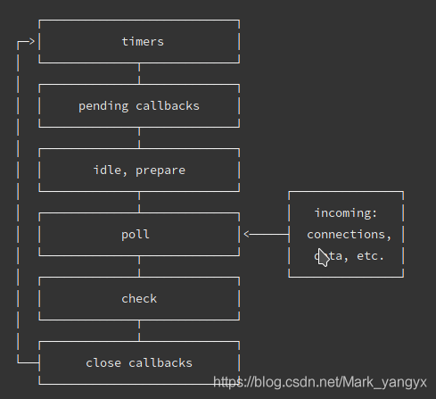
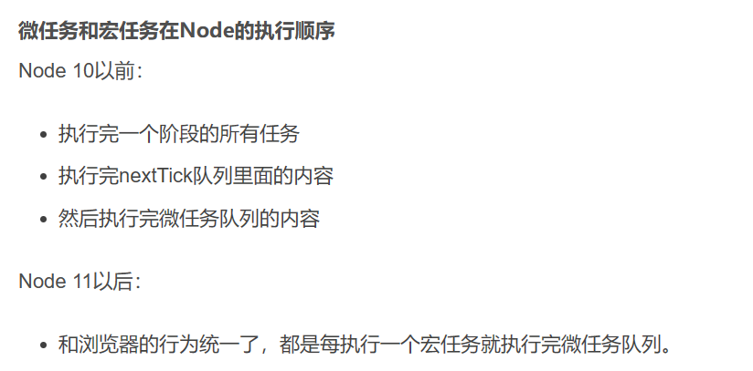

## nodejs为什么能处理多并发请求

nodejs是单线程的，但是它的执行不是阻塞的，node的I/O操作都是异步的，即发出IO操作的指令后，就可以继续执行，操作完成后执行对应回调。

Nodejs使用两种线程：由事件循环处理的主线程和工作线程池的几个辅助线程。

**事件循环**Node.js 处理非阻塞 I/O 操作的机制——尽管 JavaScript 是单线程处理的——当有可能的时候，它们会把操作转移到系统内核中去。当 JavaScript 操作阻塞线程时，事件循环也被阻塞。

**工作池**是一种执行模型，它产生和处理单独的线程，然后同步执行任务并将结果返回给事件循环。然后事件循环使用所述结果执行提供的回调。工作池是以libuv实现的。

- 虽然nodejs的I/O操作开启了多线程，但是所有线程都是基于node服务进程开启的，并不能充分利用cpu资源；
- pm2进程管理器可以解决这个问题，pm2 是一个带有负载均衡功能的Node应用的进程管理器.

### 参考资料

- [使用 Node.js 多线程进行并行处理 - 掘金 (juejin.cn)](https://juejin.cn/post/7075256441019465742)
- [使用 Node.js 多线程进行并行处理 - 掘金 (juejin.cn)](https://juejin.cn/post/7075256441019465742)


## 进程和线程

在Node.js中，可以使用cluster模块来**创建多个进程，从而实现多线程**。cluster模块允许您创建一个主进程和多个工作进程，每个工作进程都可以运行在一个单独的线程中。例如：

```javascript
const cluster = require('cluster');
const numCPUs = require('os').cpus().length;

if (cluster.isMaster) {
  // 主进程
  for (let i = 0; i < numCPUs; i++) {
    // 创建工作进程
    cluster.fork();
  }
} else {
  // 工作进程
  // 在这里启动服务器
}
```

在这个例子中，我们首先判断当前进程是否是主进程。如果是主进程，则使用cluster.fork方法来创建多个工作进程。如果不是主进程，则说明当前进程是一个工作进程，在这里可以启动服务器。

## 事件循环

nodejs中也有宏任务与微任务的区别，但是宏任务由多个队列组成

### 宏任务执行顺序





[浏览器和Node 事件循环的区别_node事件循环机制与浏览器的区别是什么-CSDN博客](https://blog.csdn.net/Mark_yangyx/article/details/103026712#:~:text=浏览器和Node 事件循环的区别 解题： 思路一： 其中一个主要的区别在于浏览器的event loop 和nodejs的event,loop 在处理异步事件的顺序是不同的%2Cnodejs中有micro event%3B其中Promise属于micro event 该异步事件的处理顺序就和浏览器不同.nodejs V11.0以上 这两者之间的顺序就相同了)