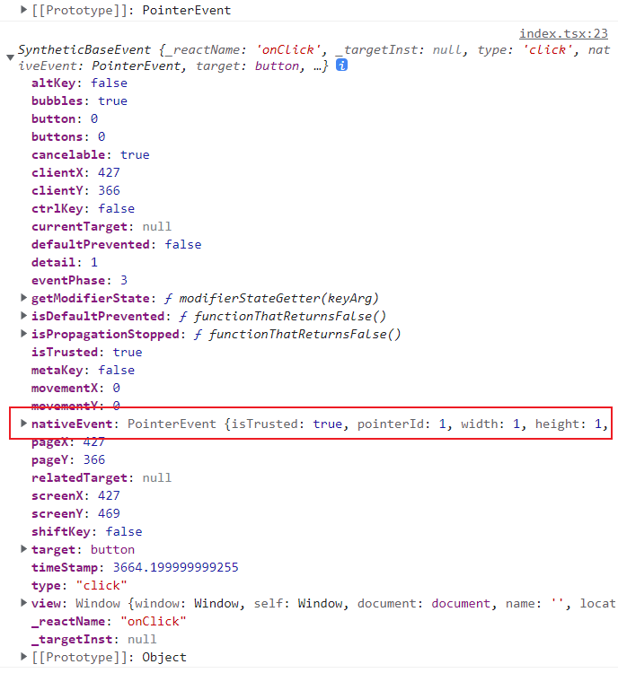
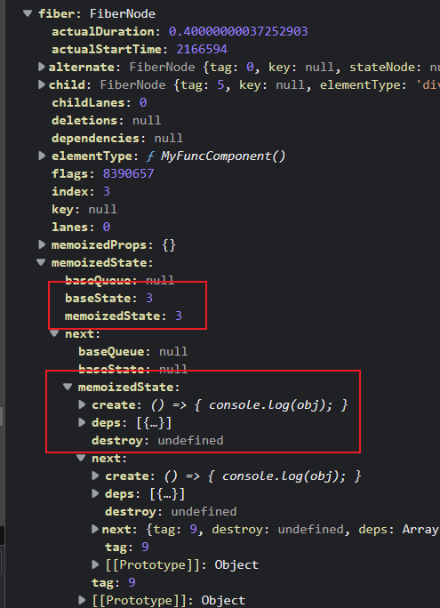
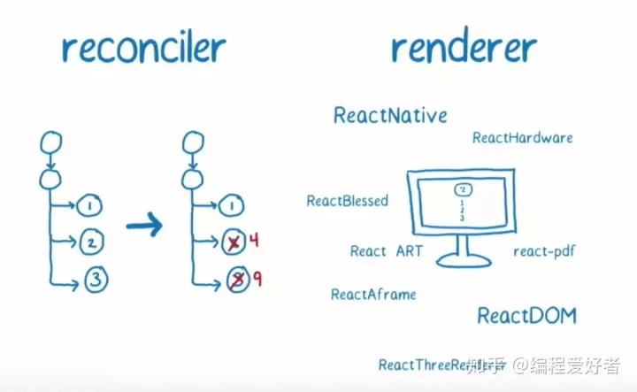
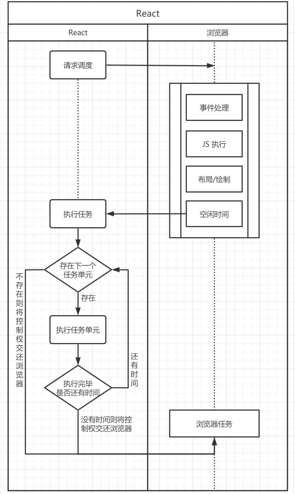

## React事件机制

### 参考资料

- [【React进阶系列】史上最全React事件机制详解 - 简书 (jianshu.com)](https://www.jianshu.com/p/41776f2f4d8b)
  文字有一个例子，很好地说明了React合成事件与原生事件。

### React有10个button，都去绑定click事件，为什么不能用事件委托

React的事件机制是基于Virtual DOM实现了一个SyntheticEvent（合成事件）层，这个层次的事件不会直接绑定到目标dom节点上，而是用事件委托机制，以队列的方式，从触发事件的组件向父组件回溯直到document节点。所以，React的事件委托是在document层面的，而不是在组件层面的。这样做的好处是可以提高性能，避免频繁的绑定和解绑事件。

那么，为什么不能用事件委托呢？其实，这里的不能用事件委托是指不能用组件层面的事件委托，也就是说，不能把10个button的click事件委托到它们的父组件上，而必须在每个button上单独绑定click事件。这是因为，React的自定义组件并不是一个真实的DOM元素，它不存在点击事件，它只是一个虚拟的组件，最终会被渲染成真实的DOM元素。所以，如果把click事件传给自定义组件，组件只会认为它是一个prop，而不会触发任何事件。**只有真实的DOM元素才能绑定和触发事件**。组件如果不声明`click` prop，无法添加属性。

### 合成事件

React通过提供合成事件来抹平不同浏览器事件对象之间的差异。合成事件是React封装的一套事件机制，它能够模拟原生事件并提供跨浏览器的一致性。

React还采用了顶层事件代理机制，能够保证冒泡一致性并跨浏览器执行。这意味着，无论您在哪个浏览器中使用React，都可以使用相同的事件处理程序代码，并期望它们以相同的方式工作。

React合成事件主要用于抹平不同浏览器之间的差异，它并不能直接用于小程序开发。如果您希望在小程序中使用React，可以考虑使用诸如Remax或Taro等框架，它们能够将React代码编译为小程序代码。

这些框架通常会提供自己的事件系统，用于在小程序中处理事件。

### 总结

原生事件上定义的捕获事件和响应事件都会先于React添加的事件执行，因为React添加的事件被代理到了document上，之后才能冒泡到document。因此React合成事件的`stopPropagation`无法阻止原生事件到达document的冒泡，注意这里说的是**无法阻止到达document之前**的冒泡，原生事件无法继续冒泡到window上。

React在执行事件队列时，会使用合成事件。合成事件保留了对原生事件的引用。在队列执行完毕后，合成事件对象的属性会全部设为null。



**考察点：**

这道面试题考察的关键是React的事件机制，包括以下几个方面：

- [React的事件是合成事件（SyntheticEvent），它是一个跨浏览器的事件包装器，它有着和浏览器的原生事件相同的接口，但是可以保证事件在所有浏览器中的一致性](https://blog.csdn.net/qq_27449993/article/details/107356392)[1](https://blog.csdn.net/qq_27449993/article/details/107356392)。
- [React的事件是委托到document层面的，而不是委托到组件层面的，所以不能把事件委托到自定义组件上，而必须在真实的DOM元素上绑定事件](https://zhuanlan.zhihu.com/p/399322564)[2](https://zhuanlan.zhihu.com/p/399322564)[3](https://www.jianshu.com/p/9ce5b647313f)。
- [React的事件是被池化的，这意味着SyntheticEvent对象会被重用，而且在事件回调函数被调用后，它的所有属性会被置空，这是出于性能的考虑，避免频繁地创建和销毁事件对象](https://blog.csdn.net/qq_27449993/article/details/107356392)[1](https://blog.csdn.net/qq_27449993/article/details/107356392)[4](https://juejin.cn/post/7091919870253760520)。
- [React的事件有一些语法差异，比如用驼峰命名法对事件命名，事件作为函数而不是字符串传递，事件对象作为最后一个参数传递等](https://www.jianshu.com/p/9ce5b647313f)[3](https://www.jianshu.com/p/9ce5b647313f)。

所以，这道面试题要求面试者对React的事件机制有一个深入的理解，能够解释清楚React的事件是如何工作的，以及为什么不能用组件层面的事件委托。

---

## 函数式编程

- [函数式编程是一种编程范式，它强调函数的纯粹性，即函数的输出只依赖于输入，而不依赖于外部的状态或副作用](https://www.zhihu.com/question/317497234)[1](https://www.zhihu.com/question/317497234)；
- [函数式编程的优点是可以提高代码的可读性，可维护性，可测试性，以及并发性](https://www.zhihu.com/question/317497234)[1](https://www.zhihu.com/question/317497234)；
- [函数式编程的核心概念包括高阶函数，闭包，柯里化，惰性求值，递归，不可变数据，函数组合，代数数据类型等](https://www.zhihu.com/question/317497234)[1](https://www.zhihu.com/question/317497234)；
- [平时实现函数式编程的方法有：使用纯函数，避免使用全局变量，避免使用循环，使用函数式编程的库（如lodash，ramda等），使用支持函数式编程的语言（如Haskell，Scala，Clojure等）等](https://www.zhihu.com/question/317497234)[1](https://www.zhihu.com/question/317497234)。

----

## React Hooks

**React Hooks是React 16.8新增的特性，它可以让你在不编写class的情况下使用state和其他的React特性**[1](https://reactjs.org/docs/hooks-intro.html)[。React Hooks的目的是让你更方便地使用函数组件，而不需要转换为类组件](https://blog.csdn.net/qq_50384924/article/details/119302468)[2](https://blog.csdn.net/qq_50384924/article/details/119302468)[。React Hooks还提供了一种新的强大的方式来组合props, state, context, refs, 和生命周期](https://reactjs.org/docs/hooks-intro.html)[1](https://reactjs.org/docs/hooks-intro.html)。

[React Hooks的基本用法是在函数组件中使用以use开头的React API，例如useState, useEffect, useContext等。这些API可以让你在函数组件中管理状态，执行副作用，访问上下文，创建引用等。React Hooks还可以自定义，以实现更复杂的逻辑和功能](https://juejin.cn/post/6844903957957967885)[3](https://juejin.cn/post/6844903957957967885)[4](https://zhuanlan.zhihu.com/p/85491343)。

### 原理

React Hooks原理是指React Hooks是如何实现的，以及它们是如何在函数组件中提供状态和其他特性的。React Hooks原理涉及到以下几个方面：

- [React Hooks是一些以use开头的函数，它们可以在函数组件中调用，返回一些值或者执行一些操作。React Hooks利用了闭包的特性，可以在函数组件的多次渲染中保持状态和引用](https://segmentfault.com/a/1190000040887783)[1](https://segmentfault.com/a/1190000040887783)。
- [React Hooks是通过一个链表来存储和管理的，每个Hook都有一个对应的节点，包含了Hook的类型，状态，引用，依赖等信息。React Hooks链表的第一个节点被关联到当前的Fiber节点，Fiber节点是React内部用来表示组件的数据结构](https://juejin.cn/post/6844903975838285838)[2](https://juejin.cn/post/6844903975838285838)[3](https://zhuanlan.zhihu.com/p/341167678)。
- [React Hooks的调用顺序和数量必须保持一致，否则会导致Hook节点和Fiber节点的不匹配，从而引发错误。React Hooks的调用顺序和数量是通过一个全局的指针来控制的，每次调用一个Hook，指针就会向后移动一个节点，每次渲染一个组件，指针就会重置到链表的头部](https://juejin.cn/post/6844903975838285838)[2](https://juejin.cn/post/6844903975838285838)[3](https://zhuanlan.zhihu.com/p/341167678)。
- [React Hooks的更新和副作用是通过调度器和调和器来处理的，调度器负责安排组件的更新优先级和时间，调和器负责执行组件的更新和副作用。React Hooks的更新和副作用会根据Hook的类型，状态，依赖等信息，来决定是否需要触发组件的重新渲染或者执行副作用函数](https://juejin.cn/post/6844903975838285838)[2](https://juejin.cn/post/6844903975838285838)[3](https://zhuanlan.zhihu.com/p/341167678)。

`hooks`是通过链表管理的，这个链表作为fiber节点的`memoizedState`属性值，在组件更新时，可以对新旧fiber上的hooks链表上的节点进行对比。



### useMemo和useCallback

当我们需要从一个状态计算出另一个状态，或者传递一个函数给子组件时，可以使用useMemo。useMemo返回一个被缓存的值，只有当useMemo的依赖项发送变化时，才会重新执行创建函数。为什么使用useMemo是因为组件每次更新时，都会执行render函数，会重新计算状态或者生成新的函数引用，进而触发字组件的更新。

[memoized值和memoized对象是指使用memoization技术缓存的函数的返回值和对象。memoization是一种优化技术，它可以通过在内存中存储函数的计算结果，来减少函数的时间开销，但是会增加空间开销](https://blog.csdn.net/ztf312/article/details/82823336)[1](https://blog.csdn.net/ztf312/article/details/82823336)[2](https://en.wikipedia.org/wiki/Memoization)[3](https://stackoverflow.com/questions/53285304/implementing-memoization-in-c-sharp)。也就是说，memoization可以让函数记住它之前的运行结果，当函数再次被调用时，如果输入参数没有变化就直接返回之前的结果，避免重复计算。例如：

```python
# 定义一个斐波那契数列的函数
def fib(n):
  if n < 2:
    return n
  else:
    return fib(n-1) + fib(n-2)

# 使用memoization技术优化函数
def memoize(f):
  memo = {} # 创建一个字典来存储函数的结果
  def helper(x):
    if x not in memo: # 如果输入参数不在字典中，就计算并存储结果
      memo[x] = f(x)
    return memo[x] # 如果输入参数在字典中，就直接返回结果
  return helper

# 使用memoize函数
fib = memoize(fib)

# 调用fib函数
print(fib(10)) # 输出55
```

当useEffect和useCallback组合使用时，可能会导致无限循环。

```js
import React, { useState, useEffect, useCallback } from 'react';

function App() {
  const [count, setCount] = useState(0);

  // 使用useCallback创建一个函数，返回一个新的对象
  const getObj = useCallback(() => {
    return { value: count };
  }, [count]); // 依赖于count的变化

  // 使用useEffect执行一个副作用操作，设置一个定时器
  useEffect(() => {
    const timer = setInterval(() => {
      console.log('useEffect执行了');
      setCount(count + 1); // 改变count的值
    }, 1000);
    return () => {
      clearInterval(timer); // 清除定时器
    };
  }, [getObj]); // 依赖于getObj的变化
  
  return (
    <div>
      <p>count: {count}</p>
    </div>
  );
}

export default App;
```

[useMemo的源码可以在GitHub上找到，这里是一个链接](https://github.com/frejs/fre)[1](https://github.com/frejs/fre)。useMemo的作用是记住一个函数的返回值，并返回一个缓存的值。useMemo有两个参数，第一个是一个函数，第二个是一个依赖数组。useMemo的源码大致如下：

```js
function useMemo(create, deps) {
  // 获取当前的hook
  const hook = mountWorkInProgressHook();
  // 获取下一次的依赖数组
  const nextDeps = deps;
  // 获取上一次的依赖数组和缓存值
  const prevState = hook.memoizedState;
  // 如果上一次的依赖数组存在，就比较是否有变化
  if (prevState !== null) {
    const prevDeps = prevState[1];
    if (areHookInputsEqual(nextDeps, prevDeps)) {
      // 如果没有变化，就直接返回上一次的缓存值
      return prevState[0];
    }
  }
  // 如果有变化，或者第一次执行，就调用函数并获取返回值
  const nextValue = create();
  // 将返回值和依赖数组保存在hook的memoizedState中
  hook.memoizedState = [nextValue, nextDeps];
  // 返回返回值
  return nextValue;
}
```

### useEffect和useLayoutEffect

[useEffect和useLayoutEffect是两种常用的React Hooks，它们都可以让你在函数组件中执行副作用，如操作DOM, 发送请求, 订阅事件等](https://blog.csdn.net/AHcola233/article/details/116716316)[1](https://blog.csdn.net/AHcola233/article/details/116716316)[2](https://blog.logrocket.com/useeffect-vs-uselayouteffect-examples/)[。它们的函数签名也是一样的，都接受一个回调函数和一个依赖数组](https://blog.csdn.net/AHcola233/article/details/116716316)[1](https://blog.csdn.net/AHcola233/article/details/116716316)[2](https://blog.logrocket.com/useeffect-vs-uselayouteffect-examples/)。

[它们的区别在于执行时机和影响](https://blog.csdn.net/AHcola233/article/details/116716316)[1](https://blog.csdn.net/AHcola233/article/details/116716316)[3](https://www.jianshu.com/p/412c874c5add)[2](https://blog.logrocket.com/useeffect-vs-uselayouteffect-examples/)[4](https://blog.csdn.net/yunfeihe233/article/details/106616674)[5](https://juejin.cn/post/6921688408737710087)：

- [useEffect是异步执行的，它会在组件渲染后呈现到屏幕上后再执行，不会阻塞DOM的更新](https://blog.csdn.net/AHcola233/article/details/116716316)[1](https://blog.csdn.net/AHcola233/article/details/116716316)[2](https://blog.logrocket.com/useeffect-vs-uselayouteffect-examples/)[4](https://blog.csdn.net/yunfeihe233/article/details/106616674)[。这样可以避免不必要的性能损耗，但也可能导致一些闪烁的问题，比如组件在很短的时间内渲染了两次](https://blog.csdn.net/AHcola233/article/details/116716316)[1](https://blog.csdn.net/AHcola233/article/details/116716316)[3](https://www.jianshu.com/p/412c874c5add)。
- [useLayoutEffect是同步执行的，它会在组件渲染后，但在浏览器进行任何绘制之前执行，会阻塞DOM的更新](https://blog.csdn.net/AHcola233/article/details/116716316)[1](https://blog.csdn.net/AHcola233/article/details/116716316)[2](https://blog.logrocket.com/useeffect-vs-uselayouteffect-examples/)[4](https://blog.csdn.net/yunfeihe233/article/details/106616674)[。这样可以避免一些闪烁的问题，比如在操作DOM时改变页面的样式](https://www.jianshu.com/p/412c874c5add)[3](https://www.jianshu.com/p/412c874c5add)[，但也可能导致一些性能损耗，比如阻塞了浏览器的绘制](https://blog.logrocket.com/useeffect-vs-uselayouteffect-examples/)[2](https://blog.logrocket.com/useeffect-vs-uselayouteffect-examples/)。

[一般来说，useEffect可以满足大部分的场景，只有在需要同步操作DOM或者避免闪烁的情况下，才需要使用useLayoutEffect](https://blog.csdn.net/AHcola233/article/details/116716316)[1](https://blog.csdn.net/AHcola233/article/details/116716316)[2](https://blog.logrocket.com/useeffect-vs-uselayouteffect-examples/)。

### useRef的用法

[`useRef` 是一个 React Hook，它返回一个可变的 ref 对象，该对象只有一个 `current` 属性，初始值为传入的参数。](https://blog.csdn.net/u011705725/article/details/115634265)[1](https://blog.csdn.net/u011705725/article/details/115634265)

```javascript
const refContainer = useRef(initialValue);
```

[`useRef` 可以用来获取 DOM 元素或者保存某些数据。](https://blog.csdn.net/qq_45677671/article/details/116707927)[2](https://blog.csdn.net/qq_45677671/article/details/116707927)[1](https://blog.csdn.net/u011705725/article/details/115634265)[ 它在渲染周期内永远不会变，因此可以用来引用某些数据。](https://blog.csdn.net/qq_45677671/article/details/116707927)[2](https://blog.csdn.net/qq_45677671/article/details/116707927)

---

### 为什么只能在顶层调用hooks

React 之所以不允许在条件式中使用 Hook，是因为 React 需要依靠 Hook 的调用顺序来确定每个 Hook 对应的状态。具体来说，React 需要根据 Hook 的调用顺序来为每个 Hook 分配一个唯一的编号，以此来跟踪每个 Hook 对应的状态。

---

## 如何理解redux的单向数据流

[Redux的单向数据流是指应用中所有的数据都遵循相同的生命周期，这样可以让应用变得更加可预测且容易理解](https://www.redux.org.cn/docs/basics/DataFlow.html)[1](https://www.redux.org.cn/docs/basics/DataFlow.html)[。Redux数据的生命周期遵循下面4个步骤](https://blog.csdn.net/YYece/article/details/102802903)[2](https://blog.csdn.net/YYece/article/details/102802903)：

1. 调用 store.dispatch (action) 发出一个 action，描述“发生了什么”。
2. Redux store 调用传入的 reducer 函数，根据当前的 state 树和 action 返回一个新的 state。
3. 根 reducer 把多个子 reducer 输出合并成一个单一的 state 树。
4. Redux store 保存了根 reducer 返回的完整 state 树，触发视图更新。

---

## 为什么使用JSX

JSX的全程是JavaScript XML，是对js基本语法的扩展，支持在js中使用类似xml的语法，主要用于创建react元素。

在不使用jsx的情况下，我们需要使用`React.createElment`函数创建`ReactElement`，但是如果组件结构比较复杂，创建过程将非常繁琐，例如我们一个简单的`div`包裹无序列表的组件，需要重复使用createElement创建`li`元素。基于jsx不需要引入额外的语法，引入模板语法会分离开发者的关注度，引入更多新的概念，而jsx基本上还是仅使用了JavaScript语法。

```js
"use strict";

function HelloWord() {
  return /*#__PURE__*/React.createElement("div", null, /*#__PURE__*/React.createElement("ul", null, /*#__PURE__*/React.createElement("li", null, "1"), /*#__PURE__*/React.createElement("li", null, "1"), /*#__PURE__*/React.createElement("li", null, "1"), /*#__PURE__*/React.createElement("li", null, "1"), /*#__PURE__*/React.createElement("li", null, "1")));
}
```

使用 [JSX](https://zh-hans.reactjs.org/docs/introducing-jsx.html) 编写的代码将会被转换成使用 `React.createElement()` 的形式。如果使用了 JSX 方式，那么一般来说就不需要直接调用 `React.createElement()`。

---

## react组件更新

当 React 组件更新时，它会重新执行渲染函数来生成新的虚拟 DOM 树。然后，React 会将新的虚拟 DOM 树与旧的虚拟 DOM 树进行比较，以确定需要更新哪些部分。这个过程称为“协调”。

在协调过程中，React 会更新 Fiber 树上的属性，并确定哪些组件需要更新。然后，React 会调用这些组件的生命周期方法或 Hooks 来执行更新。

### react更新优化

> react中父子组件都订阅了一个store中的值，且子组件又从父组件获取了一个依赖的变量，store中值改了会导致子组件先渲染，父组件后渲染，因为依赖子组件会再渲染一次的情况，这种情况其实react帮我们处理了

正常情况：子组件渲染 ---> 父组件渲染 ---> 子组件渲染

当父组件的状态发生变化时，React 会执行一次更新过程，计算出新的虚拟 DOM 树。在更新过程中，如果某个组件的 state 或 props 发生了变化，React 会根据新的数据重新渲染该组件。

**渲染是一个昂贵的操作**，因此 React 会尽可能地延迟更新过程，以减少不必要的计算。为了达到这个目的，React 采用了异步渲染机制。

在 React 中，当某个组件的 state 或 props 发生变化时，React 不会立即进行更新操作，**而是将更新放入一个队列中**（Fiber，调和阶段），等到所有的更新都放入队列之后，再统一进行更新操作。这样做的好处是可以避免不必要的计算，提高性能。

在上述情况中，子组件从父组件获取了一个依赖的变量，当这个变量发生变化时，子组件会重新渲染。但是，在父组件的更新操作还没有被执行之前，子组件已经进行了一次更新操作，导致父组件在更新时可能没有使用最新的数据进行计算。

为了解决这个问题，React 引入了“异步更新”的概念。在异步更新模式下，React 会将多次更新操作合并为一次更新操作，从而减少渲染次数，提高性能。

具体来说，在异步更新模式下，当组件进行更新操作时，React 会将更新放入一个队列中，等到所有的更新都放入队列之后，再统一进行更新操作。在更新操作被执行之前，React 会先进行“批量更新”的处理，将多次更新操作合并为一次更新操作。这样就能够保证所有的更新操作都使用了最新的数据进行计算，避免了上述问题的发生。

总的来说，React 的异步渲染机制和“批量更新”机制可以提高渲染性能，避免不必要的计算和渲染，同时还可以保证更新操作的正确性。

---

### react的fiber架构

**React 16 之前的不足：**

首先我们了解一下 React 的工作过程，当我们通过`render()`和 `setState()` 进行组件渲染和更新的时候，React 主要有两个阶段：



**调和阶段(Reconciler)：**官方解释。React 会自顶向下通过递归，遍历新数据生成新的 Virtual DOM**，然后通过 Diff 算法，找到需要变更的元素(Patch)**（如果树结构很多，将非常耗时），放到更新队列里面去。

**渲染阶段(Renderer)**：遍历更新队列，通过调用宿主环境的API，实际更新渲染对应元素。宿主环境，比如 DOM、Native、WebGL 等。

在调和阶段阶段，**由于是采用的递归的遍历方式**（同步代码），这种也被成为 **Stack Reconciler**，主要是为了区别 **Fiber Reconciler** 取的一个名字。这种方式有一个特点：一旦任务开始进行，就**无法中断**，那么 js 将一直占用主线程， 一直要等到整棵 Virtual DOM 树计算完成之后，才能把执行权交给渲染引擎，那么这就会导致一些用户交互、动画等任务无法立即得到处理，就会有卡顿，非常的影响用户体验。

整个组件树虚拟dom的生成以及查找需要变动的地方(diff)，当组件很复杂时这些操作需要耗费很多时间，由于js是单线程的，可能会导致页面卡顿，无法响应用户事件。因此出现了fiber架构，fiber架构需要能够中断执行，那么它必须能够记录当前遍历的上下文，因此fiber节点有三个指针，指向父节点，**下一个**兄弟节点，子节点。遍历顺序：1）如果存在子节点，先遍历子节点；2）不存在子节点，存在兄弟节点，生**成当前节点的虚拟DOM，遍历下一个兄弟节点**；3）不存在子节点，不存在下一个兄弟节点，**生成当前节点的虚拟DOM，遍历父节点**；4）当前节点的所有子节点生成完毕，**生成当前节点虚拟DOM，判断有无下一个兄弟节点**。重复执行上述操作，树的后序遍历，保证所有叶子节点的虚拟DOM最先被生成，通过setState已经更新了，此时只是生成新虚拟DOM，找出DOM的更新策略。

react fiber是通过`requestIdleCallback`这个api去控制的组件渲染的“进度条”。

`requesetIdleCallback`是一个属于宏任务的回调，就像setTimeout一样。不同的是，setTimeout的执行时机由我们传入的回调时间去控制，`requesetIdleCallback`会在**事件循环空闲时**调用回调函数。当在`callback`中递归调用`requesetIdleCallback`时，又会等到事件循环队列为空时才执行回调。让用户的事件得到响应。

它的回调函数可以获取本次可以执行的时间，每一个16ms除了`requesetIdleCallback`的回调之外，**还有其他工作，所以能使用的时间是不确定的**，但只要时间到了，就会停下节点的遍历。

`requestIdleCallback`的回调函数可以通过传入的参数`deadLine.timeRemaining()`检查当下还有多少时间供自己使用。（但由于兼容性不好，加上该回调函数被调用的频率太低，react实际使用的是一个polyfill(自己实现的api)，而不是requestIdleCallback。）

**总结：**

react因为先天的不足——无法精确更新，所以需要react fiber把**组件渲染**工作切片；而vue基于数据劫持，更新粒度很小，没有这个压力；

React Fiber是React 16提出的一种更新机制，**使用链表取代了树**，**将虚拟dom连接**，**使得组件更新的流程可以被中断恢复**；它把组件渲染的工作分片，到时会主动让出渲染主线程。

react fiber这种数据结构使得节点可以回溯到其父节点，**只要保留下中断的节点索引**，就可以恢复之前的工作进度；

```js
const workLoop = (deadLine) => {
    let shouldYield = false;// 是否该让出线程
    while(!shouldYield){
        console.log('working')
        //遍历节点等工作
      	// *****
      	// 遍历结束，判断是否应该
        shouldYield = deadLine.timeRemaining()<1;
    }
    requestIdleCallback(workLoop)
}
requestIdleCallback(workLoop);
```

Fiber 的主要工作流程：

- `ReactDOM.render()` 引导 React 启动或调用 `setState()` 的时候开始创建或更新 Fiber 树。
- 从根节点开始遍历 Fiber Node Tree， 并且构建 WokeInProgress Tree（reconciliation 阶段）。 
  - 本阶段可以暂停、终止、和重启，会导致 react 相关生命周期重复执行。
  - React 会生成两棵树，一棵是代表当前状态的 current tree，一棵是待更新的 workInProgress tree。
  - 遍历 current tree，重用或更新 Fiber Node 到 workInProgress tree，workInProgress tree 完成后会替换 current tree。
  - 每更新一个节点，同时生成该节点对应的 Effect List。
  - 为每个节点创建更新任务。
- 将创建的更新任务加入任务队列，等待调度。 
  - 调度由 scheduler 模块完成，其核心职责是执行回调。
  - scheduler 模块实现了跨平台兼容的 requestIdleCallback。
  - 每处理完一个 Fiber Node 的更新，可以中断、挂起，或恢复。
- 根据 Effect List 更新 DOM （commit 阶段）。 
  - React 会遍历 Effect List 将所有变更一次性更新到 DOM 上。
  - 这一阶段的工作会导致用户可见的变化。因此该过程不可中断，必须一直执行直到更新完成。

React 调度流程图：




---

## jsx的转换流程

jsx在编译阶段被babel编译成`React.createElement`函数，执行该函数会生成ReactElement对象。

`createFiberFromElement`函数接收`ReactElement`作为输入并创建Fiber对象。

在函数组件第一次渲染时，会创建该组件的Fiber对象，hooks信息以数组的形式保存在该对象上。

需要注意的是，**函数组件被编译成的 JavaScript 代码并不是精确地返回一个 React.createElement 函数的调用结果**。实际上，React 会将这个调用结果包装在一个包含组件状态和生命周期等信息的对象中，这个对象被称为 Fiber 节点。在组件更新时，React 会更新这个 Fiber 节点并根据它来更新组件的 UI。

fiber是任务调度方面的架构，与hooks并没有直接的联系，以前是vnode到dom，现在是vnode->fiber->dom。

---

**为什么vue不需要fiber架构？**

react知道哪个组件触发了更新，但是不知道哪些子组件会受到影响。因此react需要生成改组件下的所有虚拟DOM结构，与原本的虚拟DOM结构进行对比，找出变动的部分。

在vue中，一切影响页面内容的数据都应该是响应式的，vue通过拦截响应式数据的修改，知道哪些组件应该被修改。不需要遍历所有子树。vue的diff算法是对组件内部的diff，如果存在子组件，会判断子组件上与渲染相关的属性是否发生变化，无需变化的化则复用原本的DOM，不会处理子组件。

**模板语法**让vue能够进行更好的编译时优化，提高diff过程的效率，react缺少这部分。

- [前端大佬谈 React Fiber 架构 - 知乎 (zhihu.com)](https://zhuanlan.zhihu.com/p/137234573#:~:text=React 在 render 第一次渲染时，会通过 React.createElement 创建一颗 Element 树，可以称之为,会对应一个 Fiber Node，将 Fiber Node 链接起来的结构成为 Fiber Tree。)
- [(104条消息) React的调和过程(Reconciliation)_react 调和_起晚的蜗牛的博客-CSDN博客](https://blog.csdn.net/hupian1989/article/details/102617165)
- [React Fiber 的作用和原理](https://cloud.tencent.com/developer/article/1882296)

---

## 调用`setState`发生了什么

在 React 组件中调用 `setState()` 方法会触发组件重新渲染，React 会**创建一个新的 Fiber 节点**来代表该组件的新状态，并**将该节点加入到更新队列**中。**更新队列是一个链表结构**，其中每个节点代表一个待更新的组件，**按照优先级**从高到低排序。

### 同步和异步的问题

在 React 中，setState 方法是异步更新组件状态的。这意味着，调用 setState 方法不会立即更新组件的状态，而是将新状态添加到更新队列中，等待 React 下一次更新时才会真正地更新组件的状态。

`setState` 的“异步”并不是说内部由异步代码实现，其实本身执行的过程和代码都是同步的，只是合成事件和钩子函数的**调用顺序**在**更新之前**，导致在合成事件和钩子函数中没法立马拿到更新后的值，形成了所谓的“异步”，当然可以通过第二个参数`setState(partialState, callback)`中的`callback`拿到更新后的结果。`setState`将更新操作添加到任务队列中，而合成事件和钩子函数的执行在任务队列执行之前。也就是说有多个`setState`的话，他们都会添加到任务队列中，因此就会发生状态合并。执行完`setState`，`react`的调度器会执行`requestIdleCallback`等待合适时机执行。

如果`setState`是在React合成事件或生命周期函数中调用，**那么React会判断是否处于批量更新模式**，如果是，则会将该`setState`操作放入更新队列中，等待后续统一处理；如果不是，则直接进行同步更新。

如果`setState`是在原生事件或`setTimeout`等异步回调中调用，React会直接进行同步更新。这是因为React无法确定异步事件的触发时机，所以为了确保更新能够立即生效，只能同步执行`setState`。（在实际调试过程中，不是这样的，原生事件中也是进行异步更新）。

- [setState是同步还是异步？原理是什么？ - 掘金 (juejin.cn)](https://juejin.cn/post/7066423854259765279)

---

### 批量更新模式

在`react`生命周期和合成事件执行前后都有相应的钩子，分别是`pre`钩子和`post`钩子

- `pre`钩子会调用`batchedUpdate`方法将`isBatchingUpdates`变量置为`true`，也就是将状态标记为现在正处于更新阶段了。开启批量更新。

`setState`的更新会被存入队列中，待同步代码执行完后，再执行队列中的`state`更新。 `isBatchingUpdates`若为 `true`，则把当前组件（即调用了 `setState`的组件）放入 `dirtyComponents` 数组中；否则 `batchUpdate` 所有队列中的更新

- 而`post`钩子会将`isBatchingUpdates`置为`false`。

---

### 与Vue3 nextTick的对比

在vue中，假如我们修改响应式变量后，想拿到更新之后的DOM，需要在状态修改后使用`nextTick`，而不能是修改前。因为响应式变量的`set`方法中会创建一个新的任务进行DOM更新（不是渲染，渲染是由浏览器执行的，我们只需要拿到更新后的DOM，不必等到浏览器渲染），而`nextTick`之后也会创建一个任务，由于任务进入队列的顺序不同，当执行到`nextTick`时，DOM更新的任务已经完成了，所有可以拿到更新后的DOM。

而在`React`中，我们之前讨论的其实是更新后的**状态**，他的状态是异步更新的，而在vue中，状态一直是同步更新的，DOM更新才是异步 的，状态在VDom上合并。`setState`的异步与vue 响应式变量更新导致的DOM更新的异步实现方法大体是相同的，如果是第一次执行，则创建一个微任务，**并添加任务开始标记**，之后的`setState`或响应式变量修改就无需创建新的微任务了，而是把要做的工作添加到队列中，这个微任务在执行时会遍历队列中的所有工作并执行。	在`React`还有一个批量更新模式决定是否要启用异步更新。

---

### 调试分析

**类组件**：

```tsx
import * as React from "react";

class App extends React.Component {
  btnRef: React.RefObject<HTMLButtonElement>;
  state: Readonly<{ data: string }>
  constructor(props: any) {
    super(props);
    this.handleSetState = this.handleSetState.bind(this);
    this.state = { data: 'hello' }
    this.btnRef = React.createRef();
  }

  componentDidMount(): void {
    const cThis = this;
    this.btnRef.current?.addEventListener('mouseup', function (e) {
      console.log(e);
      debugger
      cThis.setState({ ...cThis.state, data: 'hello world ' });
      cThis.setState({ ...cThis.state, data: 'hello world 2' });
      debugger
      console.log('原生事件', cThis.state);
    })
    // 原生事件执行了两次, 为什么？！第一次输出更新前状态，第二次输出更新后状态
  }

  handleSetState(e: React.MouseEvent) {
    console.log(e, this);
    // this.setState({ ...this.state, data: 'hello world' });
    // console.log('合成事件', this.state);
    // 只有原生事件的前提下，此时输出的state没有更新
  }

  render(): React.ReactNode {
    return (
      <div>
        Hello World
        <button ref={this.btnRef} onClick={this.handleSetState}>setState</button>
        <div>
          {this.state.data}
        </div>
      </div>
    )
  }
}

export default App
```

`setState`似乎永远是异步更新的：

```ts
Component.prototype.setState = function (partialState, callback) {
  if (typeof partialState !== 'object' && typeof partialState !== 'function' && partialState != null) {
    throw new Error('setState(...): takes an object of state variables to update or a ' + 'function which returns an object of state variables.');
  }

  this.updater.enqueueSetState(this, partialState, callback, 'setState');
};
```

`callback`是`setState`的第二个参数，在这个回调中可以拿到更新后的`state`。

```ts
var classComponentUpdater = {
  isMounted: isMounted,
  enqueueSetState: function (inst, payload, callback) {
    var fiber = get(inst);
    var eventTime = requestEventTime();
    var lane = requestUpdateLane(fiber);
    var update = createUpdate(eventTime, lane);
    update.payload = payload;

    if (callback !== undefined && callback !== null) {
      {
        warnOnInvalidCallback(callback, 'setState');
      }

      update.callback = callback;
    }

    var root = enqueueUpdate(fiber, update, lane);

    if (root !== null) {
      scheduleUpdateOnFiber(root, fiber, lane, eventTime);
      entangleTransitions(root, fiber, lane);
    }

    {
      markStateUpdateScheduled(fiber, lane);
    }
  },
```

当我们使用`setState`时：

- 获取当前节点的fiber对象：`var fiber = get(inst)`，（`inst`是当前组件实例），`lane`表示更新优先级；

- 生成一个更新任务（` var update = createUpdate(eventTime, lane)`），

**函数组件**

```tsx
function MyFuncComponent() {
  const [count, setCount] = React.useState(0);
  return (
    <div>
      <h1>函数组件</h1>
      <div>
        {count}
      </div>
      <div>
        <button onClick={() => {
          debugger
          setCount(count + 1)
        }}>more</button>
        <button onClick={() => {
          debugger
          setCount(count - 1)
        }
        }>less</button>
      </div>
    </div >
  )
}
```

函数组件与类组件最大的区别就是没有组件实例对象，类组件的`setState`方法可以直接拿到组件实例对象，然后拿到对应的`fiber`对象。函数组件通过`ReactCurrentDispatcher.current`拿到`dispatcher`对象（`dispatcher`对象上有所有React定义的`hooks`函数）。

> 在 React 内部，每个函数组件实际上对应着一个 Fiber 对象，而该 Fiber 对象内部有一个指向 dispatcher 的指针。
>
> dispatcher 是 React 的内部管理工具，它用于管理函数组件的 Hooks 队列，并执行更新操作。每次使用 `useState`、`useEffect` 等 Hooks 时，都会使用 dispatcher 来管理对应的状态和副作用。
>
> 在使用 `useState` 时，函数组件会调用 React 内部的 `useState` 函数，该函数会从当前 Fiber 对象中获取 dispatcher 指针，并创建一个新的状态值和对应的更新函数。当我们调用更新函数时，它会将对应的更新操作添加到 dispatcher 管理的 Hooks 队列中，并通知 React 进行更新。
>
> ReactCurrentDispatcher.current 是当前正在执行的组件的 dispatcher。它是一个全局变量，但是不是全局唯一的。每个渲染器在执行时都会创建自己的 ReactCurrentDispatcher 实例。不同渲染器之间是相互独立的，它们拥有自己的 ReactCurrentDispatcher 实例。因此，在多个渲染器同时存在的情况下，不同的渲染器可以同时使用不同的 dispatcher。
>
> 组件更新时不会创建新的 dispatcher。在函数组件的每次更新中，使用同一个 dispatcher 对应着同一个组件实例的更新。当一个函数组件在更新时，React 会创建一个新的更新对象并将其添加到该组件的更新队列中，**使用同一个 dispatcher 对应的还是同一个组件实例，只是更新对象不同**。当更新被处理时，React 会使用当前的 dispatcher 处理该组件的更新。
>
> **在更新过程中**，React 会创建新的 Fiber 对象来表示组件的更新状态，并通过之前 Fiber 对象中的指针来获取对应组件实例的 Dispatcher。然后再使用该 Dispatcher 来进行 hooks 状态的更新操作。
>
> 所以说，Dispatcher 和 Fiber 是相互依赖的，Dispatcher 依赖于 Fiber 来获取组件实例，而 Fiber 依赖于 Dispatcher 来更新 hooks 相关状态。

fiber对应的是一个更新任务，而dispatcher管理这些更新任务，并进行对比。

React组件更新的触发条件是使用`setState`或`useState`返回的`set`函数，即只有状态发生变化才会触发组件更新。

```ts
function useState(initialState) {
  var dispatcher = resolveDispatcher();
  return dispatcher.useState(initialState);
}

function useEffect(create, deps) {
  var dispatcher = resolveDispatcher();
  return dispatcher.useEffect(create, deps);
}

function useCallback(callback, deps) {
  var dispatcher = resolveDispatcher();
  return dispatcher.useCallback(callback, deps);
}

// ..... 其他所有的hooks函数

/**
 * Keeps track of the current dispatcher.
 */
var ReactCurrentDispatcher = {
  /**
   * @internal
   * @type {ReactComponent}
   */
  current: null
};

function resolveDispatcher() {
  var dispatcher = ReactCurrentDispatcher.current;

  {
    if (dispatcher === null) {
      error('******');
    }
  } // Will result in a null access error if accessed outside render phase. We
  // intentionally don't throw our own error because this is in a hot path.
  // Also helps ensure this is inlined.
  // 需要在render内部调用
  // 可能在render函数内会创建一个全局的ReactCurrentDispatcher

  return dispatcher;
}
```

在上述代码中，可以看到当我们调用`hooks`函数，首先需要获取当前的`dispatcher`，然后通过`dispatcher`执行`hooks`函数。由于`hooks`是需要绑定到当前组件的`fiber`对象上的，我们有理由相信`dispathcer`维持了对当前组件`fiber`对象的引用，并将这个`hook`添加到`fiber`对象的`memoizedState`链表上。

### 函数组件渲染和useState

在渲染子组件前，React做了这些操作：

```ts
function renderWithHooks(current, workInProgress, Component, props, secondArg, nextRenderLanes) {
  renderLanes = nextRenderLanes;
  currentlyRenderingFiber$1 = workInProgress;

  {
    hookTypesDev = current !== null ? current._debugHookTypes : null;
    hookTypesUpdateIndexDev = -1; // Used for hot reloading:

    ignorePreviousDependencies = current !== null && current.type !== workInProgress.type;
  }

  workInProgress.memoizedState = null;
  workInProgress.updateQueue = null;
  workInProgress.lanes = NoLanes; // The following should have already been reset
  // currentHook = null;
  // workInProgressHook = null;
  // didScheduleRenderPhaseUpdate = false;
  // localIdCounter = 0;
  // TODO Warn if no hooks are used at all during mount, then some are used during update.
  // Currently we will identify the update render as a mount because memoizedState === null.
  // This is tricky because it's valid for certain types of components (e.g. React.lazy)
  // Using memoizedState to differentiate between mount/update only works if at least one stateful hook is used.
  // Non-stateful hooks (e.g. context) don't get added to memoizedState,
  // so memoizedState would be null during updates and mounts.

  {
    if (current !== null && current.memoizedState !== null) {
      ReactCurrentDispatcher$1.current = HooksDispatcherOnUpdateInDEV;
    } else if (hookTypesDev !== null) {
      // This dispatcher handles an edge case where a component is updating,
      // but no stateful hooks have been used.
      // We want to match the production code behavior (which will use HooksDispatcherOnMount),
      // but with the extra DEV validation to ensure hooks ordering hasn't changed.
      // This dispatcher does that.
      ReactCurrentDispatcher$1.current = HooksDispatcherOnMountWithHookTypesInDEV;
    } else {
      ReactCurrentDispatcher$1.current = HooksDispatcherOnMountInDEV;
    }
  }

  var children = Component(props, secondArg); // Check if there was a render phase update
```

`Component`就是我们的组件函数。

`currentlyRenderingFiber$1 = workInProgress;`将`currentlyRenderingFiber$1`执行当前fiber。然后初始化当前fiber的一些属性。

由于`currentlyRenderingFiber$1`是全局的，接下来我们执行组件的渲染函数时，如果遇到`hooks`函数，就可以拿到当前组件的fiber对象。

> 在 React 中，双缓存机制是通过使用双缓存 Fiber 树来实现的。在组件更新过程中，React 会创建两个 Fiber 树，一个用于当前更新，另一个用于下一次更新。在当前更新过程中，React 使用 `ReactCurrentDispatcher$1` 来获取之前的 dispatcher。

`react-dom.devlopment.js`和`react.development.js`中都有`ReactCurrentDispatcher$1`和`ReactCurrentDispatcher`。

最终需要在`react-dom.devlopment.js`中执行hook（Dispatcher对象是在这个文件中定义的），但是是通过`react.development.js`中的`dispatcher`调用的，也就是说下面代码中的`this`指向需要发送改变。

```ts
	useState: function (initialState) {
      currentHookNameInDev = 'useState';
      mountHookTypesDev();
      var prevDispatcher = ReactCurrentDispatcher$1.current;
      ReactCurrentDispatcher$1.current = InvalidNestedHooksDispatcherOnMountInDEV;

      try {
        return mountState(initialState);
      } finally {
        ReactCurrentDispatcher$1.current = prevDispatcher;
      }
    },
```

```ts
function mountState(initialState) {
  var hook = mountWorkInProgressHook();

  if (typeof initialState === 'function') {
    // $FlowFixMe: Flow doesn't like mixed types
    initialState = initialState();
  }

  hook.memoizedState = hook.baseState = initialState;
  var queue = {
    pending: null,
    interleaved: null,
    lanes: NoLanes,
    dispatch: null,
    lastRenderedReducer: basicStateReducer,
    lastRenderedState: initialState
  };
  hook.queue = queue;
  var dispatch = queue.dispatch = dispatchSetState.bind(null, currentlyRenderingFiber$1, queue);
  return [hook.memoizedState, dispatch];
}
```

返回了一个`dispatch`函数，绑定当前fiber和hook队列。`queue` 是 `useState` Hook 中用于实现异步更新的重要数据结构，其作用是保存 state 更新队列，并在组件更新时根据更新情况进行状态的更新。

## redux

reudx的 初始状态是第一次调用合并后的reducer，并传入undefined参数得到的！（不会命中任何action，返回初始状态。我们在使用createStore时只需要传入combine后的reducer也是这个原因）；

---

## 高阶组件

### 为什么使用高阶组件

高阶组件（HOC）是一种用于复用组件逻辑的高级技巧。它不是React API的一部分，而是一种基于React的组合特性而形成的设计模式。

高阶组件的主要优点是它能够在不修改现有组件代码的情况下，对其进行扩展和复用。这可以帮助我们避免重复编写相同的逻辑代码，从而提高代码的可维护性和可读性。

例如，假设我们有多个组件需要跟踪鼠标位置。我们可以创建一个名为`withMouse`的高阶组件，它接受一个组件作为参数，并返回一个新的组件，该组件能够跟踪鼠标位置并将其作为prop传递给被包装的组件。这样，我们就可以轻松地在多个组件之间复用鼠标跟踪逻辑，而无需在每个组件中重复编写相同的代码。

### ref

在React中，ref不是prop属性。就像key一样，它被React进行了特殊处理。如果你对HOC添加ref，该ref将引用最外层的容器组件，而不是被包裹的组件。

下面是一个使用`React.forwardRef`的例子：

```javascript
import React from 'react';

const FancyButton = React.forwardRef((props, ref) => (
  <button ref={ref} className="FancyButton">
    {props.children}
  </button>
));

// 你现在可以直接获取DOM button的ref：
const ref = React.createRef();
<FancyButton ref={ref}>Click me!</FancyButton>;
```

ref只是被转发到了内部DOM上，函数组件还是没有实例。

### withRouter

withRouter高阶组件的原理是它会返回一个新的组件，该组件会将被包装的组件包裹在一个Route组件中。这样，当我们渲染被包装的组件时，它将能够访问路由相关的props。

withRouter高阶组件并不会将函数组件转换为类组件。它只是返回一个新的函数组件，该组件会渲染一个Route组件，并将被包装的组件作为其子组件。

下面是一个简化版的withRouter高阶组件的实现：

```js
import React from 'react';
import { Route } from 'react-router-dom';

function withRouter(Component) {
  function WithRouter(props) {
    return (
      <Route
        render={routeProps => <Component {...props} {...routeProps} />}
      />
    );
  }

  return WithRouter;
}
```

在上面的示例中，我们定义了一个名为withRouter的高阶组件。它接受一个组件作为参数，并返回一个新的函数组件。该函数组件会渲染一个Route组件，并将被包装的组件作为其子组件。这样，当我们渲染被包装的组件时，它将能够访问路由相关的props。

## Suspense组件

[react 原理分析 - Suspense 是如何工作的？ - 掘金 (juejin.cn)](https://juejin.cn/post/7145450651383201822)

lazy是React中的一个函数，它允许你渲染一个动态导入的组件。

由于 Lazy 往往是从远程加载，在加载完成之前 react 并不知道该如何渲染该组件。此时如果不显示任何内容，则会造成不好的用户体验。因此 Suspense 还有一个强制的参数为 fallback，表示 Lazy 组件加载的过程中应该显示什么内容。往往 fallback 会使用一个加载动画。当加载完成后，Suspense 就会将 fallback 切换为 Lazy 组件的内容。

1. 当 react 在 beginWork 的过程中遇到一个 Suspense 组件时，会首先将 primary 组件作为其子节点，根据 react 的遍历算法，下一个遍历的组件就是**未加载完成**的 primary 组件。

2. 当遍历到 primary 组件时，primary 组件会抛出一个异常。该异常内容为**组件 promise**，react 捕获到异常后，发现其是一个 promise，会将其 then 方法添加一个**回调函数，该回调函数的作用是触发 Suspense 组件的更新**。并且将**下一个需要遍历的元素重新设置为 Suspense**，因此在一次 beginWork 中，Suspense 会被访问两次。

3. 又一次遍历到 Suspense，本次会将 primary 以及 fallback 都生成，并且关系如下:

    Suspense 会在 beginWork 阶段直接**返回 fallback**。使得直接跳过 primary 的遍历。因此此时 primary 必定没有加载完成，所以也没必要再遍历一次。本次渲染结束后，屏幕上会展示 fallback 的内容

4. 当 primary 组件加载完成后，会触发步骤 2 中 then，使得在 Suspense 上调度一个更新，由于此时加载已经完成，Suspense 会直接渲染加载完成的 primary 组件，并删除 fallback 组件。

这 4 个步骤看起来还是比较复杂。**相对于普通的组件主要有两个不同的流程:**

1. primary 会组件抛出异常，react 捕获异常后继续 beginWork 阶段。
2. 整个 beginWork 节点，Suspense 会被访问两次

不过基本逻辑还是比较简单，即是:

1. 抛出异常
2. react 捕获，添加回调
3. 展示 fallback
4. 加载完成，执行回调
5. 展示加载完成后的组件

整个 beginWork 遍历顺序为:

```js
 Suspense -> primary -> Suspense -> fallback
```

### 实现loading 的其他方式

- 切换路由时，如果目标路由的loader函数没有执行完毕，可以使用`navigation.location`判断当前有没有路由在被加载；
- 进入组件后，再执行异步请求，执行异步操作时显示loading；
