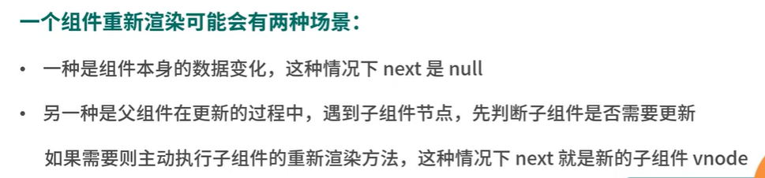

## 关于`$nextTick`

[事件循环](https://weijl.top/#/blog/前端/事件循环与nextTick.md/.%2Fassets%2Fblogs%2FBrowserSide%2F事件循环与nextTick.md)

[面试官：Vue中的$nextTick有什么作用？ | web前端面试 - 面试官系列 (vue3js.cn)](https://vue3js.cn/interview/vue/nexttick.html#三、实现原理)

https://vue3js.cn/interview/vue

[你真的理解$nextTick么 - 掘金 (juejin.cn)](https://juejin.cn/post/6844903843197616136)

[神奇的nextTick一定能获取到最新的dom么？ - 掘金 (juejin.cn)](https://juejin.cn/post/7166517557124415518)

### 返回值

[下列关于Vue的描述错误的是（ ）__牛客网 (nowcoder.com)](https://www.nowcoder.com/questionTerminal/070dbd360a1c4fc9826363f698f03b52)

- ```
  $nextTick()返回一个Promise对象
  ```

- ```
  $nextTick()可以配合async/await使用
  ```

### 事件循环与更新

GUI渲染引擎

JS引擎 -> 事件循环

[(137条消息) 微任务，宏任务，DOM渲染的执行顺序_yolanda__xiaoxiao的博客-CSDN博客_异步宏任务在dom渲染后出发么](https://blog.csdn.net/weixin_44138611/article/details/112464382)


##### 宏任务和微任务的执行顺序

在Call Stack中不仅会形成宏任务队列，还会形成微任务队列，在每一次Call Stack清空后都需要将微任务队列清空（全部执行）。

**执行顺序**

Call Stack清空
执行当前的微任务
尝试DOM渲染
触发Event Loop
**微任务和宏任务的区别**
宏任务：DOM渲染后触发，由浏览器规定（Web APIs）
微任务：DOM渲染前执行，微任务是ES6语法规定
**event loop和Dom渲染**
每次Call Stack清空(即每次轮询结束)，即同步任务执行完
都是Dom重写渲染的机会，Dom结构如有改变则重新渲染
然后再去触发下一次Event Loop

`nextTick`的官方定义：

> 在下次 DOM 更新循环结束之后执行延迟回调。在修改数据之后立即使用这个方法，获取更新后的 DOM

- 状态更新是一个微任务；

- nextTick也是微任务；

- 先写状态更新，再写nextTick回调；

- 状态更新会先创建一个微任务，并且代码块中的所有状态变化会集中到这个微任务进行，**状态改变触发了DOM更新**，创建了一个宏任务。

- 界面更新宏任务结束后，立即调用nextTick微任务。


并不用等待GUI更新，而是DOM元素内容更新后，就可以拿到更改的数据。

---

## vue3对比vue2生命周期

1、去掉了`beforeCreate`、`created`，直接使用setup

2、`beforeDestroy`、`destroyed` 被替换为了`onBeforeUnmount`、`onUnmounted`

另：新增了开发模式下： `onRenderTracked`（组件渲染过程中追踪到响应式依赖时调用）、 `onRenderTriggered`（响应式依赖的变更触发了组件渲染时调用）

---

## 父子组件生成和更新顺序

### 生成

父组件beforeCreate --> 父组件created --> 父组件beforeMount  --> 子组件beforeCreate --> 子组件created --> 子组件beforeMount  -->  子组件 mounted  --> 父组件mounted

父组件挂载前，进行子组件的创建；组件挂载后，进行父组件挂载。

创建（created）从外到内；

挂载（mounted）从内到外；

触发更新（before update）从外到内；

完成更新（update）从内到外；

before销毁（before destory）从外到内；

完成销毁（destory）从内到外；

更新与销毁的顺序一致。

**原因：**

---

## vue和react更新粒度

- [为什么说 Vue 的响应式更新精确到组件级别？（原理深度解析） - 掘金 (juejin.cn)](https://juejin.cn/post/6844904113432444942)

---

## 权限管理

权限管理可分为页面权限和按钮权限。

页面权限实现主要基于路由进行，路由列表有后端返回，前端接收到数据将路由添加到路由规则中。以及路由守卫，再次保证用户权限。

---

## 说一说服务端渲染

传统的基于React或Vue框架生产的应用，组件模板解析为DOM元素的操作是在客户端进行的，如果客户端性能不好，可能会耗费比较多的时间进行解析。

这种方式有利于SEO，爬虫可以看到完整的页面，提高页面的加载速度，减少首页白屏问题。

客户端渲染(CSR),也就是常见的单页面应用(SPA),由服务器端返回的初始 HTML 页面，**由 JS 去异步加载数据**，完成页面的渲染。由于ajax请求是异步的，百度Google等搜索引擎抓取的页面是几乎空白的，因为组件需要执行js区获取数据，对组件模板进行解析。初始的html文件一般只包含一个id为app的节点。

服务端渲染将模板解析放在服务端进行，将解析完成后的HTML字符串返回给客户端，浏览器将其显示出来。但是事件绑定的相关操作仍然在客户端进行。

在开发环境中，服务端代码与前端端代码需要在一个项目中，因为前端代码也需要访问那些SSR组件。[服务端渲染 (SSR) | Vue.js (vuejs.org)](https://cn.vuejs.org/guide/scaling-up/ssr.html#code-structure)。

应该避免在 `setup()` 或者 `<script setup>` 的根作用域中使用会产生副作用且需要被清理的代码。这类副作用的常见例子是使用 `setInterval` 设置定时器。我们可能会在客户端特有的代码中设置定时器，然后在 `onBeforeUnmount` 或 `onUnmounted` 中清除。然而，由于 **unmount 钩子不会在 SSR 期间被调用**，所以定时器会永远存在。为了避免这种情况，请将含有副作用的代码放到 `onMounted` 中。

---

## 插件和混入

vue-router是vue中的常用插件；插件是一种能为Vue添加全局功能的工具代码；插件需要提供一个install函数，该函数接收一个Vue应用实例参数app，然后调用app上的方法，对app添加全局功能；主要的方法有`component`用于注册全局组件，`provide`用于注入全局资源，通过给`config.globalProperties`添加全局的一些实例属性和方法。给应用实例的`use`方法传入插件的安装函数，为应用添加全局功能。

Vue中的mixins属性接收一个包含组件选项对象的数组，这些选项会混入到所有组件实例，例如created属性，mixins主要应用于Vue2，用于复用一些组件逻辑，在Vue3中，保留了这个功能，但更推荐使用组合式api完成逻辑复用。（生命周期复用：声明生命周期钩子函数；方法复用：methods选项；）mixins的缺点是**可能造成命名冲突**，**隐含依赖关系，不易维护**。mixins和组件的区别是mixins不会创建新的作用域，而是将**属性合并到组件**中。

总的来说，插件是对vue整个应用功能的扩展，而混入的目的是复用组件逻辑。

---

## vue的diff算法

- diff算法的优化
  无论是vue2还是vue3，diff算法的时间复杂度都是`O(n)`，因为它会将组件结构打平，而不是基于树的结构进行遍历（得益于编译阶段的模板分析，这也是react不能实现的）。diff算法最难处理的是新旧节点都是数组的情况。

  为了进行优化，对于稳定的结构（不含v-if，v-for），vue会调用`patchBlockChildren`函数，逐个对新旧VNode进行对比。

  对于不稳定结构（存在v-if，v-for，就需要使用vue3新的diff算法了，包括求最长递增子序列，双指针移动等），调用`patchChildren`函数进行对比，在这个函数内部会判断
  diff算法是将虚拟DOM与真实DOM进行比较的技术，由于真实DOM的操作回耗费更多的时间，所以使用diff算法找出需要更新的DOM节点，对其进行更新。

  **组件更新执行流程**：[vue3中的diff算法分析 - 掘金 (juejin.cn)](https://juejin.cn/post/7209192211975864376)

  vue2、vue3 的 diff 算法实现差异主要体现在：处理完首尾节点后，对剩余节点的处理方式。
  
  在 vue2 中是通过对**旧节点**列表建立一个 { key, oldVnode }的映射表，然后遍历新节点列表的剩余节点，根据newVnode.key在旧映射表中寻找可复用的节点，然后打补丁并且移动到正确的位置。
  
  而在 vue3 中是建立一个**存储新节点数组中的剩余节点**在旧节点数组上的索引的映射关系数组，建立完成这个数组后也即找到了可复用的节点，然后通过这个数组计算得到最长递增子序列，**这个序列中的节点保持不动**，然后将新节点数组中的剩余节点移动到正确的位置。
  
  **vue2 vue3 diff算法详细分析**：[说说 vue2 和 vue3 核心diff算法 - 掘金 (juejin.cn)](https://juejin.cn/post/7092068900589797413)
  
- vue响应式是通过数据劫持实现的。vue的diff算法是组件级的，通过依赖收集，vue能够准确地知道哪个组件发生上的响应式数据发生了变化。而不像react，需要重新生成整个虚拟dom树。Vue的视图template会编译成render函数（`() => h(xxxx)`），每次调用各个组件的render函数时，通过getter，就能知道哪些数据被哪些组件的视图所依赖，下一次对这些数据赋值时，也就是调用setter，相应的视图就能触发重渲染，而无关的组件则不需要再次调用render函数，节省了开销。在`setup`函数内部，`watch`函数和`computed`函数也是相似的道理。
  在`react`中，只要调用了`useState`就会触发`shouldComponentUpdate`方法，这个方法默认返回`true`，然后会重新触发组件的`render`方法，更新组件和子组件。
  vue中的优化，**1）子数组打平**，区块的；**2）静态提升**，把静态节点（没有用到响应式变量的节点）提取出来，将他们提取到模板的渲染函数外面（闭包），每次渲染时使用相同的vnode；**3）更新标记**，基于二进制的更新类型标记，一个元素可以有多个标记类型，例如[class，text，PROPS]([core/patchFlags.ts at main · vuejs/core (github.com)](https://github.com/vuejs/core/blob/main/packages/shared/src/patchFlags.ts)) ；
- vue的组件更新是组件级别的，但是在处理当前组件的过程中，会判断是否有子组件需要被更新，判断方法是检测子组件的VNode上影响组件渲染的属性是否发生变化。
  

---

## vue2和vue3依赖收集过程的对比

在 Vue2 中，依赖收集是通过 `Object.defineProperty` 来实现的。每当一个组件实例被创建时，会为该实例的每个响应式属性创建一个 `Dep` 对象（依赖收集器）。当该属性被读取时，就会将当前的 `Watcher`（订阅者）添加到 `Dep` 对象中，从而建立起属性和订阅者之间的关系。当属性发生变化时，就会通知 `Dep` 对象中的所有订阅者更新视图。这种方式**需要为每个响应式属性**都创建一个 `Dep` 对象，并且在读取属性时都要进行依赖收集，因此在处理大量数据时可能会有性能问题。

在处理数组方面，`Object.defineProperty`只对对象有效，vue2中没有使用Object.defineProperty( )对数组的每一项进行劫持，**而是选择重写数组的方法**。vue2重写了数组原型上一些可以改变数组自身的方法：`sort` `shift` `push`等。

在 Vue3 中，依赖收集是通过 `Proxy` 来实现的。当一个组件实例被创建时，会为该实例创建一个 `Reactive Proxy`，用于监听该实例上的所有属性的变化。当属性被读取时，会将当前的 `Watcher` 添加到一个 `Map` 中，建立属性和订阅者之间的关系。当属性发生变化时，就会通过 `Map` 中的订阅者列表更新视图。由于 `Proxy` 可以监听对象的整个属性变化，因此在处理大量数据时性能更好。

总的来说，Vue3 在依赖收集方面进行了优化，通过使用 `Proxy` 替代 `Object.defineProperty`，大大提高了依赖收集的性能，并且使得处理大量数据更加高效。同时，Vue3 还提供了 `ref` 和 `reactive` 等新的 API，使得响应式编程更加灵活和易用。

---

## 路由

### 路由守卫

[导航守卫 | Vue Router (vuejs.org)](https://router.vuejs.org/zh/guide/advanced/navigation-guards.html)

全局、独享、组件内定义；onRouterEnter无法拿到组件实例（虽然在组件内定义，此时组件还没有被创建）；

---

## 状态管理

[状态管理](./状态管理相关.md)

## 组件和Vue实例

组件对象与Vue实例对象非常相似，它们都有自己的数据、模板和方法，也可以通过选项对象来配置。但是，**组件对象通常用于定义可重用的模板**，而不是作为整个应用程序的基础。

**Vue实例对象和组件对象都是从Vue类实例化而来**。

在Vue中，组件是通过Vue.extend()方法创建的，该方法返回一个扩展自Vue类的子类。这个子类继承了Vue类的所有方法和属性，并且可以添加自定义的方法和属性。当你在模板中使用组件时，Vue会自动为每个组件创建一个该子类的实例。

### 事件总线

在Vue中，所有组件都是应用实例的子组件。因此，它们都可以通过this.$root属性来访问应用实例。

[vue事件总线 (weijl.top)](https://weijl.top/#/blog/前端/vue事件总线.md/.%2Fassets%2Fblogs%2FBrowserSide%2Fvue事件总线.md)

### keep-alive组件

- 在Vue中，当组件被卸载后，响应式数据的依赖项会自动移除。
- 在Vue中，使用了keep-alive的组件以后，组件上就会自动加上了activated钩子和deactivated钩子。

`ReactiveEffec`中存在一个stop方法，用于从响应式数据中移除自己；

## 编译过程

### 渲染函数

抽象语法树（AST）是源代码的抽象表示形式，它以树状结构表示程序的语法结构。AST通常用于编译器和解释器中，**用于对源代码进行语法分析和转换。**

渲染函数是一种用于生成虚拟DOM节点的函数。它接受一些参数，如props和state，并返回一个虚拟DOM节点，该节点表示要渲染的内容。渲染函数通常用于React和Vue等框架中，用于定义组件的渲染逻辑。

抽象语法树和渲染函数之间并没有直接的关系。但是，在某些情况下，我们可以使用AST来转换源代码，以生成渲染函数。例如，在Vue中，模板会被编译为AST，然后再被转换为渲染函数。

**执行渲染函数期间涉及到 Vue 组件实例的生命周期**。在组件实例创建时，它需要经历一系列的初始化步骤，比如设置好数据侦听，编译模板，挂载实例到 DOM，以及在数据改变时更新 DOM。在此过程中，它也会运行被称为生命周期钩子的函数，让开发者有机会在特定阶段运行自己的代码 。

组件实例的生命周期包括创建、挂载、更新和销毁等阶段。渲染函数只是其中一个步骤，它负责生成虚拟 DOM 并更新 DOM。

在渲染函数期间，会执行 `beforeUpdate` 和 `updated` 这两个生命周期钩子函数。`beforeUpdate` 钩子函数会在组件即将因为一个响应式状态变更而更新其 DOM 树之前调用。`updated` 钩子函数则会在组件因为一个响应式状态变更而更新其 DOM 树之后调用。

执行渲染函数期间，Vue 会调用一些内部函数来更新组件的 DOM。这些函数包括 `__patch__` 函数，它负责比较新旧虚拟 DOM 并更新真实 DOM；`render` 函数，它负责生成虚拟 DOM；以及 `update` 函数，它负责调用 `render` 函数并将生成的虚拟 DOM 传递给 `__patch__` 函数。

## 对比React

React 和 Vue 都是目前非常流行的前端框架，它们都有自己的优势和劣势。

React 的优势：

1. 高性能：React 使用 Virtual DOM 技术，通过将组件的状态和页面的真实 DOM 分离，从而避免了大量的 DOM 操作，提高了应用的性能。
2. 强大的生态系统：React 生态系统非常强大，拥有丰富的第三方库和插件，可以帮助开发者快速构建应用。
3. 可以在多个平台上使用：React Native 可以将 React 组件转换成原生组件，从而可以在移动端应用中使用。

Vue 的优势：

1. 简单易学：Vue 的 API 设计非常简单易学，即使是初学者也能很快上手开发。
2. 高效开发：Vue 提供了丰富的指令和组件，可以让开发者快速构建出复杂的页面。
3. 更好的可维护性：Vue 的代码组织非常清晰，通过组件化的方式可以让代码更易于维护和管理。

React 的劣势：

1. 学习成本较高：React 的学习曲线比较陡峭，需要掌握 JSX 和一些函数式编程的概念。
2. 可读性较差：使用 React 开发的代码通常会比较冗长，可读性较差。
3. 需要自己选择一些辅助库：React 没有内置的路由和状态管理库，需要自己选择一些辅助库进行开发。

Vue 的劣势：

1. 生态系统不如 React：尽管 Vue 的生态系统越来越完善，但仍然不如 React。
2. 转变到大型应用的开发：尽管 Vue 可以很好地处理中小型应用程序，但转变到大型应用程序时，可能需要更多的工具和库来解决一些复杂的问题。
3. 社区相对较小：Vue 的社区相对较小，因此可能难以找到相应的支持或解决方案。

综上所述，React 和 Vue 都有自己的优势和劣势，需要根据具体的开发需求来选择。如果需要开发跨平台的应用或者应用需要更好的性能，可以选择 React；如果需要快速开发并且可维护性更好，可以选择 Vue。

---

### 组件更新方面

[阿里三面：灵魂拷问——有react fiber，为什么不需要vue fiber？-CSDN博客](https://blog.csdn.net/frontend_frank/article/details/123700502)

> React
>
> 修改父组件的状态，父子组件都会重新渲染：点击`change Father state`，不仅打印了`Father:render`，还打印了`child:render`。

>Vue
>
>无论是修改哪个状态，组件都只重新渲染最小颗粒：点击`change Father state`，只打印`Father:render`，不会打印`child:render`。

**VUE:**

当父组件更新时，子组件会重新渲染，**但是子组件重新渲染只会走它的beforeUpdate和updated这些周期函数**，data不会重新执行。如果刚开始第一次渲染的时候，把属性都挂载到当前组件的data中，只有第一次渲染子组件才会执行，不管以后对子组件怎么刷新都不起作用。

Vue的响应式数据变化时，就会将所有关联的组件的渲染函数推到更新队列中（创建一个promise任务负责执行这个队列）。由于父节点的渲染函数会被先添加响应式数据的依赖项中，当触发更新时，父组件也会先于子组件重新渲染，但是父组件的重新渲染过程（diff过程）是递归的。

**REACT**

react因为先天的不足——无法精确更新，所以需要react fiber把组件渲染工作切片；**而vue基于数据劫持，更新粒度很小，没有这个压力；**

## API

### 自定义指令

> 只有当所需功能**只能通过直接的 DOM 操作来实现时**，才应该使用自定义指令。其他情况下应该尽可能地使用 `v-bind` 这样的内置指令来声明式地使用模板，这样更高效，也对服务端渲染更友好。

组件是主要的构建模块，而组合式函数则侧重于**有状态的逻辑**。另一方面，自定义指令主要是为了重用涉及普通元素的**底层 DOM 访问的逻辑**。

一个自定义指令由一个包含**类似组件生命周期钩子**的对象来定义。

一个指令的定义对象可以提供几种钩子函数 (都是可选的)：

js

```javascript
const myDirective = {
  // 在绑定元素的 attribute 前
  // 或事件监听器应用前调用
  created(el, binding, vnode, prevVnode) {
    // 下面会介绍各个参数的细节
  },
  // 在元素被插入到 DOM 前调用
  beforeMount(el, binding, vnode, prevVnode) {},
  // 在绑定元素的父组件
  // 及他自己的所有子节点都挂载完成后调用
  mounted(el, binding, vnode, prevVnode) {},
  // 绑定元素的父组件更新前调用
  beforeUpdate(el, binding, vnode, prevVnode) {},
  // 在绑定元素的父组件
  // 及他自己的所有子节点都更新后调用
  updated(el, binding, vnode, prevVnode) {},
  // 绑定元素的父组件卸载前调用
  beforeUnmount(el, binding, vnode, prevVnode) {},
  // 绑定元素的父组件卸载后调用
  unmounted(el, binding, vnode, prevVnode) {}
}
```