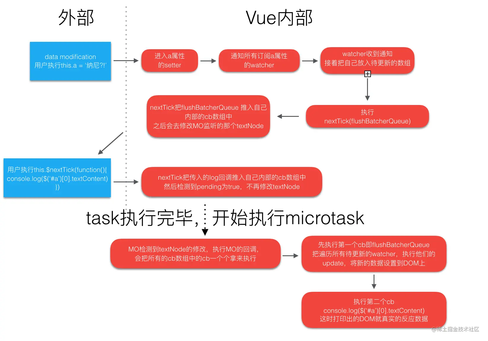

## 关于`$nextTick`

[事件循环](https://weijl.top/#/blog/前端/事件循环与nextTick.md/.%2Fassets%2Fblogs%2FBrowserSide%2F事件循环与nextTick.md)

[面试官：Vue中的$nextTick有什么作用？ | web前端面试 - 面试官系列 (vue3js.cn)](https://vue3js.cn/interview/vue/nexttick.html#三、实现原理)

https://vue3js.cn/interview/vue

[你真的理解$nextTick么 - 掘金 (juejin.cn)](https://juejin.cn/post/6844903843197616136)

[神奇的nextTick一定能获取到最新的dom么？ - 掘金 (juejin.cn)](https://juejin.cn/post/7166517557124415518)

### 返回值

[下列关于Vue的描述错误的是（ ）__牛客网 (nowcoder.com)](https://www.nowcoder.com/questionTerminal/070dbd360a1c4fc9826363f698f03b52)

- ```
  $nextTick()返回一个Promise对象
  ```

- ```
  $nextTick()可以配合async/await使用
  ```

### 事件循环与更新

GUI渲染引擎

JS引擎 -> 事件循环

[(137条消息) 微任务，宏任务，DOM渲染的执行顺序_yolanda__xiaoxiao的博客-CSDN博客_异步宏任务在dom渲染后出发么](https://blog.csdn.net/weixin_44138611/article/details/112464382)


##### 宏任务和微任务的执行顺序

在Call Stack中不仅会形成宏任务队列，还会形成微任务队列，在每一次Call Stack清空后都需要将微任务队列清空（全部执行）。

**执行顺序**

Call Stack清空
执行当前的微任务
尝试DOM渲染
触发Event Loop
**微任务和宏任务的区别**
宏任务：DOM渲染后触发，由浏览器规定（Web APIs）
微任务：DOM渲染前执行，微任务是ES6语法规定
**event loop和Dom渲染**
每次Call Stack清空(即每次轮询结束)，即同步任务执行完
都是Dom重写渲染的机会，Dom结构如有改变则重新渲染
然后再去触发下一次Event Loop

`nextTick`的官方定义：

> 在下次 DOM 更新循环结束之后执行延迟回调。在修改数据之后立即使用这个方法，获取更新后的 DOM

- 状态更新是一个微任务；

- nextTick也是微任务；

- 先写状态更新，再写nextTick回调；

- 状态更新会先创建一个微任务，并且代码块中的所有状态变化会集中到这个微任务进行，**状态改变触发了DOM更新**，创建了一个宏任务。

- 界面更新宏任务结束后，立即调用nextTick微任务。



并不用等待GUI更新，而是DOM元素内容更新后，就可以拿到更改的数据。

---

## vue3对比vue2生命周期

1、去掉了`beforeCreate`、`created`，直接使用setup

2、`beforeDestroy`、`destroyed` 被替换为了`onBeforeUnmount`、`onUnmounted`

另：新增了开发模式下： `onRenderTracked`（组件渲染过程中追踪到响应式依赖时调用）、 `onRenderTriggered`（响应式依赖的变更触发了组件渲染时调用）

---

## 父子组件生成和更新顺序

### 生成

父组件beforeCreate --> 父组件created --> 父组件beforeMount  --> 子组件beforeCreate --> 子组件created --> 子组件beforeMount  -->  子组件 mounted  --> 父组件mounted

父组件挂载前，进行子组件的创建；组件挂载后，进行父组件挂载。

创建（created）从外到内；

挂载（mounted）从内到外；

触发更新（before update）从外到内；

完成更新（update）从内到外；

before销毁（before destory）从外到内；

完成销毁（destory）从内到外；

更新与销毁的顺序一致。

**原因：**

---

## vue和react更新粒度

- [为什么说 Vue 的响应式更新精确到组件级别？（原理深度解析） - 掘金 (juejin.cn)](https://juejin.cn/post/6844904113432444942)

---

## 权限管理

权限管理可分为页面权限和按钮权限。

页面权限实现主要基于路由进行，路由列表有后端返回，前端接收到数据将路由添加到路由规则中。以及路由守卫，再次保证用户权限。

---

## 说一说服务端渲染

传统的基于React或Vue框架生产的应用，组件模板解析为DOM元素的操作是在客户端进行的，如果客户端性能不好，可能会耗费比较多的时间进行解析。

这种方式有利于SEO，爬虫可以看到完整的页面，提高页面的加载速度，减少首页白屏问题。

客户端渲染(CSR),也就是常见的单页面应用(SPA),由服务器端返回的初始 HTML 页面，**由 JS 去异步加载数据**，完成页面的渲染。由于ajax请求是异步的，百度Google等搜索引擎抓取的页面是几乎空白的，因为组件需要执行js区获取数据，对组件模板进行解析。初始的html文件一般只包含一个id为app的节点。

服务端渲染将模板解析放在服务端进行，将解析完成后的HTML字符串返回给客户端，浏览器将其显示出来。但是事件绑定的相关操作仍然在客户端进行。

在开发环境中，服务端代码与前端端代码需要在一个项目中，因为前端代码也需要访问那些SSR组件。[服务端渲染 (SSR) | Vue.js (vuejs.org)](https://cn.vuejs.org/guide/scaling-up/ssr.html#code-structure)。

应该避免在 `setup()` 或者 `<script setup>` 的根作用域中使用会产生副作用且需要被清理的代码。这类副作用的常见例子是使用 `setInterval` 设置定时器。我们可能会在客户端特有的代码中设置定时器，然后在 `onBeforeUnmount` 或 `onUnmounted` 中清除。然而，由于 **unmount 钩子不会在 SSR 期间被调用**，所以定时器会永远存在。为了避免这种情况，请将含有副作用的代码放到 `onMounted` 中。

---

## 插件和混入

vue-router是vue中的常用插件；插件是一种能为Vue添加全局功能的工具代码；插件需要提供一个install函数，该函数接收一个Vue应用实例参数app，然后调用app上的方法，对app添加全局功能；主要的方法有`component`用于注册全局组件，`provide`用于注入全局资源，通过给`config.globalProperties`添加全局的一些实例属性和方法。给应用实例的`use`方法传入插件的安装函数，为应用添加全局功能。

Vue中的mixins属性接收一个包含组件选项对象的数组，这些选项会混入到所有组件实例，例如created属性，mixins主要应用于Vue2，用于复用一些组件逻辑，在Vue3中，保留了这个功能，但更推荐使用组合式api完成逻辑复用。（生命周期复用：声明生命周期钩子函数；方法复用：methods选项；）mixins的缺点是**可能造成命名冲突**，**隐含依赖关系，不易维护**。mixins和组件的区别是mixins不会创建新的作用域，而是将**属性合并到组件**中。

总的来说，插件是对vue整个应用功能的扩展，而混入的目的是复用组件逻辑。

---

## vue的diff算法

diff算法是将虚拟DOM与真实DOM进行比较的技术，由于真实DOM的操作回耗费更多的时间，所以使用diff算法找出需要更新的DOM节点，对其进行更新。