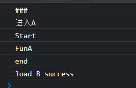
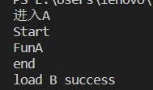
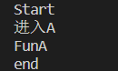

## 如何搭建前端脚手架(CLI)

CLI即命令行界面，也就是一个命令行工具。

脚手架可以创建项目时的重复性操作，统一开发风格（eslint和stylelint），规范项目目录，让开发更专注于业务。

## TreeShaking

TreeShaking是一种减小代码体积的技术，它的原理是检测EM模块中哪些被导出的值没有被使用，这些没有被使用的值不会出现在打包的产物中。

在实际使用中，Treeshaking通常与ES6的模块化机制结合使用。**因为ES6的模块化机制是静态的，可以在编译时分析出依赖关系**，从而进行剪枝操作。对于其他的代码（如CommonJS、AMD等），因为它们的依赖关系是动态的，无法在编译时确定，所以无法进行Treeshaking优化。

Treeshaking的实现需要满足两个条件：代码必须是纯函数，且不会产生副作用。如果代码中存在副作用，例如在函数内部修改全局变量，那么就无法进行Treeshaking。另外，Treeshaking的实现也需要支持Tree Shaking的标准。在Webpack中，需要使用支持Tree Shaking标准的模块打包器，如Webpack 2或更高版本，并且需要开启`production`模式，才能实现Treeshaking优化。

## webpack

在Webpack的运行过程中，每次执行Webpack命令都会创建一个新的Compiler实例。一个Compiler实例负责一次新的编译过程，并且会生成一个或多个Compilation实例。

Compilation对象是Webpack在每次构建中创建的，**它包含了当前的模块资源、编译生成的资源、变化的文件等信息**。在Compilation对象中，Webpack会将模块解析后的信息存放在模块映射表（module map）中，方便后续处理。

在Webpack中，一个Compilation对象只负责一次编译过程中的**资源的编译和输出**。每次编译都会生成一个新的Compilation对象，Webpack会在内存中保存最近一次的Compilation对象，以便后续的增量编译。

## Vite

- 将模块分为依赖和源码，依赖是开发时不会改动的纯JavaScript。源码一般不是直接的JS文件。
- 依赖存在多种模块化格式，使用ESBuild预构建**依赖**，esbuild使用go编写，速度更快。
- 基于ES模块化，提升开发过程的体验，由于无需构建整个应用，开发服务器启动更快，热模块替换速度更快。以原生ESM方式提供源码，让浏览器进行模块的导入，Vite 只需要在浏览器请求源码时进行转换并按需提供源码。

> 为什么生产环境还是要打包？

主要是为了优化性能。由于模块的嵌套嵌入，ES模块化会造成额外的网络往返。

打包可以进行tree-shaking、懒加载和 chunk 分割。

> 为什么不用esbuild打包

esbuild无法与我们经常用到其他前端工具或框架进行配合，例如eslint和postcss。esbuild无法进行代码分割和CSS处理。	

## file-loader和url-loader

[`file-loader` 和 `url-loader` 都是用于处理文件的 webpack loader。它们的主要区别在于：当文件大小小于设定的 `limit` 时，`url-loader` 会将文件转换为 base64 编码的 Data URL，而 `file-loader` 则返回文件的 public URL。](https://blog.csdn.net/WEB_YH/article/details/79325182)[1](https://blog.csdn.net/WEB_YH/article/details/79325182)[2](https://blog.csdn.net/wu_xianqiang/article/details/104558773)

简单来说，当**你需要将小文件内联到代码中以减少 HTTP 请求时**，可以使用 `url-loader`；否则可以使用 `file-loader`。

## git怎么解决代码冲突

处理git代码冲突有几种方法。你可以使用命令行来解决冲突，首先需要使用 `git checkout` 切换到冲突的分支，然后使用 `git mergetool` 或 `git diff` 来比较冲突的文件[1](https://www.zhihu.com/question/580699943)。你也可以在代码编辑器中打开冲突的文件，手动比较并合并两个版本[1](https://www.zhihu.com/question/580699943)。

**提交到远程仓库出现冲突**

1. 首先，运行 `git fetch` 命令来获取远程仓库的最新更改。
2. 然后，运行 `git merge` 命令来合并远程仓库的更改。
3. 在合并过程中，如果出现冲突，Git会提示您解决冲突。您可以通过编辑冲突文件来手动解决冲突。
4. 解决完所有冲突后，运行 `git add` 命令来将解决冲突后的文件添加到暂存区。
5. 最后，运行 `git commit` 命令来提交解决冲突后的更改。

`git fetch` 命令用于从远程仓库获取最新的更改，但不会将这些更改合并到当前分支中。这样，您可以先查看远程仓库的更改，然后再决定是否将这些更改合并到当前分支中。

当您运行 `git fetch` 命令时，它会获取远程仓库中所有分支的最新提交，并更新本地仓库中对应的远程跟踪分支。例如，如果您的本地仓库有一个名为 `origin/master` 的远程跟踪分支，那么运行 `git fetch` 命令后，该分支将被更新为远程仓库中 `master` 分支的最新状态。

`git fetch` 命令不会创建新的本地分支。它只会更新本地仓库中已有的远程跟踪分支，以便它们与远程仓库中对应的分支保持同步。

如果想在本地创建一个新分支来跟踪远程仓库中的某个分支，可以使用 `git checkout` 命令。例如，要创建一个名为 `mybranch` 的新本地分支来跟踪远程仓库中的 `master` 分支，可以运行 `git checkout -b mybranch origin/master` 命令。

使用 `git branch -vv` 命令来查看本地分支当前追踪的远程分支。该命令会显示本地仓库中所有分支的列表，以及每个分支当前追踪的远程分支（如果有的话）。

如果您想更改本地分支当前追踪的远程分支，可以使用 `git branch` 命令的 `-u` 或 `--set-upstream-to` 选项。

例如，假设您的本地仓库中有一个名为 `mybranch` 的分支，它当前追踪远程仓库中的 `origin/master` 分支。如果您想将其更改为追踪远程仓库中的 `origin/develop` 分支，可以运行以下命令：

```shell
git branch -u origin/develop mybranch
```

或者，如果您当前已经切换到了 `mybranch` 分支，可以省略分支名称，直接运行：

```shell
git branch -u origin/develop
```

以上命令会将本地 `mybranch` 分支的上游分支更改为 `origin/develop`。

## webpack生命周期

webpack是基于tapable让开发者能够动态注册回调形成插件机制。

Tapable支持同步回调和异步回调。

在webpack的打包过程，会创建两个关键的对象compiler和compilation。

在webpack中，**compiler** 对象是编译管理器，webpack启动后会创建compiler对象，该对象一直存活直到结束退出。而 **compilation** 对象是单次编辑过程的管理器，比如当watch = true时，运行过程中只有一个compiler，但每次文件变更触发重新编译时，都会创建一个新的compilation对象[1](https://bing.com/search?q=webpack+compiler和compilation区别)。

简单来说，compiler对象负责管理整个webpack构建过程，而compilation对象负责管理单次编辑过程。

`Compiler` 模块是 webpack 的主要引擎，它通过 [CLI](https://www.webpackjs.com/api/cli) 或者 [Node API](https://www.webpackjs.com/api/node) 传递的所有选项创建出一个 compilation 实例。

`compilation` 实例能够访问所有的模块和它们的依赖（大部分是循环依赖）。 它会对应用程序的依赖图中所有模块， 进行字面上的编译(literal compilation)。 在编译阶段，模块会被加载(load)、封存(seal)、优化(optimize)、 分块(chunk)、哈希(hash)和重新创建(restore)。

要注册`compilation`的生命周期回调，需要在`compiler`的`thisCompilation`回调内部注册，因为这个时候才创建了`compilation`对象。

## 性能优化

### 按需引入

按需引入的**技术原理**是利用模块打包工具（如webpack）的tree shaking功能，只打包和引入项目中实际使用到的模块。tree shaking通过静态分析代码，识别出哪些模块被实际使用，哪些模块没有被使用，然后只打包使用到的模块。

按需引入**通常是指**在使用组件库时，只引入需要的组件，而不是整个库。这样可以减小打包体积，优化性能。

ES6 模块化和 CommonJS 模块化都可以实现按需引入。但是，由于 ES6 模块化支持静态导入和导出，所以它更容易进行静态分析，从而更容易实现 Tree-Shaking。Tree-Shaking 是一种消除无用代码的技术，它可以进一步优化打包体积。

静态导入和导出是指在 ES6 模块化中使用的 `import` 和 `export` 语句。**静态导入和导出是在编译时确定的**，这意味着它们不能在运行时动态改变。这里的编译指的是打包过程。这个过程通常由构建工具（如 webpack 或 rollup）完成，它会对代码进行分析和转换，以便更好地优化打包结果。

**要编写一个支持按需引入的库**，需要遵循以下几点：

**ES方案：**

1. 使用ES6模块语法（import/export）来组织代码。这种语法可以被静态分析，从而支持tree shaking。
2. 将每个功能或组件拆分成单独的模块，以便用户可以单独引入所需的模块。
3. 在打包时，使用支持tree shaking的打包工具（如webpack、rollup等），并正确配置以启用tree shaking功能。

**非ES方案：**

1. 将每个功能的组件拆分成单独模块，并且分别进行编译打包；
2. 用户引入时需要具体引入的路径，不能从根index.js文件引入，有插件可以帮助我们做到这一点；

相关插件：

- `unplugin-auto-import`是一个用于Vite、Webpack和Rollup的插件，它可以自动按需导入API。它支持TypeScript，并由unplugin提供支持。使用此插件，你可以在代码中直接使用API，而不需要手动导入它们。插件会自动分析代码并添加必要的导入语句。

[组件库实现按需引入的原理 - 掘金 (juejin.cn)](https://juejin.cn/post/6844904158181474311)

[按需打包 UI 组件库原理探究 - 掘金 (juejin.cn)](https://juejin.cn/post/6942362094264287268)

### 懒加载，按需加载

使用懒加载语法，把懒加载的模块单独打包成一个chunk。

### 代码分离

多个入口，并行加载这些js文件。

## CJS和ESM

cjs 本身是node 端的模块化规范，模块是被同步加载的。但是在浏览器中，并不支持require 和exports，因此需要webpack 进行打包，将他们打包到一个文件中。

后来js推出了自己的模块化语法，称为esm，他是一种静态导入规范，模块导入必须放在顶层，并且在当前模块执行前被加载,**nodejs 也对这个规范提供了支持**。

为什么我们写的符合esm 的代码也需要打包呢，因为我们还用了一些浏览器不支持的语法，打包也能帮助我们实现兼容性处理，此外，过多的import 会产生大量http請求，打包在一起可以提升执行速度。

---

ESM（ECMAScript Modules）是静态的，因为它的导入和导出语句必须位于模块的顶层，而且不能被包含在任何控制流语句（如 if 或 for）中。这意味着模块之间的依赖关系在编译时（打包）就可以确定，而不需要等到运行时。

require() 和 import 的主要区别在于它们的导入方式（动态 vs 静态）。require() 允许在运行时动态导入模块，而 import 则要求在编译时静态确定模块之间的依赖关系。

静态导入使用 import 关键字，**它不是一个函数，而是一个声明语句**。例如：

```javascript
import { myFunction } from './myModule.js';
```

**import 的静态特性也可以在运行时带来好处。**例如，浏览器可以在运行时预先解析模块之间的依赖关系，并提前加载所需的模块，从而提高应用程序的性能。

import() 函数与 import 关键字不同。import 关键字用于静态导入，而 import() 函数用于动态导入。

### 静态导入和动态导入

静态导入和动态导入的本质区别在于它们发生的时间（编译时 vs 运行时）。

静态导入使用 import 关键字，它是一个声明语句，用于在编译时确定模块之间的依赖关系。例如：

```javascript
import { myFunction } from './myModule.js';
```

动态导入使用 import() 函数，它是一个函数，可以在运行时按需加载模块。例如：

```javascript
import('./myModule.js')
  .then(({ myFunction }) => {
    // 使用 myFunction
  });
```

总之，静态导入和动态导入的本质区别在于它们发生的时间（编译时 vs 运行时）。静态导入用于在编译时确定模块之间的依赖关系，而动态导入用于在运行时按需加载模块。

当你使用打包器（如 webpack 或 Rollup）来打包你的代码时，它会根据模块之间的依赖关系来确定哪些模块应该被打包在一起。

- 如果你使用静态导入（import 关键字），打包器可以在编译时确定模块之间的依赖关系，并据此进行优化。例如，它可以使用 tree shaking 来移除未使用的代码。

- 如果你使用动态导入（import() 函数），打包器会将动态导入的模块单独打包，以便在运行时按需加载。

- 如果你使用 require() 函数来导入模块，打包器可能无法确定模块之间的依赖关系，因此它可能无法对代码进行优化。这意味着所有模块都可能被打包在一起，即使其中一些模块并未被使用。

require的动态导入并不会生成一个新的bundle，而import动态导入可以。因为它是基于Promise的，并且不会阻塞当前代码的执行。

而使用require动态导入时，它需要去执行目标模块。（它们是否被打包在一起取决于打包器如何处理模块之间的依赖关系。）

### 编译时

JavaScript 是一种解释型语言，它通常不需要编译。然而，现代 JavaScript 引擎（如 V8 和 SpiderMonkey）使用了一种称为即时编译（JIT）的技术来提高代码的执行速度。

即时编译是一种在运行时将 JavaScript 代码编译为机器码的过程。它与传统的编译过程不同，后者是在运行前将源代码编译为机器码。

因此，当我们谈论 JavaScript 的“编译时”，我们通常指的是**即时编译过程**，它发生在运行时。

需要注意的是，在本文中，当我们谈论静态导入和动态导入时，我们使用“编译时”和“运行时”这两个术语来描述模块之间的依赖关系是在何时确定的。这与 JavaScript 的即时编译过程无关。

在本文中，“编译时”指的是模块之间的**依赖关系在代码被打包**或传输到浏览器之前就已经确定的时间点。而“运行时”指的是代码在浏览器中执行的时间点。

[ESM和CJS模块杂谈 - 掘金 (juejin.cn)](https://juejin.cn/post/7048276970768957477)

### ESM是异步的

```js
// main.js
console.log('Starting');
import { myFunction } from './myModule.js';
myFunction();
console.log('Finished');
```

浏览器会按照以下顺序执行代码：

1. 打印 “Starting”。
2. 异步加载 myModule.js 模块。
3. 在 myModule.js 模块加载完成后，恢复执行。
4. 调用 myFunction()。
5. 打印 “Finished”。

浏览器会在遇到 import 语句时异步加载所请求的模块，而不会阻塞执行。在模块加载完成后，浏览器会恢复执行，并调用 myFunction()。

需要注意的是，由于模块是异步加载的，因此在模块加载完成之前，浏览器可能会执行其他任务。这意味着 “Finished” 可能会在 myFunction() 被调用之前或之后打印。

### 浏览器加载时机

浏览器会首先加载模块，模块加载完成后再执行之后的代码。

main.js

```js
console.log('Start')

import { funA } from './moduleA.js';


funA();

import('./moduleB.js').then((module)=>{
    console.log('load B success')
})

console.log('end');
```

moduleA.js

```js
console.log('进入A')

export const funA = function(){
    console.log('FunA');
}
```

浏览器打印：



当浏览器导入了main.js，main.js依赖模块moduleA.js，即使moduleA.js不在第一行，也会被首先加载，这是一个异步的过程，加载过程可以执行其他任务，加载完成后才进行执行main.js。

### node 导入时机



### node中使用require

```js
console.log('Start')
const {funA} = require('./moduleA.cjs');

funA();

console.log('end');
```

```js
console.log('进入A')

function funA() {
    console.log('FunA');
}

module.exports = {
    funA
} 
```



可以看到moduleA是在执行过程中加载的。

---

## 性能监控

### 白屏时间

**白屏时间是指浏览器从响应用户输入网址地址，到浏览器开始显示内容的时间**。可以通过计算页面开始展示的时间点与开始请求的时间点之差来计算白屏时间12。你可以使用 performance.timing.navigationStart 来获取开始请求的时间点，然后在页面开始展示时记录一个时间点，两者相减即可得到白屏时间。

白屏是由于**浏览器在加载和执行脚本**的过程中会阻塞**后续的DOM渲染**。CSS加载不会阻塞DOM树的解析，但会阻塞DOM树的渲染。因此，为了避免让用户看到长时间的白屏时间，我们应该**尽可能地提高CSS加载速度**。

- SPA网站的内容是JS生成，如果网站结构复杂，组件数量太多，可能需要耗费很大时间生成DOM，导致白屏。
- 如果HTTP请求过多（CSS资源、JS资源），也会阻塞浏览器的渲染过程。

## 包管理工具

### pnpm和npm或者yarn的区别

pnpm、npm和yarn都是node.js的包管理工具，它们可以根据项目中的package.json文件自动安装项目依赖。

它们之间的主要区别有：

- pnpm使用了一种称为“符号链接”的技术，**可以避免重复下载和存储相同的依赖包**，从而节省了磁盘空间和网络带宽。
- yarn使用了本地缓存的机制，可以在无需互联网连接的情况下**安装本地缓存的依赖包**，提供了离线模式。
- npm是Node默认的包管理工具，它的优点是兼容性好，缺点是速度慢，而且容易出现依赖包版本不一致的问题。

### 最近实践

- 如果您想使用yarn的离线模式，您可以在安装依赖包时加上–offline参数，例如：yarn install --offline。
- **如果您想节省磁盘空间和网络带宽，您可以使用pnpm**代替npm或者yarn，它会使用符号链接的方式来共享相同的依赖包，而不是复制多份。
- 如果您想管理多个项目的依赖包，您可以使用pnpm的工作区（workspaces）功能，它可以让您在一个仓库中安装和链接多个项目的依赖包，而不需要使用额外的工具，如lerna。

### 符号链接

符号链接是一种特殊的文件，它包含有一条指向其他文件或目录的引用，而不是实际的文件内容。

符号链接的作用是可以让您在不复制文件的情况下，访问或操作其他位置的文件或目录，从而节省了磁盘空间和网络带宽。

符号链接在不同的操作系统中有不同的创建和删除方法，例如，在Windows系统中，您可以使用mklink命令来创建符号链接，例如：mklink /D link target。

 在Linux系统中，您可以使用ln命令来创建符号链接，例如：ln -s target link。

**target是指符号链接所指向的文件或目录的位置，也就是原始的文件或目录。link是指符号链接本身的位置，也就是您想要创建的文件或目录。**

### package-lock.json

package-lock.json是一个由npm自动生成的文件，它记录了当前项目的npm包的**依赖树**，以及每个包的具体版本号和安装源。

**package-lock.json的作用是锁定安装时的包的版本号**，以保证其他人在npm install时大家的依赖能保证一致，避免因为包的版本不同而导致的问题。

yarn.lock 也是一个自动生成的文件，用于存储项目的精确依赖版本和每个包的校验和。这是 yarn 的方式来提供一致性的依赖。yarn.lock 和 package-lock.json 的作用类似，只是它们是由不同的管理工具生成和使用的。yarn.lock 是由 yarn 生成和使用的，而 package-lock.json 是由 npm 生成和使用的.

## GIT

### rebase

[git rebase详解（图解+最简单示例，一次就懂）_风中一匹狼v的博客-CSDN博客](https://blog.csdn.net/weixin_42310154/article/details/119004977)


**变基后：**


**解释：**

feature分支是基于master分支的B拉出来的分支，feature的基底是B。

而master在B之后有新的提交，**就相当于此时要用master上新的提交来作为feature分支的新基底**。

**实际操作为把B之后feature的提交先暂存下来**，然后删掉原来这些提交，再找到master的最新提交位置，把存下来的提交再接上去（接上去是逐个和新基底处理冲突的过程），如此feature分支的基底就相当于变成了M而不是原来的B了。（注意，如果master上在B以后没有新提交，那么就还是用原来的B作为基，rebase操作相当于无效，此时和git merge就基本没区别了，差异只在于**git merge会多一条记录Merge操作的提交记录**）

但由于存在一个**删除所有feature分支提交的过程**，会导致feature之前的提交记录都没有了。

**好处是：** feature分支的提交记录会比较简洁，缺点就是rebase以后我就不知道我的当前分支**最早是从**哪个分支拉出来的了。

### cherry-pick

[git cherry-pick 教程 - 阮一峰的网络日志 (ruanyifeng.com)](https://ruanyifeng.com/blog/2020/04/git-cherry-pick.html)

`git cherry-pick`命令的作用，就是将指定的提交（commit）应用于其他分支。

> ```bash
> $ git cherry-pick <commitHash>
> ```

上面命令就会将指定的提交`commitHash`，应用于当前分支。这会在当前分支产生一个新的提交，当然它们的哈希值会不一样。

举例来说，代码仓库有`master`和`feature`两个分支。

> ```bash
>     a - b - c - d   Master
>          \
>            e - f - g Feature
> ```

现在将提交`f`应用到`master`分支。

> ```bash
> # 切换到 master 分支
> $ git checkout master
> 
> # Cherry pick 操作
> $ git cherry-pick f
> ```

上面的操作完成以后，代码库就变成了下面的样子。

> ```bash
>     a - b - c - d - f   Master
>          \
>            e - f - g Feature
> ```

从上面可以看到，`master`分支的末尾增加了一个提交`f`。

`git cherry-pick`命令的参数，不一定是提交的哈希值，分支名也是可以的，表示转移该分支的最新提交。

> ```bash
> $ git cherry-pick feature
> ```

上面代码表示将`feature`分支的最近一次提交，转移到当前分支。

## SeverLess

### 与FaaS的关系

Serverless是一种云计算**模型**，它允许开发人员构建和运行应用程序，而无需管理基础设施。在Serverless模型中，云服务提供商负责管理服务器、操作系统、网络和存储等基础设施，开发人员只需要编写应用程序代码即可。

函数即服务（Function as a Service，FaaS）是Serverless模型的一种**实现方式**，它将应用程序代码分解成小的、独立的函数，并在需要时按需执行这些函数。在FaaS模型中，开发人员只需要编写函数代码，而无需关心函数的部署、扩展和管理等问题。

需要注意的是，Serverless和FaaS并不是完全相同的概念。Serverless是一种云计算模型，而FaaS是Serverless模型的一种实现方式。除了FaaS之外，还有其他实现Serverless模型的方式，例如事件驱动计算（Event-driven Computing）、无服务器容器（Serverless Containers）等。

## 后端交互

### Restful API

[一文搞懂什么是RESTful API - 知乎 (zhihu.com)](https://zhuanlan.zhihu.com/p/334809573)

一种软件架构风格、设计风格，而不是标准，只是提供了一组**设计原则和约束条件**。

**为什么？**

客户端的种类出现多元化，**而客户端和服务端就需要接口进行通信**，但接口的**规范性**就又成了一个问题：

所以一套**结构清晰、符合标准、易于理解、扩展方便**让大部分人都能够理解接受的接口风格就显得越来越重要，而RESTful风格的接口(RESTful API)刚好有以上特点，就逐渐被实践应用而变得流行起来。

**特点：**

- **以资源为基础** ：资源可以是一个图片、音乐、一个XML格式、HTML格式或者JSON格式等网络上的一个实体，除了一些二进制的资源外普通的文本资源更多以JSON为载体、面向用户的一组数据(通常从数据库中查询而得到)。
- **统一接口**: 对资源的操作包括获取、创建、修改和删除，这些操作正好对应HTTP协议提供的GET、POST、PUT和DELETE方法。换言而知，使用RESTful风格的接口但从接口上你可能**只能定位其资源**，但是无法知晓它具体进行了什么操作，需要具体了解其发生了什么操作动作要从其HTTP请求方法类型上进行判断。（根据请求方式，判断要执行的操作）

- **URI指向资源**：URI = Universal Resource Identifier 统一资源标志符，用来标识抽象或物理资源的一个紧凑字符串。URI包括URL和URN，在这里更多时候可能代指URL(统一资源定位符)。RESTful是面向资源的，每种资源可能由一个或多个URI对应，但一个URI只指向一种资源。

- **无状态**：服务器不能保存客户端的信息， **每一次从客户端发送的请求中，要包含所有必须的状态信息**，会话信息由客户端保存， 服务器端根据这些状态信息来处理请求。 当客户端可以切换到一个新状态的时候发送请求信息， 当一个或者多个请求被发送之后, 客户端就处于一个状态变迁过程中。 每一个应用的状态描述可以被客户端用来初始化下一次的状态变迁。

