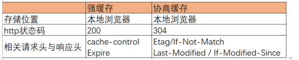

##  什么是HTTP协议

[别人问你http协议，到底是想问什么？ - 掘金 (juejin.cn)](https://juejin.cn/post/6844903578021167111)

HTTP是应用层的协议，用于在网络上传输资源，包括文本，图片，视频等。一个由客户端发出的请求,会经过 http协议包装一层，TCP协议包装一层，IP协议包装一层，以太网再包装一层，和发快递是一样的，这个过程称为**封装**，包装好之后在物理层进行传输。到达服务器就开始拆开这个快递。这个过程任何人无法绝对掌握数据是否可靠，所以要通过**TCP三次握手**（面试题）

> 握手过程中使用了 TCP 的标志（flag）—— SYN（synchronize）和ACK（acknowledgement）。发送端首先发送一个带 SYN 标志的数据包给对方。接收端收到后，回传一个带有 SYN/ACK 标志的数据包以示传达确认信息。最后，发送端再回传一个带 ACK 标志的数据包，代表“握手”结束。若在握手过程中某个阶段莫名中断，TCP 协议会再次以相同的顺序发送相同的数据包。

总结一下就是：

- 客户端–发送带有SYN标志的数据包–一次握手–服务端
- 服务端–发送带有SYN/ACK标志的数据包–二次握手–客户端
- 客户端–发送带有带有ACK标志的数据包–三次握手–服务端

HTTP报文有两种，请求报文和响应报文，请求报文的格式是：请求行、通用信息头、请求头，实体头，报文主体。

请求行以方法字段作为开始，后面是url字段和http协议版本。

响应报文的格式是：状态行、通用信息头，响应头，实体头，报文主体。

状态码由`3`位数字组成，表示请求是否被理解或被满足，并且用来支持浏览器的自动操作。

## 什么是CSRF攻击

CSRF（**Cross**-site request forgery）的中文名称跨站请求伪造，也被称为“**One** Click Attack”或者 Session Riding，通常缩写为 CSRF 或者 XSRF，是一种对网站的恶意利用。CSRF 则通过伪装成受信任用户的请求来利用受信任的网站，攻击者获取了用户的凭证，例如cookie或者token，主动向服务端发送请求，服务端接收到用户凭证后就认为这是一个正常的用户请求，执行这个请求可能导致用户信息泄漏或者财产损失。

预防的方式只能说对请求中的参数进行验证，增加攻击者伪造请求的难度。

尽管听起来像跨站脚本（XSS），但它与 XSS 非常不同，XSS 利用站点内的信任用户，而 CSRF 则通过伪装成受信任用户的请求来 利用受信任的网站。 与 XSS 攻击相比，CSRF 攻击往往不大流行（因此对其进行防范的资源也相当稀少）和难以防范，所以被认为比 XSS 更具危险性。

XSS（corss site script）中文名跨站脚本攻击，攻击原理是原本需要接受数据但是一段脚本放置在了数据中，该脚本可能会：

1. 修改DOM,伪造页面，欺骗用户，获取账号密码等私密信息;
2. 在内面内生成浮窗广告;
3. 可以监听用户的行为,比如addEventListener('keydown') // 监听用户的键盘敲击事件
4. 窃取cookie信息
5. 获取页面数据等

预防方式：

1. 在服务端将script标签转义掉,( `服务器对输入的脚本进行过滤或转码`);
2. 充分使用 `CSP` (限制加载其他域下的资源文件、禁止向第三方提交数据)
3. cookie设置 - HttpOnly (设置这个属性之后`cookie`无法通过js去document.*cookie*读取)

## 说一说new会发生什么

1. 创建一个新对象
2. 将对象的原型指向构造函数的原型
3. 将构造函数的作用域赋给这个对象，因此构造函数内的`this`指向这个新创建的对象
4. 执行构造函数内的对象，给对象添加属性和方式
5. 对构造函数返回值进行判断，如果构造函数返回了对象，则创建的对象就是这个返回的对象，否则还是我们创建的对象

## HashRouter和HistoryRouter的区别和原理

HashRouter监听`onhashchange `事件来前进和后退，优点是没有兼容性问题，并且刷新页面不会产生404错误，缺点是url中需要有`#`符合，不美观。URL 中的 hash 值只是客户端的一种状态，向服务端发送请求的时候，hash 部分不会被发送，对后端完全没有影响。所以改变hash值，不会重新加载页面。这种模式的浏览器支持度很好，低版本的IE浏览器也支持这种模式。hash路由被称为是前端路由，已经成为SPA（单页面应用）的标配。hash 值得改变会在浏览器的历史记增加访问记录，所以可以通过浏览器的回退、前进控制 hash 值的改变。可以通过 a 标签设置 href 值或者通过 js 给location.hash 赋值来改变 hash 值。可以通过`hashchang` 事件来监听 hash 值的变化，从而对页面进行跳转（渲染）。

使用HistoryRouter一般需要服务端的支持，因为在页面刷新时，这个请求会传递给服务端，否则会出现404。它利用的是History API。**监听`popstate`事件监听URL变化，从而对页面进行跳转（渲染）**。通过`pushState()`和 `replaceState()`方法操作URL变化，这种修改只能导致history对象发生变化，从而改变当前地址栏的 URL，但浏览器不会向后端发送请求，也不会触发popstate事件的执行，因此需要手动触发`popstate`事件（点击浏览器的【前进】【后退】按钮，或者调用 `history` 对象的 `back`、`forward`、`go` 方法）。

[WindowEventHandlers.onpopstate - Web API 接口参考 | MDN (mozilla.org)](https://developer.mozilla.org/zh-CN/docs/Web/API/Window/popstate_event)

当一个前端路由请求发送给服务端，服务端只需要返回`index.html`（首页路由）即可。

**hash和history的区别**

**1.形式上**：hash模式url里面永远带着#号，开发当中默认使用这个模式。如果用户考虑url的规范那么就需要使用history模式，因为history模式没有#号，是个正常的url，适合推广宣传；
 **2.功能上**：比如我们在开发app的时候有分享页面，那么这个分享出去的页面就是用vue或是react做的，咱们把这个页面分享到第三方的app里，有的app里面url是不允许带有#号的，所以要将#号去除那么就要使用history模式，但是使用history模式还有一个问题就是，在访问二级页面的时候，做刷新操作，会出现404错误，那么就需要和后端人配合，让他配置一下apache或是nginx的url重定向，重定向到你的首页路由上就ok了

## valueOf与toString

{}的valueOf()方法的值为{}

{}的toString()方法的值为[object object] 

[]的valueOf()方法的值为[]

[]的toString()方法的值为""(空串)

JavaScript 中的 valueOf() 方法用于返回指定对象的原始值，若对象没有原始值，则将返回对象本身。

## CSS选择器的权重顺序

```
!important>行内样式>ID选择器 >属性选择器> 元素选择器
```

规则1：样式有冲突时，高优先级样式覆盖低优先级样式。

规则2：同等优先级，使用距离上下文最近的样式。

## 网络七层协议

OSI七层协议由底层开始，包括物理层、数据链路层、网络层、传输层、会话层、表示层、应用层。

数据链路负责建立逻辑连接，进行硬件寻址，差错校验等功能。能够发现错误，不能纠正错误。**将原始比特流转变为逻辑传输线路**

网络层进行逻辑连接寻址，确定传输路径，控制子网的运行。

传输层定义传输数据的协议端口号，以及流控和差错校验。接收上一层数据，必要时进行分割，将数据交给网络中层，保证数据的有效传输。协议包括TCP UDP。

会话层负责建立、管理、终止会话。安全协议包括SSL、TLS。（安全套接字、安全传输）

表示层负责进行数据的表示，包括安全和压缩。（加密内容，压缩解压）

## JS数据类型

Number String Undefined Null Boolean Object

新增：BigInt Symbol

基本数据类型：Number String Undefined Null Boolean BigInt Symbol（除了Object）

## Chrom浏览器进程

最新的 Chrome 浏览器包括：1 个浏览器（Browser）主进程、1 个 GPU 进程、1 个网络（NetWork）进程、多个渲染进程和多个插件进程。

浏览器至少有四个进程[渲染进程中的各线程 - 掘金 (juejin.cn)](https://juejin.cn/post/6994433869906870286)：

- 浏览器主进程
- GPU进程
- 网络进程
- 渲染进程

其中渲染进程又有五个线程：

- 主线程（js引擎线程）
- GUI渲染线程
- 事件触发线程
- 定时器触发线程
- http请求线程

## 闭包

**概念：闭包是指有权访问另一个函数作用域中变量的函数**，创建闭包的最常见的方式就是在一个函数内创建另一个函数，通过另一个函数访问这个函数的局部变量,利用闭包可以突破作用链域，将函数内部的变量和方法传递到外部。

**原理：**借助函数的立即执行、参数以及函数的return返回值，**多创建了一层作用域**。让闭包内的变量被持续引用而不能被释放内存空间，将值储存起来。

**作用：**保证内部函数所使用的变量不被污染。方便调用上下文的局部变量。加强封装性

**缺点：**闭包的变量不会被垃圾回收机制回收，过度使用闭包导致大量的内存消耗。可能导致内存泄露。

## 前端存储方案

**cookie**由**服务器**生成，发送给浏览器，浏览器把cookie以kv形式保存到某个目录下的文本文件内，下一次请求同一网站时会把该cookie发送给服务器。

[cookie和localstorage的区别_net343的博客-CSDN博客_localstorage](https://blog.csdn.net/net343/article/details/84989452)

当客户端要发送http请求时，浏览器会先检查下是否有对应的cookie。有的话，则**自动**地添加在**request header中的cookie字段**。注意，每一次的http请求时，如果有cookie，浏览器都会**自动**带上cookie发送给服务端。那么把什么数据放到cookie中就很重要了，因为很多数据并不是每次请求都需要发给服务端，毕竟会增加网络开销，浪费带宽。所以对于那设置“每次请求都要携带的信息（最典型的就是身份认证信息）”就特别适合放在cookie中，其他类型的数据就不适合了。

cookie的缺点：

(1) 每个特定域名下的**cookie数量有限**，当超过单个域名限制之后，再设置cookie，浏览器就会清除以前设置的cookie。IE和Opera会清理近期最少使用的cookie，FF会随机清理cookie；

(2) **存储量太小**，只有4KB；

(3) 每次HTTP请求都会发送到服务端，**影响获取资源的效率**；

(4) **需要自己封装获取、设置、删除cookie的方法**：

> （1）通过document.cookie获取所有的cookie值，获取到一个cookie所有值在一起的字符串。
> （2）因为所有的cookie都是以分号隔开的，所有使用split(‘;’)将这个字符串切开变成数组，存起来。
> （3）判断数组中每一项有没有包含cookie名字的，如果有，把对应的值取出来就行。

cookie是存在客户端浏览器上，**session会话**存在服务器上。会话对象用来存储特定用户会话所需的属性及配置信息。当用户请求来自应用程序的web页时，如果该用户还没有会话，则服务器将自动创建一个会话对象。当会话过期或被放弃后，服务器将终止该会话。**cookie和会话需要配合**。


**Cookie的保留时间**主要由两个方面决定。

1. 浏览器的设定，打开浏览器的Internet设置，第一个页签下有浏览历史记录，点击下方的设定按钮，新开页面中点击第二个的历史记录页签，可以设置天数，就是网页浏览记录、Cookie等的保存天数。
2. 由所访问的网页决定，有些使用Cookie的网页会有一个默认使用Cookie的天数，不同网页该默认天数可不同。
3. 浏览器的Cookie保留时间设定优先于所访问网页的设定。

- Expires/Max-Age

  Cookie 的过期时间，过了这个时间之后 Cookie 将会自动删除。
  [cookie默认有效期多长_惊艳面试官的 Cookie 介绍 - 简书 (jianshu.com)](https://www.jianshu.com/p/136c13893061)

  Set-Cookie:id=a3fWa; Expires=Wed,21Oct201507:28:00GMT;

  Max-Age 的单位是秒。

  document.cookie='promo_shown=1; Max-Age=2600000; Secure'

  **如果没有设置该选项，这样的cookie称为会话cookie。它存在内存中，当会话结束，也就是浏览器关闭时，cookie消失。**

---

在较高版本的浏览器中，js提供了两种存储方式：sessionStorage和globalStorage。在H5中，用localStorage取代了globalStorage。

sessionStorage用于本地存储一个会话中的数据，这些数据只有在**同一个会话中的页面才能访问，并且当会话结束后，数据也随之销毁**。所以sessionStorage仅仅是会话级别的存储，而不是一种持久化的本地存储。

localStorage是持久化的本地存储，除非是通过js删除，或者清除浏览器缓存，否则数据是永远不会过期的。

浏览器的支持情况：IE7及以下版本不支持web storage，其他都支持。不过在IE5、IE6、IE7中有个userData，其实也是用于本地存储。这个持久化数据放在缓存中，只有不清理缓存，就会一直存在。

---

## ES6新特性有哪些

[(140条消息) ES6新特性有哪些？_芮芮白的博客-CSDN博客_es6新特性](https://blog.csdn.net/m0_48298027/article/details/111242626)

- 新的数据类型symbol。symbol表示独一无二的值，即每个symbol类型的值都不相同。

- 新的变量声明关键字let和const。他们声明的是块级作用域变量。在ES6之前只有函数作用域和全局作用域。let和const关键字还有一个特性：“暂时性死区”，**即在使用了该关键字的块级作用域中**，其内部使用let和const关键字声明的变量**与外部作用域中的变量相互隔绝**，互不影响。即使是同名变量。

- 结构赋值`...`。支持对象解构。

- 新的对象和方法。Map和Set。

- 对象新特性。构造对象字面量更加方便，**可以直接使用变量名作为属性**。函数体作为方法，函数名变为方法名。函数声明可以省略function。

  ```js
  let myself = {
       name,
       age,
       say(){
           console.log(this.name);
       }
   };
  ```

  新增方法assign和is。assign用于浅拷贝源对象。is方法和（===）功能基本类似，用于判断两个值是否绝对相等。

- 字符串新方法，includes()判断**字符串**是否包含**参数字符串**。startsWith()/endsWith()，判断字符串是否以参数字符串开头或结尾。repeat()方法按指定次数返回一个新的字符串。padStart()/padEnd()，用参数字符串按给定长度从前面或后面补全字符串，返回新字符串。

- 数组新方法。Array.of把传入的参数当做数组元素，形成新的数组。from()方法可以将可迭代对象转换为新的数组。find()和findIndex()，查找数组中符合条件的元素值或索引，方法不会修改原数组。ill()/copyWithin()，替换数组中部分元素，会修改原数组。

- 函数支持参数默认值。

- 箭头函数，一种更加简洁的书写方式，并且也解决了关键字声明方式的一些麻烦事儿。箭头函数内部没有arguments，也没有prototype属性，所以不能用new关键字调用箭头函数。**箭头函数和普通函数最大的区别在于其内部this永远指向其父级AO对象的this。**

- class类。本质是语法糖。普通函数会被添加到函数的原型上。静态属性添加到函数上。

- 模块导入和导出。

- 异步机制。Promise和Generator。
  Promise最大的好处是在异步执行的流程中，把执行代码和处理结果的代码清晰地分离了：

  回调的本质是将回调函数作为参数传递给另一个函数，当处理比较复杂的需求时，回调函数作为参数一层层嵌套，代码结构会非常庞大臃肿，代码维护难度极高，这就叫回调地狱。

  **Promise实现了链式调用，代码更优雅，可读性更高**。链式调用解决了回调地狱问题。

  Promise是异步编程的一种解决方案，**用于解决回调地狱问题**，**让代码可读性更高，更利于维护**。 使用方法： Promise有三种情况fulfilled/resolved(成功)、rejected(失败)、pending(执行中)。 Promise通过new Promise()将构造函数实例化，Promise构造函数接收一个函数作为参数，**这个函数有两个参数resolve，reject，这两个参数也是方法**，成功调用resolve()，失败调用reject()，实例创建完成后，**可以使用then方法指定成功或者失败的回调函数，也可以用catch捕获失败**，then和catch最后也是返回promise对象，所以可以链式调用。  promise.all(iterable)：iterable是由多个promise实例组成的可迭代对象（如Array, Map, Set)，**当iterable中的promise实例都完成(resolved)返回所有成功的结果组成的数组，只要有一个回调执行失败，then是不会执行的**，**则在catch中回调第一个失败的结果**。 promise.race(iterable)：**只要iterable中的其中一个**promise实例resolved或者rejected，返回的promise就会resolved或者rejected

## 浏览器输入URL发生了什么

- URL 解析，

- DNS 查询
- TCP 连接
-  处理请求
- 接受响应
- 渲染页面

## 浏览器如何渲染页面

- HTML 被 **HTML 解析器**解析成 DOM 树
-  CSS 被 **CSS 解析器**解析成 CSSOM 树；
- 结合 DOM 树和 CSSOM 树，生成一棵**渲染树(**Render Tree)，这一过程称为 Attachment；
- 生成布局(flow，layout过程)，浏览器在屏幕上“画”出渲染树中的所有节点；
- 将布局绘制(paint)在屏幕上，显示出整个页面。

## HTTP缓存

**分类：**根据**是否需要重新向服务器发起请求**来分类，可分为(强制缓存，协商缓存) ；

根据是否可以被**单个或者多 个用户使用**来分类，可分为(私有缓存，共享缓存) ；

强制缓存如果生效，不需要再和服务器发生交互，而 协商缓存不管是否生效，都需要与服务端发生交互。下面是强制缓存和协商缓存的一些对比：



**强制缓存**在缓存数据未失效的情况下（即Cache-Control的max-age没有过期或者Expires的缓存时间没 有过期），那么就会直接使用浏览器的缓存数据，不会再向服务器发送任何请求。**强制缓存生效时， http状态码为200**。这种方式页面的加载速度是最快的，性能也是很好的，但是在这期间，如果服务器 端的资源修改了，页面上是拿不到的，因为它不会再向服务器发请求了。这种情况就是我们在开发种经 常遇到的，比如你修改了页面上的某个样式，在页面上刷新了但没有生效，因为走的是强缓存，所以 Ctrl + F5一顿操作之后就好了。 跟强制缓存相关的header头属性有（Pragma/CacheControl/Expires）， Pragma和Cache-control共存时，Pragma的优先级是比Cache-Control高的。

当第一次请求时服务器返回的响应头中**没有Cache-Control和Expires**或者Cache-Control和Expire**s过期** 还或者它的属性设置为no-cache时(即不走强缓存)，那么浏览器第二次请求时就会与服务器进行协商， **与服务器端对比判断资源是否进行了修改更新**。如果服务器端的资源没有修改，那么就会**返回304状态 码，告诉浏览器可以使用缓存中的数据**，这样就减少了服务器的数据传输压力。如果数据有更新就会返 回200状态码，服务器就会返回更新后的资源并且将缓存信息一起返回。跟协商缓存相关的header头属 性有（ETag/If-Not-Match 、Last-Modified/If-Modified-Since）请求头和响应头需要成对出现。

## get和post的区别

