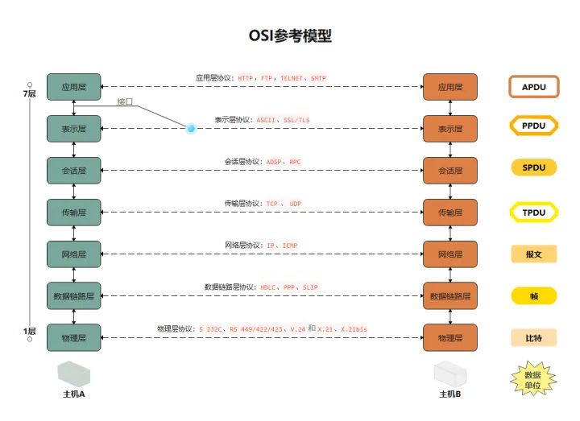

##  什么是HTTP协议

[别人问你http协议，到底是想问什么？ - 掘金 (juejin.cn)](https://juejin.cn/post/6844903578021167111)

HTTP是应用层的协议，用于在网络上传输资源，包括文本，图片，视频等。一个由客户端发出的请求,会经过 http协议包装一层，TCP协议包装一层，IP协议包装一层，以太网再包装一层，和发快递是一样的，这个过程称为**封装**，包装好之后在物理层进行传输。到达服务器就开始拆开这个快递。这个过程任何人无法绝对掌握数据是否可靠，所以要通过**TCP三次握手**（面试题）

> 握手过程中使用了 TCP 的标志（flag）—— SYN（synchronize）和ACK（acknowledgement）。发送端首先发送一个带 SYN 标志的数据包给对方。接收端收到后，回传一个带有 SYN/ACK 标志的数据包以示传达确认信息。最后，发送端再回传一个带 ACK 标志的数据包，代表“握手”结束。若在握手过程中某个阶段莫名中断，TCP 协议会再次以相同的顺序发送相同的数据包。

总结一下就是：

- 客户端–发送带有SYN标志的数据包–一次握手–服务端
- 服务端–发送带有SYN/ACK标志的数据包–二次握手–客户端
- 客户端–发送带有带有ACK标志的数据包–三次握手–服务端

HTTP报文有两种，请求报文和响应报文，请求报文的格式是：请求行、通用信息头、请求头，实体头，报文主体。

请求行以方法字段作为开始，后面是url字段和http协议版本。

响应报文的格式是：状态行、通用信息头，响应头，实体头，报文主体。

状态码由`3`位数字组成，表示请求是否被理解或被满足，并且用来支持浏览器的自动操作。

## 什么是CSRF攻击

CSRF（**Cross**-site request forgery）的中文名称跨站请求伪造，也被称为“**One** Click Attack”或者 Session Riding，通常缩写为 CSRF 或者 XSRF，是一种对网站的恶意利用。CSRF 则通过伪装成受信任用户的请求来利用受信任的网站，攻击者获取了用户的凭证，例如cookie或者token，主动向服务端发送请求，服务端接收到用户凭证后就认为这是一个正常的用户请求，执行这个请求可能导致用户信息泄漏或者财产损失。

预防的方式只能说对请求中的参数进行验证，增加攻击者伪造请求的难度。

尽管听起来像跨站脚本（XSS），但它与 XSS 非常不同，XSS 利用站点内的信任用户，而 CSRF 则通过伪装成受信任用户的请求来 利用受信任的网站。 与 XSS 攻击相比，CSRF 攻击往往不大流行（因此对其进行防范的资源也相当稀少）和难以防范，所以被认为比 XSS 更具危险性。

XSS（corss site script）中文名跨站脚本攻击，攻击原理是原本需要接受数据但是一段脚本放置在了数据中，该脚本可能会：

1. 修改DOM,伪造页面，欺骗用户，获取账号密码等私密信息;
2. 在内面内生成浮窗广告;
3. 可以监听用户的行为,比如addEventListener('keydown') // 监听用户的键盘敲击事件
4. 窃取cookie信息
5. 获取页面数据等

预防方式：

1. 在服务端将script标签转义掉,( `服务器对输入的脚本进行过滤或转码`);
2. 充分使用 `CSP` (限制加载其他域下的资源文件、禁止向第三方提交数据)
3. cookie设置 - HttpOnly (设置这个属性之后`cookie`无法通过js去document.*cookie*读取)

## 说一说new会发生什么

1. 创建一个新对象
2. 将对象的原型指向构造函数的原型
3. 将构造函数的作用域赋给这个对象，因此构造函数内的`this`指向这个新创建的对象
4. 执行构造函数内的对象，给对象添加属性和方式
5. 对构造函数返回值进行判断，如果构造函数返回了对象，则创建的对象就是这个返回的对象，否则还是我们创建的对象

## HashRouter和HistoryRouter的区别和原理

HashRouter监听`onhashchange `事件来前进和后退，优点是没有兼容性问题，并且刷新页面不会产生404错误，缺点是url中需要有`#`符合，不美观。URL 中的 hash 值只是客户端的一种状态，向服务端发送请求的时候，hash 部分不会被发送，对后端完全没有影响。所以改变hash值，不会重新加载页面。这种模式的浏览器支持度很好，低版本的IE浏览器也支持这种模式。hash路由被称为是前端路由，已经成为SPA（单页面应用）的标配。hash 值得改变会在浏览器的历史记增加访问记录，所以可以通过浏览器的回退、前进控制 hash 值的改变。可以通过 a 标签设置 href 值或者通过 js 给location.hash 赋值来改变 hash 值。可以通过`hashchang` 事件来监听 hash 值的变化，从而对页面进行跳转（渲染）。

使用HistoryRouter一般需要服务端的支持，因为在页面刷新时，这个请求会传递给服务端，否则会出现404。它利用的是History API。**监听`popstate`事件监听URL变化，从而对页面进行跳转（渲染）**。通过`pushState()`和 `replaceState()`方法操作URL变化，这种修改只能导致history对象发生变化，从而改变当前地址栏的 URL，但浏览器不会向后端发送请求，也不会触发popstate事件的执行，因此需要手动触发`popstate`事件（点击浏览器的【前进】【后退】按钮，或者调用 `history` 对象的 `back`、`forward`、`go` 方法）。

[WindowEventHandlers.onpopstate - Web API 接口参考 | MDN (mozilla.org)](https://developer.mozilla.org/zh-CN/docs/Web/API/Window/popstate_event)

当一个前端路由请求发送给服务端，服务端只需要返回`index.html`（首页路由）即可。

**hash和history的区别**

**1.形式上**：hash模式url里面永远带着#号，开发当中默认使用这个模式。如果用户考虑url的规范那么就需要使用history模式，因为history模式没有#号，是个正常的url，适合推广宣传；
 **2.功能上**：比如我们在开发app的时候有分享页面，那么这个分享出去的页面就是用vue或是react做的，咱们把这个页面分享到第三方的app里，有的app里面url是不允许带有#号的，所以要将#号去除那么就要使用history模式，但是使用history模式还有一个问题就是，在访问二级页面的时候，做刷新操作，会出现404错误，那么就需要和后端人配合，让他配置一下apache或是nginx的url重定向，重定向到你的首页路由上就ok了

## valueOf与toString

{}的valueOf()方法的值为{}

{}的toString()方法的值为[object object] 

[]的valueOf()方法的值为[]

[]的toString()方法的值为""(空串)

JavaScript 中的 valueOf() 方法用于返回指定对象的原始值，若对象没有原始值，则将返回对象本身。

## CSS选择器的权重顺序

```
!important>行内样式>ID选择器 >属性选择器> 元素选择器
```

规则1：样式有冲突时，高优先级样式覆盖低优先级样式。

规则2：同等优先级，使用距离上下文最近的样式。

## 网络七层协议



物理 数据链路 网络 传输 会话 表示 应用

## JS数据类型

Number String Undefined Null Boolean Object

新增：BigInt Symbol

基本数据类型：Number String Undefined Null Boolean BigInt Symbol

## Chrom浏览器进程

最新的 Chrome 浏览器包括：1 个浏览器（Browser）主进程、1 个 GPU 进程、1 个网络（NetWork）进程、多个渲染进程和多个插件进程。