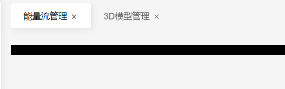

```javascript
const viewsComponent: Record<string, { [key: string]: any }> = import.meta.globEager('/src/views/backend/**/*.vue')


```


# Tabs管理

切换路由时，将历史路由目录保存到顶部



追踪到`src\layouts\backend\components\navBar\tabs.vue`

```javascript
<template>
    <div class="nav-tabs" ref="tabScrollbarRef">
        <div
            v-for="(item, idx) in navTabs.state.tabsView"
            @click="onTab(item)"
            @contextmenu.prevent="onContextmenu(item, $event)"
            class="ba-nav-tab"
            :class="navTabs.state.activeIndex == idx ? 'active' : ''"
            :ref="tabsRefs.set"
            :key="idx"
        >
            {{ item.title }}
            <transition @after-leave="selectNavTab(tabsRefs[navTabs.state.activeIndex])" name="el-fade-in">
                <Icon v-show="navTabs.state.tabsView.length > 1" class="close-icon" @click.stop="closeTab(item)" size="15" name="el-icon-Close" />
            </transition>
        </div>
        <div :style="activeBoxStyle" class="nav-tabs-active-box"></div>
    </div>
    <Contextmenu ref="contextmenuRef" :items="state.contextmenuItems" @contextmenuItemClick="onContextmenuItem" />
</template>

<script setup lang="ts">
import { nextTick, onMounted, reactive, ref } from 'vue'
import { useRoute, useRouter, onBeforeRouteUpdate, RouteLocationNormalized } from 'vue-router'
import { useConfig } from '/@/stores/config'
import { useNavTabs } from '/@/stores/navTabs'
import { viewMenu } from '/@/stores/interface'
import { useTemplateRefsList } from '@vueuse/core'
import type { ContextMenuItem, ContextmenuItemClickEmitArg } from '/@/components/contextmenu/interface'
import useCurrentInstance from '/@/utils/useCurrentInstance'
import Contextmenu from '/@/components/contextmenu/index.vue'
import horizontalScroll from '/@/utils/horizontalScroll'
import { getFirstRoute, routePush } from '/@/utils/router'

const route = useRoute()
const router = useRouter()
const config = useConfig()
const navTabs = useNavTabs()

const { proxy } = useCurrentInstance()
const tabScrollbarRef = ref()
const tabsRefs = useTemplateRefsList<HTMLDivElement>()

const contextmenuRef = ref()

const state: {
    contextmenuItems: ContextMenuItem[]
} = reactive({
    contextmenuItems: [
        { name: 'refresh', label: '重新加载', icon: 'fa fa-refresh' },
        { name: 'close', label: '关闭标签', icon: 'fa fa-times' },
        { name: 'fullScreen', label: '当前标签全屏', icon: 'el-icon-FullScreen' },
        { name: 'closeOther', label: '关闭其他标签', icon: 'fa fa-minus' },
        { name: 'closeAll', label: '关闭全部标签', icon: 'fa fa-stop' },
    ],
})

const activeBoxStyle = reactive({
    width: '0',
    transform: 'translateX(0px)',
})

const onTab = (menu: viewMenu) => {
    router.push({ path: menu.path, query: menu.query, params: menu.params })
}

const onContextmenu = (menu: viewMenu, el: MouseEvent) => {
    // 禁用刷新
    state.contextmenuItems[0].disabled = route.path !== menu.path
    // 禁用关闭其他和关闭全部
    state.contextmenuItems[4].disabled = state.contextmenuItems[3].disabled = navTabs.state.tabsView.length == 1 ? true : false

    const { clientX, clientY } = el
    contextmenuRef.value.onShowContextmenu(menu, {
        x: clientX,
        y: clientY,
    })
}

// tab 激活状态切换
const selectNavTab = function (dom: HTMLDivElement) {
    if (!dom) {
        return false
    }
    activeBoxStyle.width = dom.clientWidth + 'px'
    activeBoxStyle.transform = `translateX(${dom.offsetLeft}px)`

    let scrollLeft = dom.offsetLeft + dom.clientWidth - tabScrollbarRef.value.clientWidth
    if (dom.offsetLeft < tabScrollbarRef.value.scrollLeft) {
        tabScrollbarRef.value.scrollTo(dom.offsetLeft, 0)
    } else if (scrollLeft > tabScrollbarRef.value.scrollLeft) {
        tabScrollbarRef.value.scrollTo(scrollLeft, 0)
    }
}

const toLastTab = () => {
    const lastTab = navTabs.state.tabsView.slice(-1)[0]
    if (lastTab) {
        router.push(lastTab.path)
    } else {
        router.push('/admin')
    }
}

const closeTab = (route: viewMenu) => {
    navTabs.closeTab(route)
    proxy.eventBus.emit('onTabViewClose', route)
    if (navTabs.state.activeRoute?.path === route.path) {
        toLastTab()
    } else {
        navTabs.setActiveRoute(navTabs.state.activeRoute as viewMenu)
        nextTick(() => {
            selectNavTab(tabsRefs.value[navTabs.state.activeIndex])
        })
    }

    contextmenuRef.value.onHideContextmenu()
}

const closeAllTab = () => {
    navTabs.closeTabs(false)
    let firstRoute = getFirstRoute(navTabs.state.tabsViewRoutes)
    if (firstRoute) routePush('', {}, firstRoute.path)
}

const onContextmenuItem = async (item: ContextmenuItemClickEmitArg) => {
    const { name, menu } = item
    switch (name) {
        case 'refresh':
            proxy.eventBus.emit('onTabViewRefresh', menu)
            break
        case 'close':
            closeTab(menu as viewMenu)
            break
        case 'closeOther':
            navTabs.closeTabs(menu as viewMenu)
            navTabs.setActiveRoute(menu as viewMenu)
            if (navTabs.state.activeRoute?.path !== route.path) {
                router.push(menu!.path)
            }
            break
        case 'closeAll':
            closeAllTab()
            break
        case 'fullScreen':
            if (route.path !== menu?.path) {
                router.push(menu?.path as string)
            }
            navTabs.setFullScreen(true)
            break
    }
}

const updateTab = function (newRoute: RouteLocationNormalized | viewMenu) {
    // 添加tab
    navTabs.addTab(newRoute)
    // 激活当前tab
    navTabs.setActiveRoute(newRoute)

    nextTick(() => {
        selectNavTab(tabsRefs.value[navTabs.state.activeIndex])
    })
}

onBeforeRouteUpdate(async (to, from) => {
    updateTab(to)
})

onMounted(() => {
    updateTab(route)
    new horizontalScroll(tabScrollbarRef.value)
})
</script>

<style scoped lang="scss">
.nav-tabs {
    overflow-x: auto;
    overflow-y: hidden;
    margin-right: var(--main-space);
    scrollbar-width: none;

    &::-webkit-scrollbar {
        height: 5px;
    }
    &::-webkit-scrollbar-thumb {
        background: #eaeaea;
        border-radius: var(--el-border-radius-base);
        box-shadow: none;
        -webkit-box-shadow: none;
    }
    &::-webkit-scrollbar-track {
        background: v-bind('config.layout.layoutMode == "Default" ? "none":"config.layout.headerBarBackground"');
    }
    &:hover {
        &::-webkit-scrollbar-thumb:hover {
            background: #c8c9cc;
        }
    }
}
.ba-nav-tab {
    white-space: nowrap;
    height: 40px;
}
</style>

```

# `onBeforeRouteUpdate`钩子


当我们点击左侧导航栏到某个路由时，顶部Tab会发生变化，因此我们跟踪一下点击menu触发的事件: `src\layouts\backend\components\menuTree.vue`,

```
<el-menu-item :index="menu.path" :key="menu.path" @click="clickMenu(menu)">
```

触发了`clickMenu`，定位到`src\utils\router.ts`：

```javascript
export const clickMenu = (menu: viewMenu) => {
    switch (menu.type) {
        case 'tab':
            routePush(menu.name)
            break
        case 'link':
            window.open(menu.path, '_blank')
            break
        case 'iframe':
            routePush('', {}, menu.path)
            break

        default:
            ElNotification({
                message: i18n.global.t('utils.Navigation failed, the menu type is unrecognized!'),
                type: 'error',
            })
            break
    }
}
```

继续跟踪`routePush`：

```javascript
/**
 * 导航失败有错误消息的路由push
 * @param name 路由name
 * @param params 路由参数
 * @param path 路由path,通过path导航无法传递@param params
 */
export const routePush = async (name: string = '', params: anyObj = {}, path: string = '') => {
    try {
        const failure = await router.push(name ? { name: name, params: params } : { path: path })
        if (isNavigationFailure(failure, NavigationFailureType.aborted)) {
            ElNotification({
                message: i18n.global.t('utils.Navigation failed, navigation guard intercepted!'),
                type: 'error',
            })
        } else if (isNavigationFailure(failure, NavigationFailureType.duplicated)) {
            ElNotification({
                message: i18n.global.t('utils.Navigation failed, it is at the navigation target position!'),
                type: 'warning',
            })
        }
    } catch (error) {
        ElNotification({
            message: i18n.global.t('utils.Navigation failed, invalid route!'),
            type: 'error',
        })
        console.error(error)
    }
}
```

只是触发了路由的`push`方法，更新当前路由路径，那么我们继续分析路由的`beforeEach`和`afterEach`方法干了啥：

```javascript
router.beforeEach((to, from, next) => {
    NProgress.configure({ showSpinner: false })
    NProgress.start()
    if (!window.existLoading) {
        loading.show()
        window.existLoading = true
    }
    next()
})

// 路由加载后
router.afterEach((to, from) => {
    // console.log('after each @ to ', to)
    // console.log('after each @ from ', from)
    if (window.existLoading) {
        loading.hide()
    }
    NProgress.done()
})
```

是不是`NProgress`干了什么让Tabs发生变化呢？