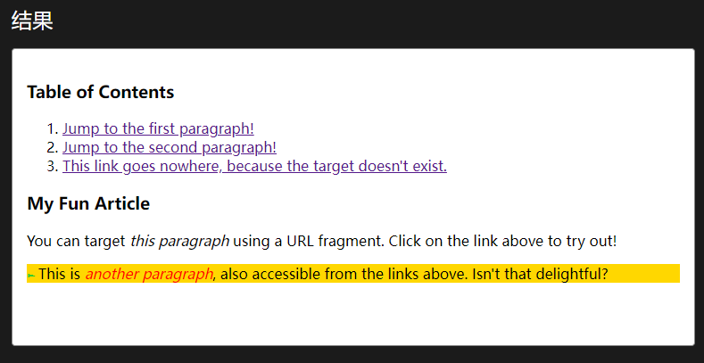

# CSS3 概要介绍

CSS3采用模块化结构，不同模块负责不同功能。这是为了避免浏览器对某些功能的不支持，如果只有一个总体结构，这个结构过于庞大，浏览器很难支持完全。现在浏览器可以有选择地支持某些模块。

# 选择器

## 属性选择器

- [att*=val] 包含指定字符串
- [att^=val] 以指定字符串开头
- [att$=val] 以指定字符串结尾

## not选择器

```
body *:not(h1){

}
```

`body *`表示选取body的所有子元素，使用`not`排除了h1元素。

## target选择器

配合书签使用`#val`，当用户点击超链接跳转到指定锚点时，该书签对应的Element会被添加样式。

```
<h3>Table of Contents</h3>
<ol>
 <li><a href="#p1">Jump to the first paragraph!</a></li>
 <li><a href="#p2">Jump to the second paragraph!</a></li>
 <li><a href="#nowhere">This link goes nowhere,
   because the target doesn't exist.</a></li>
</ol>

<h3>My Fun Article</h3>
<p id="p1">You can target <i>this paragraph</i> using a
  URL fragment. Click on the link above to try out!</p>
<p id="p2">This is <i>another paragraph</i>, also accessible
  from the links above. Isn't that delightful?</p>
```

```
p:target {
  background-color: gold;
}

/* 在目标元素中增加一个伪元素*/
p:target::before {
  font: 70% sans-serif;
  content: "►";
  color: limegreen;
  margin-right: .25em;
}

/*在目标元素中使用 italic 样式*/
p:target i {
  color: red;
}
```



## firset-child, laset-child, nth-child

[:nth-child - CSS（层叠样式表） | MDN (mozilla.org)](https://developer.mozilla.org/zh-CN/docs/Web/CSS/:nth-child)

**`:nth-child(an+b)`** 这个 [CSS 伪类](https://developer.mozilla.org/zh-CN/docs/Web/CSS/Pseudo-classes)首先找到所有当前元素的兄弟元素，然后按照位置先后顺序从 1 开始排序，选择的结果为 CSS 伪类:nth-child 括号中表达式（an+b）匹配到的元素集合（n=0，1，2，3...）。示例：

- `0n+3` 或简单的 `3` 匹配第三个元素。
- `1n+0` 或简单的 `n` 匹配每个元素。（兼容性提醒：在 Android 浏览器 4.3 以下的版本 `n` 和 `1n` 的匹配方式不一致。`1n` 和 `1n+0` 是一致的，可根据喜好任选其一来使用。）
- `2n+0` 或简单的 `2n` 匹配位置为 2、4、6、8...的元素（n=0 时，2n+0=0，第 0 个元素不存在，因为是从 1 开始排序)。你可以使用关键字 **`even`** 来替换此表达式。
- `2n+1` 匹配位置为 1、3、5、7...的元素。你可以使用关键字 **`odd`** 来替换此表达式。
- `3n+4` 匹配位置为 4、7、10、13...的元素。

```
html {
  font-family: sans-serif;
}

span,
div em {
  padding: 5px;
  border: 1px solid green;
  display: inline-block;
  margin-bottom: 3px;
}

.first span:nth-child(2n+1),
.second span:nth-child(2n+1),
.third span:nth-of-type(2n+1) {
  background-color: lime;
}
```

### [选择器示例](https://developer.mozilla.org/zh-CN/docs/Web/CSS/:nth-child#选择器示例)

- `tr:nth-child(2n+1)`

  表示 HTML 表格中的奇数行。

- `tr:nth-child(odd)`

  表示 HTML 表格中的奇数行。

- `tr:nth-child(2n)`

  表示 HTML 表格中的偶数行。

- `tr:nth-child(even)`

  表示 HTML 表格中的偶数行。

- `span:nth-child(0n+1)`

  表示子元素中第一个且为 span 的元素，与 [`:first-child`](https://developer.mozilla.org/zh-CN/docs/Web/CSS/:first-child) 选择器作用相同。

- `span:nth-child(1)`

  表示父元素中子元素为第一的并且名字为 span 的标签被选中

- `span:nth-child(-n+3)`

  匹配前三个子元素中的 span 元素。

## 伪类选择器

[伪类 - CSS（层叠样式表） | MDN (mozilla.org)](https://developer.mozilla.org/zh-CN/docs/Web/CSS/Pseudo-classes)

# 使用选择器插入内容

[伪元素 - CSS（层叠样式表） | MDN (mozilla.org)](https://developer.mozilla.org/zh-CN/docs/Web/CSS/Pseudo-elements)

## 插入文字

`content`属性

## 插入图像

`content:url(mark.png)`

## 使用content插入项目编号

这意味着要计数。

[使用 CSS 计数器 - CSS（层叠样式表） | MDN (mozilla.org)](https://developer.mozilla.org/zh-CN/docs/Web/CSS/CSS_Counter_Styles/Using_CSS_counters)

### 正向或反向计数器

`counter-reset`

你也可以同时初始化多个计数器，并可以指定其初始值。下面，我们将名为 `section` 和 `topic` 的计数器初始化为默认值，并将 `page` 计数器的初始值指定为 3。

```
counter-reset: section page 3 topic;
```

在初始化之后，计数器的值就可以使用 [`counter-increment`](https://developer.mozilla.org/zh-CN/docs/Web/CSS/counter-increment) 来指定其为递增或递减。例如，下面声明了一个随着 `h3` 标签递增的 `section` 计数器。

```
h3::before {
  counter-increment: section; /* Increment the value of section counter by 1 */
}
```

你可以在计数器的名称后指定单次递增或递减的值（正数或负数）。

```
h3::before {
  counter-increment: section -1;              
  /* Decrement the value of section counter by 1 */
  content: "Section " counter(section) ": "; 
  /* Display the word 'Section ', the value of section counter, and a colon before the content of each h3 */
}
```

# 文字与字体

## 添加引用 text-shadow属性

[text-shadow - CSS（层叠样式表） | MDN (mozilla.org)](https://developer.mozilla.org/zh-CN/docs/Web/CSS/text-shadow)

## 文本自动换行 word-break属性

[word-break - CSS（层叠样式表） | MDN (mozilla.org)](https://developer.mozilla.org/zh-CN/docs/Web/CSS/word-break)

## 长单词和URL换行 word-wrap属性

## 使用服务端字体

在CSS3之前，字体必须在客户端安装才能正常显示。

[@font-face - CSS（层叠样式表） | MDN (mozilla.org)](https://developer.mozilla.org/zh-CN/docs/Web/CSS/@font-face)

[@规则 - CSS（层叠样式表） | MDN (mozilla.org)](https://developer.mozilla.org/zh-CN/docs/Web/CSS/At-rule)