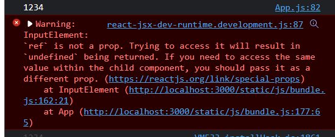
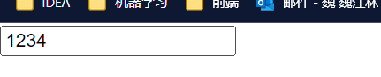

[Refs 转发 – React (reactjs.org)](https://zh-hans.reactjs.org/docs/forwarding-refs.html#gatsby-focus-wrapper)

将`ref`自动地通过组件传递给其自组件。

# 什么是refs

`refs`提供了一种方式，允许我们访问 **DOM 节点**或在 **render 方法**（类组件）中创建的 React 元素。

`ref`是作为组件的属性存在的，通过指定该属性的值，将React元素的实例保存到一个`ref`对象中。

函数组件没有实例，因此没有`ref`属性（`ref`是与组件实例绑定的，对于类组件，我们可以通过类组件的ref调用类组件上定义的方法）。

虽然函数组件自身没有`ref`属性，我们可以在任何组件中使用`ref`，只要它指向DOM元素或者类组件。

## 三种该属性的值

- useRef创建的对象
- 回调函数
- 字符串（历史遗留API）

## 函数组件使用ref

思考为什么函数组件不能有ref属性？

一个思路：我们可以给函数组件的props添加一个ref属性，父组件调用时传递一个对象，在子组件中给该对象赋值。

```tsx
function InputElement(props) {
  console.log(props.name)
  return (
    <input ref={props.ref}></input>
  )
}

function App() {
  const inputRef = useRef(null);

  useEffect(() => {
    inputRef.current.value = '1234';
  }, [])

  return <InputElement name='1234' ref={inputRef} />
}
```



可以看到我们不能将ref定义为属性。

为了让函数组件使用`ref`属性，可以使用`React.forwardRef`：

```tsx
const InputElement1 = React.forwardRef((props, ref)=>{
  console.log(props.name)
  return (
    <input ref={ref}></input>
  ) 
})

function App() {
  const inputRef = useRef(null);

  useEffect(() => {
    inputRef.current.value = '1234';
  }, [])

  return <InputElement1 name='1234' ref={inputRef} />
}
```

