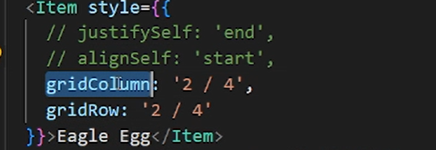
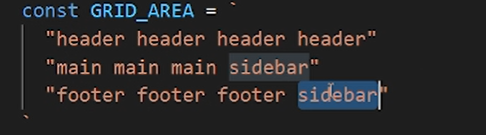
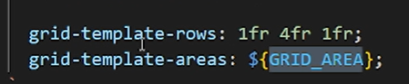
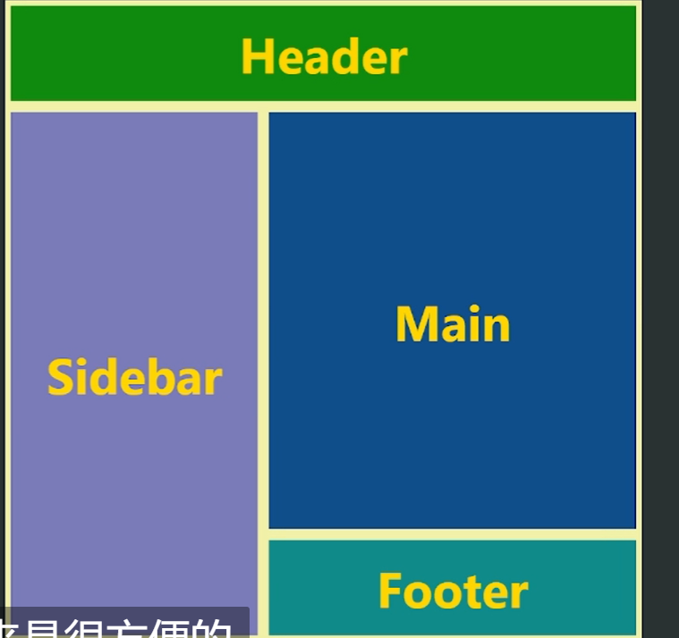

[Grid | Codrops (tympanus.net)](https://tympanus.net/codrops/css_reference/grid/)

[flex布局](./flex布局.md)

# 与flex布局的区别

- flex不能保证每一行有多少个元素，因为它只有行的概念，所有元素本质上处于同一行，只是会自动换行

# 子元素单独控制

# 使用`GridArea`用模板进行控制

定义一个3行四列的模板：

定义行的比例和使用模板：

通过定义列的比例和压缩，改变布局（基本布局不变）。

# 属性分析

## grid-template-columns

