[Tutorial v6.4.2 | React Router](https://reactrouter.com/en/main/start/tutorial)

## 初始化项目

```javascript
import React from "react";
import ReactDOM from "react-dom/client";
import {
  createBrowserRouter,
  RouterProvider,
  Route,
} from "react-router-dom";
import "./index.css";


const router = createBrowserRouter([
  {
    path: "/",
    element: <div>Hello world!</div>,
  },
]);

ReactDOM.createRoot(document.getElementById("root")).render(
  <React.StrictMode>
    <RouterProvider router={router} />
  </React.StrictMode>
);
```

### 准备额外文件

在`src`目录下需要创建和编辑`index.css`和`contacts.js`文件

[css](https://gist.githubusercontent.com/ryanflorence/ba20d473ef59e1965543fa013ae4163f/raw/499707f25a5690d490c7b3d54c65c65eb895930c/react-router-6.4-tutorial-css.css)

[js](https://gist.githubusercontent.com/ryanflorence/1e7f5d3344c0db4a8394292c157cd305/raw/f7ff21e9ae7ffd55bfaaaf320e09c6a08a8a6611/contacts.js)

## 创建DEMO主界面并修改路由

```
const router = createBrowserRouter([
  {
    path: "/",
    element: <Root />,
  },
]);
```

`routes/root.tsx` 定义Root组件

```
export default function Root() {
    return (
      <>
        <div id="sidebar">
          <h1>React Router Contacts</h1>
          <div>
            <form id="search-form" role="search">
              <input
                id="q"
                aria-label="Search contacts"
                placeholder="Search"
                type="search"
                name="q"
              />
              <div
                id="search-spinner"
                aria-hidden
                hidden={true}
              />
              <div
                className="sr-only"
                aria-live="polite"
              ></div>
            </form>
            <form method="post">
              <button type="submit">New</button>
            </form>
          </div>
          <nav>
            <ul>
              <li>
                <a href={`contacts/1`}>Your Name</a>
              </li>
              <li>
                <a href={`contacts/2`}>Your Friend</a>
              </li>
            </ul>
          </nav>
        </div>
        <div id="detail"></div>
      </>
    );
  }
```

### 现在看起来

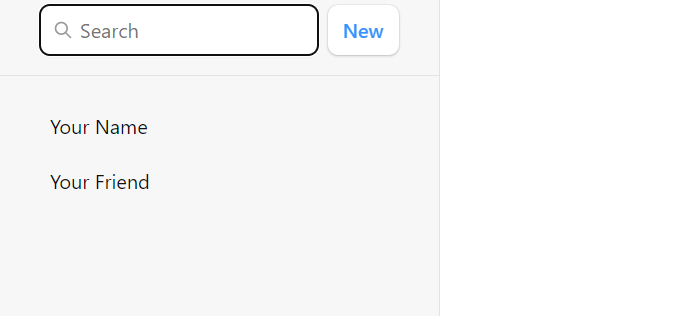

## 添加error界面

函数时编程，`useRouteError`函数获取出错信息

```javascript
import { useRouteError } from "react-router-dom";

export default function ErrorPage() {
  const error = useRouteError();
  console.error(error);

  return (
    <div id="error-page">
      <h1>Oops!</h1>
      <p>Sorry, an unexpected error has occurred.</p>
      <p>
        <i>{error.statusText || error.message}</i>
      </p>
    </div>
  );
}
```

### 注册error界面

`main.tsx`

```
import ErrorPage from "./error-page";


const router = createBrowserRouter([
  {
    path: "/",
    element: <Root />,
    errorElement: <ErrorPage />,
  },
]);
```

当路由出错时：

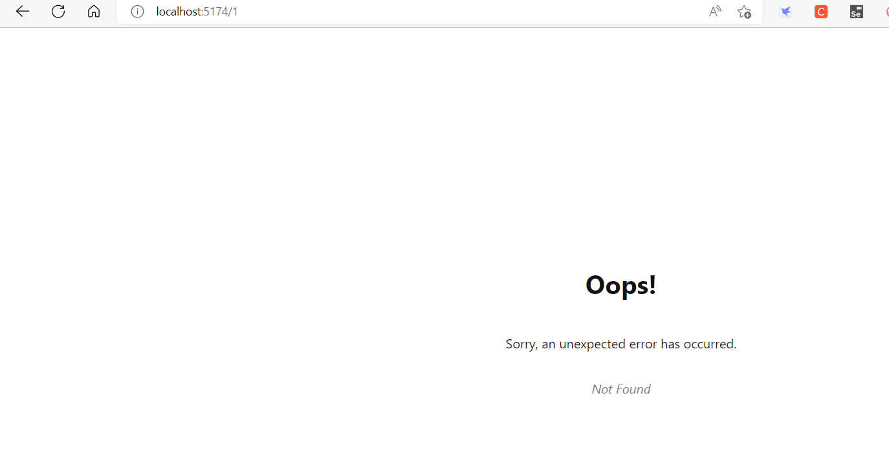

Note that [`useRouteError`](https://reactrouter.com/en/main/hooks/use-route-error) provides the error that was thrown. When the user navigates to routes that don't exist you'll get an [error response](https://reactrouter.com/en/main/utils/is-route-error-response) with a "Not Found" `statusText`. We'll see some other errors later in the tutorial and discuss them more.

For now, it's enough to know that pretty much all of your errors will now be handled by this page instead of infinite spinners, unresponsive pages, or blank screens 🙌

## 联系人组件

声明组件`routes/contact.tsx`

```typescript
import { Form } from "react-router-dom";

export default function Contact() {
  const contact = {
    first: "Your",
    last: "Name",
    avatar: "https://placekitten.com/g/200/200",
    twitter: "your_handle",
    notes: "Some notes",
    favorite: true,
  };

  return (
    <div id="contact">
      <div>
        
      </div>

      <div>
        <h1>
          {contact.first || contact.last ? (
            <>
              {contact.first} {contact.last}
            </>
          ) : (
            <i>No Name</i>
          )}{" "}
          <Favorite contact={contact} />
        </h1>

        {contact.twitter && (
          <p>
            <a
              target="_blank"
              href={`https://twitter.com/${contact.twitter}`}
            >
              {contact.twitter}
            </a>
          </p>
        )}

        {contact.notes && <p>{contact.notes}</p>}

        <div>
          <Form action="edit">
            <button type="submit">Edit</button>
          </Form>
          <Form
            method="post"
            action="destroy"
            onSubmit={(event) => {
              if (
                !confirm(
                  "Please confirm you want to delete this record."
                )
              ) {
                event.preventDefault();
              }
            }}
          >
            <button type="submit">Delete</button>
          </Form>
        </div>
      </div>
    </div>
  );
}

function Favorite({ contact }) {
  // yes, this is a `let` for later
  let favorite = contact.favorite;
  return (
    <Form method="post">
      <button
        name="favorite"
        value={favorite ? "false" : "true"}
        aria-label={
          favorite
            ? "Remove from favorites"
            : "Add to favorites"
        }
      >
        {favorite ? "★" : "☆"}
      </button>
    </Form>
  );
}
```

### 注册路由组件

```
import Contact from "./routes/contact";

const router = createBrowserRouter([
  {
    path: "/",
    element: <Root />,
    errorElement: <ErrorPage />,
  },
  {
    path: "contacts/:contactId",
    element: <Contact />,
  },
]);
```

现在`contacts`会单独在一个页面中显示，我们希望他在`Root`组件右侧显示，即搜索后，在右侧显示联系人信息。

## 嵌套路由Nested Routes

```
const router = createBrowserRouter([
  {
    path: "/",
    element: <Root />,
    errorElement: <ErrorPage />,
    children: [
      {
        path: "contacts/:contactId",
        element: <Contact />,
      },
    ],
  },
]);
```

原本的Root组件结构

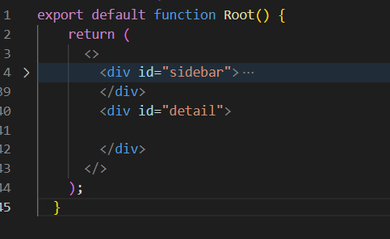

我们的目的是在Root组件里面显示下级路由组件`Contacts`的内容，官方是这样做的：

```
import { Outlet } from "react-router-dom";

<div id="detail">
	<Outlet />
</div>
```

在一个空div中，添加了`Outlet`组件，那么我们可以猜到，子路由的组件将渲染到该位置。

效果：

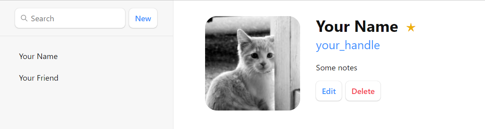

### Outlet组件的官方说明

[Outlet v6.4.2 | React Router](https://reactrouter.com/en/main/components/outlet)

An `<Outlet>` should be used in parent route elements to render their child route elements. This allows nested UI to show up when child routes are rendered. If the parent route matched exactly, it will render a child index route or nothing if there is no index route.

在父路由元素中应该使用` <Outlet> `来呈现子路由元素。这允许在呈现子路由时显示嵌套UI。如果父路由完全匹配，它将呈现子索引路由，如果没有索引路由则不呈现子索引路由。

 ## 修改左侧跳转标签

将<a>标签替换为<Link>组件

```
 <ul>
  <li>
  	<Link to={`contacts/1`}>Your Name</Link>
  </li>
  <li>
  	<Link to={`contacts/2`}>Your Friend</Link>
  </li>
</ul>
```

## 根据id加载数据

> URL段、布局、数据经常耦合在一起，例如：

| URL Segment  | Component   | Data               |
| ------------ | ----------- | ------------------ |
| /            | `<Root>`    | list of contacts   |
| contacts/:id | `<Contact>` | individual contact |

因此，React Router定义了一些约定(data conventions) 帮助将数据传给路由组件，包括`loader`和`useLoaderData`.

在`root.tsx`中导出一个`loader`函数：

```
import { getContacts } from "../contacts";

export async function loader() {
  const contacts = await getContacts();
  return { contacts };
}
```

### loader

[loader v6.4.2 | React Router](https://reactrouter.com/en/main/route/loader)

> Each route can define a "loader" function to provide data to the route element before it renders.

在路由组件渲染前（挂载）给组件传递数据。

### 路由组件获取数据并显示

`root.tsx`

```
import {
  useLoaderData,
} from "react-router-dom";

/* other code */

export default function Root() {
  const { contacts } = useLoaderData();
  return (
    <>
      <div id="sidebar">
        <h1>React Router Contacts</h1>
        {/* other code */}

        <nav>
          {contacts.length ? (
            <ul>
              {contacts.map((contact) => (
                <li key={contact.id}>
                  <Link to={`contacts/${contact.id}`}>
                    {contact.first || contact.last ? (
                      <>
                        {contact.first} {contact.last}
                      </>
                    ) : (
                      <i>No Name</i>
                    )}{" "}
                    {contact.favorite && <span>★</span>}
                  </Link>
                </li>
              ))}
            </ul>
          ) : (
            <p>
              <i>No contacts</i>
            </p>
          )}
        </nav>

        {/* other code */}
      </div>
    </>
  );
}
```

### 效果

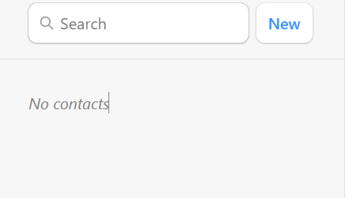

由于`getContacts`没有接收到参数，所以返回的是空对象。显示无联系人

## Data Writes + HTML Forms

Root组件中的`New`按钮触发了表单提交事件

```
								<div>
                    <form id="search-form" role="search">
                        <input
                            id="q"
                            aria-label="Search contacts"
                            placeholder="Search"
                            type="search"
                            name="q"
                        />
                        <div
                            id="search-spinner"
                            aria-hidden
                            hidden={true}
                        />
                        <div
                            className="sr-only"
                            aria-live="polite"
                        ></div>
                    </form>
                    <form method="post">
                        <button type="submit">New</button>
                    </form>
                </div>
```

[Tutorial v6.4.2 | React Router](https://reactrouter.com/en/main/start/tutorial#data-writes--html-forms)

> While unfamiliar to some web developers, HTML forms actually cause a navigation in the browser, just like clicking a link. The only difference is in the request: links can only change the URL while forms can also change the request method (GET vs POST) and the request body (POST form data).

虽然对一些web开发人员来说并不熟悉，但HTML表单实际上会在浏览器中产生导航，就像点击链接一样。唯一的区别在于请求:链接只能更改URL，而表单还可以更改请求方法(GET vs POST)和请求体(POST表单数据)。

> Instead of sending that POST to the Vite server to create a new contact, let's use client side routing instead.

取消触发传统表达事件处理，把这个url链接交给路由处理。

## 创建Contacts

[Tutorial v6.4.2 | React Router](https://reactrouter.com/en/main/start/tutorial#creating-contacts)

`root.tsx`

```
import {
  Outlet,
  Link,
  useLoaderData,
  Form,
} from "react-router-dom";
import { getContacts, createContact } from "../contacts";

export async function action() {
  await createContact();
}

/* other code */

export default function Root() {
  const { contacts } = useLoaderData();
  return (
    <>
      <div id="sidebar">
        <h1>React Router Contacts</h1>
        <div>
          {/* other code */}
          <Form method="post">
            <button type="submit">New</button>
          </Form>
        </div>

        {/* other code */}
      </div>
    </>
  );
}
```

导出了一个事件处理函数`action`。

`main.ts`

定义路由时，添加`action`属性

```
import Root, {
  loader as rootLoader,
  action as rootAction,
} from "./routes/root";

const router = createBrowserRouter([
  {
    path: "/",
    element: <Root />,
    errorElement: <ErrorPage />,
    loader: rootLoader,
    action: rootAction,
    children: [
      {
        path: "contacts/:contactId",
        element: <Contact />,
      },
    ],
  },
]);
```

### 效果

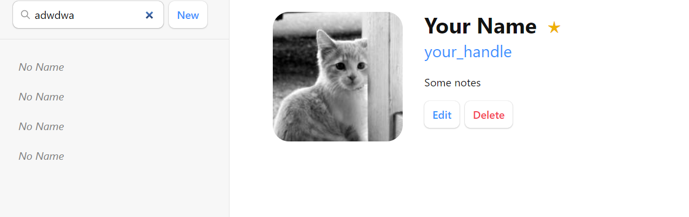

能够添加联系人了，但是联系人属性没有保存。

The `createContact` method just creates an empty contact with no name or data or anything. But it does still create a record, promise!

> 🧐 Wait a sec ... How did the sidebar update? Where did we call the `action`? Where's the code to refetch the data? Where are `useState`, `onSubmit` and `useEffect`?!

这就是“old school web”编程模式出现的地方。正如我们前面所讨论的，阻止浏览器将请求发送到服务器，而是将其发送到您的路由操作。在web语义中，POST通常意味着某些数据正在发生变化。按照约定，React Router将此作为提示，在操作完成后自动重新验证页面上的数据。这意味着所有的**useLoaderData钩子都会更新**，UI会自动与您的数据保持同步!很酷。

 ## 点击record显示对应信息

点击联系人record后，链接变成`contacts/xxxx`。

看一下路由声明：

```
[
  {
    path: "contacts/:contactId",
    element: <Contact />,
  },
];
```

> These [`params`](https://reactrouter.com/en/main/route/loader#params) are passed to the loader with keys that match the dynamic segment. For example, our segment is named `:contactId` so the value will be passed as `params.contactId`.
>
> These params are most often used to find a record by ID. Let's try it out.

`contact.tsx`

使用params

```
import { Form, useLoaderData } from "react-router-dom";
import { getContact } from "../contacts";

export async function loader({ params }) {
  return getContact(params.contactId);
}

export default function Contact() {
  // const contact = {
  //   first: "Your",
  //   last: "Name",
  //   avatar: "https://placekitten.com/g/200/200",
  //   twitter: "your_handle",
  //   notes: "Some notes",
  //   favorite: true,
  // };
  const contact = useLoaderData();
  // existing code
}
```

### 效果

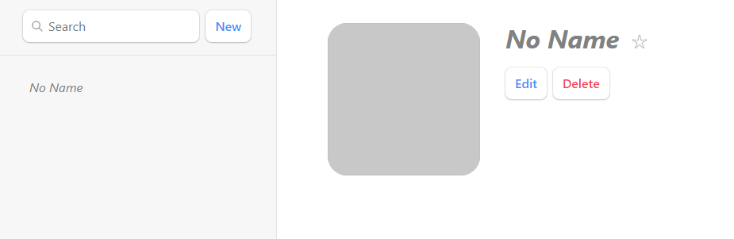

## 数据存储

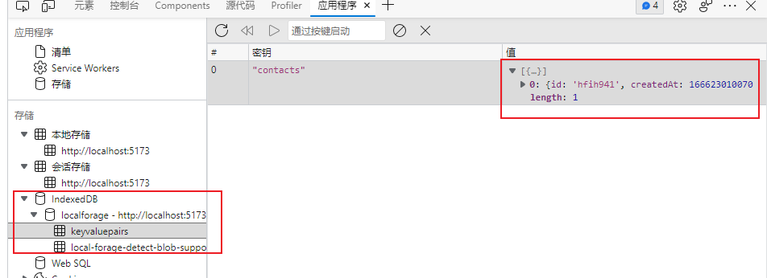

`localforage`

## 编辑数据

Just like creating data, you update data with`Form`. Let's make a new route at `contacts/:contactId/edit`. Again, we'll start with the component and then wire it up to the route config.

### 新建组件`edit.tsx`

```
import { Form, useLoaderData } from "react-router-dom";

export default function EditContact() {
  const contact = useLoaderData();

  return (
    <Form method="post" id="contact-form">
      <p>
        <span>Name</span>
        <input
          placeholder="First"
          aria-label="First name"
          type="text"
          name="first"
          defaultValue={contact.first}
        />
        <input
          placeholder="Last"
          aria-label="Last name"
          type="text"
          name="last"
          defaultValue={contact.last}
        />
      </p>
      <label>
        <span>Twitter</span>
        <input
          type="text"
          name="twitter"
          placeholder="@jack"
          defaultValue={contact.twitter}
        />
      </label>
      <label>
        <span>Avatar URL</span>
        <input
          placeholder="https://example.com/avatar.jpg"
          aria-label="Avatar URL"
          type="text"
          name="avatar"
          defaultValue={contact.avatar}
        />
      </label>
      <label>
        <span>Notes</span>
        <textarea
          name="notes"
          defaultValue={contact.notes}
          rows={6}
        />
      </label>
      <p>
        <button type="submit">Save</button>
        <button type="button">Cancel</button>
      </p>
    </Form>
  );
}
```

### 添加路由

`main.tsx`

```
const router = createBrowserRouter([
  {
    path: "/",
    element: <Root />,
    errorElement: <ErrorPage />,
    loader: rootLoader,
    action: rootAction,
    children: [
      {
        path: "contacts/:contactId",
        element: <Contact />,
        loader: contactLoader,
      },
      {
        path: "contacts/:contactId/edit",
        element: <EditContact />,
        loader: contactLoader,
      },
    ],
  },
]);
```

### 效果

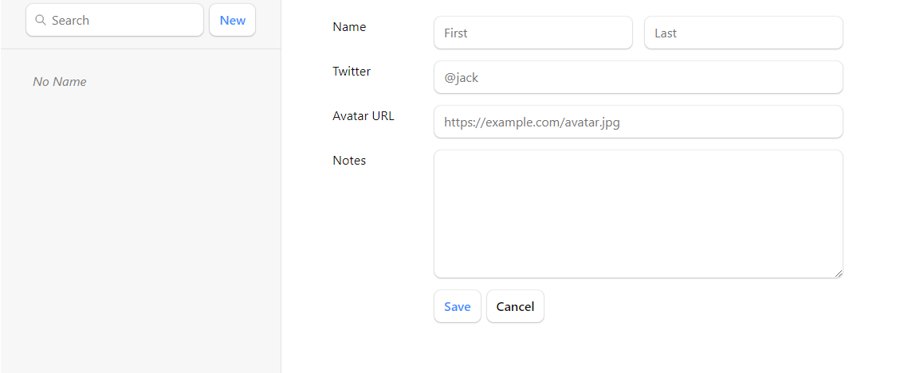

### 注意

(You might note we reused the `contactLoader` for this route. This is only because we're being lazy in the tutorial. **There is no reason to attempt to share loaders among routes**, they usually have their own.)

## 保存edit数据

与之前相同，自定义表单Action事件，避免将请求发送给服务器

`edit.tsx`

```
import {
  Form,
  useLoaderData,
  redirect,
} from "react-router-dom";
import { updateContact } from "../contacts";

export async function action({ request, params }) {
  const formData = await request.formData();
  const updates = Object.fromEntries(formData);
  await updateContact(params.contactId, updates);
  return redirect(`/contacts/${params.contactId}`);
}

/* existing code */
```

之后与之前一样在`main.tsx`中声明action属性。

### 深入讨论

修改是如何生效的，以及页面如何触发重新渲染？

如果没有添加额外js代码。当表单提交时，浏览器将会创建[`FormData`](https://developer.mozilla.org/en-US/docs/Web/API/FormData)，并将其作为request的body发送给服务器。

React Router将发送给服务器的request转交给action，并阻止其发送给服务器。

```
export async function action({ request, params }) {
  const formData = await request.formData();
  const firstName = formData.get("first");
  const lastName = formData.get("last");
  // ...
}
```

除了`from`的`action`（react router提供），所有api如：`request`, `request.formData`都是web平台提供的。

> Loaders and actions can both [return a `Response`](https://reactrouter.com/en/main/route/loader#returning-responses) (makes sense, since they received a [`Request`](https://developer.mozilla.org/en-US/docs/Web/API/Request)!). The [`redirect`](https://reactrouter.com/en/main/fetch/redirect) helper just makes it easier to return a [response](https://developer.mozilla.org/en-US/docs/Web/API/Response) that tells the app to change locations.

> Without client side routing, if a server redirected after a POST request, the new page would fetch the latest data and render. As we learned before, React Router emulates this model and automatically revalidates the data on the page after the action. That's why the sidebar automatically updates when we save the form. The extra revalidation code doesn't exist without client side routing, so it doesn't need to exist with client side routing either!

如果没有客户端路由，如果服务器在POST请求后重定向，新页面将获取最新数据并呈现。正如我们以前学到的，**React Router模拟这个模型**，并在操作之后自动重新验证页面上的数据。这就是为什么当我们保存表单时，侧栏会自动更新。在没有客户端路由的情况下，额外的重新验证代码是不存在的，所以在没有客户端路由的情况下，它也不需要存在!

 ## 添加record后重定向到编辑页面

`root.tsx`中的`action`返回重定向

```
import {
  Outlet,
  Link,
  useLoaderData,
  Form,
  redirect,
} from "react-router-dom";
import { getContacts, createContact } from "../contacts";

export async function action() {
  const contact = await createContact();
  return redirect(`/contacts/${contact.id}/edit`);
}
```

## 使用NavLink高亮所选联系人标签

```
<NavLink
  to={`contacts/${contact.id}`}
  className={({ isActive, isPending }) =>
    isActive
      ? "active"
      : isPending
      	? "pending"
        : ""
  }
>
{/* other code */}
</NavLink>
```

当我们在`<NavLink>`所指定的路由时，`isActive`会被设置为`true`，When it's *about* to be active (the data is still loading) then `isPending` will be true. This allows us to easily indicate where the user is, as well as provide immediate feedback on links that have been clicked but we're still waiting for data to load.

### 效果

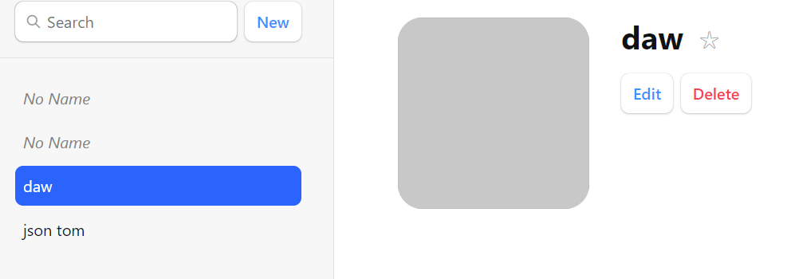

## 全局等待UI

当用户导航应用程序时，React Router将离开旧的页面，因为数据正在为下一页加载。你可能已经注意到，当你在列表之间点击时，**应用程序感觉有点没有反应**。让我们为用户提供一些反馈，这样应用程序就不会感到没有响应。

React Router在幕后管理所有的状态，并揭示你构建动态web应用所需要的部分。在本例中，我们将使用`usenavnavigation`钩子。

 `root.tsx`

```
import {
  // existing code
  useNavigation,
} from "react-router-dom";

// existing code

export default function Root() {
  const { contacts } = useLoaderData();
  const navigation = useNavigation();

  return (
    <>
      <div id="sidebar">{/* existing code */}</div>
      <div
        id="detail"
        className={
          navigation.state === "loading" ? "loading" : ""
        }
      >
        <Outlet />
      </div>
    </>
  );
}
```

[`useNavigation`](https://reactrouter.com/en/main/hooks/use-navigation) returns the current navigation state: it can be one of `"idle" | "submitting" | "loading"`.

表示当前路由状态

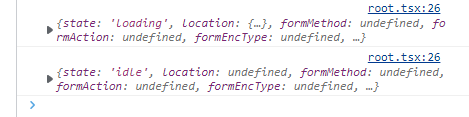

```
#detail.loading {
  opacity: 0.25;
  transition: opacity 200ms;
  transition-delay: 200ms;
}
```

## 删除记录


edit按钮事件以及处理好，接下来处理删除事件，同样是发送post请求。

`contact.tsx`

```
<Form
  method="post"
  action="destroy"
  onSubmit={(event) => {
    if (
      !confirm(
        "Please confirm you want to delete this record."
      )
    ) {
      event.preventDefault();
    }
  }}
>
  <button type="submit">Delete</button>
</Form>
```

这里直接在Form组件中写了action属性，因此发出的请求url是**contact/:contactId/destroy**；

所有我们需要注册这个路由，并为这个路由添加action属性。

`destroy.tsx`

```
import { redirect } from "react-router-dom";
import { deleteContact } from "../contacts";

export async function action({ params }) {
  await deleteContact(params.contactId);
  return redirect("/");
}
```

`main.tsx`

```
      {
        path: "contacts/:contactId/destroy",
        action: deleteAction,
      },
```

## 尝试删除出错场景

手动抛出错误

`destroy.tsx`

```
export async function action({ params }) {
  throw new Error("oh dang!");
  await deleteContact(params.contactId);
  return redirect("/");
}
```

配置路由组件的错误处理组件

```
[
  /* other routes */
  {
    path: "contacts/:contactId/destroy",
    action: destroyAction,
    errorElement: <div>Oops! There was an error.</div>,
  },
];
```

### 效果

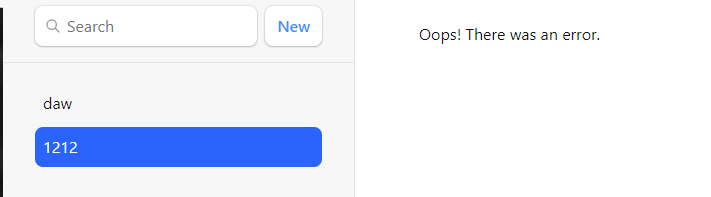

### 错误冒泡

当不为`contacts/:contactId/destroy`路由对应的`errorElement`时，error会像上级组件传递，即被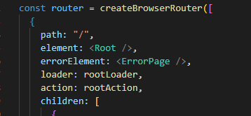处理。

效果为：

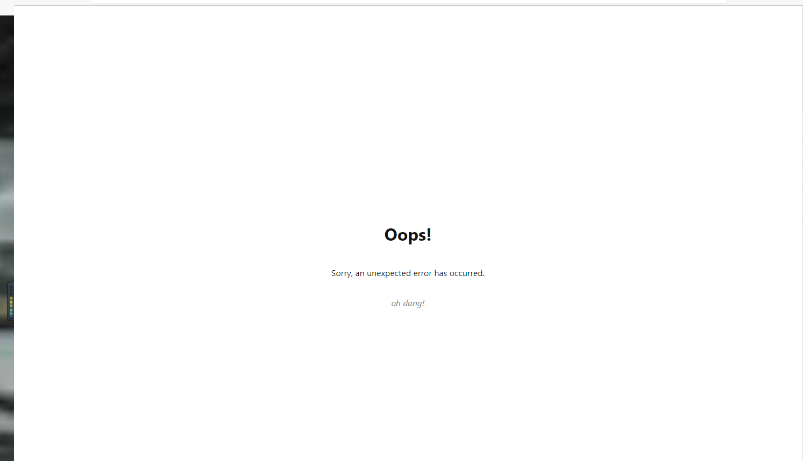

## Index组件

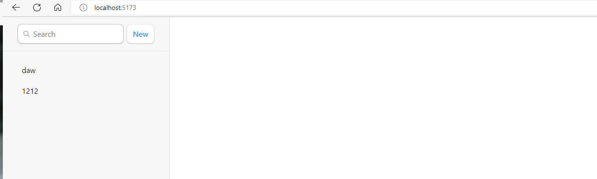

当子路由没有任何匹配时，右侧是空白的，我们希望其显示一些默认内容，例如数据统计等。

像传统web一样，我们会显示目录下的index.html文件，在react路由中，我们可以声明index组件，当路由与当前路由完全匹配时（没有子路由匹配），显示index组件。

### 创建index组件

`index.tsx`

```
export default function Index() {
  return (
    <p id="zero-state">
      This is a demo for React Router.
      <br />
      Check out{" "}
      <a href="https://reactrouter.com/">
        the docs at reactrouter.com
      </a>
      .
    </p>
  );
}
```

### 声明index路由

```
 children: [
      {
        index: true,
        element: <Index></Index>
      },
```

### 效果

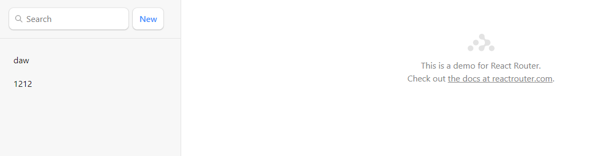

> Note the [`{ index:true }`](https://reactrouter.com/en/main/route/route#index) instead of [`{ path: "" }`](https://reactrouter.com/en/main/route/route#path). That tells the router to match and render this route when the user is at the parent route's exact path, so there are no other child routes to render in the `<Outlet>`.

## 放弃编辑并返回

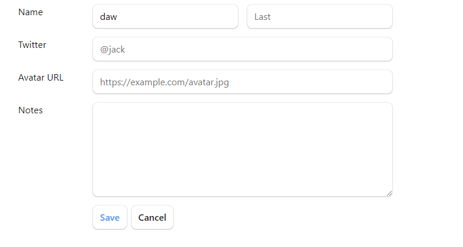

`edit.tsx`

```
import {
  Form,
  useLoaderData,
  redirect,
  useNavigate,
} from "react-router-dom";

export default function Edit() {
  const contact = useLoaderData();
  const navigate = useNavigate();

  return (
    <Form method="post" id="contact-form">
      {/* existing code */}

      <p>
        <button type="submit">Save</button>
        <button
          type="button"
          onClick={() => {
            navigate(-1);
          }}
        >
          Cancel
        </button>
      </p>
    </Form>
  );
}
```

Now when the user clicks "Cancel", they'll be sent back one entry in the browser's history.

> 🧐 Why is there no `event.preventDefault` on the button?

A `<button type="button">`, while seemingly redundant, **is the HTML way of preventing a button from submitting its form**.

Two more features to go. We're on the home stretch!

## URL Search参数和Get请求

> All of our interactive UI so far have been either links that change the URL or forms that post data to actions. The search field is interesting because it's a mix of both: it's a form but it only changes the URL, it doesn't change data.

到目前为止，我们所有的交互UI都是**更改URL的链接**或将数据发布到操作的**表单**。搜索字段很有趣，因为它是两者的混合:它是一个表单，但它只改变URL，不改变数据。

 ### look at传统form

> Note the browser's URL now contains your query in the URL as [URLSearchParams](https://developer.mozilla.org/en-US/docs/Web/API/URLSearchParams):

```
http://127.0.0.1:5173/?q=ryan
```

`root.tsx`

```
<form id="search-form" role="search">
  <input
    id="q"
    aria-label="Search contacts"
    placeholder="Search"
    type="search"
    name="q"
  />
  <div id="search-spinner" aria-hidden hidden={true} />
  <div className="sr-only" aria-live="polite"></div>
</form>
```

> As we've seen before, browsers can serialize forms by the `name` attribute of it's input elements. The name of this input is `q`, that's why the URL has `?q=`. If we named it `search` the URL would be `?search=`.
>
> Note that this form is different from the others we've used, it does not have `<form method="post">`. The default `method` is `"get"`. That means when the browser creates the request for the next document, it doesn't put the form data into the request POST body, but into the [`URLSearchParams`](https://developer.mozilla.org/en-US/docs/Web/API/URLSearchParams) of a GET request.

使用GET请求方式的化，参数会加在路径中，而不是加在请求体中。

### 客户端路由处理Get请求

`root.tsx`

将form改为Form组件

```
<Form id="search-form" role="search">
  <input
    id="q"
    aria-label="Search contacts"
    placeholder="Search"
    type="search"
    name="q"
  />
  <div id="search-spinner" aria-hidden hidden={true} />
  <div className="sr-only" aria-live="polite"></div>
</Form>
```

获取参数

```
export async function loader({ request }) {
  const url = new URL(request.url);
  const q = url.searchParams.get("q");
  const contacts = await getContacts(q);
  return { contacts };
}
```

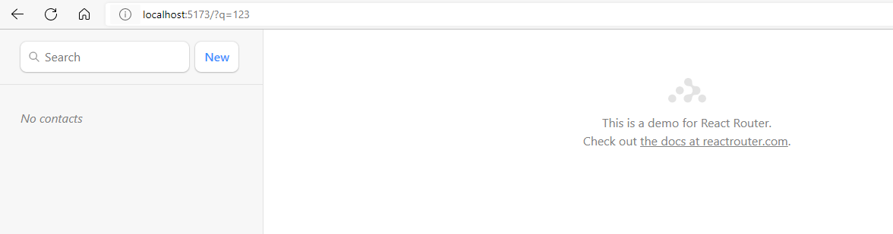

> Because this is a GET, not a POST, React Router *does not* call the `action`. Submitting a GET form is the same as clicking a link: only the URL changes. That's why the code we added for filtering is in the `loader`, not the `action` of this route.
>
> This also means it's a normal page navigation. You can click the back button to get back to where you were.

由于这是GET请求，不是POST请求，不会触发路由的action，提交GET表单和点击一个链接效果是相同的，只有url发送改变。这也是为什么我们只在loader中添加了代码，而不是action。

## 同步url参数和表单状态

目前存在的问题：

1. 如果在搜索后单击返回，即使不再过滤列表，表单字段仍然具有您输入的值。
2. 如果在搜索后刷新页面，表单字段中不再有该值，即使列表已被过滤。

即表单状态与url不同步。

### 解决方案

获取url中的参数，并将其填充到表单中

- 在loader中返回url参数
- 定义函数组件时，将loader返回的参数填充到表单中

```
export async function loader({ request }) {
  const url = new URL(request.url);
  const q = url.searchParams.get("q");
  const contacts = await getContacts(q);
  return { contacts, q };
}
```

```
const { contacts, q } = useLoaderData();

defaultValue={q}
```

根据测试目前是没有问题的，但是官方提到这只解决了第二个问题，第一个问题没有解决。

但是假设当前url是：http://localhost:5173/，设搜索后的url是http://localhost:5173/?q=12，

返回后是没有问题的，因为获取到的q是空，填充到表单也是空。

这是因为没有将form改为Form，点击回车后触发了form表单的事件，触发页面更新，而使用Form组件后，页面不会更新，不会重新触发loader，因此页面不会更新。（**会重新进行渲染，但根据react的Diff算法，不会刷新DOM**）

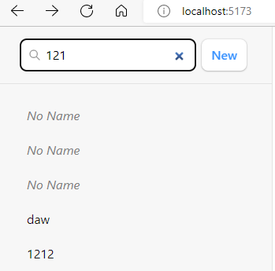


当我们刷新后，表单输入才会变成空。

### useEffect

[Hook API 索引 – React (reactjs.org)](https://zh-hans.reactjs.org/docs/hooks-reference.html#useeffect)

该 Hook 接收一个包含命令式、且可能有副作用代码的函数。

在函数组件主体内（这里指在 React 渲染阶段）改变 DOM、添加订阅、设置定时器、记录日志以及执行其他包含副作用的操作都是不被允许的，因为这可能会产生莫名其妙的 bug 并破坏 UI 的一致性。

使用 `useEffect` 完成副作用操作。赋值给 `useEffect` 的函数会在**组件渲染到屏幕之后执行**。你可以把 effect 看作从 React 的纯函数式世界通往命令式世界的逃生通道。

默认情况下，effect 将在每轮渲染结束后执行，但你可以选择让它 [在只有某些值改变的时候](https://zh-hans.reactjs.org/docs/hooks-reference.html#conditionally-firing-an-effect) 才执行。

#### 清除 effect

通常，组件卸载时需要清除 effect 创建的诸如订阅或计时器 ID 等资源。要实现这一点，`useEffect` 函数需返回一个清除函数。以下就是一个创建订阅的例子：

#### 执行时机

与 `componentDidMount`、`componentDidUpdate` 不同的是，传给 `useEffect` 的函数会在浏览器完成布局与绘制**之后**，在一个延迟事件中被调用。这使得它适用于许多常见的副作用场景，比如设置订阅和事件处理等情况，因为绝大多数操作不应阻塞浏览器对屏幕的更新。

#### effect 的条件执行

默认情况下，effect 会在每轮组件渲染完成后执行。这样的话，一旦 effect 的依赖发生变化，它就会被重新创建。

然而，在某些场景下这么做可能会矫枉过正。比如，在上一章节的订阅示例中，我们不需要在每次组件更新时都创建新的订阅，而是仅需要在 `source` prop 改变时重新创建。

要实现这一点，可以给 `useEffect` 传递第二个参数，它是 effect 所依赖的值数组。更新后的示例如下：

### 解决问题1

使用useEffect的条件执行

```
  useEffect(() => {
    document.getElementById("q").value = q;
  }, [q]);
```

#### 完全受控组件模式

```
const [query, setQuery] = useState(q);

            <input
              id="q"
              aria-label="Search contacts"
              placeholder="Search"
              type="search"
              name="q"
              value={query}
              onChange={(e) => {
                setQuery(e.target.value);
              }}
            />
```

### 每当表单状态改变时，触发搜索

```
onChange={(event) => {
	submit(event.currentTarget.form);
}}
```

> Now as you type, the form is submitted automatically!
>
> Note the argument to [`submit`](https://reactrouter.com/en/main/hooks/use-submit). We're passing in `event.currentTarget.form`. The `currentTarget` is the DOM node the event is attached to, and the `currentTarget.form` is the input's parent form node. The `submit` function will serialize and submit any form you pass to it.

## 增加搜索提示

在生产项目中，搜索是需要花一定时间的，为了获得更好的用户体验，让我们为搜索添加一些即时UI反馈。为此，我们将再次使用useNavigation。

```
const searching =
    navigation.location &&
    new URLSearchParams(navigation.location.search).has(
      "q"
    );
```

> The `navigation.location` will show up when the app is navigating to a new URL and loading the data for it. It then goes away when there is no pending navigation anymore.

`navigation.location` 会在正在当前应用正在向另一个链接导航，并且loader正在执行时为真。

### 组件渲染的执行次数

`root.tsx`

```
export default function Root() {
    console.log('@@@')
```

当我们在搜索栏键入1后：

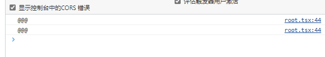

我们使用了`useNavigation`，他返回了一个state，当它改变后，触发了页面更新。

## 避免产生太多路由记录

```
const isFirstSearch = q == null;
 submit(event.currentTarget.form, {
  replace: !isFirstSearch,
});
```

## 不使用导航触发更新

到目前为止我们都是通过表单更高url获取POST请求，在历史堆栈中添加记录，实现mutations(the times we change data)。

那么我们如何不借助导航让数据发送改变呢。

`useFetcher` hook函数让我们能够直接与`loader`函数通信。


喜欢按钮符合我们这样做的原则：我们并不是在创建或删除新记录，也不想更改页面，我们只是想更改正在查看的页面上的数据。

### 实施

编辑`contact.tsx`

```
import {
  useLoaderData,
  Form,
  useFetcher,
} from "react-router-dom";

function Favorite({ contact }) {
  const fetcher = useFetcher();
  let favorite = contact.favorite;

  return (
    <fetcher.Form method="post">
      <button
        name="favorite"
        value={favorite ? "false" : "true"}
        aria-label={
          favorite
            ? "Remove from favorites"
            : "Add to favorites"
        }
      >
        {favorite ? "★" : "☆"}
      </button>
    </fetcher.Form>
  );
}
```

和往常一样，我们的表单有带有名称prop的字段。这个表单将发送带有favorite key的formData，它要么是"true"，要么是" false"。因为它有method="post"，它会调用action。因为没有 `<fetcher.Form action="...">` prop，它将发送到呈现表单的路由。

#### 定义action

```
export async function action({ request, params }) {
  let formData = await request.formData();
  return updateContact(params.contactId, {
    favorite: formData.get("favorite") === "true",
  });
}
```

#### 声明路由action

```
import Contact, {
  loader as contactLoader,
  action as contactAction,
} from "./routes/contact";


```

与Form组件唯一不同的是：它不是一个导航——URL不会改变，历史堆栈不受影响。

### 点击喜欢后的界面优化（乐观UI策略，optimistic UI）

点击喜欢后，需要时间处理这个请求，这段时间界面没有任何反馈，一段时间后才显示喜欢图标。

为了增加反馈，我们需要使用fetcher的状态，就行我们之前使用navigation的状态一样。

fetcher知道提交给action的表单数据，所以可以在fetcher. formdata上获得。**我们将使用它立即更新star的状态，即使请求还没有完成。如果更新最终失败，UI将恢复到真实的数据**。

```
// existing code

function Favorite({ contact }) {
  const fetcher = useFetcher();

  let favorite = contact.favorite;
  if (fetcher.formData) {
    favorite = fetcher.formData.get("favorite") === "true";
  }

  return (
    <fetcher.Form method="post">
      <button
        name="favorite"
        value={favorite ? "false" : "true"}
        aria-label={
          favorite
            ? "Remove from favorites"
            : "Add to favorites"
        }
      >
        {favorite ? "★" : "☆"}
      </button>
    </fetcher.Form>
  );
}
```

如果你现在点击按钮，你应该会看到星星立即变为新的状态。我们并不总是呈现实际的数据，而是检查fetcher是否有任何formData被提交，如果有，我们将使用它。当动作完成时，fetcher.formData将不再存在，我们将回到使用实际数据。因此，即使您在乐观的UI代码中编写了错误，它最终也会回到正确的状态。

## 用户不存在Error

当我们试图指定url查看一个不存在的用户，会引发error，并跳转到error界面。

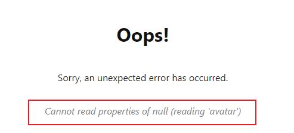

这是因为我们loader获取到的contact对象是null。

对于这种已知的错误，我们希望应用进行明确的显示，并主动抛出错误。：

```
export async function loader({ params }) {
  const contact = await getContact(params.contactId);
  if (!contact) {
    throw new Response("", {
      status: 404,
      statusText: "Not Found",
    });
  }
  return contact;
}
```

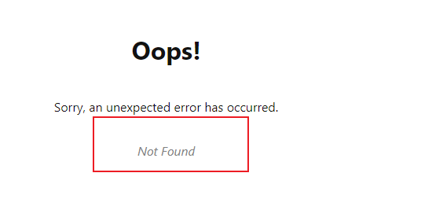

但是，这个错误是顶级路由处理的，我们的界面无法显示其他任何内容，当我们指定这是contact组件的错误，我们只希望在contact组件位置显示该错误界面。

### Pathless Routes

> One last thing. The last error page we saw would be better if it rendered inside the root outlet, instead of the whole page. In fact, every error in all of our child routes would be better in the outlet, then the user has more options than hitting refresh.
>
> We'd like it to look like this:

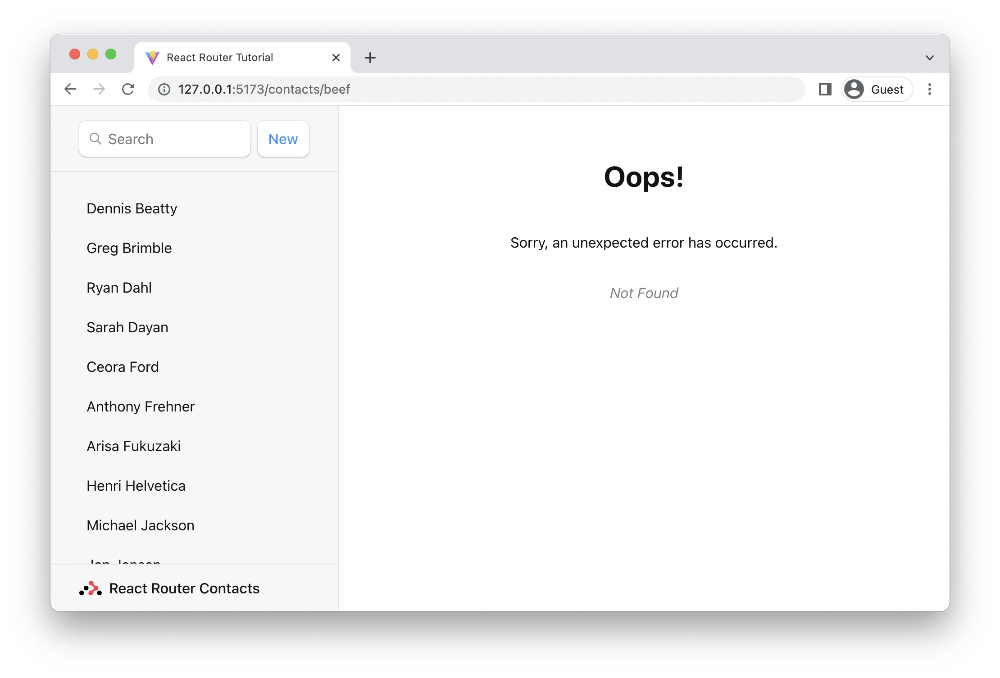

我们可以向每个组件都添加`errorElement: <ErrorPage />,`属性，但这显然是重复、代码冗余的。

有一个更清洁的方法。可以在没有路径的情况下使用路由，这使得它们可以参与UI布局，而不需要在URL中添加新的路径段:

```
createBrowserRouter([
  {
    path: "/",
    element: <Root />,
    loader: rootLoader,
    action: rootAction,
    errorElement: <ErrorPage />,
    children: [
      {
        errorElement: <ErrorPage />,
        children: [
          { index: true, element: <Index /> },
          {
            path: "contacts/:contactId",
            element: <Contact />,
            loader: contactLoader,
            action: contactAction,
          },
          /* the rest of the routes */
        ],
      },
    ],
  },
]);
```

这样的话，error在冒泡时，就被无路径路由捕获了。

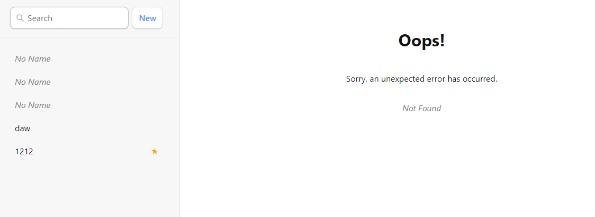

## JSX Routes

在之前，我们的路由都是在最开始就完成了全部定义。

对于我们的最后一个技巧，许多人更喜欢用JSX配置他们的路由。你可以用createRoutesFromElements做到这一点。在配置路由时，JSX和对象之间没有功能上的区别，这只是一种风格偏好。

```
import {
  createRoutesFromElements,
  createBrowserRouter,
} from "react-router-dom";

const router = createBrowserRouter(
  createRoutesFromElements(
    <Route
      path="/"
      element={<Root />}
      loader={rootLoader}
      action={rootAction}
      errorElement={<ErrorPage />}
    >
      <Route errorElement={<ErrorPage />}>
        <Route index element={<Index />} />
        <Route
          path="contacts/:contactId"
          element={<Contact />}
          loader={contactLoader}
          action={contactAction}
        />
        <Route
          path="contacts/:contactId/edit"
          element={<EditContact />}
          loader={contactLoader}
          action={editAction}
        />
        <Route
          path="contacts/:contactId/destroy"
          action={destroyAction}
        />
      </Route>
    </Route>
  )
);
```

## 总结

- loader给路由组件传递数据
- error page
- Form
- fetcher.Form
- NavLink
- Optimistic UI
- redirect
- useEffect
- 路由params获取
- Form表单状态与URL同步
- 获取导航状态