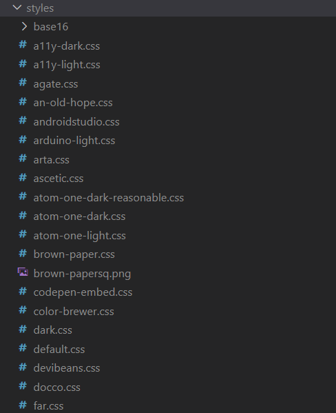
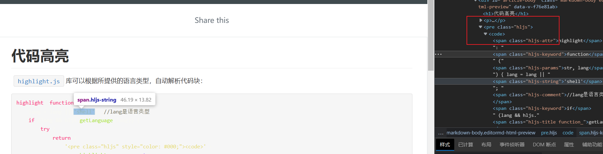

# 代码高亮

[`highlight.js`]()库可以根据所提供的语言类型，自动解析代码块：

```js
highlight: function (str, lang) {
    lang = lang || 'shell';  //lang是语言类型
    if (lang && hljs.getLanguage(lang)) {
        try {
            return (
                '<pre class="hljs" style="color: #000;"><code>' +
                hljs.highlight(lang, str, true).value +
                '</code></pre>'
            )
        } catch (__) { }
    }

    return (
        '<pre class="hljs" style="color: #000;"><code>' + md.utils.escapeHtml(str) + '</code></pre>'
    )
}
```

它提供了大量的代码样式：



## 导入css

- 在`index.html`文件中导入：

  问题：需要将样式表复制到静态资源目录。

- 在入口`main.js`中进行全局导入：

  ```js
  // other code
  import 'highlight.js/styles/github.css';
  // init app
  ```

- 以上方式都是全局导入，有没有办法进行局部导入呢？特定的组件有特定的样式：

  阅读了以下文章：

  [Vue 引入外部CSS文件 - 简书 (jianshu.com)](https://www.jianshu.com/p/60a14bb2cfb5)

  ```css
  /* @import并不是引入代码到<style></style>里面，而是发起新的请求获得样式资源，并且没有加scoped */
  
  /* @import 'highlight.js/styles/monokai-sublime.css'; */
  ```

  使用`<style scoped src`引入，`scoped`没有生效。

  

# 生成目录

```shell
npm -s markdown-it-toc-done-right markdown-it-toc-and-anchor
```

[将Markdown字符串转成HTML - 腾讯云开发者社区-腾讯云 (tencent.com)](https://cloud.tencent.com/developer/article/1907097#:~:text=markdown-it-toc-done-right ：帮markdown自动生成目录 (TOC)，依赖上面插件 markdown-it-anchor ； uslug,：上面生成的目录 (TOC)，有时候跳转会失败，原因就是markdown-it-anchor生成锚点id 与 markdown-it-toc-done-right 生成的herf 不匹配导致，uslug可解决此问题；)

# 路由生成

进行路由的一个关键问题是，路由路径下一定是有内容的（page/\*\*/../\*.vue），否则页面一旦刷新就会出现404。
