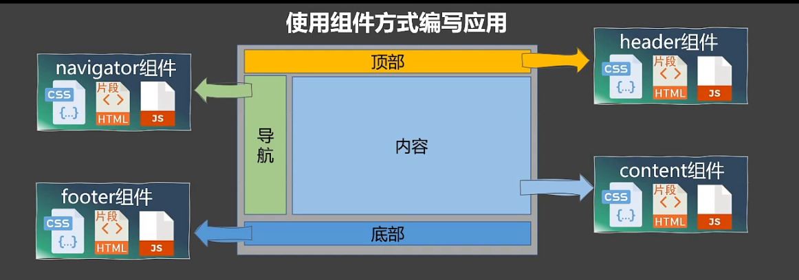
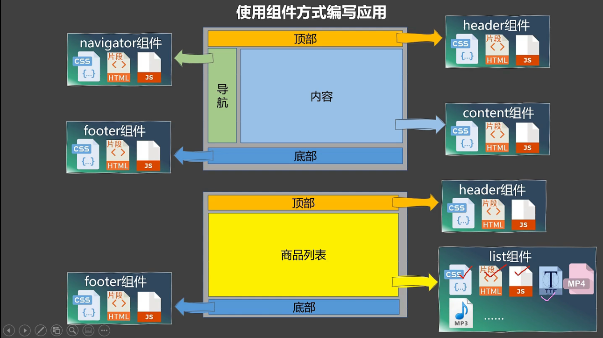
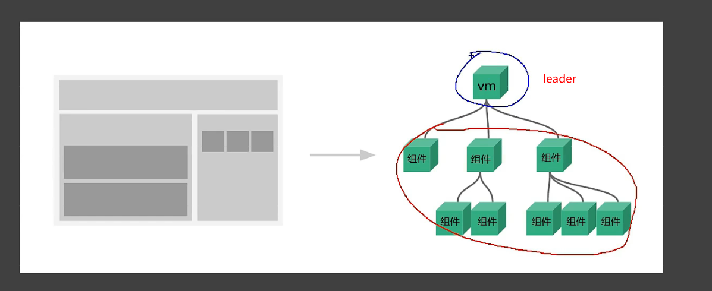
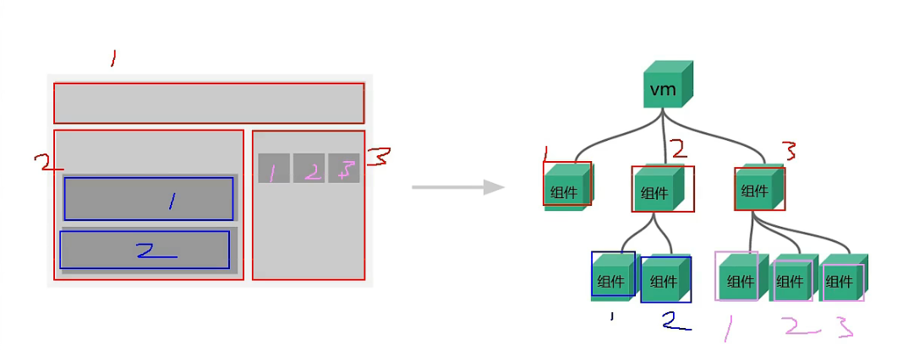

首先看图

# 为什么要组件化编程

在以前写前端代码时，经常遇到导航栏在多个页面复用的问题，采取的是将这部分代码复制到其他HTML文件；但是阅读更新时，难以统一修改，需要耗费额外的经历。一种方式是将这些代码复制到一个js文件中，用到的时候通过变量引入。但是js文档以不能格式html代码，再加上一些复杂的`JS`文件、样式文件引入，也难以使用这种方式。

组件化编程可以将这些导航、底部内容整合到一个单独的html中。

# Vue组件

## 组件嵌套

# 组件的概念

实习**局部**功能的**代码**和**资源**的**集合**。