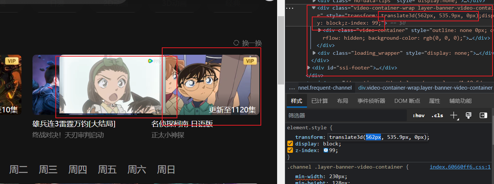
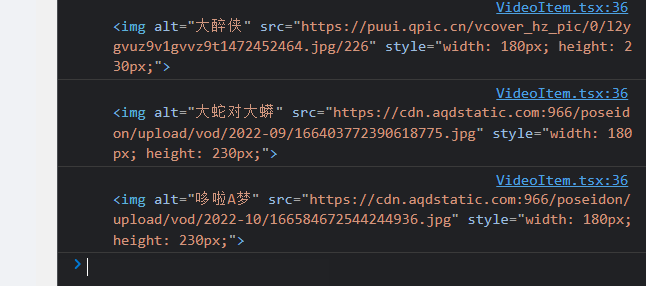
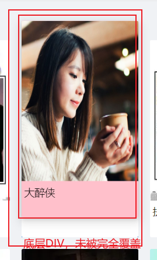

# 界面隐藏

一个容器放置视频，默认情况下

```
display: none;
z-index: 0;
transform: transform3d(10000px, true_y, true_z);
```

`y`轴和`z`轴左边都是真实的（腾讯视频使用绝对定位，因此是计算得到的），只是将其移到右边很远的距离。

# 懒加载


# React监听鼠标移入（获取坐标）

- 添加事件监听

```
onMouseEnter={(e) => { handleMouseEnter(e) }}
```

```
const handleMouseEnter = (e: React.MouseEvent) => {
	console.log(e.target)
}
```

**注意事件类型**是`React.MouseEvent`。



[合成事件 – React (reactjs.org)](https://zh-hans.reactjs.org/docs/events.html#mouse-events)

- 获取Element的绝对位置

[(104条消息) Javascript获取页面元素的绝对位置_sunlylorn的博客-CSDN博客_js获取元素的绝对位置](https://blog.csdn.net/sunlylorn/article/details/6673416)

[(104条消息) typescript中HTMLElement 和 Element的区别_达瓦利什的博客-CSDN博客](https://blog.csdn.net/w_____w_____/article/details/121126476)

ts中：

```
let res =document.getElementById('test');  //HTMLElement
let el = document.querySelector('#test');  // Element
```

mdn中：
`querySelector`，`getElementById`两者均返回Element。

Element 是一个通用性非常强的基类，所有 Document 对象下的对象都继承自它。这个接口描述了所有相同种类的元素所普遍具有的方法和属性。一些接口继承自 Element 并且增加了一些额外功能的接口描述了具体的行为。例如， HTMLElement 接口是所有 HTML 元素的基本接口，而 SVGElement 接口是所有 SVG 元素的基础。大多数功能是在这个类的更深层级（hierarchy）的接口中被进一步制定的。

实现：

```tsx
function getElementAbsPos(e: HTMLElement) {
    var t = e!.offsetTop;
    var l = e!.offsetLeft;
    while (e = e!.offsetParent as HTMLElement) {
        t += e.offsetTop;
        l += e.offsetLeft;
    }
    return { left: l, top: t };
}
```


# React实现

在腾讯视频中，悬浮框是处于顶层div下的，因此使用绝对定位（绝对定位是相当与父节点的，并不是document）。

在React中，由于我们将展示视频信息的这个Item组件化了，因此实现思路有一点改变：

- 每个Item都有一个对应的悬浮框DIV，默认情况`hidden`；
- 为了节省流量，悬浮框内的内容需要懒加载；
- 显示悬浮框的时机是一致的——鼠标移入时，为了优化体验，节省流量，可以设定为移入一段时机后才显示；

## 原始代码

```tsx
import { Card } from 'antd';
import { Content } from 'antd/lib/layout/layout';
import { useState } from 'react';
import { useNavigate } from 'react-router-dom'
import styles from './css/VideoItem.module.css'

interface VideoItemProps {
    video: Video,
    topCategory?: string,
    subCategory?: string,
}

export default function VideoItem(props: VideoItemProps) {
    const { video, topCategory, subCategory } = props
    const navigate = useNavigate()
    const [loading, setLoding] = useState(false)
    const to = (() => {
        let itemTop = Object.getOwnPropertyNames(video.category)[0]
        let itemSub = video.category[itemTop].length ? video.category[itemTop][0] : ''

        if (topCategory) {
            itemTop = topCategory
            itemSub = ''
            if (subCategory) {
                itemSub = subCategory
            }
        }
        if (itemSub) {
            return `/detail/${itemTop}/${itemSub}/${video.id}`
        } else {
            return `/detail/${itemTop}/${video.id}`
        }
    })()

    return (
      <NavLink to={to}>
          <Card hoverable
              bordered={false}
              style={{ width: 180, height: 280, overflow: 'hidden' }}
              bodyStyle={{ padding: 4 }}
              className={styles.video}
              cover={}
              onMouseOver={() => { }}
              onClick={() => handleClick()}
          >
              <div style={{ height: 280 }}>
                  {video.title}
              </div>
          </Card>
        </NavLink>
    )
}
```

`handleClick`响应点击事件，跳转到视频详情页，以上代码还不含与本文相关内容。

## 放入新的DIV

```
 <NavLink to={to}>
     <Card
         bordered={false}
         bodyStyle={{ padding: 4 }}
         className={styles.video}
         cover={}
     >
         <div className={styles.title}>
             {video.title}
         </div>
     </Card>
     <Card hoverable
         bordered={false}
         style={{
             backgroundColor: 'pink',
             display: hiddenDetail ? 'none' : 'inline-block',
             position: 'absolute',
             transform: `translate3d(0px, -100%, 0px)`,
         }}
         bodyStyle={{ padding: 4 }}
         className={styles.video}
         cover={}
     >
         <div className={styles.title}>
             {video.title}
         </div>
     </Card>
</NavLink>
```

### 状态设置

加入状态表示是否隐藏悬浮框：

默认隐藏

```tsx
const [hiddenDetail, setHiddenDetail] = useState(true)
```

### 样式设置

```tsx
style={{
	backgroundColor: 'pink',
	display: hiddenDetail ? 'none' : 'inline-block',
	position: 'absolute',
	transform: `translate3d(0px, -100%, 0px)`,
}}
```

两个`Card`组件的宽度和高度已经设为一致，为了方便调试，将悬浮框的背景设为粉色；

使用绝对定位，让其能够覆盖原始信息；

通过`transform`改变悬浮框的位置，不设置的话，悬浮框默认被挤到下方，`-100%`表示在`y`轴上**向上**移动悬浮框高度对应的像素，由于两个`Card`组件高度相同，因此可以覆盖原始信息。

### 事件设置

第一个`Card`，即默认显示的元素，添加鼠标移入事件：

```
onMouseEnter={(e) => {
	setHiddenDetail(!hiddenDetail)
}}
```

第二个`Card`，即悬浮框，添加鼠标移出事件：

```
onMouseLeave={(e) => {
	// bug 向下移出不会触发 
	// 因为移入了底层Card，执行了setHiddenDetail(false)
	// 将移入事件改为 setHiddenDetail(!hiddenDetail)
	setHiddenDetail(true)
}}
```

这里我们使用`!hiddenDetail`，而不是直接设为`true`，

因为如果底层`DIV`大于悬浮框的框的话，在悬浮框显示的情况下，如果移出过程进入了底层`DIV`，会导致悬浮框不会消失（虽然移出过程触发了`onMouseLeave`，将状态设为false，但移入底层`DIV`后，再次触发`onMouseEnter`，将状态设为`true`），这主要是应对悬浮框没有完全覆盖底层元素的情况。



## 事件优化

### 延迟显示悬浮框

在底层元素的事件响应中:

```
onMouseEnter={(e) => {  setHiddenDetail(!hiddenDetail)}}
```

将状态改变任务用`Timeout`包裹，设定延时`t`，如果在移出该元素时，定时器还没有结束，则结束该定时器：

```
let loadDetailJob: NodeJS.Timeout | null = null


<Card
    bordered={false}
    bodyStyle={{ padding: 4 }}
    className={styles.video}
    cover={}
    onMouseEnter={(e) => {
        loadDetailJob = setTimeout(() => {
            setHiddenDetail(!hiddenDetail)
        }, 500)
    }}
    onMouseLeave={(e) => {
        if (loadDetailJob) {
            clearTimeout(loadDetailJob)
        }
    }}
>
    <div className={styles.title}>
        {video.title}
    </div>
</Card>
```

### 悬浮框内容懒加载

在腾讯视频中，悬浮框显示一小段视频，但是一个页面中包含多个悬浮框，如果一次全部加载这些资源，会造成比较大的流量浪费，因此，最后是要显示悬浮框时，才加载详细内容。

在本示例中，我们悬浮框显示的图片设为懒加载模式，我们需要增加一个状态`firstLoad`记录是否是第一次显示悬浮框，如果是第一次，则设一个定时器模拟发送请求，获取详细内容的链接。另一种情况是，在知道链接地址的情况下，不发送请求，将元素的`src`指向更高为正确的就行。

为了方便操作`DOM`元素，我们创建一个悬浮框的`ref`对象：`detailRef`。

```
const [firstLoad, setFirstLoad] = useState(true)
const detailRef = useRef<HTMLDivElement | null>(null)

useEffect(() => {
		// 第一次加载悬浮框，并且悬浮框状态为显示
    if (firstLoad && !hiddenDetail) {
    // 在知道路径的情况下，可以直接修改路径，Promise用于模拟向服务器发送请求的等待过程
        new Promise((resolve, reject) => {
            setTimeout(() => {
                resolve('load success')
            }, 1000)
        }).then(() => {
            setFirstLoad(false)
            detailRef.current!.querySelector('img')!.src = 'https://zos.alipayobjects.com/rmsportal/jkjgkEfvpUPVyRjUImniVslZfWPnJuuZ.png'
        })
    }
}, [hiddenDetail])
```

## 完整代码

```
import { Card } from 'antd';
import { Content } from 'antd/lib/layout/layout';
import { useEffect, useRef, useState } from 'react';
import { Image } from 'antd'
import { NavLink, useNavigate } from 'react-router-dom'
import styles from './css/VideoItem.module.css'

interface VideoItemProps {
    video: Video,
    topCategory?: string,
    subCategory?: string,
}


function getElementAbsPos(e: HTMLElement) {
    var t = e!.offsetTop;
    var l = e!.offsetLeft;
    while (e = e!.offsetParent as HTMLElement) {
        t += e.offsetTop;
        l += e.offsetLeft;
    }
    return { left: l, top: t };
}

export default function VideoItem(props: VideoItemProps) {
    const { video, topCategory, subCategory } = props
    const navigate = useNavigate()
    const [hiddenDetail, setHiddenDetail] = useState(true)
    const [firstLoad, setFirstLoad] = useState(true)
    const detailRef = useRef<HTMLDivElement | null>(null)
    let loadDetailJob: NodeJS.Timeout | null = null
    const to = (() => {
        let itemTop = Object.getOwnPropertyNames(video.category)[0]
        let itemSub = video.category[itemTop].length ? video.category[itemTop][0] : ''

        if (topCategory) {
            itemTop = topCategory
            itemSub = ''
            if (subCategory) {
                itemSub = subCategory
            }
        }
        if (itemSub) {
            return `/detail/${itemTop}/${itemSub}/${video.id}`
        } else {
            return `/detail/${itemTop}/${video.id}`
        }
    })()

    useEffect(() => {
        if (firstLoad && !hiddenDetail) {
            new Promise((resolve, reject) => {
                setTimeout(() => {
                    resolve('load success')
                }, 1000)
            }).then(() => {
                setFirstLoad(false)
                detailRef.current!.querySelector('img')!.src = 'https://zos.alipayobjects.com/rmsportal/jkjgkEfvpUPVyRjUImniVslZfWPnJuuZ.png'
            })
        }
    }, [hiddenDetail])

    return (
        <NavLink to={to}>
            <Card
                bordered={false}
                bodyStyle={{ padding: 4 }}
                className={styles.video}
                cover={}
                onMouseEnter={(e) => {
                    loadDetailJob = setTimeout(() => {
                        setHiddenDetail(!hiddenDetail)
                    }, 500)
                }}
                onMouseLeave={(e) => {
                    if (loadDetailJob) {
                        clearTimeout(loadDetailJob)
                    }
                }}
            >
                <div className={styles.title}>
                    {video.title}
                </div>
            </Card>
            <Card hoverable
                bordered={false}
                loading={firstLoad}
                ref={(c) => { detailRef.current = c }}
                style={{
                    backgroundColor: 'pink',
                    display: hiddenDetail ? 'none' : 'inline-block',
                    position: 'absolute',
                    transform: `translate3d(0px, -100%, 0px)`,
                }}
                bodyStyle={{ padding: 4 }}
                className={styles.video}
                cover={}
                onMouseLeave={(e) => {
                    // bug 向下移出不会触发 
                    // 因为移入了底层Card，执行了setHiddenDetail(false)
                    // 将移入事件改为 setHiddenDetail(!hiddenDetail)
                    setHiddenDetail(true)
                }}
            >
                <div className={styles.title}>
                    {video.title}
                </div>
            </Card>
        </NavLink>
    )
}
```

